# 岭回归 Python 示例

> 原文：<https://towardsdatascience.com/ridge-regression-python-example-f015345d936b?source=collection_archive---------4----------------------->


Photo by [Jeswin Thomas](https://unsplash.com/@jeswinthomas?utm_source=medium&utm_medium=referral) on [Unsplash](https://unsplash.com?utm_source=medium&utm_medium=referral)

过拟合，即模型对训练样本表现良好但未能推广的过程，是机器学习的主要挑战之一。在前面的文章中，我们将介绍如何使用正则化来帮助防止过度拟合。具体来说，我们将讨论岭回归，线性回归的远亲，以及如何用它来确定最佳拟合线。

在我们开始描述岭回归之前，理解机器学习环境中的**方差**和**偏差**是很重要的。

# 偏见

术语*偏差*不是 y 轴截距，而是模型无法得出近似于样本的图的程度。例如，前进线有很高的偏差，因为它不能捕捉数据中潜在的趋势。

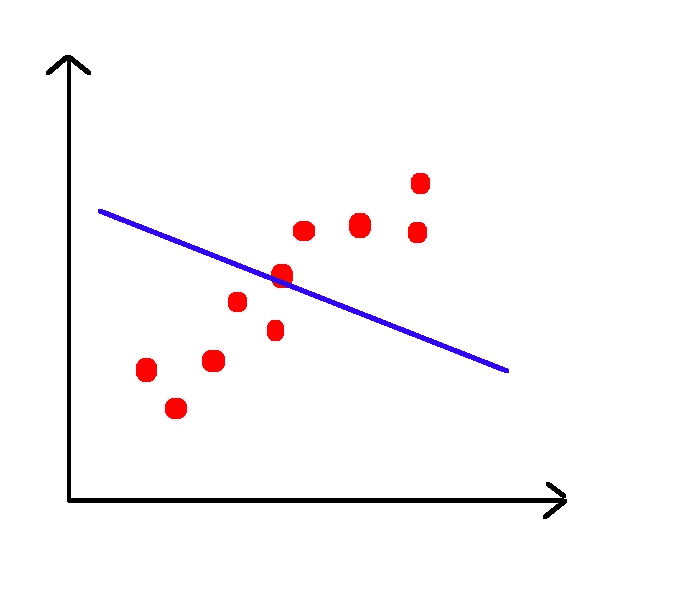

另一方面，前进线具有相对较低的偏差。如果我们要测量均方误差，它将比前面的例子低得多。

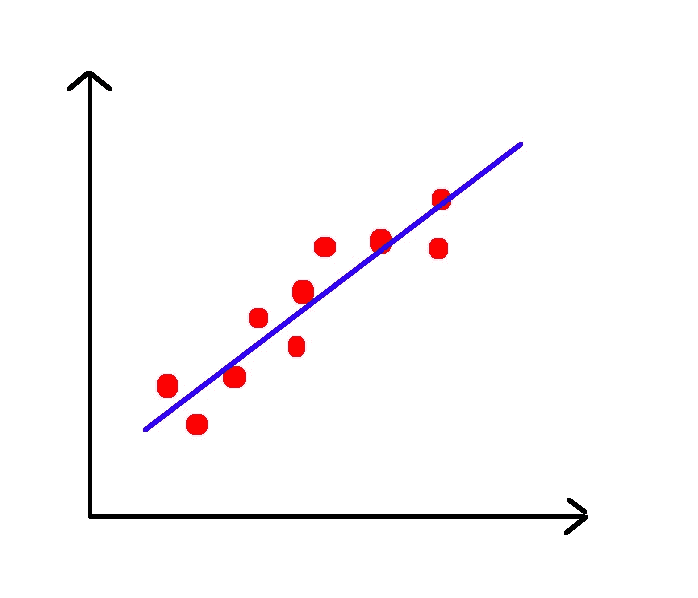

# 差异

与统计定义相反，*方差*不是指数据相对于平均值的分布。相反，它描述了数据集之间拟合的差异。换句话说，它测量模型的准确性在呈现不同的数据集时如何变化。例如，上图中的曲线在其他数据集上的表现完全不同。因此，我们说它有很高的方差。

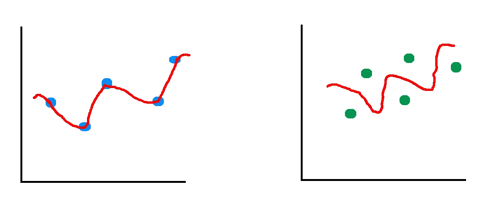

另一方面，直线具有相对较低的方差，因为不同数据集的均方误差相似。

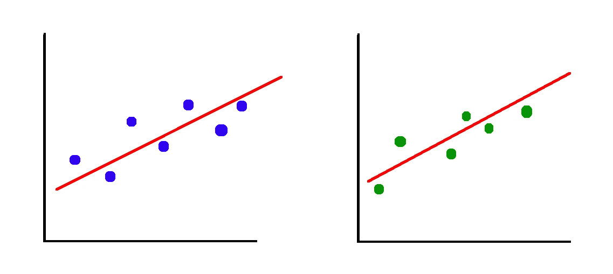

岭回归几乎等同于线性回归，只是我们引入了少量的偏差。作为对所述偏差的回报，我们得到方差的显著下降。换句话说，通过以稍微差一点的拟合开始，岭回归对于不完全遵循与模型被训练的数据相同的模式的数据表现得更好。

添加偏差，通常被称为正则化。顾名思义，正则化用于开发一个模型，该模型擅长预测遵循**正则**模式而非特定模式的数据目标。换个方式说，正则化的目的是防止过拟合。当我们使用比数据建模所需次数更高的多项式时，往往会发生过度拟合。

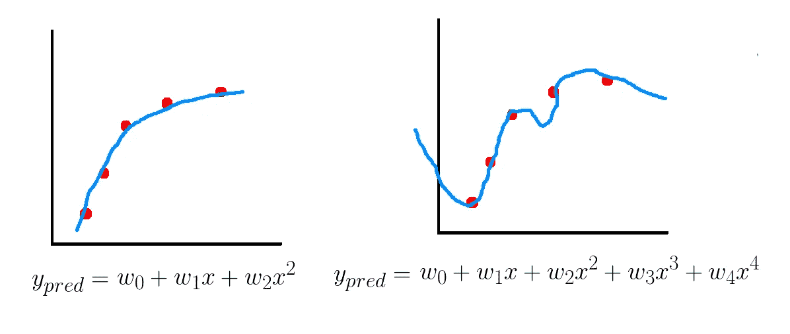

为了解决这个问题，我们在损失函数中引入了一个正则项。在岭回归中，损失函数是线性最小二乘函数，正则化由 [l2 范数](https://en.wikipedia.org/wiki/Matrix_norm)给出。

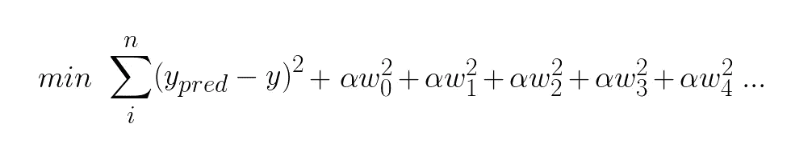

因为我们试图最小化损失函数，并且 **w** 包含在残差平方和中，所以模型将被迫在最小化残差平方和和最小化系数之间找到平衡。

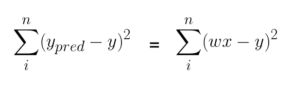

对于高次多项式，如果基础数据可以用低次多项式近似，则高阶变量的系数将趋向于 0。

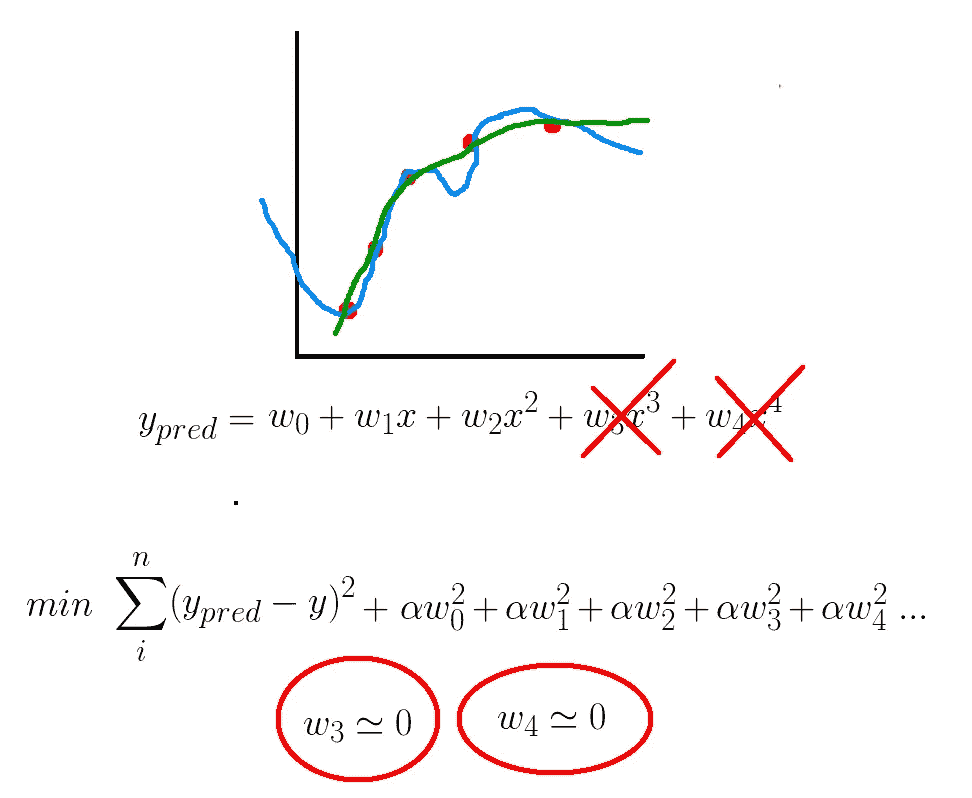

如果我们将超参数α设置为某个较大的数，在试图找到成本函数的最小值时，模型会将系数设置为 0。换句话说，回归线的斜率为 0。

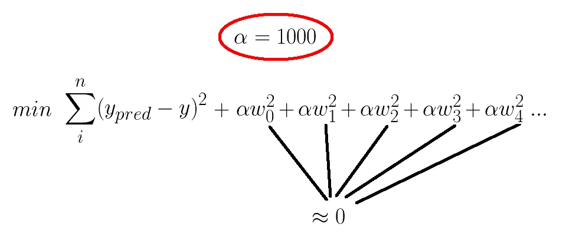

# 算法

给定增加的正则项，找到系数并不困难。我们采用成本函数，执行一点代数运算，对 **w** (系数向量)取偏导数，使其等于 0，然后求解 **w** 。

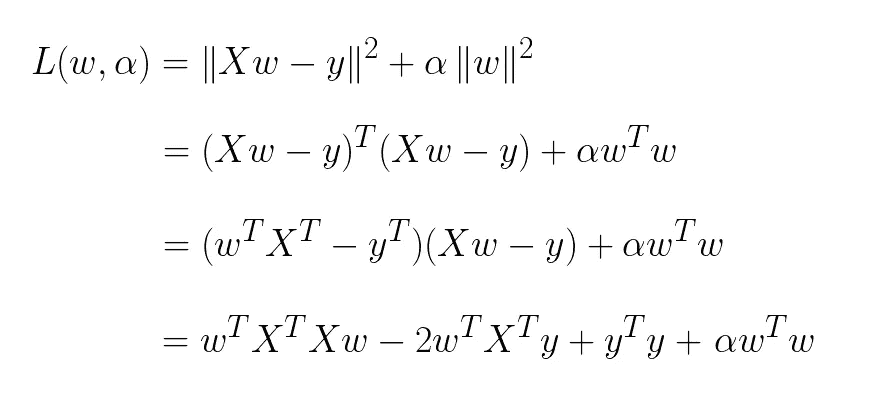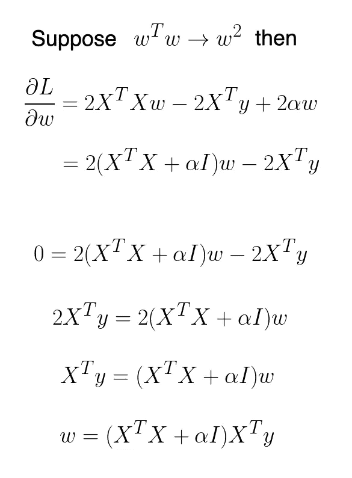

# Python 代码

让我们看看如何使用 Python 从头开始实现岭回归。首先，我们导入以下库。

```
from sklearn.datasets import make_regression
from matplotlib import pyplot as plt
import numpy as np
from sklearn.linear_model import Ridge
```

我们可以使用`scikit-learn`库来生成非常适合回归的样本数据。

```
X, y, coefficients = make_regression(
    n_samples=50,
    n_features=1,
    n_informative=1,
    n_targets=1,
    noise=5,
    coef=True,
    random_state=1
)
```

接下来，我们定义超参数**α。**α决定正则化强度。α值越大，正则化越强。换句话说，当α是一个非常大的数时，模型的偏差会很大。alpha 值为 1 时，模型的行为与线性回归相同。

```
alpha = 1
```

我们创建单位矩阵。为了让我们之前看到的等式遵守矩阵运算的规则，单位矩阵必须与矩阵 X 的转置点 X 大小相同。

```
n, m = X.shape
I = np.identity(m)
```

最后，我们用上面讨论的等式来求解 w。

```
w = np.dot(np.dot(np.linalg.inv(np.dot(X.T, X) + alpha * I), X.T), y)
```

将 w 与生成数据时使用的实际系数进行比较，我们可以看到它们并不完全相等，但很接近。

```
w
```

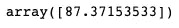

```
coefficients
```

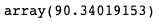

我们来看看回归线是如何拟合数据的。

```
plt.scatter(X, y)
plt.plot(X, w*X, c='red')
```

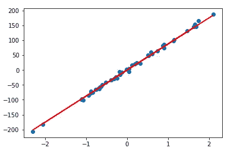

让我们使用岭回归的`scikit-learn`实现做同样的事情。首先，我们创建并训练一个`Ridge`类的实例。

```
rr = Ridge(alpha=1)rr.fit(X, y)w = rr.coef_
```

我们得到了与用线性代数解出的相同的值。

```
w
```

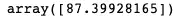

回归线与上面的一条相同。

```
plt.scatter(X, y)
plt.plot(X, w*X, c='red')
```

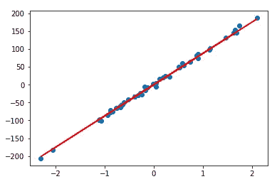

接下来，让我们可视化正则化参数α的效果。首先，我们将其设置为 10。

```
rr = Ridge(alpha=10)rr.fit(X, y)w = rr.coef_[0]plt.scatter(X, y)
plt.plot(X, w*X, c='red')
```

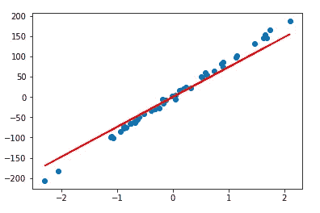

正如我们所见，回归线不再是完美的拟合。换句话说，与 alpha 为 1 的模型相比，该模型具有更高的偏差。为了强调，让我们试试 100 的 alpha 值。

```
rr = Ridge(alpha=100)rr.fit(X, y)w = rr.coef_[0]plt.scatter(X, y)
plt.plot(X, w*X, c='red')
```

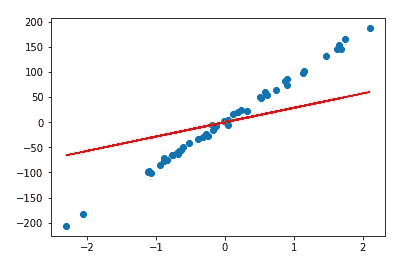

当 alpha 趋向于正无穷大时，回归线将趋向于平均值 0，因为这将最小化不同数据集之间的方差。