# 线性回归和深度学习中的岭正则化

> 原文：<https://towardsdatascience.com/ridge-regularization-on-linear-regression-and-deep-learning-a32cd9dc5a78?source=collection_archive---------21----------------------->

# 介绍

正如我在之前关于[正则化](https://medium.com/@snaveenmathew/a-short-note-on-regularization-42ee07c65d90)和[套索惩罚](/lasso-regularization-on-linear-regression-and-other-models-70f65efda40c)的文章中所讨论的，正则化可以用来对抗过度参数化模型中的过度拟合。正则化作为最佳子集选择的计算有效的替代方案，但是有其缺点(例如:估计器的效率低)。本文的目的是介绍岭回归的数学基础，推导其解析解，讨论其几何解释，并将其与奇异值分解联系起来进行分量分析。

# 制定

线性回归的公式和正规方程形式见我的[上篇](/lasso-regularization-on-linear-regression-and-other-models-70f65efda40c)。

## 山脊公式和解决方案

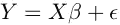

Regression equation

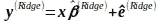

Ridge solution estimated on a sample

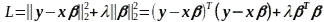

Ridge loss function

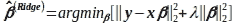

Ridge solution

Ridge estimate using normal equation

注:岭可以被视为修改协方差矩阵的惩罚，从而减少变量之间的共线性。脊的这一特性有助于避免损失函数中的平稳段。

# 几何解释

## 优化的对偶形式

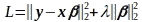

Ridge optimization: primal (unconstrained)

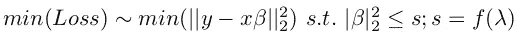

Dual form of ridge optimization (constrained)

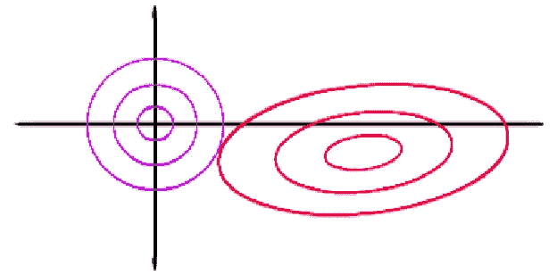

Contour plot for ridge. Image credits: [https://stats.stackexchange.com/questions/30456/geometric-interpretation-of-penalized-linear-regression](https://stats.stackexchange.com/questions/30456/geometric-interpretation-of-penalized-linear-regression)

紫色圆圈对应于不同 s 的|β|₂ ≤ s，其中|β|₂ =沿圆周的常数。增加λ会减小圆的大小。红色椭圆对应于不同的 y-xβ)₂值，其中 y-xβ)₂ =沿椭圆的常数。对于固定的λ，s 的值是固定的:这对应于一个紫色圆圈。

在无约束的情况下，y-xβ)₂的最小值出现在椭圆的中心。然而，在|β|₂ ≤ s 的约束情况下，解将向原点位移。

独特的山脊解决方案位于这两条“曲线”的接触点。由于曲线|β|₂ ≤ s 是可微的，所以对于有限的λ，所有βᵢs 的脊解将是非零的。随着λ的增大(s 的减小)，βᵢs 越来越接近 0。即使βᵢs 移近 0，这也不会导致有限λ的稀疏。因此，脊线惩罚不能用于特征选择。

# 岭惩罚和奇异值分解的关联

对 x 应用奇异值分解，我们得到

SVD on independent variables

将此代入岭的解析解，假设独立变量居中，利用旋转矩阵和投影矩阵的性质，我们得到

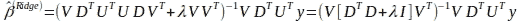

Ridge solution in terms of principal components

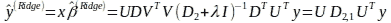

Ridge prediction

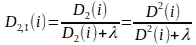

Diagonal matrix in ridge prediction

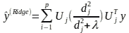

Ridge prediction

让我们一步一步地检查这一点:

1.  PCⱼ空间中的 y 项目，其中 PCⱼ指的是 jᵗʰ主分量。所有的投影都在 x 的列空间中
2.  按一个因子缩小投影(λ > 0 时发生严格的缩小)
3.  重新变换投影

从上面的等式中，我们可以使用岭估计回归模型的自由度:

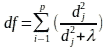

Degrees of freedom of ridge

# 深度学习的延伸

当特定层的权重相关时，深度学习会遭受过度拟合。这通常发生在网络的全连接部分。Ridge 将训练集的输出特征映射投影到主成分上，并缩小预测。这使得损失曲线更加凸出，即使在独立变量之间完全共线性的情况下。对于适当选择的λ，权重将非常小。因此，在存在脊形损失的情况下，当我们通过网络执行正向传递时，非线性缓慢地建立。这个论点也适用于小λ。

# 结论

在[之前的文章](/lasso-regularization-on-linear-regression-and-other-models-70f65efda40c)中，我们讨论了套索正则化作为一种通过执行变量选择来解决过度拟合的方法。当需要强制抑制特征消除时，岭回归非常有用。在实际问题中，当已知所有特征，并且所有特征对结果都具有“科学价值”时，此属性非常有用:因此，分析中不能遗漏任何特征。然而，当预测精度很重要时，使用套索和脊线惩罚的线性组合。这叫做 elasticnet。L1 正则化的比例也是一个超参数，应该与其他超参数一起调整。Elasticnet 是 L1 和 L2 正则化的一般情况。当在验证集上进行适当调整时，它有望胜过 ridge 和 lasso。

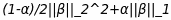

Elasticnet. Equation credit: glmnet package documentation