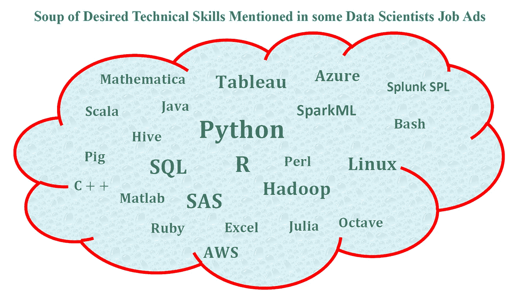

# 来自数据科学家招聘广告的荒谬要求

> 原文：<https://towardsdatascience.com/ridiculous-requirements-from-data-scientist-job-ads-d84fa716af73?source=collection_archive---------13----------------------->

在当今时代，数据已经成为如此强大的资源。数字革命带来了前所未有的数据创造速度。想想脸书、Instagram、twitter、YouTube、Medium 等社交媒体平台每天创造的新数据量。除此之外，政府、医疗保健(患者健康记录)、学术界、工业、商业系统(销售数据、客户购买历史等)、体育(NBA、NFL、MLB、欧洲足球联盟等联盟中的球员统计数据)、娱乐(观众在网飞的历史数据等)等部门每天都会产生大量数据。

数据的大规模生产和可用性产生了几个**机遇**和**挑战**。

脸书、谷歌、亚马逊和微软等公司和大企业正在利用数据的力量来改变和革命日常业务的开展方式，例如网飞使用观众历史数据来构建电影推荐系统，而亚马逊则使用深度学习算法根据购买历史或浏览历史向在线客户推荐产品。

一些小型企业面临的主要挑战是向数据驱动转型的能力。

一个**数据驱动的**公司或组织是一个使用数据进行决策的组织，例如改善客户服务、优化生产、提高产品效率以及实现利润最大化。

我在一家还不是数据驱动的公司从事数据科学项目。该公司有大量的数据，在我联系他们之前，他们不知道如何处理这些数据，因为该公司没有数据科学团队。这些公司会在招聘广告中发布对数据科学家的荒谬要求。他们希望新聘用的数据科学家负责数据科学工作流程中的一切，从问题框架到模型构建和应用。

在这篇文章中，我将讨论关于数据科学家的招聘广告。我将展示 3 个来自 indeed.com**的样本数据科学家招聘广告。其中两个我认为可以归类为**夸张的**，而第三个看起来**一般**，看起来像是一个数据科学家职位的**典型**广告。在第一部分**中，我将讨论几个我认为有些夸张的 indeed.com 广告。在第二部分中，我展示了一个我认为很有代表性的招聘广告。

# I .夸大数据科学家职位的技术技能要求

## a)招聘职位:数据科学家 1

**招聘广告中提到的期望技能:**

*   大数据技术经验包括但不限于: **Sqoop** 、**蜂巢**、**纱**、**火花**、**尼菲**、**卡夫卡**、 **HDFS** 、 **HBase** 。
*   **JanusGraph** 、 **Apache Ranger** 、 **Apache Atlas** 、**基于图形的解决方案**中的知识。
*   脚本和编程语言的知识(例如， **Perl** 、 **Python** 、 **Java** )
*   报告工具的知识(例如 **Tableau** 、 **Power BI**
*   数据科学工具知识(例如 **Knime** 、 **RapidMiner** )
*   回归建模技术的知识
*   人工智能和机器学习技术的知识
*   **Linux** 的知识
*   具有敏捷方法的经验(例如 **Scrum** 、**看板**、**开发/运营**)

## b)招聘职位:数据科学家

**招聘广告中提到的期望资历:**

*   定量学科的学士学位，如统计学、数据科学、计算机科学、数学、工程、物理等。强烈推荐高级学位
*   2 年以上的学术/行业经验，具有预测建模、机器学习和高级分析能力
*   对高级统计和现代机器学习预测技术有扎实的理解和经验，如 GLMs、决策树、森林、增强集成、神经网络、深度学习等。
*   较强的使用常用数据科学工具的编码技能，如 **Python** (强烈推荐)、 **R** 、 **Linux/Unix** 命令行和 shell 脚本等。
*   在使用 **SQL** 、 **Hive** 、 **Impala** 、 **Spark** 或同等查询语言的数据处理方面具有很强的技能
*   熟悉分布式存储和大数据计算技术( **AWS** 、 **Hadoop** 、 **Spark** 等。)
*   优秀的沟通技巧
*   对提取隐藏的见解和构建增强业务成果的机器学习系统充满热情

# 二。示例性数据科学家招聘广告

工作角色广告:数据科学家

**招聘广告中提到的期望技能:**

*   作为数据科学家或数据分析师的可靠经验
*   理解机器学习和运筹学
*   **R** 、 **SQL** 、 **Python** 的知识；熟悉 **Scala** 、 **Java** 或 **C++** 是一项优势
*   使用数据可视化和报告工具的经验(例如 **Tableau**
*   关于数据模型、数据库设计开发、数据挖掘和分段技术的技术专长
*   分析头脑和商业头脑
*   强大的数学技能(如统计、代数)
*   解决问题的能力
*   优秀的沟通和表达技巧
*   供应链领域的经验是一项资产
*   计算机科学、工程或相关领域的学士/学士学位；数据科学或其他定量领域的研究生学位优先

总之，我们已经讨论了一些数据科学家招聘广告中提到的各种技术技能。我认为一个人几乎不可能胜任所有这些技能。通过在招聘广告中列出几项技能，一家公司实际上可以阻止合格的申请人申请该职位。在我看来，在招聘广告中列出几种技术技能的公司要么还不是数据驱动的公司，要么可能只是处于创建数据科学和分析团队的初始阶段。当谈到利用数据科学的力量并使用这种力量来指导和控制日常运营时，这些公司仍在苦苦挣扎。我觉得突出 2、3 个顶尖技术技能是有意义的。数据科学是一个需要终身学习的领域，所以招聘广告必须强调任何潜在的申请人都需要终身学习和快速学习。