# 骑行好书

> 原文：<https://towardsdatascience.com/riding-okadabooks-aae359d9fbad?source=collection_archive---------22----------------------->

## 深入了解非洲最受欢迎的图书电子商店，同时为其作者生成成功指标

Photo by [🇨🇭 Claudio Schwarz | @purzlbaum](https://unsplash.com/@purzlbaum?utm_source=medium&utm_medium=referral) on [Unsplash](https://unsplash.com?utm_source=medium&utm_medium=referral)

作为一个专注于非洲文学的作者或喜欢其动态故事的读者，你很可能读过一本出版于 [*Okadabooks*](https://okadabooks.com/store) 的书。如果你是尼日利亚人，这种可能性会增加。自 2013 年成立以来，它的受欢迎程度飙升，确保每年阅读近 5 亿页。最近，我调查了读者的购书趋势、阅读模式，并为作者创建了一个成功指标。为了尽量简短，这篇文章包含了我的一些发现，其余的和代码细节可以在[这里这里](https://github.com/EdidiongEsu/analyzing_okadabooks)找到。

## **获取数据**

为了能够得到我想要的信息，我需要收集 okadabooks.com 上所有的图书卡。每本出版的书都有一个书卡，里面包含重要的信息，如书名、价格、简介、评级、作者、阅读次数和书的封面。我编写了一个网络爬虫来获取站点上所有可用的细节。更多详情 [*此处*](https://github.com/EdidiongEsu/okadabooks_scraper)

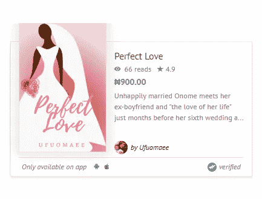

A book card sample

> 注意:这个数据是在 10 月份收集的，所以随着每天有更多关于 okadabooks.com 的书籍出版，一些发现会有变化。由于网速低，403 个错误。电子贸易委员会认为网站上 80%的书都被偷了。这仍然是整个数据集的一个很好的表示。

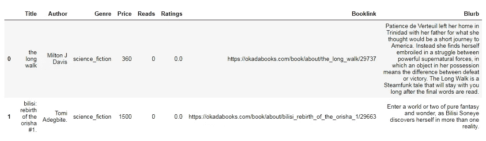

screenshot of data frame

## 书籍的可及性

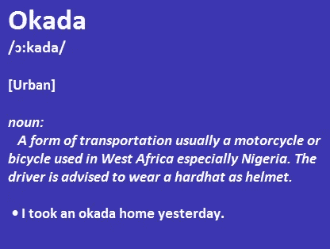

meaning of okada

okadabooks 的核心愿景之一是让读者更容易接触到书籍。其中很大一部分是尼日利亚人，因为公司总部就在那里。这就是为什么这些书的价格是用奈拉(₦)表示的，就像上面的书卡上看到的那样。为了实现这一愿景，它早些时候鼓励作者将图书价格控制在 1000 奈拉以内。

下意识地，推荐这个价格等级使得大部分作者不对出版的书籍定价。这反过来又有助于实现这一愿景。okadabooks 上出版的书籍几乎有一半是免费的，**准确的说是 48%** 。

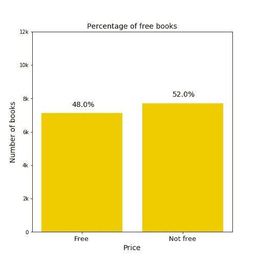

## 大多数作者只写过一本书

okadabooks 上的绝大多数作者只写了一本书，前 1%的作者写了 10 多本书。okadabooks 拥有 8835 位作者，是大多数尼日利亚作者的首选网站，鼓励许多新作者出版他们的书籍。

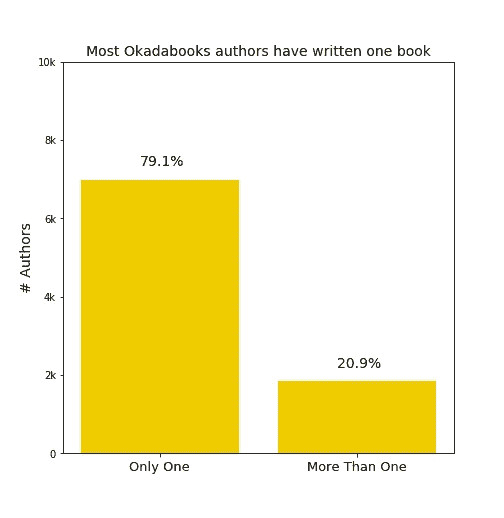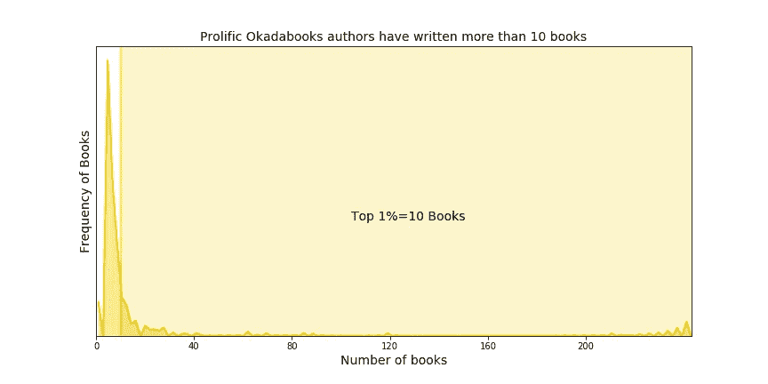

## **精英十人**

这些是阅读量最多的前 10 位作者。在浏览了名单上的个人资料后，我发现第一个名字[*Okechukwu Ofili*](https://www.konbini.com/ng/lifestyle/okechukwu-ofili-is-helping-nigerian-authors-get-paid-for-their-work/)*很有趣。Okechukwu 是 okadabooks 的首席执行官和创始人。这很有趣，因为我不知道它的创始人是作家，这促使我去读他的书。在这份榜单中，Okadabooks.com 位列前五，因为它有助于分发更多的书籍，以迎合网站上的大量类别。*

*有一个作者的名字叫做*不知名的*，我觉得这个名字很奇怪*。*通过链接去找了一些书后，都把我带到了用户 *Okadabooks Mechanic* 那里，是母站点的一个附属机构。 [*下面是*](https://okadabooks.com/user/OkadabooksMechanic) 他们的简介，浏览一下他们的一些出版物。*

> *作者的名字有时不同于用户的名字*

*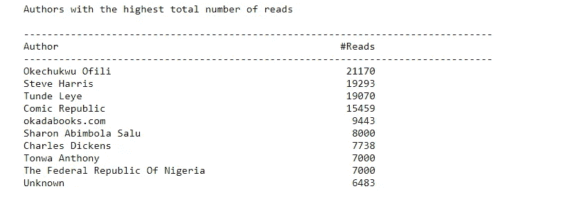**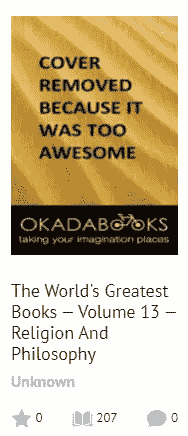*

## ***有价格的书很少有人买***

*Okadabooks 上的大量免费书籍对试图从该网站赚钱的作者产生了负面影响。对于严重依赖电子书平台的自出版作者来说，这可能会彻底令人沮丧。他们最好的办法是在出版过程中同时出版一些硬拷贝。**有价格的书 89%** 买了不到 10 次。*

*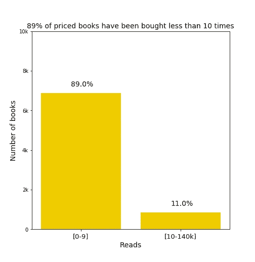*

# *成功指标*

**

*我的书失败了吗？*

*成功是相对的，因为从自助出版的作家到传统作家，大多数作家的书都写得很好。目的是通过比较整个电子书平台的阅读量，为 okadabooks 的作者生成一个**现实的**指标。*

*获得成功标准的一个方法是找出优秀书籍的阅读量。我推断，一本出色的书获得了第 99 个百分位数 [*的阅读量。由于术语*exceptual*倾向于比较，这一措施似乎是合理的。*](https://en.wikipedia.org/wiki/Percentile)*

*为了考虑购买力因素，建立了两个里程碑:第一个里程碑和 B 星。前者只关注有价格的书籍，而后者代表整个数据集。*

*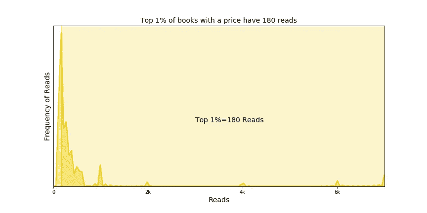**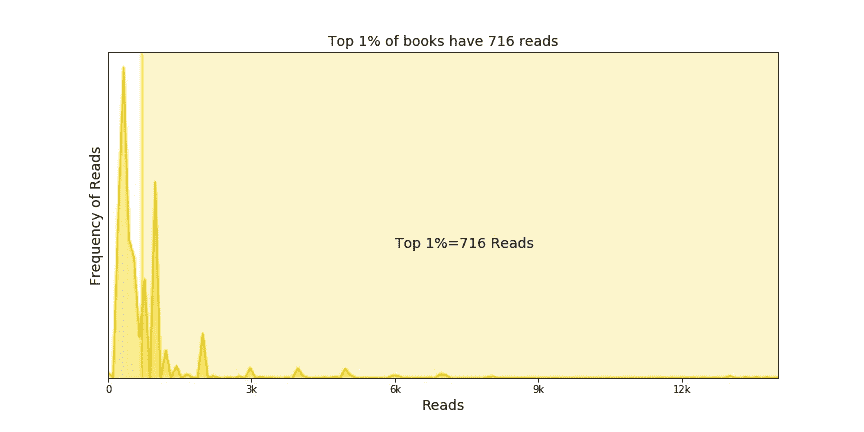**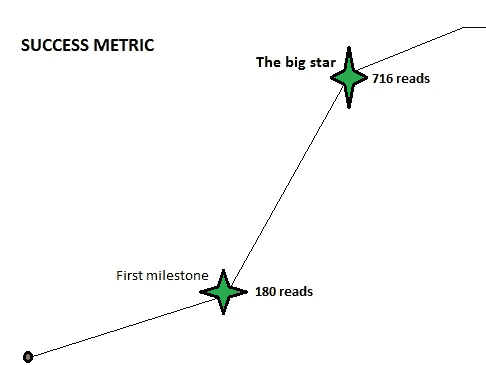*

## *吸血鬼祖先和新人*

*这些是第一批在 Okadabooks 上出版的书。在网站上快速浏览后，我发现每个图书链接都有一个唯一的编号，不会在整个数据集中重复。从那里很容易得到前三本出版的书。出版的最后一本书叫做《菜鸟》。*

*网站上最先发布的三本书分别是*[H*ow 懒惰拯救了我的生命(预览)*](https://okadabooks.com/book/about/how_laziness_saved_my_life_preview/2) 和 [*绝望的奈贾女人的日记*](https://okadabooks.com/book/about/the_diary_of_a_desperate_naija_woman/3) *。*前两本书由 okadabooks 的创始人兼首席执行官 Okechukwu Ofili 出版。第二次出版， [H *ow 懒惰救了我的命(预告)*](https://okadabooks.com/book/about/how_laziness_saved_my_life_preview/2) 以**14000 在网站上的阅读量最高。****

**在我运行我的网络爬虫之前，okadabooks 上出版的最后一本书是 [*社交媒体对抑郁症的影响&自杀*](https://okadabooks.com/book/about/the_influence_of_social_media_on_depression_suicide/29770) *。《新秀》是即将出版的第**29770 本**书。***

## ****结论****

****

**自 2013 年成立以来，Okadabooks 一直鼓励新作者，平均每年约四千本书。这篇文章旨在检查读者(主要是尼日利亚人)的阅读文化，同时也为作者生成一个成功指标。如果你正在寻找一些好的小说，如奇曼达·阿迪契 *和*任何其他非洲文学，我推荐你去 [*网站上买一本电子书。*](https://okadabooks.com/store)**

**感谢您的阅读。如果你喜欢这篇文章，请关注并看看我的其他数据科学文章🙏🙏。**