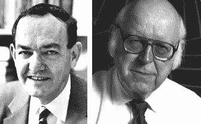
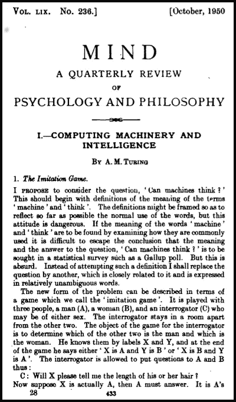
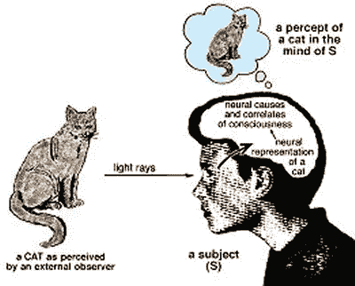
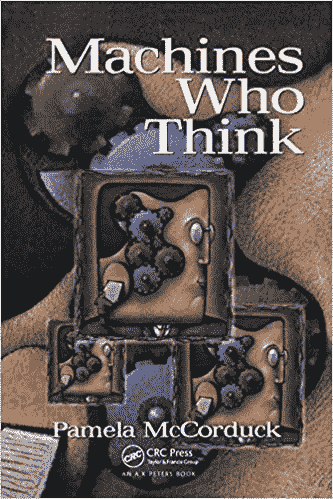

# 象征人工智能的兴衰

> 原文：<https://towardsdatascience.com/rise-and-fall-of-symbolic-ai-6b7abd2420f2?source=collection_archive---------3----------------------->

## AI 的历史| [走向 AI](https://towardsai.net/)

## 人工智能的哲学预设

## 符号人工智能

> 人工智能的早期成功范例，被认为是通向一般智能的道路

Allen Newell, [Herbert A. Simon](http://en.wikipedia.org/wiki/Herbert_A._Simon) — Pioneers in Symbolic AI

由通用问题求解器和其他基于规则的推理系统(如逻辑理论家)等项目启动的人工智能工作成为了近 40 年研究的基础。符号人工智能(或经典人工智能)是人工智能研究的一个分支，它试图以声明的形式(即事实和规则)显式地表示人类知识。如果这种方法要成功地产生类似人类的智能，那么就有必要使用符号和规则将人类拥有的隐性或程序性知识转化为显性形式。象征性人工智能取得了一些令人印象深刻的成功。模仿人类专业知识的人工系统，如专家系统，正在构成狭窄但深刻的知识领域的各种领域中出现。

## 人工智能与哲学

艾伦·图灵在 1950 年开始问这个问题——机器会思考吗？如果是，那么我们是机器吗？

这导致了人工智能机器的出现，这些机器被认为能够思考，因此被认为是智能的。在我们讨论会思考的 AI 之前，能不能先定义一下思考？勒内·笛卡尔[1596–1650]——“动物是神奇的机器，人类也是，除了他们有头脑”

人工智能的鼻祖，的说过——思考是对符号的操作，推理是计算。

他的想法是——思考可以通过操纵精神符号来完成。但首先什么是象征呢？

为了正式定义它，符号——代表其他事物的可感知的事物

*   字母符号、数字、路标、音乐符号等
*   像“苹果”这样的符号它象征着红色的可食用的东西。在其他一些语言中，我们可能有其他一些符号来象征相同的可食用物体。

数学家兼哲学家勒内·笛卡尔认为思想本身是象征性的表现，而感知是一个内在的过程。

> “我认为味道、气味、颜色对于我们定位的对象来说仅仅是名称，它们存在于意识中。因此，如果活的生物被移走，所有这些品质将被抹去和消灭”-伽利略，分析师，1623

宇宙是用数学语言书写的，它的特征是三角形、圆形和其他几何物体。所以他指出所有的现实都是数学的。

霍布斯受到伽利略的影响，就像伽利略认为几何可以表示运动一样，再者，按照笛卡尔的说法，几何可以表示为代数，代数是对[数学符号](https://en.wikipedia.org/wiki/Mathematical_symbol)以及操纵这些符号的规则的研究。创造人工智能的另一种方式是制造有自己思想的机器。

但是现在什么是头脑呢？可以用下面的话来回答

[**二元论——身心**](https://en.wikipedia.org/wiki/Mind%E2%80%93body_dualism)

笛卡尔——一个符号和它所象征的是两件不同的事情。头脑是非物质的，因此也是非空间的。笛卡尔清楚地将心灵与[意识](https://en.wikipedia.org/wiki/Consciousness)和自我意识等同起来，并将其与作为[智力](https://en.wikipedia.org/wiki/Intelligence)所在地的[大脑](https://en.wikipedia.org/wiki/Brain)区分开来

思维——符号的代数操作，与心智相关

思想和物质如何相互作用——身心问题

## 从哲学到思考机器

> 一个物理符号系统具有一般智能的必要和充分的手段。——[艾伦·纽厄尔](https://en.wikipedia.org/wiki/Allen_Newell)

机器操纵符号的能力被称为[符号 AI](https://skymind.ai/wiki/symbolic-reasoning) 。约翰·豪格兰德在他的书《人工智能——非常理念》中称之为老式的人工智能。我们如何知道一个符号/单词的意思？字典？这又给了一个符号在其他符号/词方面的意义，那么这个意义从何而来呢？

语言和思维——我们能不用符号思考吗？

根据诺姆·乔姆斯基的说法，语言和符号是第一位的。

某一套[结构规则](https://en.wikipedia.org/wiki/Grammar)是[对人类来说与生俱来的](https://en.wikipedia.org/wiki/A_priori_and_a_posteriori)，独立于[感官体验](https://en.wikipedia.org/wiki/Sensory_experience)。随着在心理发展过程中接受更多的语言刺激，儿童会采用符合普遍语法的特定句法规则。

约翰·洛克[1632-1704]反对乔姆斯基的观点，即人类生来就有普遍语法，这是一种知识，他假定大脑是一块白板。

因此，与先前存在的笛卡尔哲学相反，他坚持认为我们生来没有先天的想法，相反，知识仅仅由通过感知获得的经验决定。孩子会符号操作，会做加减法，但并不真正明白自己在做什么。所以操纵符号的能力不代表你在思考。

> 我们的大脑中有些东西(量子力学)是当今物理学无法解释的。罗杰·彭罗斯

## 象征人工智能的衰落

然而，符号人工智能遇到的困难是很深的，可能是无法解决的。符号人工智能先驱们遇到的一个难题被称为常识知识问题。此外，依赖于程序性或隐性知识的领域，如感觉/运动过程，在符号人工智能框架内更难处理。在这些领域，符号人工智能取得了有限的成功，基本上把这个领域留给了更适合这类任务的神经网络架构(在后面的章节中讨论)。在接下来的章节中，我们将详细阐述符号人工智能的重要子领域以及这种方法遇到的困难。

ELIZA

伊莱扎，一个被认为是可以与人对话的智能程序，由麻省理工学院 CSAIL 的约瑟夫·韦岑鲍姆于 1966 年建造。后来发现它只是操纵用户的输入来产生输出

MYCIN [1974]是一个在斯坦福建立的医学诊断专家系统，但从未在现实世界中使用过

塞缪尔的检验程序【1952】——阿瑟·塞缪尔的目标是探索如何让计算机学习。这个程序随着玩的游戏越来越多而不断改进，最终打败了它自己的创造者。1959 年，它打败了最好的选手，这造成了对人工智能统治人工智能的恐惧。这导致了人工智能的连接主义范式，也称为非符号人工智能，它产生了基于学习和神经网络的方法来解决人工智能。

## 参考

> [物理符号系统](https://en.wikipedia.org/wiki/Physical_symbol_system)
> 
> 与机器人的爱和性——大卫·利维，2008
> 
> 人工智能——非常理念——约翰·豪格兰，1985
> 
> 会思考的机器——帕梅拉·麦克达克，1979 年
> 
> 【T4《艾的哲学》和《艾的哲学》，约翰·麦卡锡