# 2019 RISE 我们看到了哪些趋势？

> 原文：<https://towardsdatascience.com/rise-conference-2019-vs-2018-79cf85b349c3?source=collection_archive---------26----------------------->

## 关于人口统计、行业和参与者保留的一些预期和意外的发现

Photo by [nick hidalgo](https://unsplash.com/@shotbynick?utm_source=medium&utm_medium=referral) on [Unsplash](https://unsplash.com?utm_source=medium&utm_medium=referral)

作为亚洲最大的科技/创业会议之一，RISE Conference 2019 于 7 月 11 日刚刚结束。与去年的活动有什么不同？哪些国家的初创企业发展最快？哪些行业最火，哪些行业“缩水”？

为了回答这些问题，让我们来看看创业参与者的数据。许多发现都在意料之中，但有些确实令人惊讶。

(数据集和 Jupyter 笔记本在本文末尾提供)

# 人口统计—新加坡+菲律宾↑,印度↓

就初创公司参与者总数而言，它正在逐步增长——与 2018 年相比，增加了 24 家公司。鉴于国家名单并不相同，参与的国家数量(58 个)在两年内惊人地相同。

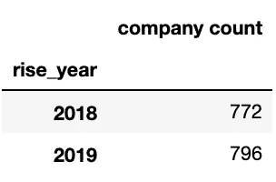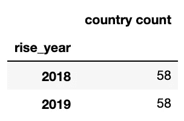

## 顶级参与国家

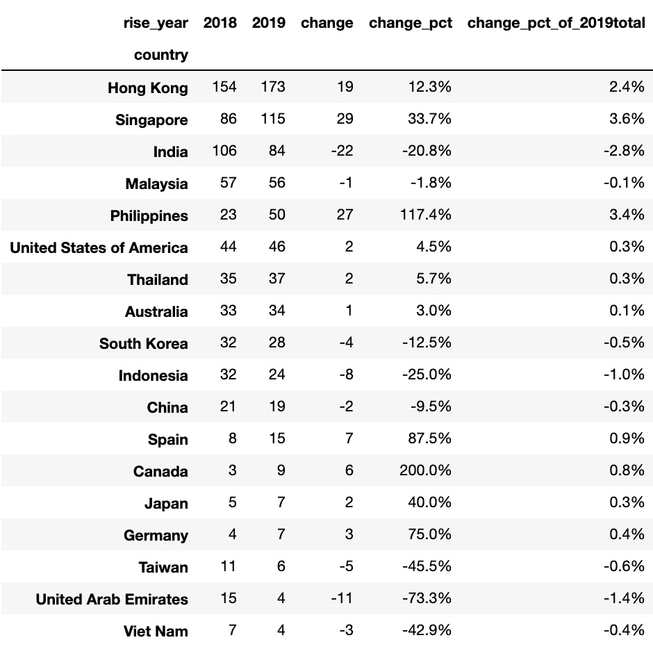

Top countries by participant counts

在排名靠前的参与国中，印度和马来西亚的变化最大——印度的参与公司减少了 20.8%(减少了 22 家)，而菲律宾的参与公司增长了 117%(增加了 27 家)。香港和新加坡继续成为该地区的前两名。

## 前 5 个增加/减少的国家

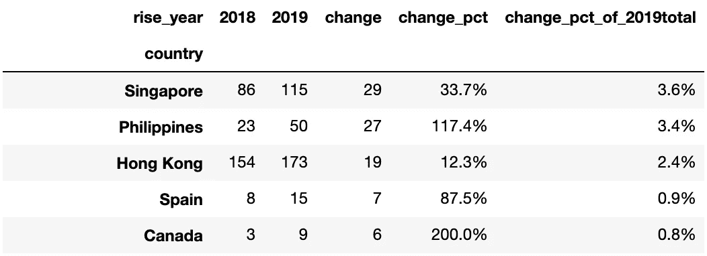

Top 5 increase countries

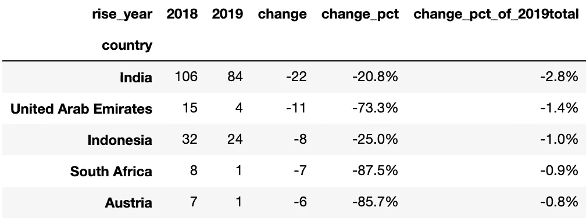

Top 5 decrease countries

在所有国家中，新加坡的新参与者人数最多(增加 29 人，占总参与者的 3.6%)。今年，RISE 遭遇了印度参与者人数的最大降幅(22 人，占总数的-2.8%)。

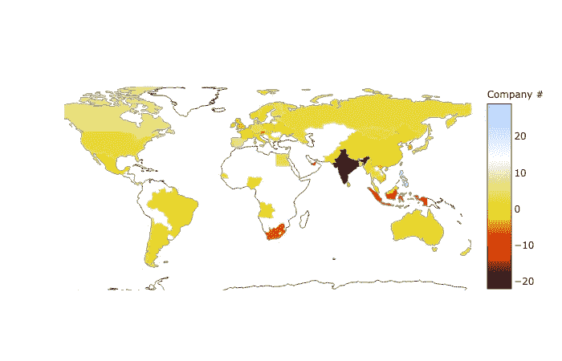

RISE 2019 vs 2018 — participants change, by country

## 资金层级

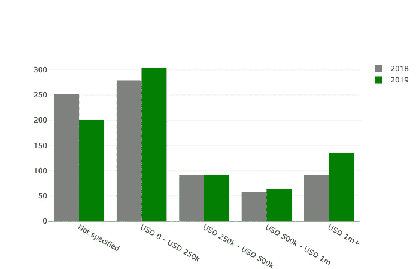

RISE 2019 vs 2018 — funding tier change

规模超过 100 万美元的公司明显更多，从 2018 年的 92 家公司增加到 2019 年的 135 家公司，这可能意味着更多获得资助的创业公司正在考虑将 RISE 作为一个重要的平台。

# 行业——人工智能、电子商务

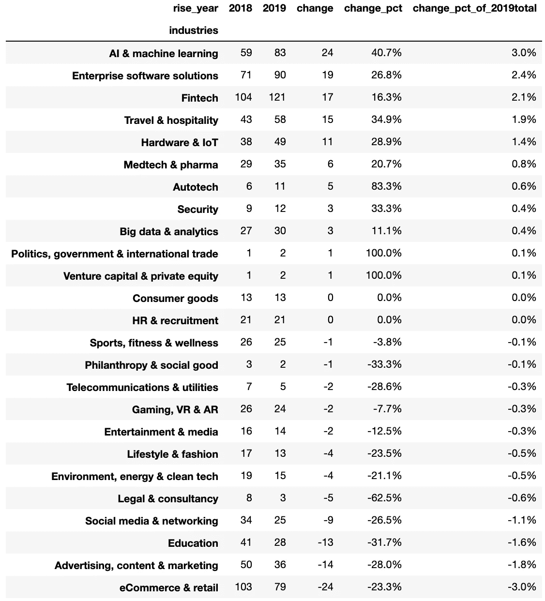

RISE 2019 vs 2018 — participants change, by industry

当然，人工智能&机器学习是最热门的创业行业之一——但是它到底有多火呢？参会的 AI 创业公司数量在所有行业中增长最多(+24，较 2018 年增长 40.7%)。**企业软件解决方案、金融科技和旅游&酒店**也是会议中增长最快的领域。

另一方面，**电子商务&零售**的参与者数量下降幅度最大(-24，较 2018 年下降 23.3%)。如果我们进一步研究这个细分，我们会发现 net -24 的一半以上来自印度。也许可以对印度最近的电子商务空间进行更多的研究/生存分析(推广不够？竞争太大？还是已经做得太好了？).

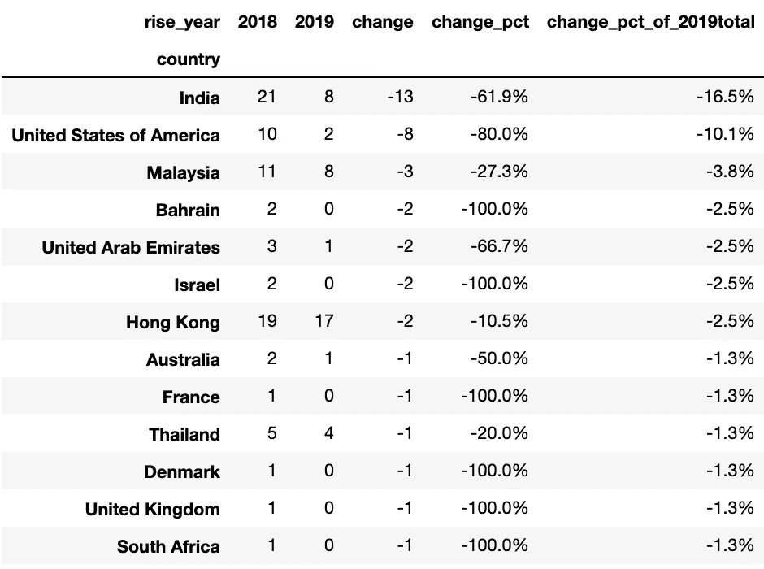

Participants change in **eCommerce & retail**

## 赢家:新加坡和菲律宾金融科技，新加坡和香港物联网+人工智能

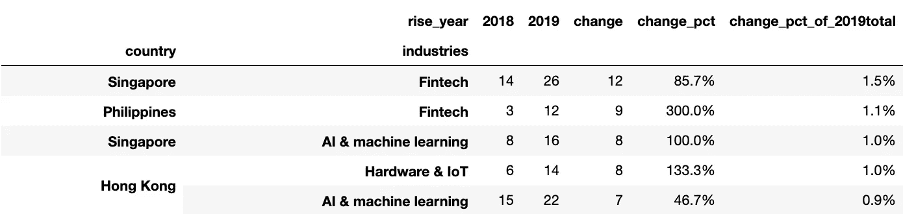

Top gainers, by country-industry

虽然人工智能是 RISE 2019 中最具趋势的行业，但**新加坡和菲律宾的金融科技**是我们看到参与者增长最多的行业，特别是菲律宾，该国的金融科技公司数量是此次活动的 3 倍。**新加坡人工智能和香港物联网+人工智能**也是会议中发展最快的部分，正如预期的那样。

## 输家:印度电子商务、香港金融科技

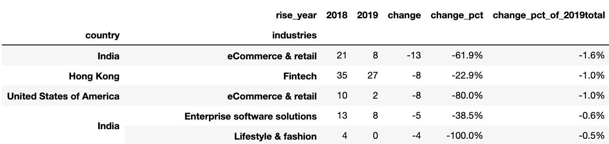

Top losers, by country-industry

除了印度，美国参加会议的电子商务公司也少得多。我想知道这在多大程度上可以归因于中国与政府之间的贸易战。

有一个令人惊讶的输家——**。长期以来，香港一直是亚洲的金融中心，也一直是该地区金融科技公司的天然孵化器。现在新加坡增长了 85.7%，而香港却萎缩了 22.9%。**

尽管来自香港的金融科技公司数量(27 家)仍高于来自新加坡的数量(26 家)，但很难说明年是否还会如此。与新加坡相比，香港在政府支持、政治稳定、人才等各方面不断失去优势。作为一名香港人，我希望香港能够继续成为金融科技或商业发展的良好环境，但事实似乎并非如此。

# 参与者保留

## 按国家

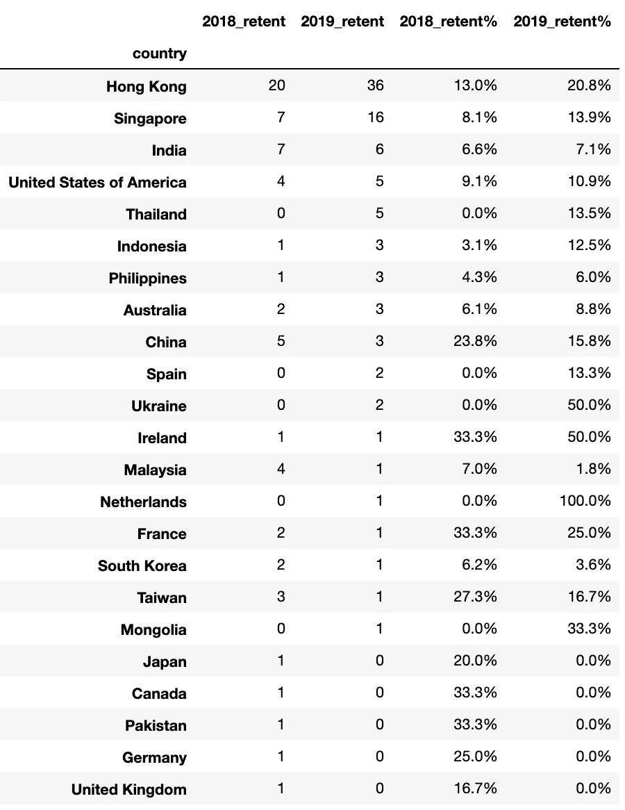

participant retention, by country

上表显示了被 RISE“留住”的创业公司数量。列 *2018_retent* 显示有多少公司加入了 RISE 2017，然后又加入了 RISE 2018。同样适用于列 *2019_retent。*我们可以看到，RISE 在留住香港的初创公司方面做得越来越好，今年有超过 20%的公司再次加入。

## 按行业

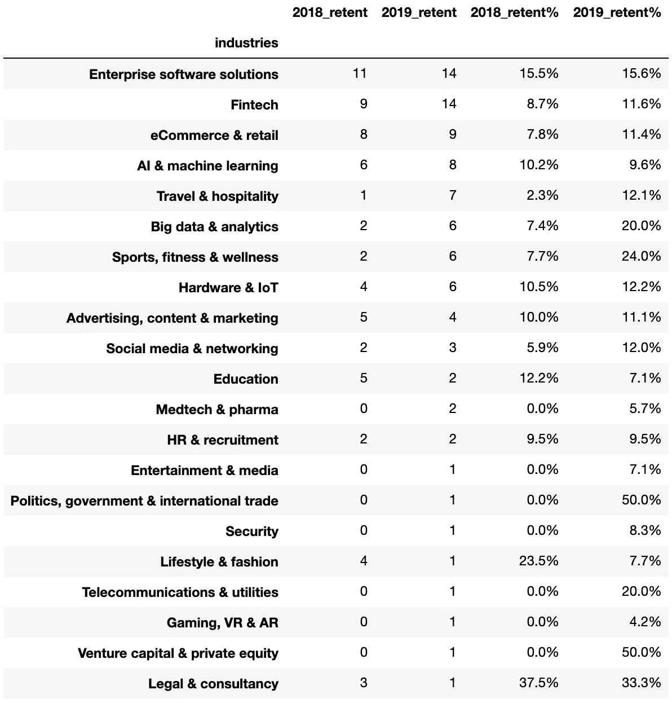

participant retention, by industry

**企业软件解决方案**和**金融科技**是今年再次参加会议的公司最多的。值得注意的是**差旅&招待费**的留存率增幅最大(从 2.3%增至 12.1%)。RISE 是一个特别有效的旅游平台吗？

# 关闭

该数据集包含一些其他有趣的属性，如“电梯推销”和参与创业公司的社交媒体档案的可用性，我去年写了一篇文章，名为《创业公司的文化差异》。而且有了 2 年的数据集，做一些生存分析或者研究参与 RISE 的效果可能会很有意思。我会去看看我那位自愿参加会议的朋友，看看是否有一些我们可以进一步研究的有趣的角度。

# 附录

Jupyter 笔记本+数据:[https://www.kaggle.com/mr5iff/rise-2019-vs-rise-2018](https://www.kaggle.com/mr5iff/rise-2019-vs-rise-2018)