# 集群风险管理

> 原文：<https://towardsdatascience.com/risk-management-with-clustering-fd594e064806?source=collection_archive---------17----------------------->

## 如何揭开表面下的结构

**更新**:我开了一家科技[公司](http://www.legislate.tech/)。你可以在这里找到更多

E 对每个投资组合经理的夏普比率进行评估，夏普比率衡量其投资回报的相关风险，由以下公式给出:

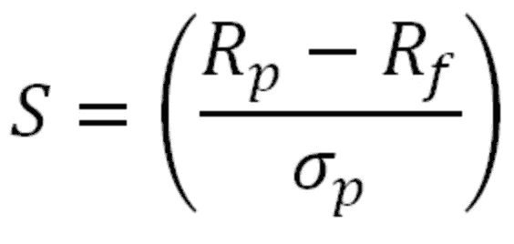

其中:

*   Rp 是投资组合的回报
*   **Rf** 是无风险收益(如国债)
*   **适马 p** 是投资组合超额收益的标准差，代表投资组合的风险

夏普比率经常受到批评，因为它假设波动性不好，而且因为它的无量纲比率，有时很难解释。

在这篇文章中，我们将看到投资于“好的”夏普比率的风险可能比预期的要大得多。为此，我们将使用 K-Means 聚类来揭示隐藏的结构。

# 数据

我们将分析大约 50 家机构投资者的季度美国持股情况，这些机构投资者管理的总资产超过 1 亿美元。这些数据是公开的，因为他们需要每季度向 SEC 提交详细说明其持股情况的 13F 表格。我用 [Sentieo 的](https://sentieo.com)平台下载数据。

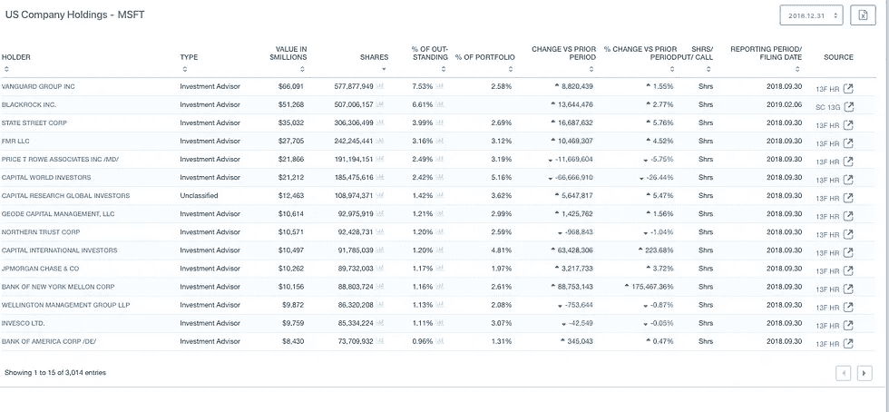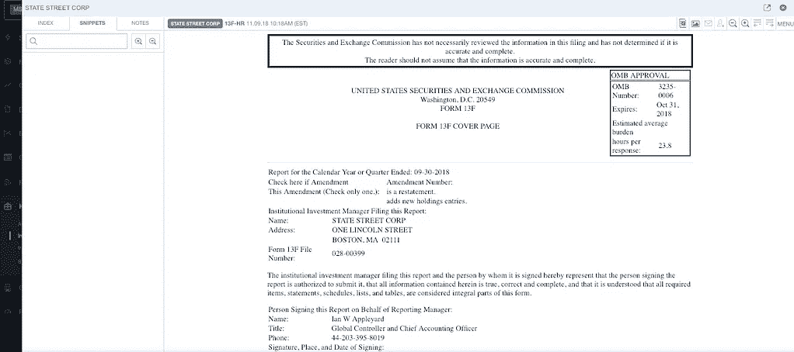

Microsoft’s institutional investors and an example of a 13F form

表格详细说明了他们投资的性质和价值，以及他们各自在投资组合中所占的比例。为了简单起见，我们只考虑他们管理的总资产和他们投资的百分比。我们还将提取以下特征来代表他们的投资风格:

*   他们最大持股的%
*   %的第二、第三、第四和第五次
*   投资组合剩余部分的%
*   管理资产总额

我们选择了这些特征来观察基金的规模和他们的配置策略之间是否有关系。分配策略也可以用来代表他们的侵略性。

如果一个经理把所有鸡蛋放在一个篮子里，他们将比使用多个篮子的人承担更多的风险。然而，如果所有的鸡蛋质量都很好，夏普比率就不会增加分散风险。

# 数据可视化

下载准备好 2018 年 3 季度的数据后，上传到了 AuDaS。 [AuDaS](http://Mindfoundry.ai/audas) 由 [Mind Foundry](http://mindfoundry.ai) 开发，允许任何人在几分钟内轻松学习机器学习和构建模型。

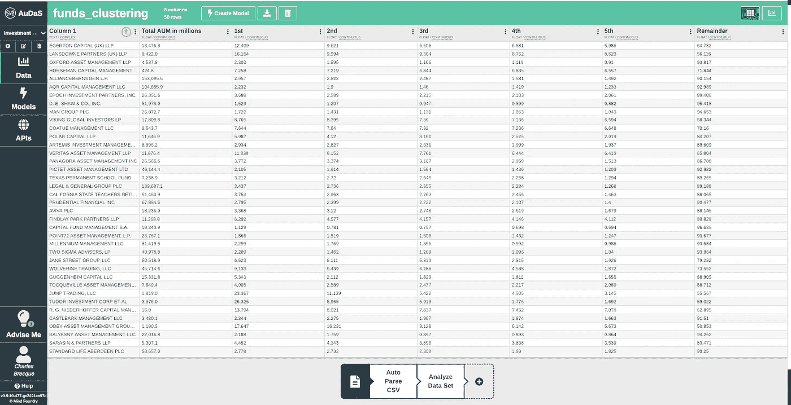

数据上传后，AuDaS 会扫描数据以发现异常，并向用户发出建议。在这种情况下，它识别出 Name 列没有预测值，我们可以删除它。

数据集中的基金经理是养老基金、自营基金、基础基金和量化基金的组合。直方图视图还允许我们查看资金如何跨功能分布。

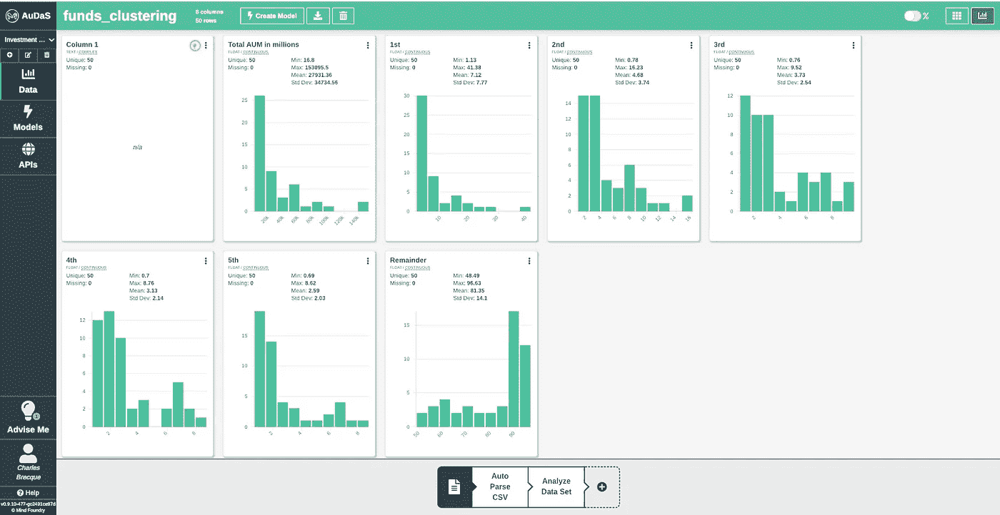

# 使聚集

我们现在将要求 AuDaS 识别我们的基金经理篮子中的集群，结果它自动排除了 name 列。

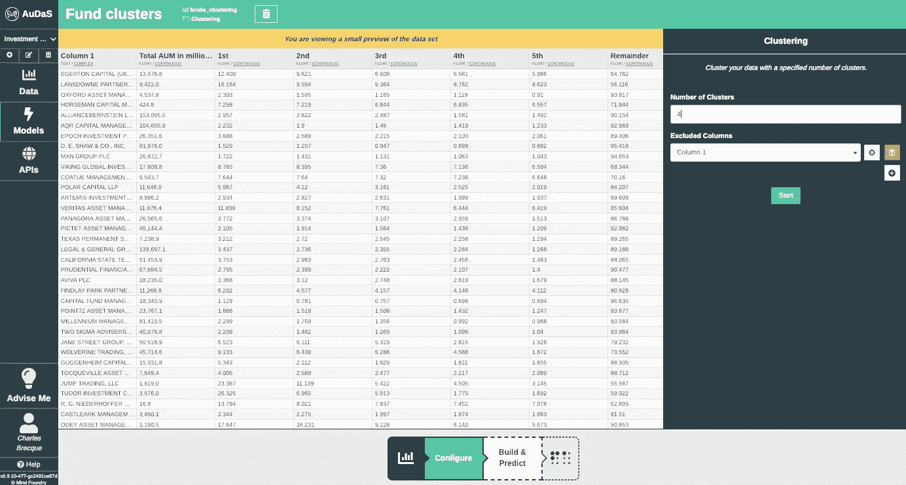

下面给出了相关的模型和性能结果，我们可以看到 AuDaS 已经识别了 4 个相当清晰的集群。

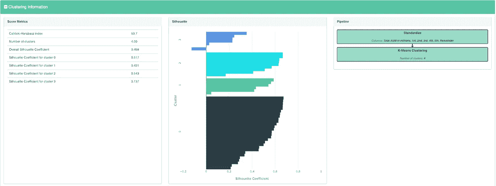

要了解这些聚类的属性，我们可以返回直方图视图，查看这些类在其他要素中的分布情况。

# 解释集群

## 0 类:相当分散的中小型基金

这些基金的前五大持股占其总资产的 10%至 20%，因此被认为相当分散。这类基金的一个例子是 [Polar Capital](http://www.polarcapital.co.uk) ，它提供基本面驱动的投资产品，在长期内提供差异化的风险调整回报。

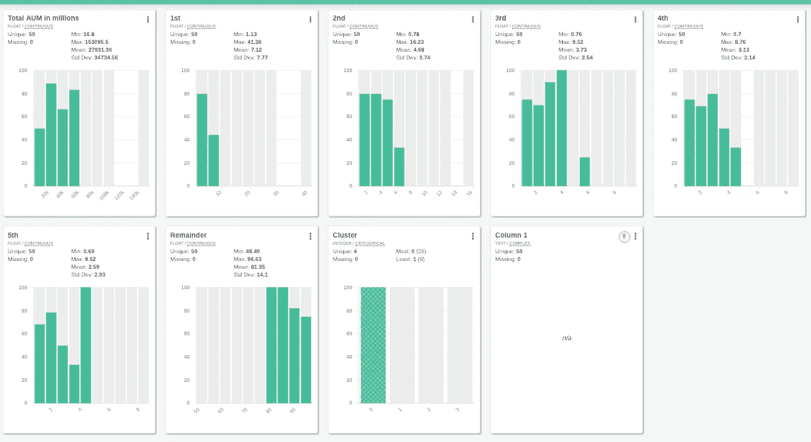

## 第一类:保守的中大型基金

这些基金的前五大持股占其总资产的比例不到 10%，这意味着它们非常分散。这也突显出，规模较大的基金似乎更厌恶风险。直觉上，这可以解释为他们会失去更多，因此需要把鸡蛋放在更多的篮子里。这一类的例子包括 [AQR 资本管理](https://www.aqr.com/)、[保诚](https://www.pru.co.uk/)和[千禧管理](https://www.mlp.com/home/)。

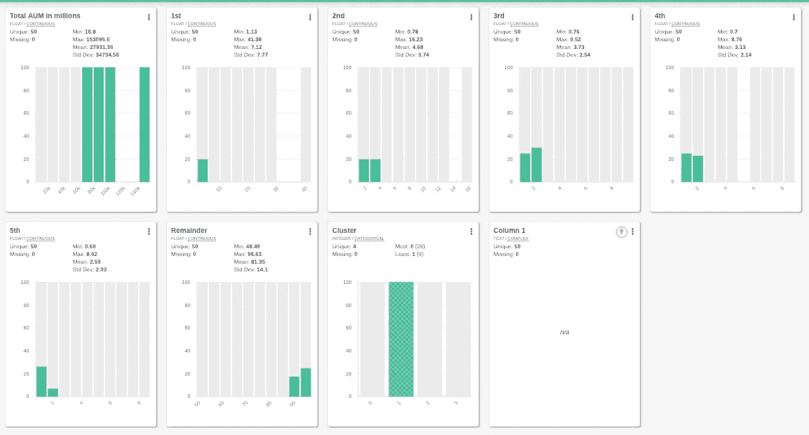

## 第二类:小型激进基金

这些基金的前五大持股占据了其投资组合的至少 20%，在某些情况下甚至高达 50%。由于它们的规模，这些基金必须更有策略才能从投资中获得回报。这一类的例子有[兰斯多恩合伙公司](https://www.lansdownepartners.com/)、[奥迪资产管理公司](https://www.odey.com/)和[埃格顿资本公司](https://www.egertoncapital.com/)，他们以下大赌注而闻名。兰斯多恩的嘉能可[赌注](https://uk.reuters.com/article/uk-hedgefunds-glencore/hedge-fund-bet-on-glencore-backfires-with-100-million-loss-idUKKBN1DH1ZA)在 2017 年事与愿违，让他们损失了 1 亿美元。Odey 在 2018 年 6 月押注英国政府债务相当于该基金资产净值的 147.4%。

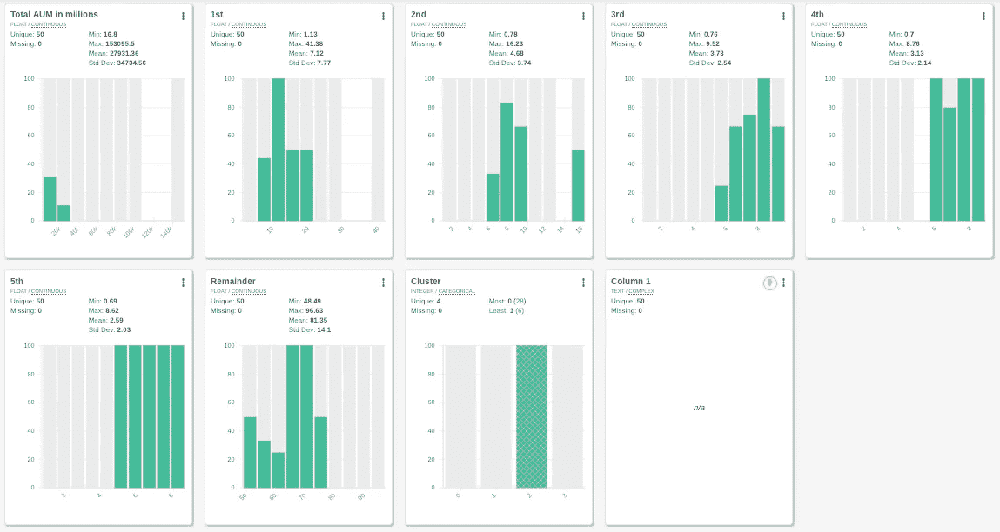

## 第三类:非常激进的小型基金

这些基金甚至比前一类更激进，因为大多数基金的前 5 大持股占据了投资组合的至少 40%。这一类的例子有 [Wolverine Trading](https://www.wolve.com/trading-businesses#wolverine) 和 [Jump Trading](https://www.jumptrading.com/) ，它们都是自营基金。这意味着他们交易的是自己的资本(而不是投资者的资本)，这给了他们更多的自由和对投资方式的控制。因此，他们可以随心所欲地咄咄逼人。

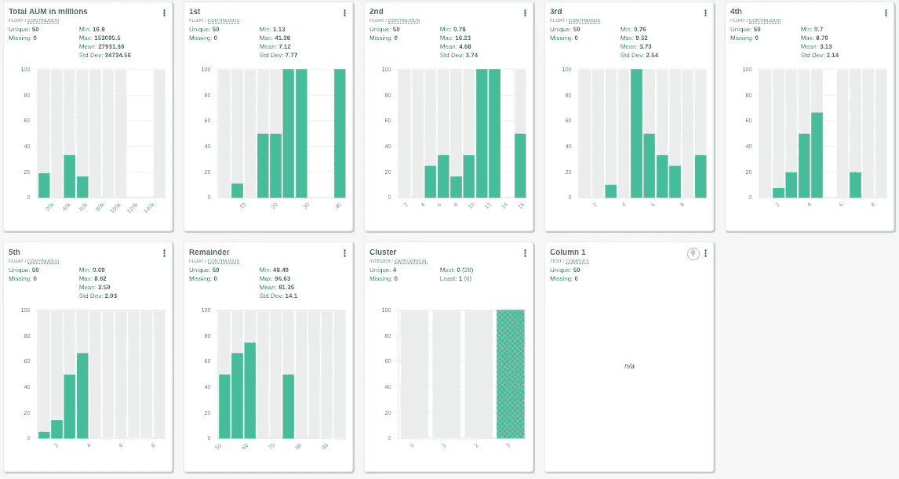

# 结论和延伸

在这个简短的研究中，我们能够从我们的一篮子投资经理中提取出一些清晰的结构，这些投资经理可能隐藏在类似的夏普比率后面。这种结构突出了取决于其规模、类型和性质的基金的进取性。

此外，我们只考虑了一些基本特征，这项研究还有许多潜在的扩展:

*   **基金的流动性**考虑的是它们是否能够在需要的时候卖出(也就是说，它们卖出的资产是否会有买家)。将流动性作为一个特征包括在内，可能会揭示哪些基金被困在了龙虾池投资中。
*   永久资本损失:这可能发生在股票暴跌至 0，或者你借钱亏损的时候。使用**杠杆**作为一个功能可以突出一些额外的结构。
*   **投资的类型/类别**:在本研究中，我们只考虑了前五大投资的规模，但我们也可以考虑它们的类别(科技、工业等)。某些基金可能持有相同的投资组合，尽管比例不同，因此投资者应避免同时投资所有基金。
*   **其他管理特征**，如费用、员工数量、在公司的平均工作年限、奖金池等。可能有助于发现对我们的风险分析有益的其他结构层。

如果你有兴趣了解我们的 Quant 和基本面对冲基金客户如何使用澳元进行风险分析和投资管理，请不要犹豫，通过[电子邮件](http://charles.brecque@mindfoundry.ai)或 [LinkedIn](https://www.linkedin.com/in/charles-brecque-96768397/) 联系我。您还可以阅读以下更多案例研究:

 [## 机器学习的价值投资

### 你最喜欢的持有期不一定是永远…

towardsdatascience.com](/value-investing-with-machine-learning-e41867156108)  [## 用数据科学充实投资分析师

### 基本面投资如何受益于机器学习

towardsdatascience.com](/augmenting-investment-analysts-with-data-science-98297cb1ccb0) 

## 团队和资源

[Mind Foundry](http://www.mindfoundry.ai) 是牛津大学的一个分支机构，由斯蒂芬·罗伯茨(Stephen Roberts)和迈克尔·奥斯本(Michael Osborne)教授创立，他们在数据分析领域已经工作了 35 年。Mind Foundry 团队由 30 多名世界级的机器学习研究人员和精英软件工程师组成，其中许多人曾是牛津大学的博士后。此外，Mind Foundry 通过其分拆地位，拥有超过 30 名牛津大学机器学习博士的特权。Mind Foundry 是牛津大学的投资组合公司，其投资者包括[牛津科学创新](https://www.oxfordsciencesinnovation.com)、[牛津技术与创新基金、](http://www.oxfordtechnology.com)、[牛津大学创新基金](https://innovation.ox.ac.uk/award-details/university-oxford-isis-fund-uoif/)和 [Parkwalk Advisors](http://parkwalkadvisors.com) 。