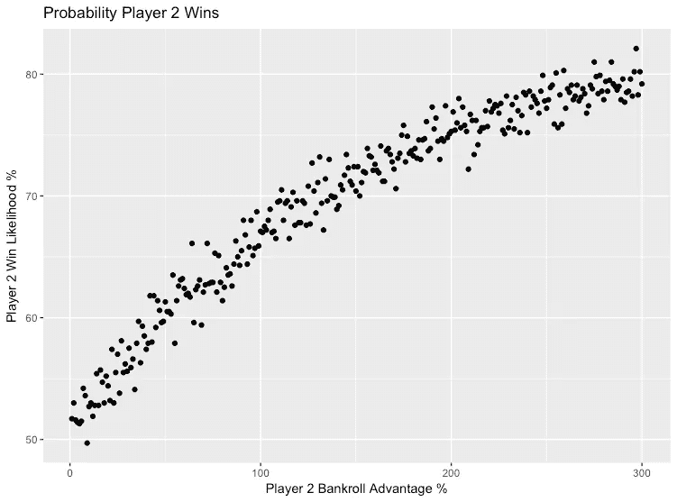
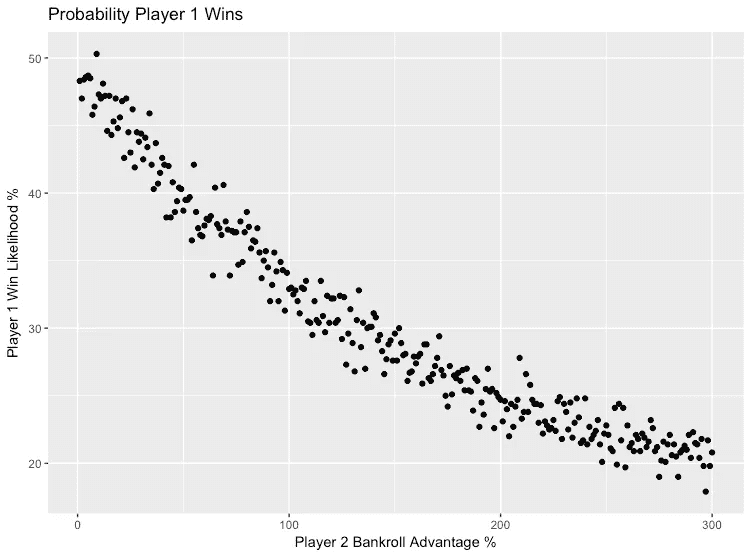
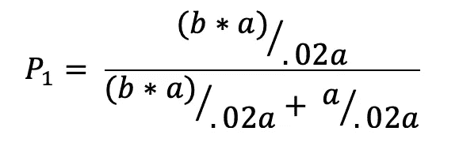
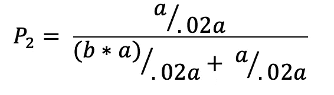
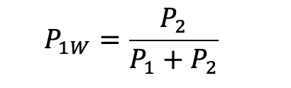
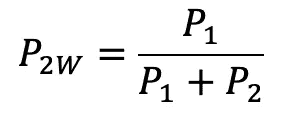
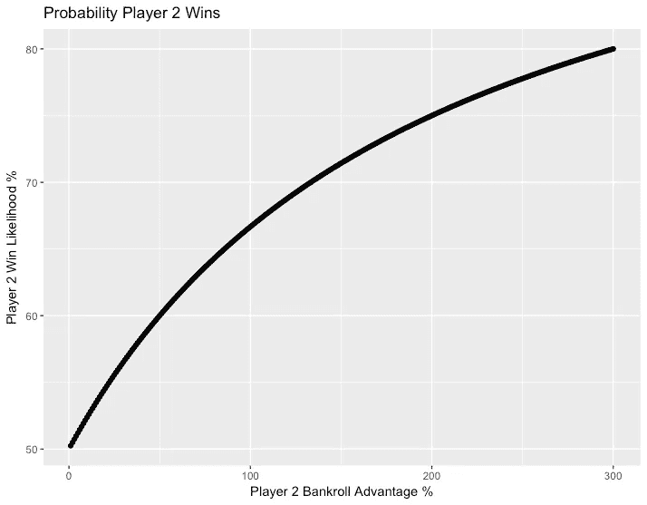
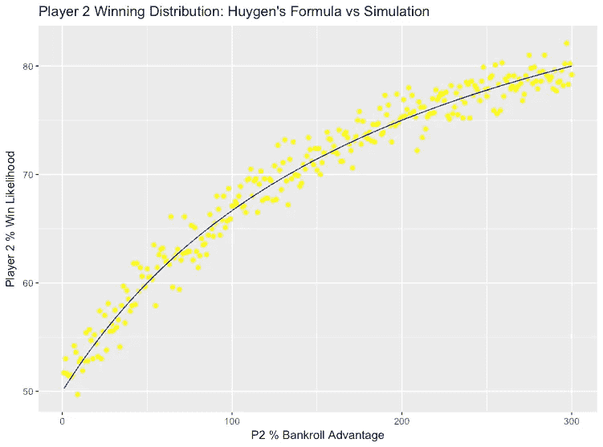

# 风险建模:随机游走零和博弈中资本优势的力量

> 原文：<https://towardsdatascience.com/risk-modeling-the-power-of-capital-advantage-in-random-walk-zero-sum-games-part-1-619314798d2?source=collection_archive---------36----------------------->

在这篇文章中，我将展示一个至关重要的数学概念，它对于在机会游戏中构建风险管理策略是必不可少的。通过在 R 中使用随机数发生器的实验，我们将探索在模型投资游戏中拥有相对于对手的固定资本优势将如何产生显著的概率优势，从而最终获胜。

我们将把我们的模拟结果与已被证明的数学定理预测的结果进行比较。之后，我们将探索这个概念对赌博、投资和商业的战略意义。

**破产风险简介:**

破产风险是金融界常用的一个概念。它试图量化投资组合价值归零的可能性。破产风险的原则如下:

*   在一个无限的样本空间中，在任何事件上赌一个人总启动资金的固定部分，最终都会导致破产*，不管每次下注的期望值是正的。*
*   遵循上述标准的每一次连续下注都会增加破产的风险，并产生破产的随机确定性。

有一种可能，你对上述说法持怀疑态度。如果你有一定的概率赢得一个赌注，因此有一个正的期望值，那么反复下注怎么可能会导致你输光所有的钱呢？这正是我们在本系列中将通过对各种玩具游戏的模拟和数据分析来探讨的问题。说到数学，眼见为实。

**定义游戏:**

*   假设有两个玩家:玩家 1 和玩家 2
*   假设 a 是玩家 1 开始时的金额
*   假设 b 是一个乘数，其中 2 号玩家从(b * a)美元开始

这两个玩家将连续掷硬币。

*   正面的话，玩家 1 将获得其初始投资的 2%[.02 * a]，反面的话，他将损失[. 02 * a]。
*   在正面，玩家 2 将获得玩家 1 失去的[.02 * a]，在反面，他将失去玩家 1 获得的[.02 * a]
*   如果一个玩家破产了，(失去了所有的钱)，那么另一个玩家就赢得了游戏。

我们会让每个玩家投掷无限数量的硬币，直到其中一个坏掉。然后，我们将运行这个游戏数千次，以确定每个玩家赢得游戏的频率。

开始的时候，两个玩家会有相同数量的钱。慢慢地，我们将玩家 2 的资金增加其初始投资的 1%,并观察玩家 2 赢得游戏的概率如何增加，尽管他在每次投掷中缺乏固有优势。

**用代码建模问题:**

所有代码都可以在[这里](https://github.com/pranavwalia/Risk-of-Ruin-Simulators)找到。

如果您不熟悉编程，请跳过这一部分，直接查看结果。

我们将在 r 中定义三个函数。第一个函数将简单地运行一个游戏。函数参数如下:玩家 1 的启动资金、玩家 2 的乘数和样本大小。它将输出一个 3 位向量，代表三种情况:玩家 1 赢，玩家 2 赢，平局(根据惠根的*赌徒毁灭定理*，不应该有任何平局)。*注意:R 从 1 开始索引数组(原因完全超出我的理解)。不要认为我对数组 1:n 的计数很疯狂*

```
###Runs a coin flip simulation and outputs a winner or tie.
# a [double] amount of money in player 1 bankroll
# b [double] multiplier for amount of money in player 2 bankroll
#S [int] Sample size
#w [double] the fraction of a gained when a player wins
#l [double] the fraction of a lost when a player loses
#Outputs: a length 3 vector where a 1 represents a positive result #for a P1 win, P2 win, or Tie respectivelyrunSim <- function(a,b,s,w,l) {
  player1 <- a
  player2 <- a * b
  output <- c(0,0,0)
  for (i in 1:s) {
    coin = sample(0:1,1)
    if (coin == 0) {
      player1 <- player1 - (l * a)
      player2 <- player2 + (w * a)
    } else {
      player1 <- player1 + (w * a)
      player2 <- player2 - (l * a)
    }
    if (player1 <= 0) {
      output[2] <- 1
      output
      break
    } else if (player2 <= 0) {
      output[1] <- 1
      output
      break
    }
  }
  if (player1 != 0 & player2 != 0) {
    output[3] = 1
    output
  }
  output
}
```

值得注意的是，在每个玩家的获胜条件中包含“中断”声明是至关重要的，因为一旦有人破产，游戏就应该结束。

我们的下一个函数将运行多个游戏，以确定每个玩家在给定的玩家-2 的资金优势下获胜的频率。

```
##Runs n amount of simulations to determine P1 win $, P2 win$, Tie%, P2% advantage
##n: amount of sims to run
#a: starting money
#s: sample size required for a single game
#swing: how much a player will win or lose based on outcome
#Player2 bankroll edgerunMetaSim <- function(n, a, s, swing, p2Multiplier) {
  results <- c(0,0,0)
  for (i in 1:n) {
    r <- runSim(a,p2Multiplier,s,swing,swing)
    if (r[1] == 1) {
      results[1] <- results[1] + 1
    } else if (r[2] == 1) {
      results[2] <- results[2] + 1
    } else {
      results[3] <- results[3] + 1
    }
  }
  output <- c(results[1]/sum(results),results[2]/sum(results),
              results[3]/sum(results),-1 *(1 - p2Multiplier))
  output
}
```

我们的最后一个函数将输出每个玩家获胜的频率，记录玩家 2 的资金优势，将玩家 2 的资金增加预定的数量，并运行下一次模拟。该函数将输出一个 4 列数据框，记录聚合模拟的全部结果。

```
##Runs x amount of Meta-"Simulations"  gradually increasing the bankroll edge of one player by a given amount
#x[int]: amount of simulations to run
#start[double]: starting edge that player 2 has
#increment: a percentage increase for the succesive simulation
#Outputs: A two dimensional Data Frame: Cols[P1 win %, P2 win %, Tie #%, P2$ Advantage]runAggregateSims <- function(x, start, increment, swing,rounds) {
  cols <- c("P1 Win %","P2 Win %", "Tie %","P2 Bankroll Advantage")
  out <- data.frame(matrix(ncol = 4, nrow = 0))

  for (i in 1:x) {
    start <- start + increment
    row <- runMetaSim(rounds,1000,1000000,swing,start)

    out <- rbind(out,row)
    print(paste("Sim ", toString(i), "/", toString(x), " Complete"))
  }
  colnames(out) <- cols
  out

}
```

下面的代码只是运行模拟并绘制结果

```
sims <- runAggregateSims(300,1,.01,.02,1000)simsWithPercent <- sims
simsWithPercent$`P2 Bankroll Advantage` <- simsWithPercent$`P2 Bankroll Advantage` * 100
simsWithPercent$`P2 Win %` <- simsWithPercent$`P2 Win %` * 100
simsWithPercent$`P1 Win %` <- simsWithPercent$`P1 Win %` * 100qplot(simsWithPercent$`P2 Bankroll Advantage`,simsWithPercent$`P2 Win %`,xlab = "Player 2 Bankroll Advantage %",ylab = "Player 2 Win Likelihood %",
      main = "Probability Player 2 Wins")qplot(simsWithPercent$`P2 Bankroll Advantage`,simsWithPercent$`P1 Win %`,xlab = "Player 2 Bankroll Advantage %",ylab = "Player 1 Win Likelihood %",
      main = "Probability Player 1 Wins")
```

**结果:**

*   一场掷硬币游戏的样本空间被限制在一百万次
*   在玩家 2 的每个资金优势级别运行 1000 场游戏，以确定他获胜的可能性
*   玩家 2 的胜率是在 1%到 300%的资金优势范围内确定的。

图 1 显示了玩家 2 在不同资金优势水平下获胜的概率分布，占玩家 1 启动资金的百分比。我们可以观察到图表遵循对数增长率。玩家 2 的优势在开始时增长得非常快，并且随着他的资金在每次迭代中增加 1%而逐渐减少。

当参与人 2 的资本比参与人 1 多 300%时，他有超过 80%的机会比对手活得久。



Figure 1



Figure 2

上面的图 2 简单地显示了参与人 1 的反向分布。随着玩家 2 的资金优势增加，玩家 1 赢得掷硬币游戏的可能性逐渐减少，他破产的风险也随之增加。

**形式化:**

研究我们自己的数据是公平的，但是让我们看看这个分布是否遵循克里斯蒂安·惠更斯‘赌徒的毁灭’定理提出的公式。

我们将从 Huygen 最初的抛硬币问题中推导出他的公式，以适合我们自己的游戏版本。回想一下文章开头我们定义变量的地方。



Figure 3: Probability of Player 1 going broke



Figure 4: Probability of Player 2 going broke

上面的公式分别代表了参与人 1 和 2 的破产风险。利用这些信息，我们可以得出任何一个玩家获胜的概率，也就是另一个玩家破产的可能性除以玩家 1 或玩家 2 破产的可能性。



Figure 5: Probability of Player 1 winning



Figure 6: Probability of Player 2 winning

我们现在将重写我们的 *runAggregateSims()* 函数，以便根据我们的原始参数简单地绘制上述函数及其值的数据框。

```
##Runs the aggregate sims using the Huygen's TheoromrunAggregateSims2 <- function(x,increment,swing,a,b) {
  cols <- c("P1 Win %","P2 Win %", "Tie %","P2 Bankroll Advantage")
  out <- data.frame(matrix(ncol = 4, nrow = 0))

  for (i in 1:x) {
    b <-  b + increment
    p1 <- (a/.02*a)/(((b*a)/.02*a) + (a/(0.2*a)))
    p2 <- ((b*a)/.02*a)/(((b*a)/.02*a) + (a/(0.2*a)))

    p1winrate <- p1/(p1 + p2)
    p2winrate <- p2/(p1 + p2)

    row <- c(p1winrate,p2winrate,0,-1 * (1 - b))
    out <- rbind(out,row)
    print(paste("Sim ", toString(i), "/", toString(x), " Complete"))
  }
  colnames(out) <- cols
  out
}##Running Huygen's Formula
huygensFormula <- runAggregateSims2(300,1,.01,.02,1000,1)
huygensFormulaPercent <- huygensFormula * 100###Stacking Huygen's Formula onto The Simulation Graph
###Sorry, R is the ugliest language in the world when it comes
#To using third party librariesa <- ggplot() + geom_point(data = simsWithPercent,aes(x= simsWithPercent$`P2 Bankroll Advantage`, y = simsWithPercent$`P2 Win %`),color = "yellow") + xlab("P2 % Bankroll Advantage") + ylab("Player 2 % Win Likelihood") +
geom_line(data = huygensFormulaPercent, aes(x = huygensFormulaPercent$`P2 Bankroll Advantage`,y=huygensFormulaPercent$`P2 Win %`),color = "blue") + ggtitle("Player 2 Winning Distribution: Huygen's Formula vs Simulation")a 
```

下图 7 显示了从惠更斯公式推导出的概率密度函数得出的曲线。



Figure 7: Plot of Huygen’s Formula

将概率密度函数绘制在与我们的模拟结果相同的图表上，我们可以看到来自模拟的数据几乎完全符合从定理导出的公式。



Figure 8: Huygen’s Formula over Simulation

**结论:**

如果两个人反复玩公平机会赌博游戏，我们可以假设如下:

*   根据破产风险理论，有人肯定会破产
*   尽管在单个回合中没有任何特别的优势，但拥有更多钱的人在赢得整个游戏方面具有统计优势。
*   在一个公平的赌博游戏中，拥有比对手更多的钱的统计优势可以被可靠而准确地量化。
*   如果你想赢一场和你朋友的反复掷硬币游戏，只需下注更多的钱。

**业务应用:**

*   在亏损时期，避免破产的唯一方法是降低风险，将其作为你全部资金的一部分，同时在盈利时期增加风险。这样，从长远来看，你的收益将足以抵消可变成本和损失。
*   留出大量资金(自由流动的流动现金)的唯一目的是减少经济和金融变化，这提供了直接可量化的竞争优势，并增加了生存的机会。
*   简单地说，有很多钱会让你更容易…获得更多的钱。事实上，你甚至不需要做出特别明智的选择来决定如何拿这笔钱去冒险。只要你确定你是在与资金较少的竞争对手进行零和游戏中冒险。
*   如果你在资金上处于劣势，你需要一个巨大的概率优势来弥补不能去方差。这个概念将在以后的文章中探讨。

**未完待续:**

在下一篇文章中，我将探讨不公平游戏中同样的现象。我们将会看到概率优势是否能克服资金劣势，或者在零和游戏中，仅仅比对手拥有更多的钱就能胜出。