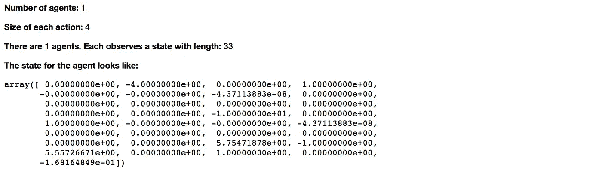
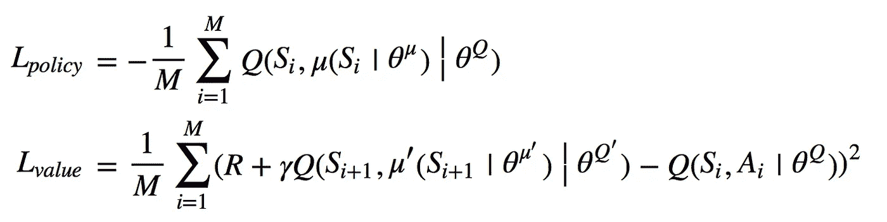
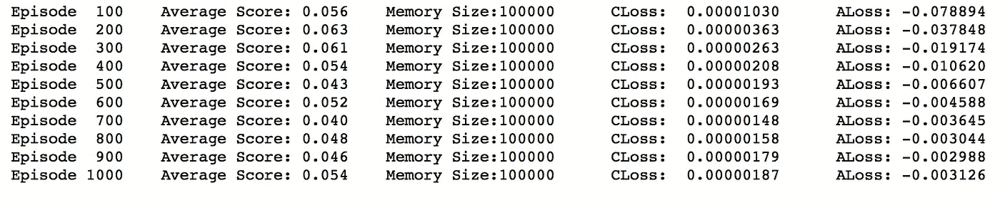

# [RL]训练机械臂去够球—第 1 部分

> 原文：<https://towardsdatascience.com/rl-train-the-robotic-arm-to-reach-a-ball-part-01-1cecd2e1cfb8?source=collection_archive---------18----------------------->

Photo by [James Pond](https://unsplash.com/@lamppidotco?utm_source=medium&utm_medium=referral) on [Unsplash](https://unsplash.com?utm_source=medium&utm_medium=referral)

## 比较 DDPG、D4PG 和 A2C 的学习效率

# 1.摘要

## 1.1 激励机制

看到我们如何利用强化学习的力量，训练机器人通过自我试验和错误来学习如何与环境互动，总是令人着迷。在这个任务中，我将实验和比较强化学习中不同流行算法的效率。这不仅有助于我们对这些算法有一个总体的了解，而且也让我们进一步相信强化学习在不久的将来会有多大的潜力。

为了恰当地处理这个话题，整个讨论将分为两个系列。本文是第一部分，主要介绍训练环境和一种学习算法——DDPG，这是最古老的方法。

## 1.2 培训环境

在强化学习领域，组件由*一个环境、一个或多个代理*和*两者之间交换的信息*组成。首先，环境将当前情况的信息发送给代理，然后代理以其最好的可能方式作出响应，再次，环境将奖励和下一个情况的信息发送给代理，以此类推。

在这里，为了给代理创建一个游乐场，我将使用 Unity 开发并由 Udacity 修改的环境[ [**Reacher**](https://github.com/Unity-Technologies/ml-agents/blob/master/docs/Learning-Environment-Examples.md#reacher) ]进行实验。省去了我们搭建环境和配置奖励机制的麻烦。当我们刚刚开始熟悉这个领域时，这使我们能够专注于实现、调整和比较 RL 算法。

在 **Reacher** 任务中，机械臂需要学习如何控制和移动一个球。它粘球控制球的时间越长，积累的奖励就越多。环境的观测状态由 33 个变量组成，并且都在连续空间中。

关于机械臂，有两种情况，一种是单个机器人代理，另一种是多个机器人代理，总共有 20 个代理，每个代理都有自己的环境副本。因为我们现在有了单个和多个代理的场景，所以我们可以探索和比较两者之间的学习效率。

每个代理有 4 个动作变量，都在-1 和 1 之间的连续空间内。此外，单代理和多代理环境都可以在[[**uda city Github**](https://github.com/udacity/deep-reinforcement-learning/tree/master/p2_continuous-control)]中下载。

## 1.3 实验的模型/算法

在单代理情况下，使用[[**【DDPG】**](https://arxiv.org/abs/1509.02971)]和[ [**分布式确定性策略梯度(D4PG)**](https://arxiv.org/abs/1804.08617) ]的算法。当在单个代理上训练时，最大的问题之一是过渡状态/经历的顺序将是相关的，因此像 DDPG/D4PG 这样的非策略将更适合这种情况。在这些模型中，对**重放存储器**进行采样的做法打破了转换之间的相关性。

在多个代理的情况下，使用[ [**【同步优势演员评论家(A2C)**](https://blog.openai.com/baselines-acktr-a2c/) 】。A2C 是[ [**A3C**](https://arxiv.org/abs/1602.01783) 的同步版。A2C 更容易实现，在一些研究中，它的性能甚至优于 A3C。在对多个智能体进行训练的情况下，由于每个智能体都有其独特的过渡经验，集体的过渡经验自然会解决顺序关联的问题。此外，我们甚至可以享受基于策略的学习算法带来的训练稳定性。

## 1.4 快速总结

那么，这个任务的目标是什么呢？在任务中，如果代理人的手臂在目标位置，那么给予+0.1 的奖励。代理能够将手臂保持在目标位置的时间越长，累积的奖励就越多。为了完成任务，代理人需要平均每集获得 30 英镑以上的奖励。

从后面显示的结果中，我们可以清楚地看出 **A2C** 在训练速度方面明显优于其他两种算法，这并不奇怪，尽管如此，这种改进确实令人印象深刻。具体来说，在这个案例中，A2C 成功地训练代理人在不到 5 **00 的训练集**内积累超过 30 的奖励(目标奖励)。而 D4PG 需要大约 **5000 集**，DDPG 甚至**无论花多少时间训练经纪人都无法完成任务。**

下面是这篇文章结构的快速指南。

## 1.5 报告的结构

*   ***1 . 5 . 1***[***智能体如何与环境交互***](#536e)
    在本节中，我将显示如何使智能体与环境交互的代码(假设在单智能体场景中)，向环境发送其动作值，并从环境接收奖励和下一次观察状态的反馈。
*   ***1 . 5 . 2***[***在单个智能体场景上训练— DDPG***](#2899)
    在单个智能体的情况下，我将对两个算法进行实验— DDPG 和 D4PG。这一部分将详细演示 DDPG 模型是如何逐步建立起来的，包括演员和评论家的网络结构、重放记忆的设置、动作探索和损失函数等。最后，对训练结果进行了讨论。

# 2.代理如何与环境交互

[︽](#a704) 在这里，我将简单介绍一下 Unity 环境的样子，以及代理如何用代码与环境交互。

## 2.1 环境背景

注意到环境包含多个大脑。大脑根据接收到的动作输入来控制环境的反应。用不同的大脑指定环境，会产生不同的反馈。在这个任务中，使用默认的大脑(第一个)。

`**env:**`包含每个大脑的环境对象。它包括，

*   `brain_name = env.brain_names[0]:`默认使用 env brain。
*   `env.brains[brain_name].vector_action_space_size:`行动的维度。
*   `env[brain_name].agents:`内部代理数量信息。
*   `env[brain_name].vector_observations:`维数(代理数，观察状态数)。

Code — Activate the Environment

Preview of the Environment (Single Agent)

## 2.2 代理与环境交互

对于每个新的情节，环境需要是`reset()` 并因此给出初始观察状态。然后，代理通过`act()`对其从环境接收的状态做出响应。环境使用`step()`接收来自代理的当前动作，并用*新状态*、*奖励*和*完成(一集结束的标记)*更新自身。

既然我们已经了解了所有必需的背景知识，我们就可以开始建模了。

Code — Agent Interact with Environment

# 3.在单个代理场景下训练——DDPG

## 3.1 DDPG

[︽](#a704) 首先，我在训练开始前导入一些自定义模块来配置整个设置。[模块](https://github.com/TomLin/RLND-project/tree/master/p2-continuous-control)包括:

1.  `ddpg_model:`包含 DDPG 演员和评论家神经网络结构类的模块文件。
2.  `noise:`奥恩斯坦-乌伦贝克噪声过程用于 DDPG 代理的勘探目的。
3.  `replay_memory:`在训练中收集和取样进行过渡的经验。
4.  `ddpg_agent:`定义 DDPG 代理如何与环境交互并实施培训的模块文件。

下面是一系列代码片段，突出了每个自定义模块中最重要的部分。它帮助我们快速了解每个模块的核心。

## 3.2 模型结构

网络的大部分结构遵循了最初[[DDGP 论文 T10 中实现的内容，脚本的主要部分参考了[uda city 的 DDPG 模板 T12。](https://github.com/udacity/deep-reinforcement-learning/tree/master/ddpg-pendulum)

值得注意的一点是，critic 网络在计算 Q 值时采用了最后一个隐含层的动作。

但是，为了提高计算效率，在这种情况下需要调整一些超参数。例如，演员和评论家网络都包含两个隐藏层(每个具有 **128** 和 **64** 单位的大小)。下面显示的代码是 Critic Network 的初始化。

演员网络共享相似的结构。

Code — Initialize DDPG Critic Network (excerpted)

## 3.3 重量初始化

在初始化时，评论家和演员网络的权重都采用**x 服务器初始化**。

Function — Xavier Weights Initialization

## 3.3 重放记忆

这里，为了减轻计算压力，重放存储器的大小仅设置为 **100，000** 。回放内存在*均匀随机采样*中采样，并发送给【cuda 或 cpu 训练模型。

Code — Create Replay Memory Object

## 3.4 行动探索

奥恩斯坦-乌伦贝克噪声被添加到动作探索的动作值中。

Code — Action Exploration of DDPG Agent

## 3.5 损失函数

确定性政策梯度不同于随机政策梯度，因为它不包括行动的对数概率。

也就是说，策略(参与者)梯度是批评家网络相对于动作的梯度，乘以参与者网络相对于网络参数的梯度。在这篇[ [帖子](https://pemami4911.github.io/blog/2016/08/21/ddpg-rl.html)中阅读更多详情。

另一方面，批评值的损失只是常规的时间差异(TD)误差。因此，保单损失和批评价值损失定义为:

Code — Compute Loss for Critic and Actor for DDPG Agent

## 3.6 重量更新

在训练过程中，模型中的权重被**软更新**。

Code — Implement Soft-Updated for Network Parameters

## 3.7 简而言之，超参数

以下是超参数设置的概述。

*   学习率(演员/评论家):1e-4
*   重量衰减:1e-2 # L2 重量衰减
*   批量:64
*   缓冲区大小:100000
*   Gamma: 0.99 #奖励折扣系数
*   Tau: 1e-3 #目标网络中参数的软更新
*   每次重复学习:10
*   每时间步发生的学习:20
*   评论家剪辑的最大渐变:1
*   隐藏层 1 尺寸:128
*   隐藏层 2 尺寸:64

## 3.8 构建培训功能

在本节中，我定义了一个训练函数`train_ddpg()`来监控进度，并在训练完成后保存模型。

Function — Control and Monitor the Training Progress

## 3.9 培训结果—失败

在实验中，我设置了在每个 **20** 时间点触发的训练。在每次训练期间，权重更新将迭代 **10** 次。

另外，**临界梯度被削波**，最大值为 1，以增强训练的稳定性。正如你将在下面看到的，在第一个 1000 集(如下图所示)中，情节奖励徘徊在 **0.04** 到 **0.05** 左右，这很大程度上意味着代理根本没有从这些经历中学到任何东西。

除了这里展示的演示实验，我还尝试了不同的训练长度，跨度从 1000 到 5000 集，但没有一次成功。

Average Episodic Score for DDPG Agent (task not solved)

# 待续

现在我们已经看到 DDPG 不能理解任务的复杂性。所以在下一部分，我将转向其他算法——D4PG 和 A2C，看看这些新发布的方法是否更强大，是否能够解决手头的任务。

文章中的完整代码可以在这个[链接](https://github.com/TomLin/RLND-project/tree/master/p2-continuous-control)中找到。此外，如果你喜欢这个帖子，欢迎指出我犯的任何错误或在评论框中留下反馈。

# 参考

[1] Unity Technologies， [ml-agents](https://github.com/Unity-Technologies/ml-agents/blob/master/docs/Learning-Environment-Examples.md#reacher) (2018)，Github

[2] Udacity，[深度强化学习](https://github.com/udacity/deep-reinforcement-learning/tree/master/ddpg-pendulum) (2018)，Github

[3] P. Emami，[tensor flow 中的深度确定性策略梯度](https://pemami4911.github.io/blog/2016/08/21/ddpg-rl.html) (2016)，Github