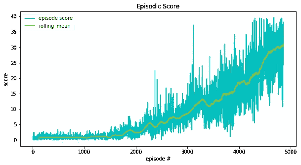
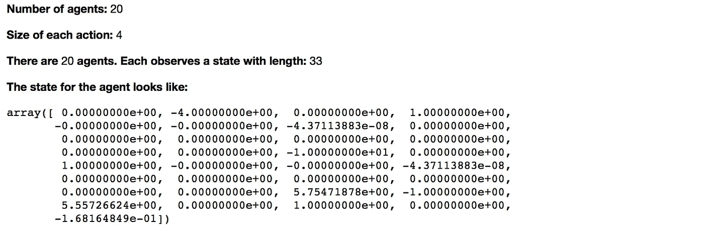
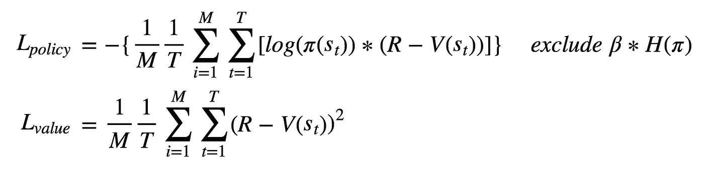
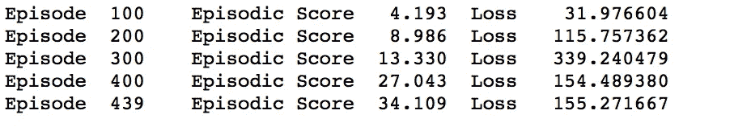
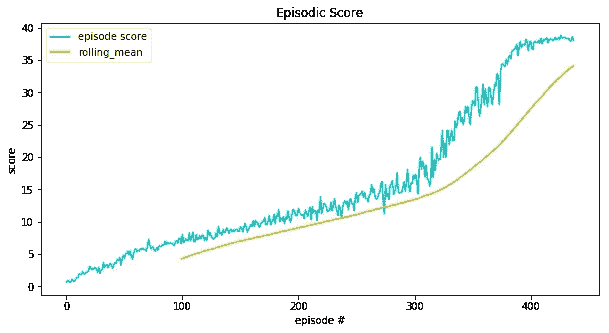
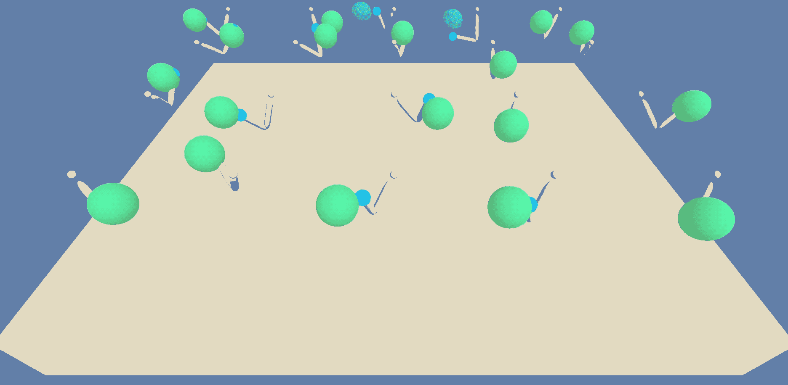
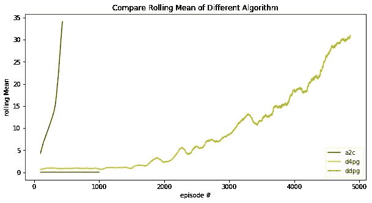

# [RL]训练机械臂去够球—第 2 部分

> 原文：<https://towardsdatascience.com/rl-train-the-robotic-arm-to-reach-a-ball-part-02-fc8822ace1d8?source=collection_archive---------24----------------------->

Photo by [James Pond](https://unsplash.com/@lamppidotco?utm_source=medium&utm_medium=referral) on [Unsplash](https://unsplash.com?utm_source=medium&utm_medium=referral)

## 比较 DDPG、D4PG 和 A2C 的学习效率

# 概述

根据我在第 1 部分提到的，我们知道无论代理花多少时间学习，DDPG 都不能成功地解决任务。平均的阶段性回报徘徊在 0.04 到 0.05 之间，与 30 的目标回报相差甚远。因此，下面，我将开始试验另外两种算法，单代理场景中的 D4PG 和多代理场景中的 A2C。

同样，下面是本文结构的快速指南。

# 1.报告的结构

*   ***1.1*** [***列车上单个代理场景—D4PG***](#826a)这次，我将改为在 D4PG 代理上进行实验。这是最新发布的算法，据称在应对复杂环境时比 DDPG 更有效。本节将介绍模型结构、回放记忆、行动探索和学习过程的步骤。它将突出与 DDPG 的区别，相似的部分将被快速浏览。
*   ***1.2***[***多智能体场景——A2C***](#0601)A2C 模型在多智能体环境下实现。这一部分将涵盖它是如何建立的，在这个过程中收集经验和学习。A2C 的代码与 DDPG 和 D4PG 的代码相当不同，因为它应该反映 A2C 如何使用多代理来收集经验和更新网络参数。还是那句话，训练结果是包含在最后的。
*   ***1.3***[***所有算法的比较及结论***](#bce9)最后，我们准备比较三种不同算法的执行情况。每个模型的滚动情景奖励将绘制在同一个图表上，这样我们可以更好地了解每个模型的学习趋势和效率。

# 2.针对单个代理场景的培训— D4PG

[︽](#f6f1) 正如我们在第 01 部分中所知，DDPG 模型并没有成功解决该任务，所以我转向另一种算法— [ [D4PG](https://arxiv.org/abs/1804.08617) ]，这是 2018 年最新的 RL 算法。代码脚本主要参考了这本书——【[深度强化——学习——动手](https://github.com/PacktPublishing/Deep-Reinforcement-Learning-Hands-On)】。

首先我会在训练前导入一些自定义模块来配置整个设置。这些模块包括:

1.  `d4pg_model:`包含 D4PG 的演员和评论家神经网络结构类的模块文件。
2.  `replay_memory:`为培训收集过渡经验并取样。
3.  `d4pg_agent:`定义 D4PG 代理如何与环境交互并实施培训流程的模块文件。

## 2.1 模型结构

我跟进 DDPG 指定的相同模型结构，除了*评论家网络*，输出需要改成 **N_ATOMS** 。至于其他，评论家和演员都有两个隐藏层，每个层的尺寸为 128 和 64，与 DDPG 相同。

Code — Critic Network for D4PG (excerpted)

## 2.2 重放记忆

为了符合 D4PG 代理中所需的数据类型(从[ [深度强化学习实践](https://github.com/PacktPublishing/Deep-Reinforcement-Learning-Hands-On) ]中引用),通过重放存储器对象中定义的函数`sample2()`进行采样。重播内存大小设置为 100，000。详细的代码片段在这个[ [链接](https://gist.github.com/TomLin/c84f9bd64685157e9789b8a40f41b36b) ]里。

## 2.3 行动探索

D4PG 和 DDPG 的一个小区别是动作探索。在 D4PG 中，它使用来自正态分布的**简单随机噪声作为鼓励动作探索的方式，而不是 OU 噪声。修改后的代码片段在这个[ [链接](https://gist.github.com/TomLin/24d693dfb4d88370bfd6c286702e6e9f) ]中。**

## 2.4 损失函数

D4PG 可以在*多个过渡轨迹(N 步)*上训练，但为了简单起见，我选择在**一个时间步**上训练。不过根据其他评论，一步到位的训练是最不稳定的，不推荐，但我还是去争取了。因此，下面的损失和代理学习代码是基于一步转换轨迹的。

Code — Loss Computation and Learning Process in D4PG Agent (excerpted)

## 2.5 重量更新

权重由`soft_updated()`软更新，与 DDPG 相同。

## 2.6 简而言之，超参数

以下是超参数设置的概述。

*   学习率(演员/评论家):1e-4
*   批量:64
*   缓冲区大小:100000
*   伽玛:0.99
*   陶:1e-3
*   每次重复学习:10
*   每时间步发生的学习:150
*   评论家剪辑的最大渐变:1
*   n 步:1 #过渡轨迹
*   n 原子:51 #用于评论家网络输出
*   Vmax:评论家网络的 10 #参数
*   Vmin: -评论家网络的 10 #参数
*   隐藏层 1 尺寸:128
*   隐藏层 2 尺寸:64

## 2.7 构建培训功能

为了监控训练进度，我再次定义了一个训练函数`train_d4pg()`，它与`train_ddpg()`非常相似，参见这个[链接](https://gist.github.com/TomLin/36b84c222622bfc01c95dac2b89c7d0b)中的完整代码片段。

## 2.8 培训结果——效率低下

由于之前在 DDPG 的失败，这一次，我稍微降低了学习频率。每 **150** **时间步**触发一次训练过程，每次训练**重复**10 次权重更新。

我希望这将进一步稳定培训，尽管代理可能需要更长的时间来学习。以下结果显示，D4PG 代理成功达到了 30 的目标剧集分数，尽管如此，在达到目标之前，它需要占用多达 **5000 集**。我们可以看出学习进度相当缓慢。

下图是 D4PG 剧集的滚动平均得分。观察结果图，我们可以看出片段分数彼此之间有很大的差异。显然，训练进度并不稳定，这准确地反映了非策略算法的性质。

Rolling Episodic Score over Episodes (D4PG)

现在，让我们来看看它在动画中的表现。

A Single D4PG Agent Controls a Ball (final training result)

# 3.多代理场景培训— A2C

[︽](#21af) 用于建立 A2C 模型的模块/功能如下:

1.  `A2CModel:`神经网络的 A2C 强化学习算法。
2.  `collect_trajectories():`收集 n 步经验转场。
3.  `learn():`根据收集的轨迹计算训练损失，并更新网络的权重。

## 3.1 环境的简要背景

这一次，我使用另一个环境，它将同时激活 20 个代理，每个代理都有自己的环境副本。这 20 名代理人的经验将被收集起来并相互分享。

Preview of the Environment (Multi-Agents)

## 3.2 模型结构

该模型是简单的两个全连接层，每层有 **128** 个单元， **64** 个单元。

然后它分离出**演员**和**评论家** **层**(而不是像以前的模式那样的演员和评论家网络)。演员和评论家层都使用全连接层，它遵循[ [原始 A3C 算法论文](https://arxiv.org/abs/1602.01783) ]中实现的方式。

Code — Initialize A2C Model (excerpted)

## 3.3 收集现场过渡轨迹

A2C 是一个 **on-policy** RL 算法，没有重放记忆这种东西。相反，它使用当前收集的转换经验来更新其网络。

在接下来的代码片段中，我定义了`collect_trajectories()`函数。接受 *A2C 模型*、*整体环境*、*采集*的时间步数的输入。当模型与环境交互时，所有的动作和反馈都存储在`batch_s`、`batch_a`、`batch_r`等对象中，分别代表状态、动作、奖励。一旦收集到的经验达到要求的时步数，或者当一集结束时，该函数就会对每步的奖励进行奖励归一化和折扣处理，得出每个时步的最终**目标值/处理后的奖励**并存储在`batch_v_t`对象中。

Function — Used to Collect Trajectories for A2C Model Training

## 3.4 行动探索

动作是从正态分布中采样的**，其中 **μ** 取决于每个状态，而 **σ** 由自变量给出。此外，动作输出通过`tanh()` 激活，以便根据环境要求将其值压缩在-1 和 1 之间。**

此外，为了检索以后行动的对数概率，我使用了一个技巧。我定义函数`get_action()`来返回 **actions_tanh** 和**原始动作值**。原始动作值存储在`batch_a`中。然后，在学习阶段，它们将与状态一起被传递到`get_action_prob(batch_s, batch_a)`，以获得动作的相应对数概率。

关于批判状态值，它只是传递给批判层的状态输出。

Code — Action Output and Critic State Value for A2C Model (excerpted)

## 3.5 损失函数

损失函数在 A2C 也被称为**目标函数**。

*注意，原始损失函数包括熵项。*熵在许多算法中用于鼓励动作探索，包括 A2C 模型。然而，我在策略损失中放弃了熵，这与大多数其他实现相反。原因是我现在处理的是一个多维度的行动空间。我不知道如何指定多维作用空间的熵。

相反，我参考了[ [尚同章的作品](https://github.com/ShangtongZhang/DeepRL/blob/master/deep_rl/network/network_heads.py) ]，其中他假设**(鼓励行动探索的方差)是常数，因此熵在所有情况下也是常数。这样，我可以忽略掉政策损失的熵。**

**关于价值损失函数，它也是保单损失的一部分。这导致我的保单损失和价值损失如下:**

****

**现在，我在自定义函数`learn()`中总结了损耗的计算和网络参数的更新。你可能会注意到，我在这里为学习过程构建代码的方式与以前的模型中的方式有很大不同。它是一个独立的函数，而不是属于代理的子类对象。**

**Function — Compute Loss and Trigger Learning for A2C Model**

## **3.6 重量更新**

**在 A2C 模型中，所有权重由当前轨迹批次的梯度直接更新，这意味着这里没有应用软更新。**

## **3.7 简而言之，超参数**

**以下是超参数设置的概述。**

*   **学习集数:1000**
*   **N 步数:10 # n 步过渡轨迹**
*   **学习率:0.00015**
*   **伽玛:0.99**

## **3.8 构建培训流程**

**在这一节中，我不会特别将培训过程总结成一个函数。在这里链接的[代码](https://gist.github.com/TomLin/4eb589c263b04581617ba0de6d8f4387)中，会直接监控学习进度，训练结束后保存模型。**

## **3.9 培训结果——高效率**

**在培训期间，一旦代理收集到新的一批 N 步过渡经验，该批经验将用于计算损失并立即更新演员和评论家层的参数。请注意，如果代理的情节都没有完成，则每批的最后一个状态将是下一批的初始状态。相反，如果任何一集结束，那么所有代理将停止并从当前集离开，并继续重新开始新的一集。**

**从下面显示的结果，你可以告诉 A2C 模型是非常有效的。代理人学习接任务，并在不到 1000 集的**中达到 30 分的目标情节分数。另外，无论是在学习过程中还是在从头开始重新训练的情况下，训练进度都相当一致和稳定。每当你再次重新训练代理人时，你可以得到几乎相同的结果。****

****

**Average Episodic Score for A2C Agents**

**从滚动分数图中观察，我们进一步确信学习进展相当顺利。偏差或波动远远小于 D4PG 模型中的偏差或波动，最后，最后一张图片是训练结果的动画。**

****

**Rolling Episodic Score over Episodes (A2C)**

****

**Multiple A2C Agents Control a Ball (final training result)**

# **4.所有算法的比较和结论**

**[︽](#31fe) 在这些试验中，A2C 模型达到了最好的性能和效率，即使在此之上，再训练结果仍然非常一致，但鉴于这是多代理场景并使用 **10 步过渡轨迹**的事实，结果应该不会太令人惊讶。**

**另一方面，D4PG 是单代理场景，我只使用了 **1 步过渡轨迹**。虽然它没有 A2C 那么有效，但它仍然给出了一个令人满意的结果。然而，重新训练的结果并不一致，你可能会发现你的代理在某些试验中陷入局部最优。以我为例，需要 5000 集才能达到目标分数。尽管如此，我的触发参数更新的设置是每 150 个时间戳，也许我可以增加更新频率以提高其效率。然而，这种方式我会冒着牺牲已经不稳定的稳定性的风险。从根本上说，这是一个效率和稳定性之间的权衡问题。**

**最后一个是 DDPG。好吧，在这个任务中是行不通的。前一篇文章中演示的训练结果使用了 1000 集，但是我在其他训练长度上进行了实验，达到了 5000 集。他们中没有一个人成功地解决了这个问题。也许任务真的很复杂，其中观察状态包含 33 个变量，而代理有 4 个动作变量。看起来 DDPG 在处理如此复杂的问题上效率不够高。**

****

**Learning Progress Compared on all Algorithms — DDPG, D4PG and A2C**

**在我关于如何进一步改进整个实验的最后思考中，我可能会尝试使用 Python 的多处理模块重写代码，这将使算法能够应用于并行环境。这是强化学习的一个趋势，值得一试。此外，我可能会尝试看看我是否可以重新编码 D4PG，以便在未来进行多步轨迹训练。这样可以提高 D4PG 模型的稳定性。**

**如果你喜欢这个帖子，欢迎指出我犯的任何错误，或者在评论框中留下任何反馈。代码和 jupyter notebook 的完整实现可以在这个[ [链接](https://github.com/TomLin/RLND-project/tree/master/p2-continuous-control)中找到。**

# **参考**

**[1] M. Lapan，[动手深度强化学习](https://github.com/PacktPublishing/Deep-Reinforcement-Learning-Hands-On/tree/master/Chapter14) (2018)，Github**

**[2] S. Zhang，[py torch 中深度 RL 算法的模块化实现](https://github.com/ShangtongZhang/DeepRL/blob/master/deep_rl/network/network_heads.py) (2018)，Github**

**[3] M .周，[利用 PyTorch 简单实现强化学习(A3C)](https://github.com/MorvanZhou/pytorch-A3C/blob/master/continuous_A3C.py)(2018)，Github**

**[4] Hungryof, [模型中 buffer 的使用](https://blog.csdn.net/Hungryof/article/details/82017595) (2018), CSDN**