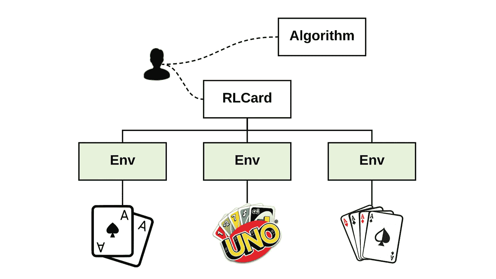
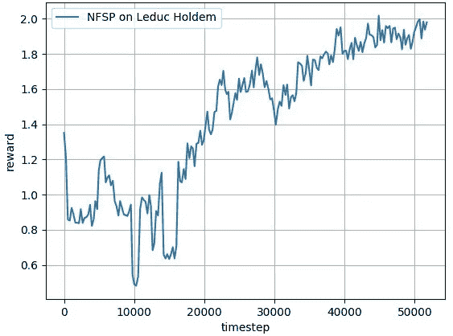

# RLCard:用 3 个步骤构建你自己的扑克人工智能

> 原文：<https://towardsdatascience.com/rlcard-building-your-own-poker-ai-in-3-steps-398aa864a0db?source=collection_archive---------10----------------------->

## 介绍纸牌游戏中强化学习的工具包


[https://github.com/datamllab/rlcard](https://github.com/datamllab/rlcard)

由于强化学习的进步，人工智能(AI)在游戏中取得了令人鼓舞的进展。举几个例子，AlphaGo 在围棋比赛中击败了人类职业选手。[alpha zero](https://www.nature.com/articles/nature24270?sf123103138=1)【2】在国际象棋、shogi、围棋等游戏中从零开始自学，成为艺术大师。近年来，研究人员的努力在扑克游戏中取得了成果，如[Libra tus](https://science.sciencemag.org/content/359/6374/418)【3】和[deep stack](https://science.sciencemag.org/content/356/6337/508)【4】，在德州扑克中取得了专家级的表现。扑克是人工智能中最具挑战性的游戏之一。作为一名玩家，我们不仅需要考虑自己的手牌，还需要考虑其他玩家隐藏在我们视线之外的手牌。这导致了可能性的爆炸。

在本文中，我将介绍一个用于纸牌游戏中强化学习的开源项目，该项目最近由德克萨斯州 A & M 大学的[数据实验室](http://faculty.cs.tamu.edu/xiahu/)开发。本文将首先概述该项目，然后提供一个如何从头开始训练代理人玩 Leduc Hold'em poker(德州扑克的简化版本)的运行示例。该项目的目标是让每个人都能接触到扑克游戏中的人工智能。

# 概观



[5] [An overview of RLCard. Each game is wrapped by an Env (Environment) class with easy-to-use interfaces.](https://arxiv.org/pdf/1910.04376.pdf)

RLCard 提供了各种纸牌环境，包括 21 点、Leduc Hold'em、德克萨斯扑克、UNO、斗(中国扑克游戏)和麻将，以及几个标准的强化学习算法，如[深度 Q 学习](https://www.nature.com/articles/nature14236?wm=book_wap_0005)【6】、[神经虚构自玩](https://arxiv.org/abs/1603.01121)(NFSP)【7】和[反事实后悔最小化](http://papers.nips.cc/paper/3306-regret-minimization-in-games-with-incomplete-information.pdf)【8】。它支持简单的安装和丰富的文档示例。它还支持多个过程的并行训练。采用了以下设计原则:

> ***可再现:*** *来自环境的结果可以被再现和比较。用相同的随机种子在不同的运行中应该获得相同的结果。* ***易上手:*** *每次游戏结束后都收集整理好经验，界面直白。状态表示、动作编码、奖励设计，甚至游戏规则，都可以方便地配置。* ***可扩展:*** *按照上述设计原则，可以方便地将新的卡片环境添加到工具包中。工具包中的依赖性被最小化，这样代码可以很容易地维护。*

# Leduc 德州扑克

Leduc 德州扑克是德州扑克的简化版。该游戏使用 6 张牌(黑桃杰克、王后和国王，以及红桃杰克、王后和国王)。每个玩家会有一张手牌，还有一张社区牌。与德州扑克类似，高等级牌胜过低等级牌，例如黑桃皇后比黑桃杰克大。一对胜过一张牌，例如，一对 j 比皇后和国王大。游戏的目标是从其他玩家那里赢得尽可能多的筹码。Leduc Hold'em 的更多细节可以在 [Bayes 的虚张声势:扑克中的对手建模](https://arxiv.org/abs/1207.1411) [9]中找到。

# 第一个例子:NFSP 在 Leduc 德州扑克上

现在，让我们用 RLCard 对一名 NFSP 特工进行 Leduc 德州扑克培训！完整的示例代码如下所示:

在本例中，为 Leduc Hold'em 构建 AI 需要 3 个步骤。

**第一步:** *制造环境。*首先，告诉“rlcard”我们需要一个 Leduc 德州扑克环境。

```
env = rlcard.make('leduc-holdem')
```

**第二步** : *初始化 NFSP 代理。其次，我们创建两个内置的 NFSP 代理，并告诉代理一些基本信息，例如，动作的数量、状态形状、神经网络结构等。注意，NFSP 还有一些其他的超参数，比如内存大小。这里我们使用默认值。*

```
with tf.Session() as sess:
    agents = []
    for i in range(env.player_num):
        agent = NFSPAgent(sess,
                          scope='nfsp' + str(i),
                          action_num=env.action_num,
                          state_shape=env.state_shape,
                          hidden_layers_sizes=[128,128],
                          q_mlp_layers=[128,128])
        agents.append(agent) # Setup agents
    env.set_agents(agents)
```

**第三步** : *生成游戏数据，训练代理。*第三，可以用“run”功能生成游戏数据。然后，我们将这些转换传送到 NFSP 并培训代理。

```
episode_num = 10000000for episode in range(episode_num): # Generate game data
    trajectories, _ = env.run(is_training=True) # Train the agents
    for i in range(env.player_num):
        for ts in trajectories[i]:
            agents[i].feed(ts)
            rl_loss = agents[i].train_rl()
            sl_loss = agents[i].train_sl()
```

然后，NFSP 代理将通过自我游戏学习玩 Leduc Hold'em。性能可以通过 NFSP 代理和随机代理的比赛来衡量。你也可以在这里找到代码和学习曲线[。示例学习曲线如下所示:](https://github.com/datamllab/rlcard/blob/master/examples/leduc_holdem_nfsp.py)



[Learning curves in terms of performance against random strategy. The reward is the winning big blinds.](https://github.com/datamllab/rlcard)

NFSP 代理在对抗随机代理的性能方面逐渐提高自己。如果您想探索更多的例子，请查看[资源库](https://github.com/datamllab/rlcard/tree/master/examples)。玩得开心！

# 玩预先训练好的模型

RLCard 还与 NFSP 一起提供了一个预先训练好的 Leduc Hold'em 模型。我们可以通过运行[这个脚本](https://github.com/datamllab/rlcard/blob/master/examples/leduc_holdem_human.py)来对抗预先训练好的代理。

```
>> Leduc Hold'em pre-trained model>> Start a new game!
>> Agent 1 chooses raise=============== Community Card ===============
┌─────────┐
│░░░░░░░░░│
│░░░░░░░░░│
│░░░░░░░░░│
│░░░░░░░░░│
│░░░░░░░░░│
│░░░░░░░░░│
│░░░░░░░░░│
└─────────┘
===============   Your Hand    ===============
┌─────────┐
│J        │
│         │
│         │
│    ♥    │
│         │
│         │
│        J│
└─────────┘
===============     Chips      ===============
Yours:   +
Agent 1: +++
=========== Actions You Can Choose ===========
0: call, 1: raise, 2: fold>> You choose action (integer):
```

# 摘要

要了解这个项目的更多信息，请点击这里查看[。该团队正在积极开发项目的更多功能，包括可视化工具和锦标赛排行榜。这个项目的最终目标是让社区中的每个人都有机会在卡牌游戏中接受训练、比较和分享他们的人工智能。我希望你喜欢阅读。在我的下一篇帖子中，我将介绍 21 点深度 Q 学习的机制，我们将看看该算法是如何实现的及其在纸牌游戏中的应用。](https://github.com/datamllab/rlcard)

参考资料:
【1】白银*等*。用深度神经网络和树搜索掌握围棋游戏(2016)。
【2】白银*等*。掌握没有人类知识的围棋游戏(2017)。
【3】布朗和桑德霍尔姆。用于单挑无限注扑克的超人 AI:Libra tus 击败顶级专业人士(2018)。
【4】Moravík*等* DeepStack:单挑无限注扑克中的专家级人工智能(2017)。
【5】查*等*。RLCard:卡牌游戏强化学习工具包(2019)。
【6】Minh*等*通过深度强化学习实现人级控制(2015)。
【7】海因里希和西尔弗。不完全信息博弈中自我博弈的深度强化学习(2016)。
【8】Zinkevich*等*不完全信息博弈中的后悔最小化(2008)。
【9】sou they*等* Bayes 的虚张声势:扑克中的对手建模(2012)。