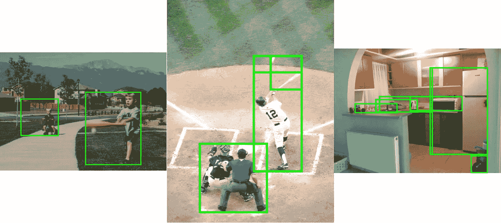
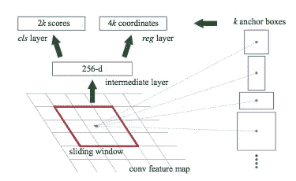
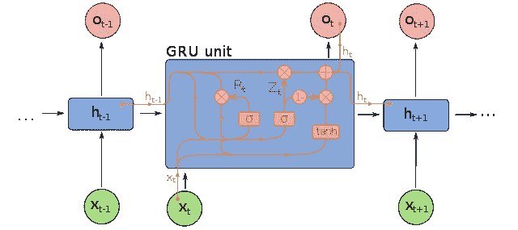
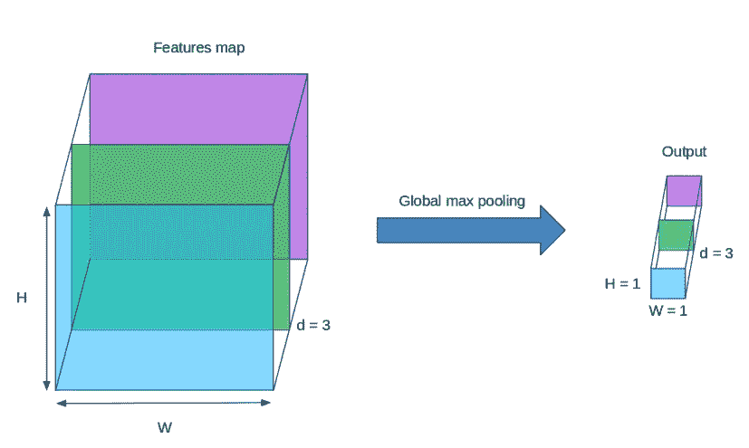

# RLSD:用于多标签图像分类的端到端 CNN+LSTM 模型

> 原文：<https://towardsdatascience.com/rlsd-an-end-to-end-cnn-lstm-model-for-multi-label-image-classification-47dfdf8e4bd9?source=collection_archive---------11----------------------->

RLSD localizes regions of interest that contain objects with semantic relationships.

# **阅读小组**

[我们公司](https://launchpad.ai/)有[一个机器学习工程师的奖学金项目](https://fellowship.ai/)。奖学金项目的一部分是每周一次的研究论文回顾。每周都会有一名研究员发表一篇最新的机器学习研究论文。

我喜欢这些每周一次的小组，因为它让我们了解最新的研究。大多数数据科学家花时间阅读研究论文，但我个人不会保持每周一篇论文的节奏，如果我的日程表上没有这些阅读小组。

我相信每周、每两个月或至少每月一次的研究阅读小组应该是任何专注于应用机器学习的公司的一部分。这一领域的创新步伐势不可挡。

作为前研究员和该组织的成员，我偶尔有机会提交自己的研究论文。我想在 Medium 上与我的读者分享我从这篇论文中学到的东西会很不错。

# 多标签图像分类

[ImageNet](http://www.image-net.org/) 中的分类任务是将一幅图像作为一组像素 X 作为输入，并返回该图像的标签 Y 的预测，标签 Y 应该描述图像的主题。

ImageNet prediction outputs from AlexNet. “Vanilla” ImageNet carries just one label per image.

这是对计算机视觉问题的过度简化。图像自然包含许多主题。我们可以用多标签分类来表示这种更常见的情况。与其将我们的图像标签限制为每张图像一个，为什么不使用多个标签来表示图像中存在的多个对象呢？

Most photographs contain many objects; a seabird, many humans, skateboards, hats, and even boats in the background are present in this example.

传统神经网络架构的简单改编，如 AlexNet、VGG 等。，可以让你多标签输出。[在模型的最后一层使用 sigmoid 激活函数](/fast-ai-season-1-episode-3-a-case-of-multi-label-classification-a4a90672a889)，代替 softmax，是一种选择。

但是这种方法并不总是那么有效。对于这个问题，有许多可供选择的方法。

今天我将谈谈其中的一种方法。

## 区域潜在语义依赖(RLSD)模型

RLSD 是张等人于 2016 年首次提出的一种[方法。这个想法的许多扩展最近已经被探索。](https://arxiv.org/pdf/1612.01082.pdf)

研究人员的动机是试图对图像中的**潜在语义依赖**进行建模。之所以使用“潜在”这个词，是因为虽然有标签可用，但描述这些关系的标签却不可用。

图像中的对象通常以某种方式相互关联，尽管并不总是如此:一个女孩用棒球棒击球。一只小猫坐在电脑上。

这种关系并不总是存在的。例如，一张照片可能包含一栋建筑、一辆汽车和一棵树，尽管这三个对象不会以任何有意义的方式进行交互。

这篇论文的想法是创建一个模型，它足够具有**表达能力来学习这些潜在的语义依赖**，同时也足够灵活**来检测独立的同现对象**。

# 了解 RLSD

这篇论文对我来说特别难理解，部分原因是它很复杂，部分原因是它的语法。

*说真的，如果有任何 ML 研究者需要英文编辑，* ***请在发表前*** *联系我。*

幸运的是，我有一些时间来纠正和消化它。

**TL；博士**

该模型使用来自 [Faster-RCNN](https://arxiv.org/pdf/1506.01497.pdf) 的[区域提议网络(RPN)](https://medium.com/@tanaykarmarkar/region-proposal-network-rpn-backbone-of-faster-r-cnn-4a744a38d7f9) 来生成感兴趣区域(RoI)提议。当 RoI 具有高置信度得分时，使用**双线性插值**将与其相关的卷积特征转换为固定大小的特征向量。这些向量通过密集层进行进一步压缩。压缩的特征向量然后被输入到 [LSTM 模型](https://medium.com/mlreview/understanding-lstm-and-its-diagrams-37e2f46f1714)，该模型将在可变数量的时间步长上处理信息。最后，记录 LSTM 的输出，并使用最大池操作将其转换到标签空间。

## 这有用吗？

这似乎太复杂了，无法工作。(一旦你阅读了训练前的步骤，它开始变得更加可信。)

# **区域提案网络**

在[fast-RCNN 论文](https://arxiv.org/pdf/1506.01497.pdf)中介绍了[区域提议网络，或 RPN，](https://medium.com/@tanaykarmarkar/region-proposal-network-rpn-backbone-of-faster-r-cnn-4a744a38d7f9)。网络学习从图像空间到一组固定的边界框的映射，称为*锚*。锚预测带有置信度得分和四个边界框回归值，它们转换固定锚框以对固定锚位置进行微小调整。

Diagram from the faster-RCNN paper explaining RPN. The inputs to the RPN are convolutional features, extracted from (for example) a pretrained VGG network.

使用预训练的 VGG 网络从输入图像中提取 512 维的特定于位置的特征向量。[每个 512-d 矢量可以直接映射回输入图像上的一个区域](http://kaiminghe.com/iccv15tutorial/iccv2015_tutorial_convolutional_feature_maps_kaiminghe.pdf)。这些位置中每一个都与多个锚(比如 9 个锚)相关联。这个数字在上图中被称为 *k* 。

每个 *k* 锚点与一个以输入图像的相应区域为中心的边界框相关联。每个都有不同的大小和长宽比(例如，正方形、高矩形、宽矩形)。RPN 能够使用该输出来预测边界框输出。

RLSD 的作者在[视觉基因组图像数据集](https://visualgenome.org/)上对 RPN 进行了预训练，该数据集为这个预训练步骤提供了边界框。

# 感兴趣区域特征提取

一旦 RPN 检测到感兴趣区域(RoI ),一组 512 维特征向量就被传递到模型的下一部分。

这是与 RoI 相关的一组特征向量；由于 RoI 有不同的大小，这通常是向前传递的可变数量的特征向量。

为了固定这些特征的大小，作者使用[双线性插值](https://en.wikipedia.org/wiki/Bilinear_interpolation#Application_in_image_processing)将这些特征映射到一组固定的特征。这是 fast-RCNN 的一个变化，它使用了一个池层来实现这一点。输出特征被固定为 512 维特征的 7×7 网格(针对每个 RoI)。

然后，这个张量被展平，并通过两个完全连接的层(每个层有 4096 个单位)发送。输出是该区域的提取特征的 4096 维编码。

# LSTM 加工

给定 RoI 的 4096-d 特征编码作为输入给定 [LSTM 模型](https://medium.com/mlreview/understanding-lstm-and-its-diagrams-37e2f46f1714)。

Diagram of an LSTM model.

在每个时间步长，LSTM 模型将前一步的内部输出(上图中的 *h* 和 *x* )作为输入，这是一组与当前时间步长 *t* 相关的新特征。在 *t* =0 时，x 是 4096-d 区域特征编码，h 是零向量。时间步长 *t* 的输出是一个 N 维向量，其中 N 是我们拥有的标签数量。由于我们没有输入序列，**时间步长 *t* +1 的 *x* 输入就是时间步长 *t*** *的预测输出。*

LSTM 想停就停。标签上有一个特殊的“结束”标签。一旦 LSTM 输出“结束”编码，它就停止预测。

该模型针对每个 RoI 运行。

# 获得预测

LSTM 模型的输出是一个三阶张量。如果有 M 个 ROI、T 个时间步长和 N 个标签，则总输出为 M×T×N 个张量。

为了将其映射到 N 维标签空间，**任何给定标签的最大概率**(跨所有时间步长和区域)**被作为最终输出**。根据定义，这是一个**最大池**操作。

([source](https://arxiv.org/pdf/1901.00461.pdf)) Global max-pooling is used to get the final predictions. Instead of features, we have predictions; H and W correspond to timesteps and regions.

这里的输出是一个 N 维的预测向量。我们现在可以通过整个模型计算多标签交叉熵损失和反向传播，因为梯度可以通过每个操作反向传递(包括双线性插值操作，如 [Karpathy 等人](https://arxiv.org/pdf/1511.07571.pdf)所指出的)

# **慷慨的前期培训**

作者使用许多预训练步骤来获得收敛的模型。RPN 在带有边界框的数据集上进行了预训练，LSTM 在目标数据集上进行了预训练(跳过 RoI 步骤并向前传递所有要素)。原始卷积特征是从 ImageNet 预训练的 VGG 模型中提取的。

作者“发现这个初始化过程对模型快速收敛很重要[原文如此]。”

由于梯度不能通知来自图像级标签的 RPN 输出，我认为这一步不仅仅是“重要的”，而是模型工作所必需的。

# 结果

From the paper. mAP on the PASCAL VOC 2007 dataset, without using bounding boxes in training, got an 87.3 mAP, an apparent 2.1 improvement over the previous SOTA. (RLSD + ft-RPN row should be ignored, as it uses the provided bounding boxes in training).

这项工作的结果是对以前 SOTA 关于 PASCAL VOC 的结果的明显改进。他们的模型的另一个版本，称为 RLSD + ft-RPN，在训练期间使用数据集中提供的边界框来训练 RPN，所以它不应该与该表上的其他结果进行比较。(看看 RLSD 街吧。)

# 这样实用吗？

值得一问的是，这种模式对于部署是否足够实用。经过大量的预训练后，由于 LSTM 步骤，推理时间可能比大多数网络更长(尽管这可以在所有 RoI 输出中很好地并行化。)

作者没有报道推断过程中的计算时间。

此外，由于对预培训的依赖，我预计 RPN 在非常不同的领域不会很好地工作；这可能会对性能造成另一个限制，**需要来自与目标数据集相似的域的数据集，并且具有可用的边界框注释**来完成预训练步骤。这样的数据通常很难获得。

如果作者提供一些代码(或者一些预先训练好的网络)，我会对这个项目更加乐观**。既然得不到，我就持怀疑态度。**

# 优势

如果一切顺利，并且你能够预训练一个在你的领域中有效的 RPN，那么从端到端训练 RLSD 模型提供了一些优势。例如，**特定的边界框可以与预测标签**相关联。

在多标签分类问题上使用该模型也可能获得最佳结果。只要确保你能完成所有要求的训练前步骤。