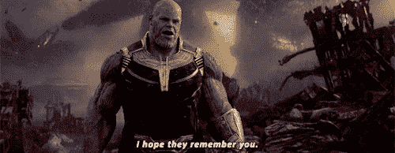
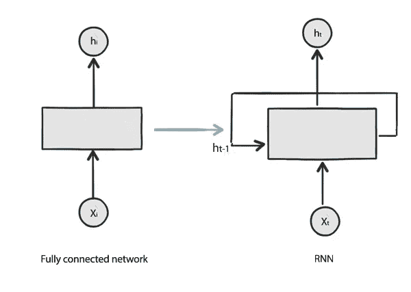
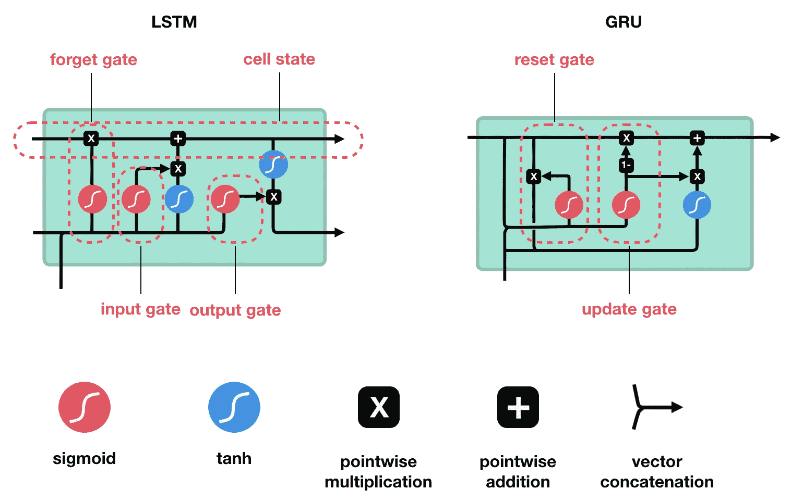
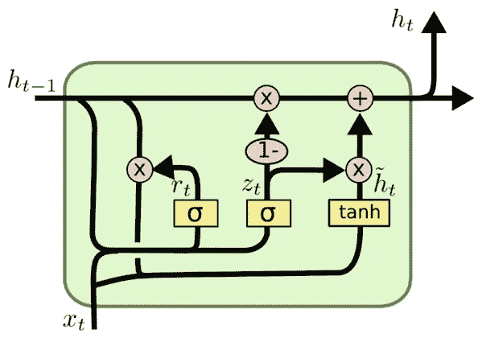

# RNN 简体版-初学者指南

> 原文：<https://towardsdatascience.com/rnn-simplified-a-beginners-guide-cf3ae1a8895b?source=collection_archive---------8----------------------->

## 递归神经网络的直观解释，LSTM 和 GRU

image credit — [Gerd Altmann](https://pixabay.com/users/geralt-9301/?utm_source=link-attribution&utm_medium=referral&utm_campaign=image&utm_content=3699542) from [Pixabay](https://pixabay.com/?utm_source=link-attribution&utm_medium=referral&utm_campaign=image&utm_content=3699542)

递归神经网络(RNN)是一种流行神经网络体系结构，广泛用于由顺序或上下文数据组成的用例。

在我们从 RNN 本身开始之前，让我们先看看为什么我们首先需要它。让我们试着记住这一幕。

花了点时间，对吧？(或者你根本无法理解)

现在想象你正在看电影，你在这个特定的场景中，你将能够很容易地把这些点联系起来。我们所有的想法都是流动的，基于之前的框架，我们可以很容易地连接到当前的框架。我们的思想具有持久性。

我们传统的神经网络架构无法做到这一点，给定一个特定的帧序列，它们无法预测电影中每一点发生了什么。

为了解决这种问题，我们使用一个自环网络。

fig1 : Recurrent Neural Network ( Network with self loop)

简单来说，我们将网络中前一个时间帧的输出反馈到下一个时间帧。假设网络在 t=1 时的输出是 h0，而在 t=2 时训练网络，我们也将考虑 h0，从先前时刻接收的输出。如果我们展开网络，我们会得到下面的结构。

fig2 : RNN at various instance of time , Image Credit— colah’s blog

这里需要记住的重要一点是 ***您显示的连续单元是不同时间点的相同单元，而不是级联单元*** 。

现在，RNN 的简单实现也存在问题。随着时间的推移，它们通过反向传播来学习。如果我们要求他们从长期依赖中学习，这可能会导致梯度消失或梯度爆炸的问题。简而言之，他们记不住重要的信息，而这些信息可能在以后的时间标记中需要。

为了克服这些问题，我们使用 LSTM(长短期记忆)，一种非常特殊的循环网络和 GRU(门控循环单元)，它是 LSTM 的一个稍微修改的版本。

## **LSTM 故障:**

让我们来分析一下 LSTM 的内部结构。一个 LSTM 单元主要

fig3 :LSTM and GRU .image credit — [Michael Nguyen](https://towardsdatascience.com/@learnedvector)

由一个单元状态(单元的当前信息流)和三个门(读取网络层的特殊形式)-忘记门、输入门和输出门组成。迷惑对吗？别担心，我们会一步一步地分解它。

**细胞状态**:我们可以把细胞状态想象成不同时刻的连续信息流。在每个时刻，我们都必须决定保留或修改多少信息。还记得我们最初为什么需要 LSTM 吗？我们无法保留来自遥远的特定时刻的信息的重要性。 在这里，我们可以灵活地决定在每个阶段给予哪些信息更多的重视。

1.  **忘记大门**:首先让我们仔细看看我们拥有的各种符号:

fig4 :Structure of LSTM ,image credit- wikipedia

**C_(t-1)** :旧单元状态， **c_t:** 当前单元状态， **h_(t-1):** 从前一状态输出， **h_t** =当前状态输出

遗忘门决定了我们将使用多少来自先前单元状态的信息，以及我们将“丢弃”多少信息。最后一个状态的输出( **h_(t-1)** )与 x_t 连接(**未加**)，并通过一个 sigmoid 单元。Sigmoid 提供 0 到 1 之间的输出。直观上，0 表示'**忘记一切**，1 表示'**保留一切**。

**2。输入门:**输入门决定我们将哪些新信息添加到单元状态中。串接的 x_t 和 h_(t-1)通过 sigmoid 单元发送，该单元决定我们将更新什么值。

级联值也通过一个双曲正切层，该层给出-1 到+1 之间的输出，并帮助调节网络。在所有这些操作之后，我们得到了单元状态的当前值。

3.**输出门:**输出门决定在下一个时刻我们将传递给网络什么信息。如果你沿着最后一条水平线，我们首先串接 x_t 和 h_(t-1)是通过一个 sigmoid 单元发送的。然后，我们通过一个双曲正切函数传递当前单元状态的值(注意，这是一个逐点双曲正切运算，而不是双曲正切激活层)。最后，我们将两个输出相乘，并在下一个时间发送出去。你可能会想到 ***为什么这里有两个 h _ t***？。答案是，在我们的整个解释中，我们考虑的是 LSTM 的一个单元。实际上，我们也可以使用级联多层 LSTMs。因此，一个输出到网络的下一层，另一个输出到网络的下一个实例(随时间前馈)。

## GRU 的分解:

G**G**ate**R**e current**U**nit 是由推出的 LSTM 网络的流行变种

fig5 : Structure of GRU

[Cho 等(2014)](http://arxiv.org/pdf/1406.1078v3.pdf) 。LSTM 和 GRU 的主要区别是，GRU 只有两个门(更新和重置门)。

1.  **更新门**:更新门只不过是单个单元中输入门和遗忘门的组合。它决定保留什么信息和需要添加什么新信息。
2.  **重置门:**它决定在下一个时刻需要向网络传递什么信息。它还合并了当前单元格状态和隐藏状态，并进行一些其他更改。

与 LSTM 相比，GRU 减少了门的数量，因此减少了张量运算的数量。这使得它在计算上比 LSTMs 更便宜和更快。但是我们不能马上说哪种实现是最好的。这取决于手头的问题。在实践中，我们将这两个模型应用到我们的用例中，并比较哪一个性能更好。

# **结束备注:**

在本文中，我们讨论了关于**R**e current**N**eural**N**网络的基础知识以及 LSTM 和 GRU 的构建模块。本文的主要目的是让您熟悉神经网络的基础知识，并建立一个直观的基础。希望这将有助于你的旅程。快乐学习！

**引文:**

你可以通过这些链接更深入地研究

1.  [http://colah.github.io/posts/2015-08-Understanding-LSTMs/](http://colah.github.io/posts/2015-08-Understanding-LSTMs/)
2.  [https://www.youtube.com/watch?v=WCUNPb-5EYI](https://www.youtube.com/watch?v=WCUNPb-5EYI)
3.  [https://skymind.ai/wiki/lstm](https://skymind.ai/wiki/lstm)