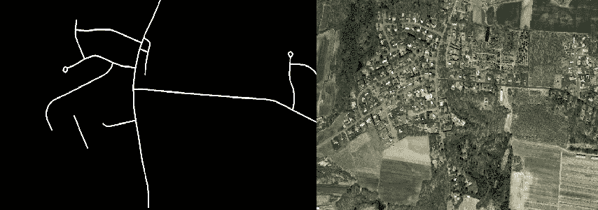
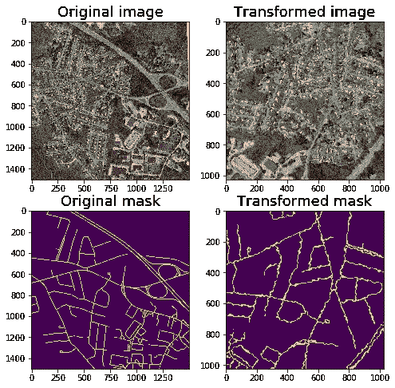
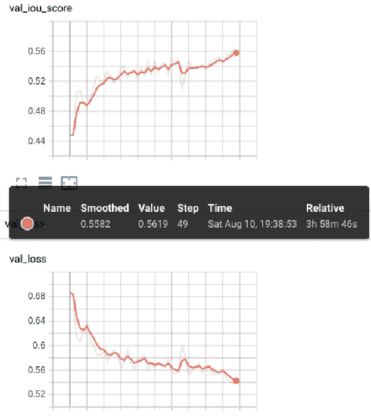
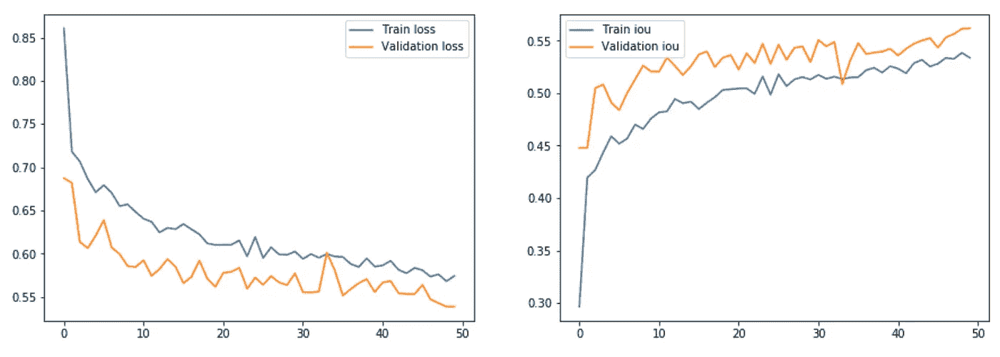
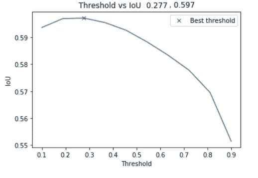
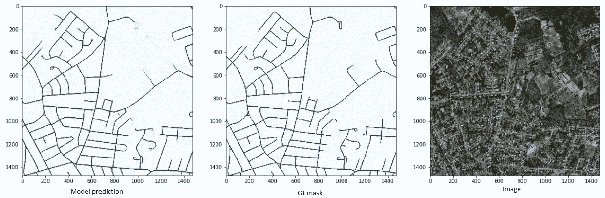

# 基于 Keras 的分割模型和白蛋白库的道路检测

> 原文：<https://towardsdatascience.com/road-detection-using-segmentation-models-and-albumentations-libraries-on-keras-d5434eaf73a8?source=collection_archive---------5----------------------->

> 在这篇文章中，我将展示如何编写自己的数据生成器以及如何使用 albumentations 作为增强库。以及 segmentation_models 库，它为 unet 和其他类似 Unet 的体系结构提供了几十个预训练的头。完整代码请访问 Github 。链接到[数据集](https://www.kaggle.com/insaff/massachusetts-roads-dataset)。

查看我的机器和深度学习博客【https://diyago.github.io/ 

# 理论

语义图像分割的任务是将图像的每个**像素**标记为所表示内容的相应**类**。对于这样一项任务，经过各种改进的 Unet 架构表现出了最佳效果。它背后的核心思想只是几个卷积块，提取深度和不同类型的图像特征，随后是所谓的去卷积或上采样块，恢复输入图像的初始形状。此外，在每个卷积层之后，我们有一些跳跃连接，这有助于网络*记住关于初始图像的*，并有助于防止渐变。有关更多详细信息，您可以阅读 arxiv 文章或另一篇文章[或](/understanding-semantic-segmentation-with-unet-6be4f42d4b47)。


Vanilla U-Net [https://arxiv.org/abs/1505.04597](https://arxiv.org/abs/1505.04597)

我们是来练习的，让我们开始吧。

# 数据集-卫星图像

对于分割，我们不需要太多的数据来获得一个像样的结果，甚至 100 张带注释的照片就足够了。目前，我们将使用来自[https://www.cs.toronto.edu/~vmnih/data/](https://www.cs.toronto.edu/~vmnih/data/)的马萨诸塞州道路数据集，大约有 1100 多张带注释的列车图像，它们甚至提供验证和测试数据集。不幸的是，没有下载按钮，所以我们必须使用脚本。这个[脚本](https://gist.github.com/Diyago/83919fcaa9ca46e4fcaa632009ec2dbd)将完成这项工作(可能需要一些时间来完成)。

让我们来看看图片示例:



Massachusetts Roads Dataset image and ground truth mask ex.

注释和图像质量似乎不错，网络应该可以检测道路。

# 库安装

首先你需要安装带有 TensorFlow 的 Keras。对于 Unet 构建，我们将使用 [Pavel Yakubovskiy](https://medium.com/u/e34a5c21265a?source=post_page-----d5434eaf73a8--------------------------------) 的名为 [segmentation_models](https://github.com/qubvel/segmentation_models) 的库，用于数据扩充[albumination](https://github.com/albu/albumentations)库。稍后我会写更多关于他们的细节。这两个库的更新都非常频繁，所以我更喜欢直接从 git 更新它们。

# 定义数据生成器

作为数据生成器，我们将使用我们的自定义生成器。它应该继承 *keras.utils.Sequence* 并且应该定义这样的方法:

*   *__init__* (类初始化)
*   *__len__* (数据集的返回长度)
*   *on_epoch_end* (时段结束时的行为)
*   *__getitem__* (生成的批次馈入网络)

使用自定义生成器的一个主要优点是，您可以处理您拥有的每种格式数据，并且可以做任何您想做的事情——只是不要忘记为 keras 生成所需的输出(批处理)。

这里我们定义 ***__init__*** 方法。它的主要部分是为图像( *self.image_filenames* )和遮罩名称( *self.mask_names* )设置路径。不要忘记对它们进行排序，因为对于*self . image _ filenames[I]*对应的掩码应该是 self.mask_names[i]。

接下来重要的事情***_ _ getitem _ _****。*通常情况下，我们无法将所有图像存储在 RAM 中，因此每次生成新的一批数据时，我们都需要读取相应的图像。下面我们定义训练的方法。为此，我们创建一个空的 numpy 数组(np.empty ),它将存储图像和遮罩。然后我们通过 *read_image_mask* 方法读取图像，对每一对图像和掩膜进行增强。最后，我们返回 batch (X，y ),它已经准备好被放入网络中。

接下来，我们定义发电机，它将被馈入网络:

## 数据扩充— **相册**

数据扩充是一种策略，能够显著增加可用于训练模型的数据的多样性，而无需实际收集新数据。这有助于防止过拟合，并使模型更加健壮。

对于这样的任务，有大量的库:imaging、augmentor、solt、keras/pytorch 的内置方法，或者您可以使用 OpenCV 库编写您的自定义增强。但是我强烈推荐 [**相册**](https://github.com/albu/albumentations) 图书馆。用起来超级快捷方便。有关用法示例，请访问官方[知识库](https://github.com/albu/albumentations)或查看[示例笔记本](https://github.com/albu/albumentations/tree/master/notebooks)。



在我们的任务中，我们将使用基本的增强，如翻转和非平凡的弹性变换的对比。你可以在上图中找到它们的例子。

在定义了所需的增强后，您可以很容易地得到如下输出:

# 复试

我们将使用常见的[回调](https://keras.io/callbacks/):

*   模型检查点-允许您在训练时保存模型的权重
*   ReduceLROnPlateau —如果验证指标停止增加，则减少训练
*   EarlyStopping —一旦验证指标停止，就停止训练，以增加几个时期
*   tensor board——监控训练进度的绝佳方式。链接到官方[文档](https://www.tensorflow.org/tensorboard/r2/scalars_and_keras)

# 培养

作为模型，我们将使用 Unet。使用它最简单的方法就是从 [segmentation_models](https://github.com/qubvel/segmentation_models) 库中获取。

*   backbone_name:用作编码器的分类模型的名称。EfficientNet 目前在分类模型中是最先进的，所以让我们来尝试一下。虽然它应该给出更快的推理并且具有更少的训练参数，但是它比众所周知的 resnet 模型消耗更多的 GPU 内存。还有许多其他选择可以尝试
*   encoder_weights —使用 imagenet weights 加速训练
*   encoder_freeze:如果*为真*则将编码器(骨干模型)的所有层设置为不可训练。首先冻结和训练模型，然后解冻可能是有用的
*   decoder_filters —您可以指定解码器块的数量。在某些情况下，带有简化解码器的较重编码器可能会有用。

在初始化 Unet 模型之后，你应该编译它。此外，我们将[IOU](https://medium.com/koderunners/intersection-over-union-516a3950269c)(union 上的交集)设置为我们将监控的度量，并将 bce_jaccard_loss ( [二进制交叉熵](/understanding-binary-cross-entropy-log-loss-a-visual-explanation-a3ac6025181a)加上 [jaccard loss](https://arxiv.org/pdf/1705.08790.pdf) )设置为我们将优化的损失。我给了链接，所以不会去这里为他们进一步的细节。

开始训练后，你可以观看 tensorboard 日志。正如我们可以很好地看到模型训练，即使在 50 个纪元后，我们也没有达到全局/局部最优。



Tensorboard logs



Loss and IOU metric history

# 推理

因此，我们有 0.558 IOU 进行验证，但每个高于 0 的像素预测都被视为屏蔽。通过选择合适的阈值，我们可以将结果进一步提高 0.039 (7%)。



Validation threshold adjusting

度量当然很有趣，但是更有洞察力的模型预测。从下面的图片中，我们看到我们的网络很好地完成了任务，这很好。对于推理代码和计算指标，您可以阅读完整的代码。



## 参考

```
@phdthesis{MnihThesis,
    author = {Volodymyr Mnih},
    title = {Machine Learning for Aerial Image Labeling},
    school = {University of Toronto},
    year = {2013}
}
```