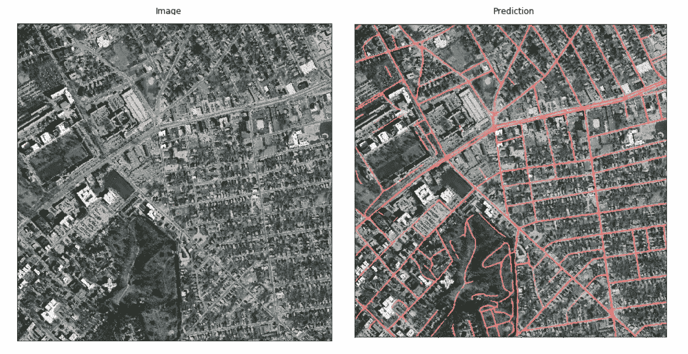
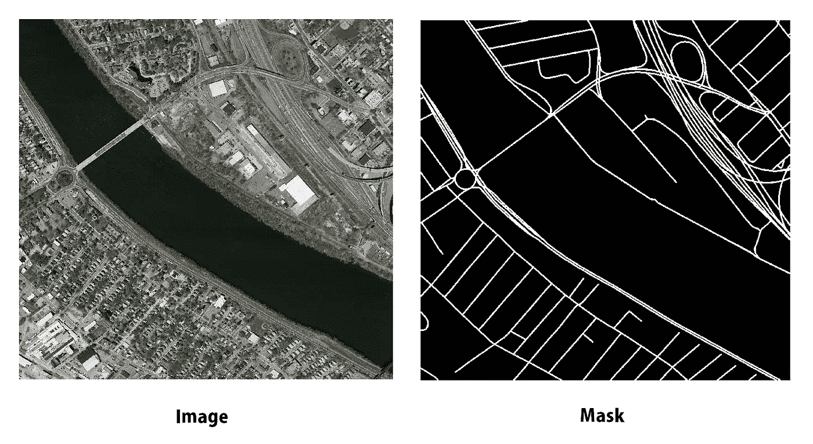
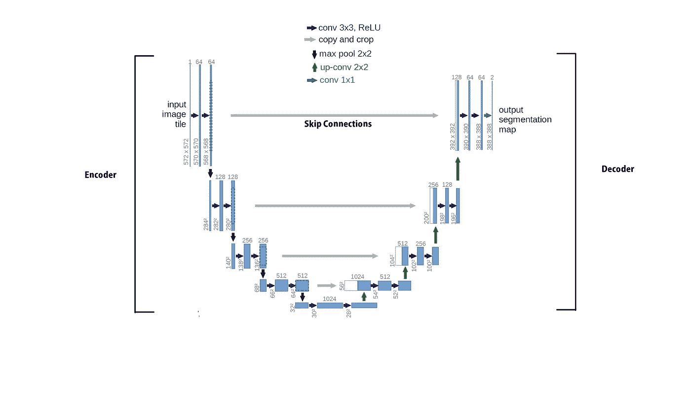
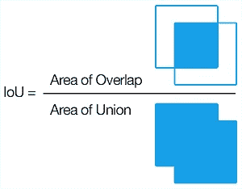
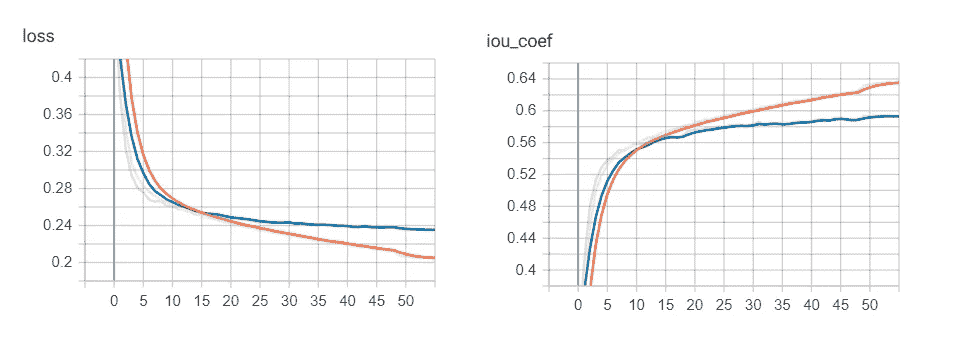
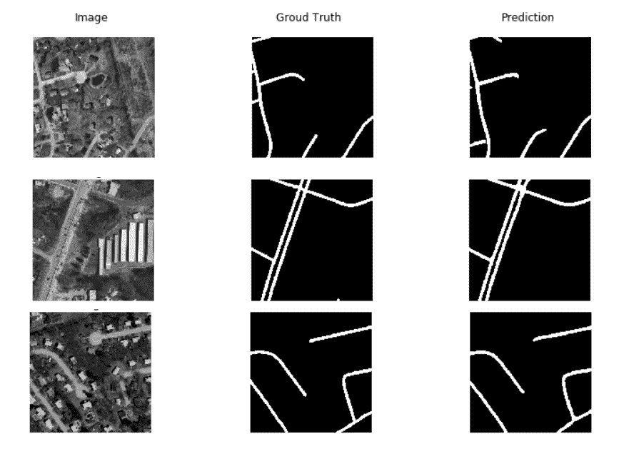
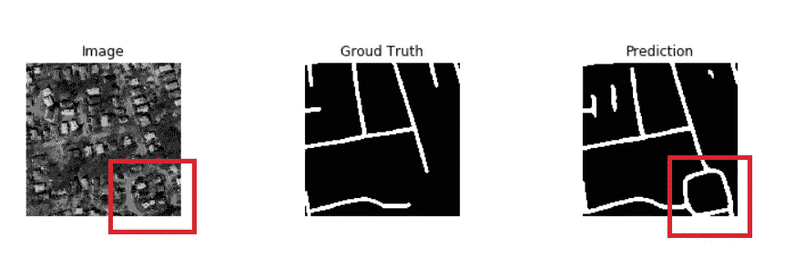
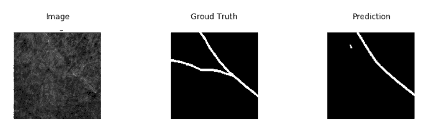

# 航空图像中道路的分割。

> 原文：<https://towardsdatascience.com/road-segmentation-727fb41c51af?source=collection_archive---------7----------------------->

## 这篇全面的文章将帮助您创建一个道路分割模型，它可以检测和分割航空图像中的道路。

卷积神经网络(C.N.N.s)的出现是计算机视觉领域的一项突破，因为它们从根本上改变了计算机“看”图像的方式。机器视觉已经从它开始的地方走了很长的路，但它今天仍然处于研究的前沿。语义分割是将图像中的每个像素归属于某一类的过程。这个类可以是一只狗，一辆车，或者在我们的例子中是道路。



You can view the interactive output [here](https://generationai.wixsite.com/evolve).

地球上所有道路的总长度约为 3350 万公里。让我换一种说法——如果我们能把所有的路都排成一条直线，那么我们将走过地球和太阳之间距离的四分之一。手动标注道路的每一部分是一项艰巨的任务，如果不是不可能的话。这就是深度学习发挥作用的地方，这也是我们将通过这个项目完成的事情。简单来说，我们将训练一个深度学习模型来识别航拍图像中的道路。

您可以在本文末尾找到源代码的链接。如果你想了解这篇文章的范围，请参考目录。项目中使用的所有资源都是公开可用的，因此建议您遵守。本文涵盖了该项目的实践和理论两个方面，我希望这对您来说是一次愉快的学习经历。

# 目录

1.  **数据
    一、我们需要的数据类型。
    二。数据集
    iii。正在下载数据集。**
2.  **预处理**
3.  **神经建模
    一、关于 F.C.N
    二。网络架构**
4.  **训练模型
    一、损失函数和优化器
    二。回调
    三。训练模型**
5.  **测试模型**
6.  **改进范围**
7.  **结论**
8.  **链接和引用**

让我们开始吧。

# 1.数据

不同类型的机器学习模型需要不同类型的数据，数据越多越好。更多的数据训练意味着我们的模型将能够学习更多的潜在模式，并且能够更好地区分异常值。

## 我们需要的数据类型。

通常，对于分割挑战，我们需要图像以及它们各自的(最好是手绘的)地图。对于这个项目，我们需要航空图像，以及它们的分段地图，其中只显示了道路。这个想法是，我们的模型将专注于表示道路的白色像素，它将学习输入图像和输出地图之间的相关性。

## 二。数据集

对于这个项目，我们将使用[马萨诸塞州道路数据集](https://www.cs.toronto.edu/~vmnih/data/)。该数据集包含 1171 幅航空影像，以及它们各自的地图。它们的尺寸是 1500 x 1500 英寸。tiff 格式。请看看下面的样品。



Just look at how elaborately the image was annotated.

## 三。正在下载数据集。

您可以从克隆我的 GitHub [repo](https://github.com/Paulymorphous/Road-Segmentation) 开始，然后使用 Src 文件夹中的 download_images.py 脚本下载数据集。如果你有一个不可靠的持续波动的互联网连接，那么请使用*学术洪流*来获取数据集。你可以在这里找到数据集[。](http://academictorrents.com/details/630d2c7e265af1d957cbee270f4328c54ccef333)

# 2.预处理

数据的质量极大地影响了我们模型的性能，因此预处理是确保我们的模型以正确的形式接收数据的重要一步。我尝试了多种预处理技术，以下方法产生了最好的结果:

**一、手选**:数据集中有少数( *~50* )图像缺失了一大块航拍图像。大部分图像包含白色像素，但它们有完整的分割图。因为这样会影响模型，所以我手动删除了它们。

**二。裁剪而不是调整尺寸**:在大图像上训练我们的模型不仅是资源密集型的，而且一定会花费很多时间。将图像调整到较低的尺寸可能是一个解决办法，但是调整尺寸是有代价的。无论我们在调整大小时选择什么样的插值方法，我们最终都会丢失信息。

因此，我们将从大图像中裁剪出较小的 256 x 256 的图像。这样做给我们留下了大约 22，000 幅有用的图像和地图。

三。**对图进行阈值处理和二值化:**灰度图像是包含不同灰度的单通道图像。每个像素可以取 256 个可能的灰度值，0 代表黑色像素，255 代表白色像素。在语义分割中，我们本质上预测每个像素的这个值。我们将只提供两个选项，而不是提供 256 个离散选项供模型选择。你可能已经注意到了，我们的地图只有两种颜色:黑色和白色。白色像素代表道路，黑色像素代表除道路以外的一切。

仔细观察我们的双色分割图，会发现当我们想要的是黑白时，有许多灰色像素。我们将从阈值像素值为 100 开始。使得所有具有高于某个阈值的值的像素被分配最大值 255，而所有其他像素被分配零。这样做确保了在分段掩码中只有两个唯一的像素值。现在，0 和 255 是一个很大的范围。通过将所有地图除以 255，我们将地图归一化，现在我们最终只有两个值— 0 和 1。

**四。打包(可选)**:我在 Google Colab 上训练了我的模型。衷心感谢谷歌为成千上万的数据科学家和机器学习工程师提供资源。

我注意到在训练期间从 Gdrive 向模型提供图像(使用 ImageDataGenerator)最终会消耗额外的时间。但是，如果您在系统上训练模型，这就不正确了，因为在这种情况下加载文件要快得多。我将整个图像和地图数组打包成两个独立的 *.h5py* 文件，并将它们加载到内存中。这样做加快了训练过程。

# 3.神经建模

既然我们已经处理了数据，是时候开始模拟我们的神经网络了。为了完成我们的分段任务，我们将使用全卷积网络。这类网络大多由卷积层组成，与更传统的神经网络不同，没有完全连接的层。

## 一、关于 F.C.N

德国弗赖堡大学计算机科学系开发了用于生物医学图像分割的全卷积网络[1]。后来人们意识到，这些网络的范围远远超出了医学领域。这些网络可以对任何类型的对象进行多类分割——无论是分割人、汽车还是建筑物。

## 二。网络体系结构

这个项目使用 U-net，这是一个完全卷积的神经网络，它的名字很直观。该网络采用 256x256 多通道图像，并输出相同尺寸的单通道图。

U-net 有两部分——编码器或下采样部分，解码器或上采样部分。看看下面的图片就知道了。



Dissecting a U-net

**编码器:**下采样部分。此部分使用卷积层来学习图像中的时间特征，并使用汇集层对其进行下采样。这部分负责学习图像中的物体。在这种情况下，这部分学习道路看起来如何，并可以检测它。我添加了 dropout 层，它将随机忽略神经元以防止过度拟合，我添加了 BatchNormalization 以确保每一层都可以独立于前一层进行学习。

**解码器:**又叫上采样段。连续的池操作会导致图像空间信息的丢失。模型确实知道图像的内容，但是不知道它在哪里。解码器网络背后的整个想法是使用我们在上一步中提取的特征图来重建空间数据。我们使用转置卷积对图像进行上采样。与普通插值不同，Conv2DTranspose 具有可学习的参数。

**跳过连接:**编码器段中的层与解码器段中的层之间的直接连接称为跳过连接。它们被称为跳过连接，因为它们桥接两层，而忽略所有中间层。跳过连接为上采样层提供空间信息，并帮助它们重建图像和“将东西放入适当的位置”(字面意思)。

请使用以下代码复制 U-net。

我们的 U-net 闪耀着光辉。

# 4.训练模型

## 一.损失函数和超参数

在像素级别，这种分割挑战可以被认为是二元分类问题，其中模型对每个像素是白色(道路)还是黑色(非道路)进行分类。但是，我们需要一个平衡的数据集来促进正确的分割，因为这些图像中黑色像素的数量远远超过白色像素，所以我们有一个不平衡的数据集。

有几种不同的方法来处理不平衡的数据问题。在这个挑战中，我们将使用软骰子损失，因为它是基于骰子系数。Dice 系数是预测样本和基础真实样本之间重叠的度量，该值的范围在 0 和 1 之间。其中 0 表示没有重叠，1 表示完全重叠。


The formula for the Dice Coefficient. Deja Vu?

平滑骰子损失就是 *1 —骰子系数*，这样做是为了创建一个最小化损失函数【2】。请看下面骰子丢失的代码。

```
def dice_coef(y_true, y_pred, smooth = 1):
   y_true_f = K.flatten(y_true)
   y_pred_f = K.flatten(y_pred)

   intersection = K.sum(y_true_f * y_pred_f)
   dice = (2\. * intersection + smooth) / (K.sum(y_true_f)    K.sum(y_pred_f) + smooth)

   return dicedef soft_dice_loss(y_true, y_pred):
   return 1-dice_coef(y_true, y_pred)
```

可以看到，我们使用了一个名为 smooth 的参数，默认值为 1。通过将分子和分母都加 1，我们可以确保永远不会被零除。



Source:pyimagesearch.com

**准确性度量**:准确性度量告诉我们生成的分割图的正确性。我们将使用 Jaccard 索引，也就是 Union 上的交集，来告诉我们生成的地图有多精确。顾名思义，交集超过并集是分割图正确性的度量。分子是预测图和基本事实标注之间的交集，而分母是基本事实标注和分割图的总面积(使用联合运算计算)。下面的代码片段用于计算 Jaccard 索引。

```
def IoU(y_pred, y_true):
   I = tf.reduce_sum(y_pred * y_true, axis=(1, 2))
   U = tf.reduce_sum(y_pred + y_true, axis=(1, 2)) - I
   return tf.reduce_mean(I / U)
```

我们使用 Adam 作为优化器来编译模型。我们将以 0.00001 的学习率开始，我们将它设置为运行 100 个时期。我们使用软骰子损失作为损失函数，使用 Jaccard 指数作为精度指标。

## 二。复试

在训练过程中可以调用的一组函数称为回调函数。在这个项目中，我们将使用四次回调:

1.  **模型检查点**:监控验证损失，保存验证损失最低的模型的权重。
2.  **提前停止**:监控确认损失，如果确认损失在一定次数后没有增加，则终止训练过程。
3.  **ReduceLROnPlateau** :监控验证损失，如果验证损失在一定次数后没有降低，则降低学习率。
4.  TensorBoardColab :是 Tensorboard 的一个特殊版本，专门用于 Google Colab。我们可以在培训过程中监控准确性和其他指标。

## 三。训练模型

我们已经做了所有的功课，现在是时候拟合模型了。但在此之前，我们将使用*trainttestsplit()*将数据拆分为分别包含 17，780 和 4446 幅图像的训练集和测试集。一旦模型开始对训练数据进行训练，你也许可以去跑步，因为这需要一些时间。好的一面是，我们不必照看模型，你可以回到一个训练有素的模型和输出的重量。

该模型运行了 57 个时期，然后早期停止开始并停止了训练过程。最小验证损失为 0.2352。您可以在下图中观察验证和培训指标的趋势。



Tensorgrab

# 5.测试模型

我们的测试集包含 4446 幅图像，我们的模型几乎可以立即预测它们的分割图。我们的模型在测试集上的性能可以使用 Dice 系数来衡量，该系数达到 0.59(该值介于 0 和 1 之间)。当然还有改进的余地。您可以在下图中观察到一些预测的输出。



Few Samples

再看一下，您会注意到我们的模型可以分割注释者遗漏的部分道路。在下图中，注释者跳过了右下角的方块，而我们的模型能够捕捉到它。我们的模型成功地分割了车道、停车场和死胡同。



Our model was able to pick up the square region

# 6.改进的范围

在某些地图上，道路并不完全可见，请看下面的例子。我们的模型无法检测左侧的道路。尽管没有一个模型能产生 100%准确的结果，但总有改进的空间。



Missing predictions

我们可以通过采取某些措施来提高模型的性能，这些措施如下:

1.  **图像数据增强**:它是通过应用各种操作，如颜色偏移、旋转等，使图像轻微失真的方法。来产生更多的数据。
2.  **使用损失乘数处理职业不平衡**:如前所述，我们有一个职业不平衡的问题，为了解决它，我们使用了软骰子损失。我们希望最大化我们的 dice 系数，但是当与二元交叉熵相比时，后者具有更好的梯度，因此将是我们定制损失函数的良好代理，并且可以容易地最大化。唯一的问题是，与软骰子损失不同，二进制交叉熵不是为了处理类别不平衡而构建的，这导致了乌黑的分割图。然而，如果我们应用类乘数，使得模型被激励来忽略频繁出现的类，那么我们可以使用二进制交叉熵来代替骰子损失。这将带来流畅的训练体验。
3.  **使用预训练模型:**预训练模型可以针对这个问题进行微调，它们将充当最佳特征提取器。使用迁移学习导致更快的训练时间，并且通常产生更好的分割图。

# 7.结论

在这个项目中，我们创建了一个深度学习模型，可以从航拍图像中分割道路。我们获取了图像，并对其进行处理以满足我们的需求。我们创建了一个 U-net 并了解了它的工作原理。我们使用软骰子损失作为我们的成本函数，并训练了 57 个时期的模型。然后，我们在测试集上测试我们的模型，并观察一些样本。

本项目的几点收获:

1.  裁剪图像而不是调整它们的大小可以保留空间信息。
2.  将分割图二值化将图中不同值的数量减少到两个。
3.  使用 ModelCheckpoint 回调来保存模型权重是一个好主意。为了以防万一，如果程序在训练过程中崩溃，你可以随时重新加载重量并恢复训练。
4.  最后，如果你曾经走进了死胡同，那么 [Slav Ivanov](https://medium.com/u/d41130ab0af4?source=post_page-----727fb41c51af--------------------------------) 已经写了一篇全面的[文章](https://blog.slavv.com/37-reasons-why-your-neural-network-is-not-working-4020854bd607)，它将帮助你克服任何与深度学习相关的障碍。

# 8.链接和参考

这个挑战的确很有趣，感谢您通读这篇文章。如果您有任何反馈或问题，请随时在下面的评论部分输入。

如果你期待更多有趣的教程，那么请关注我的 [Twitter](https://twitter.com/Paulymorphous) 和 Medium。

## 链接

1.  [源代码](https://github.com/Paulymorphous/Road-Segmentation)。
2.  [CS231n:用于视觉识别的卷积神经网络](http://cs231n.stanford.edu/)

## 参考

[1] [优信网—维基百科](https://en.wikipedia.org/wiki/U-Net)

[2] [评估图像分割模型—杰瑞米·乔登](https://www.jeremyjordan.me/evaluating-image-segmentation-models/)

想了解更多？查看我的其他几篇文章:

1.  [创建自定义人脸识别模型，并在您的系统上运行。](/s01e01-3eb397d458d)
2.  [构建活体情感识别模型](https://medium.com/free-code-camp/facial-emotion-recognition-develop-a-c-n-n-and-break-into-kaggle-top-10-f618c024faa7)。