# 公路旅行热

> 原文：<https://towardsdatascience.com/road-trip-fever-460a2627f0c4?source=collection_archive---------21----------------------->

## Ep。4:求解 TSP 以获得目的地的有效路线

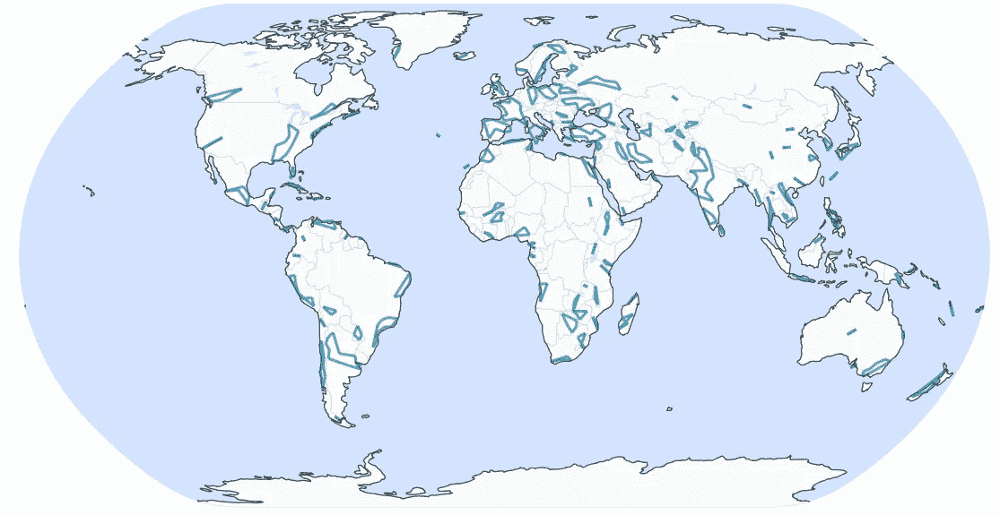

Our output today; All our efficient road-trip destinations on globe; connected linearly

想象一下你自己，走在蜿蜒的山路上，每个角落都会出现新的田园风光。或者感受海风吹过你的头发，驾驶着你的敞篷车，在那风景如画的海洋车道上感受无尽的夏日海浪。或者把你的露营车停在一个似乎从来没有人见过的地方。公路旅行有多种形式，通常会立即激发我们许多人的兴趣。

对于我们在[第三集](/clustered-globe-e5c54b42de16)中看到的更大的集群，为了充分利用我们的假期，公路旅行是不可避免的。这就是为什么在今天的帖子中，我们将尝试回答如何在我们所有的度假目的地旅行:需要自驾游吗？如果是，如何最有效地穿过集群？

对于后者，我们将尝试为每个需要公路旅行的度假目的地解决一个微型版的 [TSP](https://en.wikipedia.org/wiki/Travelling_salesman_problem) ！

> **旅行推销员问题** ( **TSP** )提出以下问题:“给定一列城市和每对城市之间的距离，访问每个城市并返回出发城市的最短可能路线是什么？” *—维基百科*

# 我们的方法

1.  **在我们的度假目的地建立更小的住宿集群**;这些将定义求解 TSP 的位置。
2.  **将需要 TSP 分析的目的地**与仅包含一个或两个子聚类的目的地分开
3.  **探索**哪种 **TSP 解决算法**最适合我们的问题**并在我们的公路旅行度假目的地应用**
4.  **想象**我们新创造的**全球公路旅行**

# 数据

我们今天需要的数据是每项活动的经度和纬度方面的地理数据。因为我们已经在[第一集](/planet-beehive-aeca53ba0326)中使用[谷歌地图的地理编码 API](https://developers.google.com/maps/documentation/geocoding/intro) 得出了这些。

然而，为了计算我们的公路旅行目的地之间的最佳路线，我们将从以下各项中提取驾驶距离(时间)数据:

*   [谷歌](http://www.google.com) : *为了检索我们目的地内夜间位置之间的距离，我们将利用* [*谷歌的距离矩阵 API*](https://developers.google.com/maps/documentation/distance-matrix/start) *。*

# 定义夜间位置

在第三章中，我们将我们的旅游活动集中到了度假目的地。但与此同时，我们也注意到，这些度假目的地中的一些仍然包含相距很远的活动(例如，一个美国集群包含从芝加哥到新奥尔良的所有活动)。这意味着我们不能把自己的基地设在集群中的一个单独的位置，并且能够通过一日游参观所有的活动。我们必须在我们的活动和目的地之间创建一个新的层级:过夜地点。

我们要寻找的是一个单一的位置，从这个位置我们可以在一天内合理的距离内(因此距离是一个约束)从集群中获得尽可能多的活动。听起来很熟悉？那是因为这是一个和我们在[上一集](/clustered-globe-e5c54b42de16)中提到的非常相似的问题！因此，让我们不要重新发明轮子，使用我们在那里使用的相同集群过程(DBSCAN 集群)来创建子集群，这些子集群将充当我们的夜间位置。

由于我们希望能够开车前往活动地点并返回我们的过夜地点，同时还能够享受活动，我们将根据最大直线距离**200km***选择**ε参数**。因为我们想要访问集群中的所有活动，所以我们将选择 1 个的**最小人口。确保没有异常值(即，如果子群中有一个活动，我们将访问该活动，并在继续下一个子群之前在那里停留 1 个晚上)。***

*因此，在应用这种方法后，我们现在已经在我们的剧集中创建了三个旅游层级:*

*   *活动-要参观的地方*
*   *子集群-睡眠的位置*
*   *集群-度假目的地*

*视觉上，回到美国的例子，这些层看起来像这样:*

***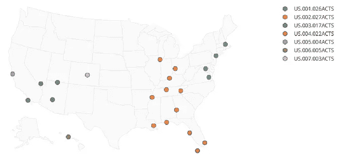**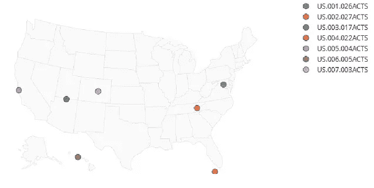*

*Fig. 1, 2, 3: Mapped activities, **sub-clusters** and clusters respectively, grouped by the 7 clusters in the US*

*由此可以立即看出，并非所有集群都有多个子集群。一些度假目的地有一个单一的过夜地点，从那里我们可以参观所有的活动。非常适合不太喜欢公路旅行的旅行者。*

*让我们来看一下我们的聚类分布，包括过夜地点的数量，以及公路旅行和非公路旅行聚类:*

*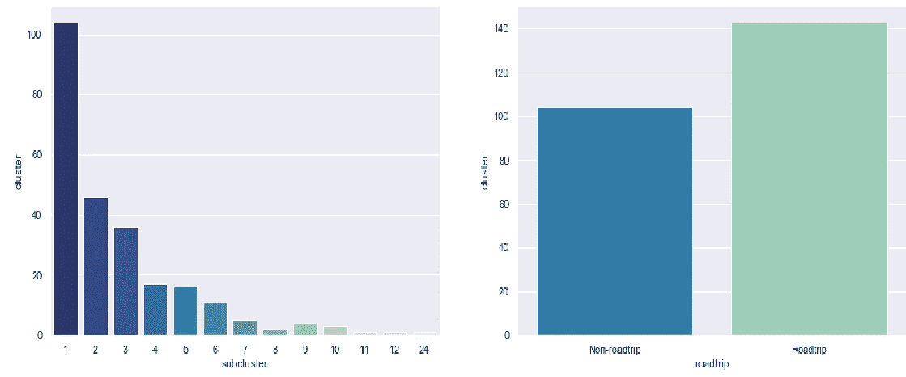*

*Fig. 4 distributions of the holiday destinations (clusters) by the number of overnight locations (sub-clusters)*

*大多数度假目的地只有一个过夜的地方。我们可以看到，大多数其他集群都有 2 到 10 个子集群，大多数都是较小的数量。然后有三个目的地有超过 10 个子集群，但这些似乎是相当例外。*

*谈到非公路旅行与公路旅行(> 2 个过夜地点)目的地的分布，我们对两者都有相当多的选择。这很好，因为我们希望有更多的选择来决定什么时候我们更喜欢公路旅行，什么时候我们更喜欢一个更固定的基地来探索目的地。每个国家都有 100 多个目的地(分别为 104 个和 143 个)，有足够的选择余地。*

# *选择正确的 TSP 求解算法*

*对于有多个过夜地点的 143 个目的地，我们需要定义穿过它们的最有效路线。同时在相同的位置开始和结束。*

*对于有两个和三个过夜地点的目的地来说，任何路线都是最有效的路线。然而，对于有 3 个以上过夜地点的所有路线，我们必须通过解决微型的**旅行推销员问题**，也称为 TSP，来导出最有效的路线。*

*一个很大的灵感来源于[的这篇文章](http://www.randalolson.com/2015/03/08/computing-the-optimal-road-trip-across-the-u-s/)来自[的兰迪·奥尔森](https://medium.com/u/79a76605c902?source=post_page-----460a2627f0c4--------------------------------)。他的发现无疑比以前听说过 TSP 的人拥有更广泛的受众。他的[遗传算法](https://en.wikipedia.org/wiki/Genetic_algorithm)让我们特别感兴趣，因为我们不需要推导出绝对最佳的路线，更重要的是以适当的性能生成非常有效的路线。*

*我们的目标是实施最有效的算法来优化*单个集群内的路线。*正如我们在图 4 中观察到的，我们的大多数目的地只有 10 个或更少的过夜地点。*

*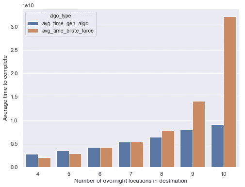*

*Fig. 5 Time complexity comparison for a brute force vs genetic algorithm approach*

*考虑到这些非常少的位置，我们不妨将遗传算法的时间复杂度与[强力](https://guide.freecodecamp.org/algorithms/brute-force-algorithms/) TSP 算法进行比较，看看后者是否足以在我们的解决方案中实现。*

*在左侧的图 5 中，您可以看到随着我们集群内过夜地点数量的增加，完成路线优化的平均时间。通过这种方式，我们可以快速测试总的完成时间，以及越来越多的地点可能在未来或更长的假期产生的影响。*

*随着过夜场所数量的线性增长，暴力方法明显呈指数增长；虽然遗传算法的时间复杂度或多或少是线性增长的，但是对于性能的稳定性来说，这已经是更优选的解决方案。*

*对于我们的算法，即使我们每个目的地的位置有限，我们也想创建一个可持续的解决方案。因此，最好的方法是将遗传算法的一个衍生版本整合到我们的解决方案中。*

# *创造高效的公路旅行*

*终于！有趣的事情来了:让我们实际上创造一些公路旅行！*

*现在我们已经最终确定了我们选择的算法，我们可以开始研究我们的数据，看看我们的公路旅行在实践中是怎样的。由于对 Randall 的第一篇文章仍然很感兴趣，同时也为了测试我们解决 TSP 问题的能力，我将在两个层次上创建公路旅行:一条穿越一个国家内所有活动的路线，以及为我们在这个国家内的每个目的地分开的路线(我们的最终目标)。*

*这里需要把握的重要一点是:*

*   *全国范围的路线穿过包含我们活动的所有城市，而集群路线仅穿过我们过夜的地点。*
*   *仅显示公路旅行目的地。未被公路出行聚类路径访问的位置要么是单位置目的地，要么是异常值。*

*让我们来看看四大洲四个较大国家的 TSP 解决方案:美国、巴西、印度和澳大利亚:*

*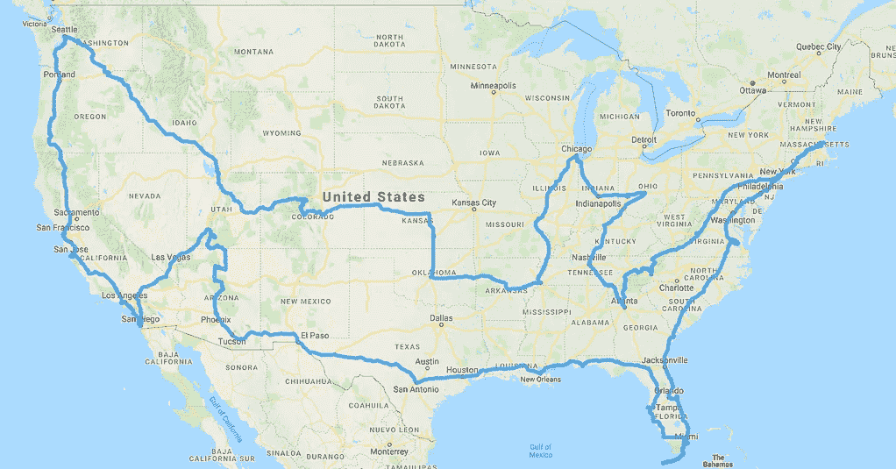**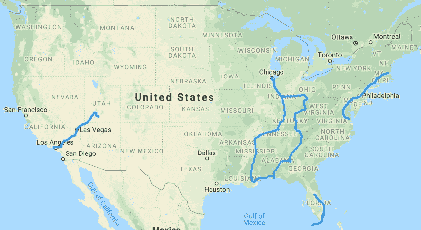*

*Fig. 6, 7 Efficient road-trips through our relevant locations in the **United States**; country-wide and for all road-trip destinations separated, respectively*

*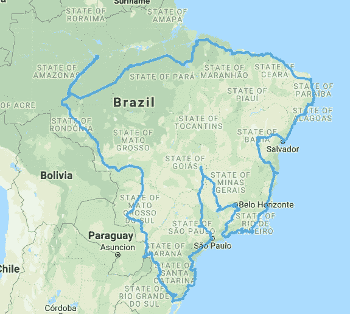**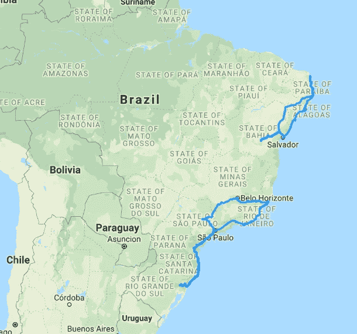*

*Fig. 8, 9 Efficient road-trips through our relevant locations in **Brazil;** country-wide and for all road-trip destinations separated, respectively*

*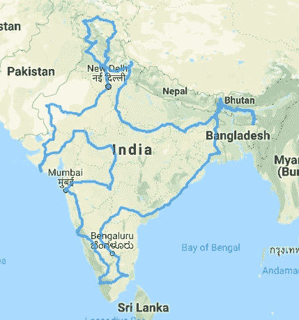**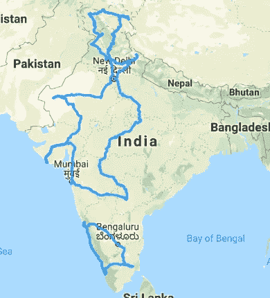

Fig. 10, 11 Efficient road-trips through our relevant locations in **India**; country-wide and for all road-trip destinations separated, respectively* *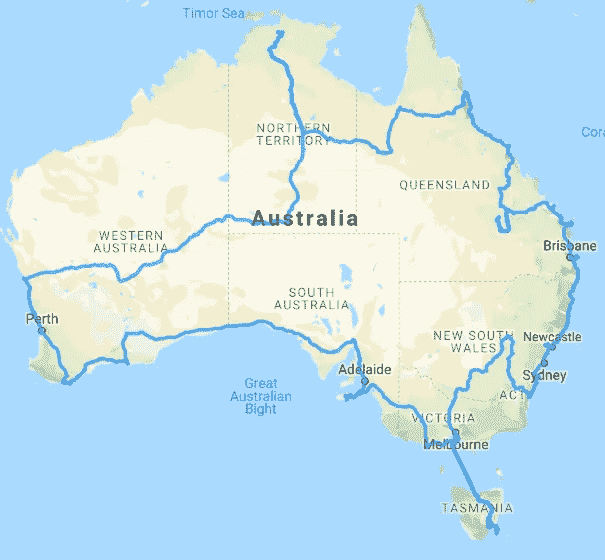**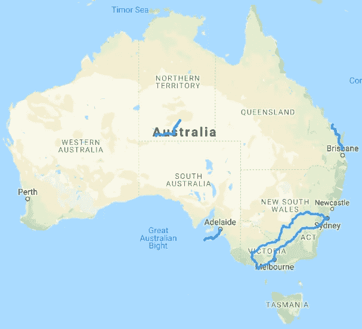*

*Fig. 12, 13 Efficient road-trips through our relevant locations in **Australia**; country-wide and for all road-trip destinations separated, respectively*

*总的来说，这些对我来说都是令人印象深刻的公路旅行！从视觉上看，它们的效率也相当高，虽然最有可能进一步优化这些路线，但与这样做所需的额外复杂性相比，增加的效率将是有限的。就我们的情况而言，进一步加强这些路线绝对是大材小用。*

*分开来看不同的目的地，我们看到各种形状和形式的公路旅行。猜猜看，印度西北部的大型公路旅行是我们的异常目的地，有 24 个过夜地点(见图 4)。*

*谈论休假旅行！*

# *最终地图*

*所以今天我们设法将我们的目的地细分为过夜地点。我们还在代码中添加了 TSP 求解算法，当目的地有 3 个以上的位置时，该算法可以计算出这些过夜位置之间的有效路线。*

*总之，下面的互动图表将展示我们旅游活动中的所有公路旅行目的地，以及它们的线性连接的有效路线(不是实际的驾驶方式)。这张交互式地图是使用 [Plotly](https://plot.ly) 创建的。祝你下次旅行愉快！*

*Fig. 14 Map of all our road-trip destinations linearly connected by order of efficient route*

> *读到这里又恰好是 Django/Web 开发方面的专家？如果你有兴趣给我的代码更多一点的形状，给我一个 DM..字面上。*

**关于我自己的更多信息，请随时查看我的* [*LinkedIn*](https://www.linkedin.com/in/thijs-bressers-a793bb19)*