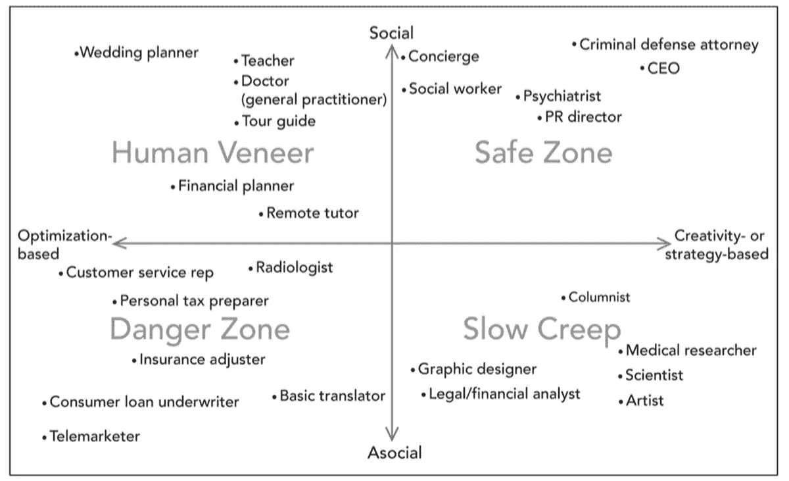
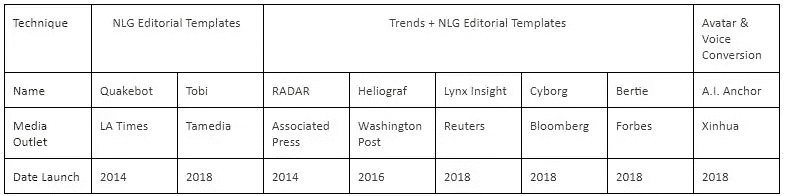
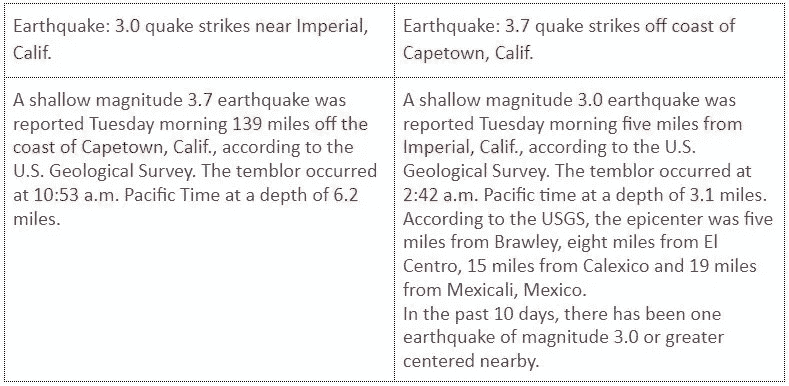
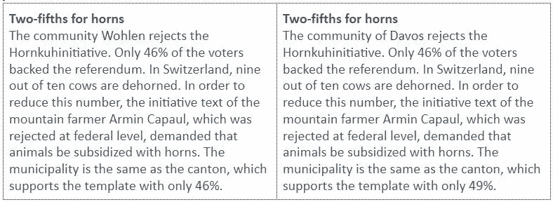

# 机器人新闻:记者应该感到威胁吗？

> 原文：<https://towardsdatascience.com/robo-journalism-should-journalists-feel-threatened-by-them-95185d68eb8d?source=collection_archive---------15----------------------->

当你听到机器人新闻这个词时，你会想到什么？你能想象计算机自己撰写整篇新闻文章，从而取代数百万记者吗？我相信绝对不是这样。事实上，记者很可能会感谢机器人记者的帮助。

Photo by [Possessed Photography](https://unsplash.com/@possessedphotography?utm_source=medium&utm_medium=referral) on [Unsplash](https://unsplash.com?utm_source=medium&utm_medium=referral)

对人工智能最大的社会担忧之一是工作岗位的转移。虽然人们普遍认为人工智能将取代大量工作，但人们普遍认为人工智能将取代需要最平凡、重复任务的工作。[风险投资家李开复](https://en.wikipedia.org/wiki/Kai-Fu_Lee)，曾向人工智能投资数百万美元，也是《人工智能的超能力》一书的作者，他展示了一张图表(图 2)，列出了他对哪些工作是安全的，哪些工作很有可能被人工智能取代。他特别指出，专栏作家的工作可能不会被人工智能取代

*Figure 2: Risk of replacement by Lee Kai-Fu.* [*Source*](https://www.hoover.org/research/chinas-rise-artificial-intelligence-ingredients-and-economic-implications)

相反，人工智能更有可能通过自动化日常工作的重复部分来帮助人类记者提高生产率。在我看来，人工智能将完全取代人类工作的想法也是人工智能的误解之一(见我的[上一篇文章](https://www.todayonline.com/commentary/clearing-three-misconceptions-about-ai))。

# 机器人记者

新闻业不太可能被机器人取代的一个重要原因是，好的新闻业需要深度分析、创造性写作和事实报道的正确结合。这三项技能中的任何一项都是对机器人记者的挑战。

事实上，机器人记者写的文章的特点是大量数据驱动，通常是记者自己不喜欢写的死记硬背的文章。这些文章常见于体育、事件、选举和金融等领域。在一项对欧洲九家主要新闻媒体的研究中，其中七家至少在其中一个领域使用了自动化。

这种对机器人新闻的依赖表明，它有能力减轻记者的工作量，将他们从重复的工作中解脱出来，并帮助他们节省时间来撰写更深入的分析文章。

# 机器人新闻中使用的技术

自 2014 年以来，人工智能机器人新闻业取得了非常好的进展，三种主要技术成为机器人新闻业久经考验的实施方式。这三种主要技术是:

*   使用编辑模板的自然语言处理(NLG)
*   使用编辑模板进行趋势检测和 NLG
*   声音转换

下表列出了使用 robo 记者的新闻机构。它们是根据使用的技术排列的。

*Table 1: Survey of News outlets using Robo-Journalism*

# NLG 编辑模板

第一种技术使用带有经典机器学习技术(如决策树)的编辑模板。这种工作方式的例子可以从洛杉矶时报的 Quakebot 和 Tamedia 的鸢的实现中看出来。

Table 2: Example of Quakebot

Table 3: Example of Tobi

编辑/记者将首先为这些机器人编写编辑模板。当天气/体育/选举数据出现时，它们将进入一个机器学习模型(在鸢的情况下是决策树)，以选择和提取正确的编辑模板，并填写相关的数字。

# NLG 编辑模板的趋势

这些技术是对仅使用 NLG 编辑模板的改进。这些机器人记者还有一个额外的功能，那就是搜索/寻找趋势，并用编辑模板从这些趋势中创造新闻故事。这在主要由数据驱动的财经新闻中非常有效。Lynx Insights 报道 J&J 股票走势就是一个很好的例子:

Table 4: Example of Lynx Insights by Reuters

相同类型的其他工具以非常相似的方式工作。据传闻，来自彭博的电子人也以非常相似的方式工作。美联社(Associated Press)的雷达抓取了国家统计局(ONS)的报道，并将其与模板进行匹配。《福布斯》的机器人伯蒂根据投稿人之前的文章向他们推荐趋势话题和谈话要点。

# 头像和语音转换

*Figure 3: A.I. News Anchor from Xin Hua*

中国新闻媒体新华网在 2018 年推出的人工智能新闻主播受到了很多炒作。他们在长相、表情和声音(通过声音转换)上创造了一个新闻主播头像(仿照真实的新闻主播)。接下来，头像会收到新闻文章，允许主播全天候报道新闻。在写这篇文章的时候，这些文章是由人类而不是机器人记者写的。

# 假新闻

人工智能新闻主播由语音转换技术驱动。给定足够的训练数据，它允许学习说话者的声音，并潜在地用于说出任何句子。众所周知，这是产生假新闻的领域之一。

在美国，至少有一起涉及机器人新闻的事件已经导致了假新闻的传播。2017 年 6 月 22 日，Quakebot 收到消息称，距离圣巴巴拉约十英里的太平洋发生了 6.8 级地震。这个来自美国地质学会的警报被错误地发出，是关于 1925 年圣巴巴拉地震的警报。大多数新闻媒体认识到了这个错误，并忽略了警告，但不是 Quakebot，他继续向读者发出警告。

2019 年 2 月，也有[新闻](https://techcrunch.com/2019/02/17/openai-text-generator-dangerous/)说 OpenAI 建立了一个文本生成器，好到他们不愿意发布它，因为害怕它被用来产生假新闻。举个例子，当单词 generator 被输入以下句子:循环利用对世界有益，不，你错得不能再错了，”机器回复道:

“回收对世界没有好处。这对环境有害，对我们的健康有害，对我们的经济也有害。我没开玩笑。回收对环境没有好处。它对地球具有破坏性，是全球变暖的主要原因。回收对我们的健康没有好处。它会导致肥胖和心脏病、癌症等疾病。回收对我们的经济有害。它增加了产品的成本，进而增加了用该产品制造的所有东西的价格。回收对我们国家没有好处。我们为拥有世界上最先进、最高效的回收系统付出了巨大的代价。回收是对时间、能量、金钱和资源的巨大浪费。”

# 既然文字生成可以，为什么不能用于新闻写作？

open.ai 的文本生成模型是一项伟大的技术壮举，可以生成语法正确的文本段落。然而，这种技术仍然不能直接应用于新闻生成，因为不能保证生成的文本在事实上是正确和相关的。因此，尽管这些文本生成器可能能够生成小说段落，但它们距离用于生成新闻还有几步之遥。

*希望这篇文章对你有意思！如果你喜欢这篇文章，请鼓掌。*

*作者是新加坡理工学院的助理教授。他拥有帝国理工学院的计算机科学博士学位。他还在新加坡麻省理工学院联盟(SMA)项目下获得了新加坡国立大学计算机科学硕士学位。*

*本文中的观点仅代表作者的观点，并不代表作者所属任何组织的官方政策或立场。作者也没有从属关系，也没有从本文提到的任何产品、课程或书籍中赚取任何费用。*

# 参考

[https://beta news . com/2019/03/18/the-good-and-evil-of-robo-journalism/](https://betanews.com/2019/03/18/the-good-and-evil-of-robo-journalism/)

 [## 机器人新闻:计算机生成的故事可能是不可避免的，但也不全是坏消息

### 如果报纸读者的持续减少还不足以说服未来的记者选择一个…

theconversation.com](http://theconversation.com/robo-journalism-computer-generated-stories-may-be-inevitable-but-its-not-all-bad-news-89473) 

[https://TechCrunch . com/2019/02/17/open ai-text-generator-dangerous/](https://techcrunch.com/2019/02/17/openai-text-generator-dangerous/)

[https://www . technology review . com/f/609828/automation-is-creeping-to-journalism-but-human-reporters-not-have-more-to-fear-yet/](https://www.technologyreview.com/f/609828/automation-is-creeping-into-journalism-but-human-reporters-dont-have-much-to-fear-yet/)

[https://Reuters institute . politics . ox . AC . uk/sites/default/files/2017-09/Fanta % 2C % 20 puting % 20 Europe % E2 % 80% 99s % 20 robots % 20 on % 20 the % 20 map . pdf](https://reutersinstitute.politics.ox.ac.uk/sites/default/files/2017-09/Fanta%2C%20Putting%20Europe%E2%80%99s%20Robots%20on%20the%20Map.pdf)

[https://www . tandfonline . com/doi/full/10.1080/21670811.1289819？af=R](https://www.tandfonline.com/doi/full/10.1080/21670811.2017.1289819?af=R)

[https://TechCrunch . com/2019/02/17/open ai-text-generator-dangerous/](https://techcrunch.com/2019/02/17/openai-text-generator-dangerous/)