# 探索霞多丽的变化

> 原文：<https://towardsdatascience.com/robosomm-chapter-2-exploring-variations-of-chardonnay-7aa70f5317c2?source=collection_archive---------29----------------------->

## 机器人

## 利用 K-Modes 聚类更好地理解品种内的变异

# 介绍

数据科学让我们能够以全新和意想不到的方式体验葡萄酒世界。在本文中，我们将使用一套称为聚类的数据科学技术来研究霞多丽葡萄酒的变化。

# 准备我们的数据集

发布给[www.winemag.com](http://www.winemag.com.)的 15000 条关于霞多丽葡萄酒的在线评论被删除，包括其他可能感兴趣的属性:年份、价格、评级和酒厂的位置。

在研究各种类型的霞多丽时，我们最感兴趣的是葡萄酒的可感知特征。为此，从基于文本的葡萄酒评论中提取描述符，利用 RoboSomm 系列的[前一章](https://www.linkedin.com/pulse/robosomm-predicting-grape-varieties-roald-schuring/)中的工作。

首先，通过删除标点符号、停用词和将文本转换成小写字母来规范评论。单词的屈折使用一种叫做词干化的过程来标准化。然后提取 2000 个最常见的单词和单词组合(二元模型)。这个术语列表经过过滤，只保留那些在盲品一杯葡萄酒时可以合理提取的术语。此外，含义模糊的词语(例如,‘酸’是指葡萄酒中的酸度高还是低？)也被删除。

这个过程留下了大约 500 个标准化的原始描述符来描述我们的夏敦埃酒。使用映射系统将每个原始描述符映射到一个类别(级别 1)、一个高级描述符(级别 2)和一个低级描述符(级别 3)。下面提供了一个这样的例子。

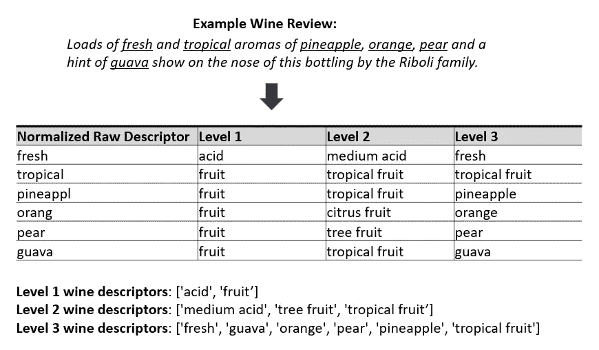

在我们的聚类练习中，使用了 2 级描述符。这个级别足够宽泛，可以让一致的主题出现在葡萄酒评论中，也足够具体，可以让不同类别之间出现有趣的差异。

# 使聚集

在数据科学中，聚类是创建相似数据点的分组集的任务。这是一种无监督的学习方法，这意味着它从数据集中提取参考，而没有标记的响应。在这种情况下，我们开始使用聚类来了解夏敦埃酒有多少种类型，以及这些类型有何不同。

由于我们的数据本质上是分类的，我们必须注意选择正确的方法来构建我们的聚类。许多标准聚类算法(如 k-means)使用基于欧氏距离的评估度量来分配聚类成员。这对于分类数据来说效果不好，因为在分类数据中，数值之间的*大小*差异是没有意义的。

在探索了几个备选方案后，我们选定了 k-modes 算法。该算法要求指定聚类数。选择“正确”的集群数 k 不是一件简单的任务！我们使用了多种技术组合(碎石图、平均轮廓分数、轮廓分析)来得出 k = 5 的值。你可以在这个 [Jupyter 笔记本](https://github.com/RoaldSchuring/studying_grape_styles/blob/master/Studying%20Grape%20Variety.ipynb)里读到更多关于这个过程的内容。在这 5 组中，有 3 组的观察值有意义。我们称之为 A，B 和 c。

# 研究我们的星团

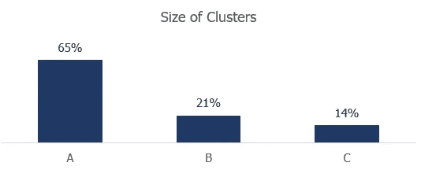

我们的三个集群大小不同。事实上，聚类 A 包含了我们数据集中的大部分夏敦埃酒。聚类 B 和 C 略小，分别占 21%和 14%。

**描述符的差异**

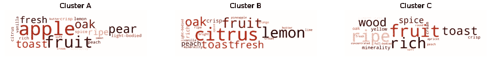

让我们看看我们的集群在(第 3 级)描述符方面有什么不同。在聚类 A 中最常出现的描述词是与水果相关的:最显著的是苹果和梨。聚类 B 具有柑橘相关的水果描述符，例如柠檬、酸橙和橙子。特定的水果风味似乎在 C 类葡萄酒中不太明显，尽管这些葡萄酒总体上仍有水果味，并以成熟的水果风味为标志。此外，这些葡萄酒似乎是浓缩的，丰富的和浓郁的。

当我们查看每个分类中属于特定类别(1 级描述符)的所有描述符的百分比时，这些主题得到了确认。17%的 C 类葡萄酒描述符与酒体相关，而 A 类和 B 类分别为 8%和 9%。有趣的是，C 类葡萄酒的酸描述符较少(占总量的 9%，而 A 类和 B 类分别为 11%和 12%)。这可能表明 C 类葡萄酒的酸度较低。在任何情况下，这些葡萄酒的酸性特征都没有其他葡萄酒明显。

**地理上的差异**

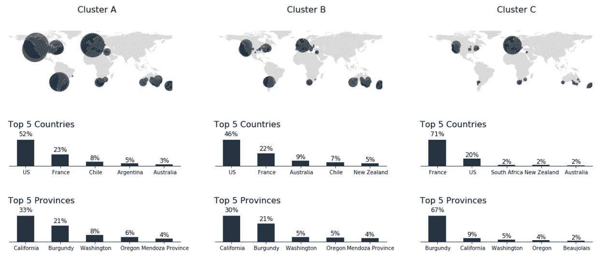

接下来，让我们看看我们的集群在地理分布上的差异。我们可以看到，C 类葡萄酒确实与 A 类和 B 类非常不同。A 类和 B 类主要是美国葡萄酒，而 C 类葡萄酒来自法国。更具体地说，大约三分之二的 C 组葡萄酒是勃艮第白葡萄酒。

另一个观察结果是，澳大利亚葡萄酒集中出现在聚类 B 中(占总数的 9%)，而它们在聚类 A (3%)和聚类 C (2%)中很少出现。

**价格差异**

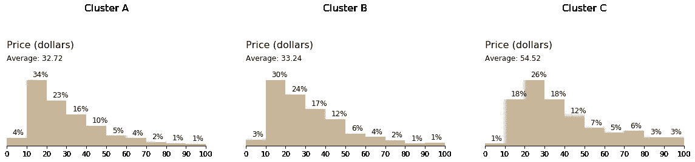

我们还可以计算每个聚类的价格分布。毫不奇怪，聚类 C 包含迄今为止最昂贵的葡萄酒。这里的平均价格是 54.52 美元，比其他集群的平均价格高出 65%。这与勃艮第葡萄酒作为霞多丽葡萄酒的黄金标准的刻板印象是一致的。

**酒精含量差异**

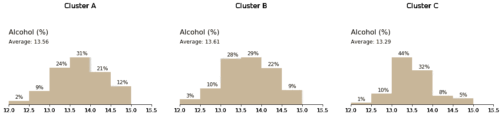

值得一提的最后一个变量是每个集群中葡萄酒的酒精含量。还是那句话，A 群和 B 群的葡萄酒是相似的。然而，C 类葡萄酒的平均酒精含量要低得多。这可能归因于地理位置。众所周知，勃艮第等气候较冷的地方出产酒精含量较低的葡萄酒。

# 综合

检查了我们的三个集群后，我们可以总结每个集群的发现。这也允许我们给它们起一个名字，一个比‘A’、‘B’和‘C’更有启发性的名字。

下面是集群 A 的总结，我们的树果实密集的夏敦埃酒。在左侧，您可以看到按类别分类的最常见描述符的概述。地理概况，年龄和价格在右边。

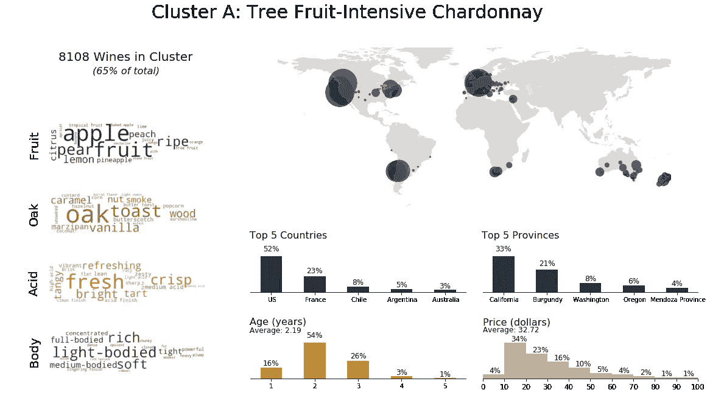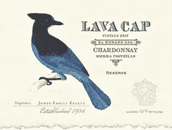

An example of a tree fruit-intensive wine is the 2017 Lava Cap from the Sierra Foothills in California.

聚类 B 在其柑橘类水果描述符方面是独特的。柠檬、酸橙、葡萄柚和橙子的味道使这些葡萄酒与众不同。

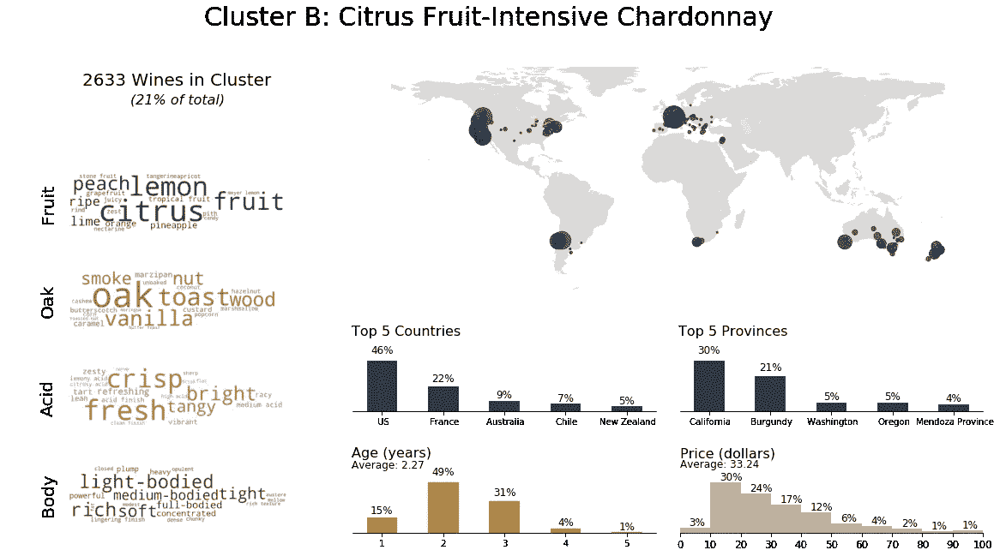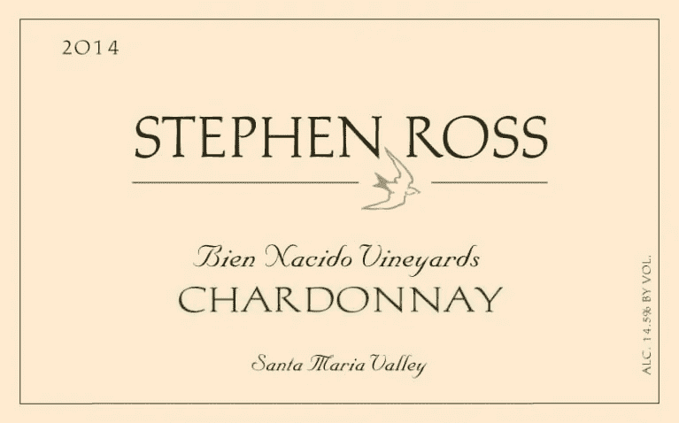

An example of a Cluster B wine is the 2014 Stephen Ross Bien Nacido Vineyards Chardonnay from the Santa Maria Valley.

聚类 C 的标签并不奇怪:白勃艮第。这些葡萄酒因其浓郁、柔和和浓郁的风味而脱颖而出。在我们基于平均轮廓分数的分析中，这是最独特的聚类(在附带的 [Jupyter 笔记本](https://github.com/RoaldSchuring/studying_grape_styles/blob/master/Studying%20Grape%20Variety.ipynb)中有更多关于这一点的信息)。

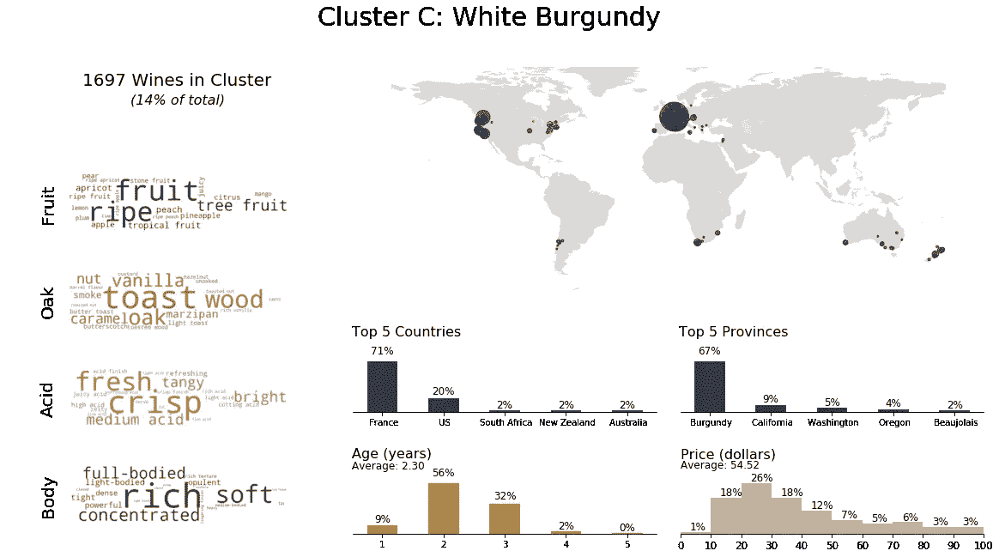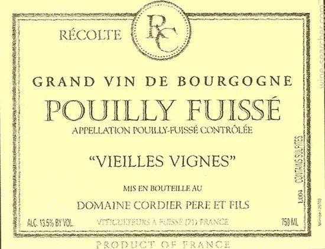

An example of a Cluster C wine is the 2016 Grand Vin de Bourgogne Pouilly Fuisse.

# 结论

在探索不同品种的霞多丽的过程中，我们对这些葡萄酒的风味、地理和价格有了很多了解。这项工作是一个有趣的起点，可以帮助我们了解一个葡萄品种内的变异。令人鼓舞的是，仅使用葡萄酒描述符的无监督聚类任务能够在法国和美国霞多丽之间建立如此强烈的区别。这本身就使得这成为一个有趣的领域进行进一步的分析。