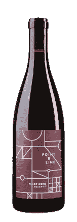
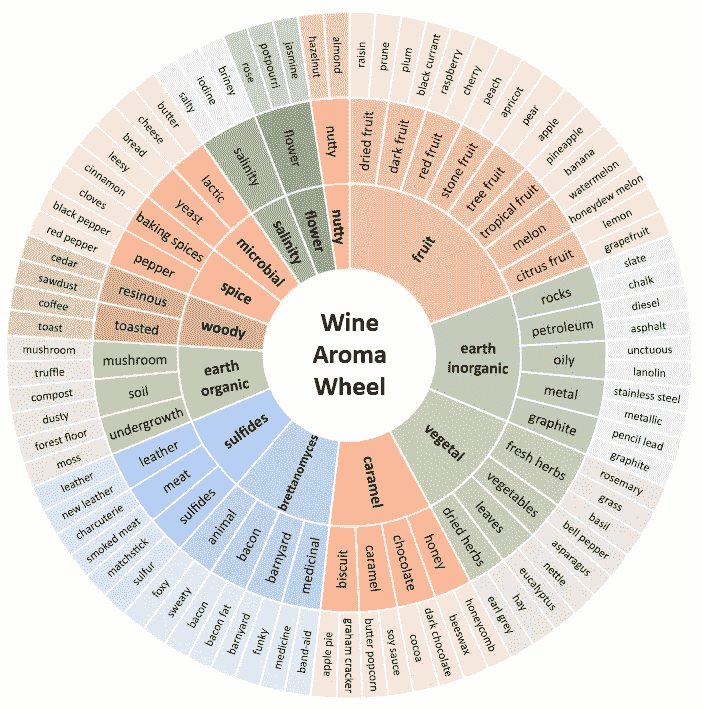
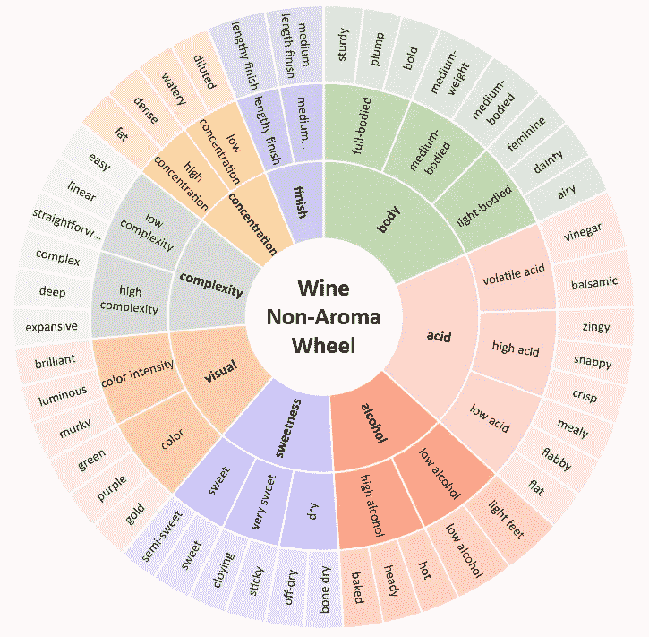

# 葡萄酒嵌入和葡萄酒推荐器

> 原文：<https://towardsdatascience.com/robosomm-chapter-3-wine-embeddings-and-a-wine-recommender-9fc678f1041e?source=collection_archive---------12----------------------->

## 机器人

## 量化 150，000 多种葡萄酒的感官特征，建立葡萄酒推荐模型

RoboSomm 系列前几章的基石之一是从专业葡萄酒评论中提取描述符，并将其转换为定量特征。在本文中，我们将探索一种从葡萄酒评论中提取特征的方法，该方法结合了现有 RoboSomm 系列和关于该主题的学术文献的最佳内容。然后，我们将使用这些特性来生成一个简单的葡萄酒推荐引擎。

包含所有相关代码的 Jupyter 笔记本可以在这个 [Github 库](https://github.com/RoaldSchuring/wine_recommender)中找到。我们的数据集包括大约 180，000 篇专业葡萄酒评论，摘自 [www.winemag](http://www.winemag) .com。这些评论跨越大约 20 年，涵盖几十个国家和数百种葡萄品种。

# 葡萄酒嵌入

在下一节中，我们将通过五个步骤来创建我们的“葡萄酒嵌入”:每种葡萄酒的 300 维向量，总结其感官特征。在途中，我们将解释其他人在类似项目中采取的成功方法。在我们继续之前，让我们挑选一款葡萄酒加入我们的旅程:



Point & Line 2016 John Sebastiano Vineyard Reserve Pinot Noir

***点评:*** *两位在圣巴巴拉餐厅工作多年的商业伙伴将干红花朵和山艾树结合在一起，为这款装瓶带来优雅的芳香。龙蒿和迷人的胡椒味点缀着浓郁的蔓越莓口感，酒体轻盈但结构良好。*

太棒了。是时候开始了。

**步骤 1:标准化葡萄酒评论中的单词(删除停用词、标点符号和词干)**

第一步是规范我们的文本。我们希望从原始文本中删除停用词和任何标点符号。此外，我们将使用词干分析器(Sci-Kit Learn 中的雪球斯特梅尔)来减少词干的屈折变化。皮诺审查变成如下:

*dri 红花山艾树 combin eleg aromat entri bottl 两辆巴士搭档工作圣巴巴拉餐厅场景 mani year 龙蒿 intrigu 胡椒味装饰 tangi cranberi palat light _ bodi veri well structur*

**步骤 2:用短语(双字组和三字组)增强标准化单词集**

接下来，我们要考虑这样一种可能性，即我们想从葡萄酒描述中提取的一些术语实际上是单词或短语的组合。在这里，我们可以使用 gensim 包[短语](https://radimrehurek.com/gensim/models/phrases.html)为整个语料库生成一组二元和三元语法。通过 phraser 运行我们的标准化葡萄酒评论，将“light”和“bodi”等经常出现在“light_bodi”旁边的术语合并在一起:

*dri 红花山艾树 combin eleg aromat entri bottl 两个巴士搭档工作圣巴巴拉餐厅场景 mani_year 龙蒿 intrigu 胡椒味装饰 tangi cranberi palat light _ bodi veri well struct*

**第三步:使用 RoboSomm wine wheels 标准化每次点评中的葡萄酒描述符**

品酒师在语言运用上往往很有创意，有时会用不同的词来描述看似相同的事物。毕竟，“湿石板”、“湿石头”和“湿水泥”的香味难道不是同一种感官体验的真实表现吗？另外，品酒有特定的行话。诸如“烘焙的”、“热的”或“抛光的”等术语在品酒界有特定的含义。

为了标准化葡萄酒行话和创造性的描述符，陈智思等研究人员开发了[计算葡萄酒轮](https://www.researchgate.net/publication/273780770_Wineinformatics_Applying_Data_Mining_on_Wine_Sensory_Reviews_Processed_by_the_Computational_Wine_Wheel)。计算型葡萄酒轮对葡萄酒评论中出现的各种葡萄酒术语进行分类和映射，以创建一组统一的描述符。这项伟大的工作，连同其他人的贡献(例如 [Wine Folly](https://winefolly.com/tutorial/wine-aroma-wheel-100-flavors/) 和 [UC Davis](https://www.winearomawheel.com/) )已经被用来产生**robosom Wine wheels**。这些 wine wheels 是在完成上述步骤 1 和 2 之后，通过查看语料库中最频繁出现的描述符列表而创建的。然后手动检查该列表，并映射到一组标准化的描述符。总之，这导致了 1000 多个“原始”描述符的映射。

第一个 RoboSomm 葡萄酒轮是一个芳香轮，它对各种芳香描述符进行分类:



Wine Aroma Wheel

第二个葡萄酒轮是非香气轮，它考虑了其他特征，如酒体、甜度和酸度。这些描述符通常不包含在品尝轮中，但却是品尝体验的重要组成部分:



Wine Non-Aroma Wheel

我们可以选择在轮盘的三个级别中的任何一个级别标准化葡萄酒术语，或者使用原始描述符本身(没有标准化)。现在，我们将把描述符映射到轮子的外层。对于我们开始处理的黑皮诺审查，我们获得了以下信息:

***干*** *红* ***花荞****combin****雅*** *芳香 entri bottl 两车搭档工作 santa_barbara 餐厅场景 mani_year* ***龙蒿***intri gu**胡椒** *风味装潢*

*请注意，所有已经映射的描述符都以粗体突出显示。在本分析的上下文中，其他术语要么是不提供信息的，要么是模糊的。*

***步骤 4:检索评论中每个映射术语的 Word2Vec 单词嵌入***

*接下来，我们需要考虑如何量化我们的映射描述符集。实现这一点的常用方法(也是 RoboSomm 系列的前几章中使用的方法！)是用 0 或 1 来表示语料库中每个描述符的不存在/存在。然而，这种方法没有考虑术语之间的语义(不)相似性。例如，龙蒿更像山艾树，而不是蔓越莓。为了说明这一点，我们可以创建单词嵌入:单词和短语的向量表示。Els Lefever 等研究人员和她的合著者在他们的工作中采用了类似的方法来量化葡萄酒评论。*

*出于这个项目的目的，我们将使用一种称为 Word2Vec 的技术为每个映射项生成一个 300 维的嵌入。由于葡萄酒行话如此具体，我们必须在一个有代表性的语料库上训练我们的 Word2Vec 模型。好在我们这一套 18 万的酒评正是如此！之前已经使用我们的 wine wheels 映射了我们的描述符，我们已经在一定程度上标准化了语料库中的葡萄酒术语。这样做是为了消除不必要的语义差异(例如，将“湿石头”、“湿石板”和“湿水泥”合并为“湿岩石”)，希望提高我们的 Word2Vec 模型的质量。*

*我们训练的 Word2Vec 模型由语料库中每个术语的 300 维嵌入组成。然而，我们可以回忆起上一步的分析，我们真正关心的只是与葡萄酒感官体验相关的术语。*

**

*对于我们的黑皮诺，这些是:*

****干，花，山艾，优雅，龙蒿，胡椒，扑鼻，蔓越莓，酒体轻盈****

*在相邻的图像中，我们可以看到每个映射描述符的单词嵌入。*

***第五步:用 TF-IDF 权重对葡萄酒评论中嵌入的每个词进行加权，并将嵌入的词加在一起***

*既然我们已经为每个映射的描述符嵌入了一个单词，我们需要考虑如何将它们组合成一个向量。以我们的黑皮诺为例，“干”是所有葡萄酒评论中一个相当常见的描述词。我们想让它的权重小于一个更稀有、更独特的描述符，比如“山艾树”。此外，我们希望考虑每次审查的描述符总数。如果在一篇评论中有 20 个描述符，而在另一篇评论中有 5 个描述符，那么前一篇评论中的每个描述符对葡萄酒整体形象的贡献可能比后一篇评论中的要小。术语频率-逆文档频率(TF-IDF)考虑了这两个因素。TF-IDF 查看单个评论(TF)中包含多少映射描述符，以及每个映射描述符在 180，000 条葡萄酒评论(IDF)中出现的频率。*

*将每个映射描述符向量乘以其 TF-IDF 权重，得到我们的加权映射描述符向量集。然后，我们可以对这些进行求和，以获得每个葡萄酒评论的单个葡萄酒嵌入。对于我们的黑皮诺，这看起来像:*

**

# *构建葡萄酒推荐器*

*现在我们已经有了葡萄酒嵌入，是时候享受一些乐趣了。我们可以做的一件事是生产一个葡萄酒推荐系统。我们可以通过使用最近邻模型来做到这一点，该模型计算各种葡萄酒评论向量之间的余弦距离。彼此最接近的葡萄酒嵌入作为建议返回。*

*让我们看看，当我们插入之前的黑皮诺系列时，我们得到了什么建议。在我们的数据集中，180，000 种可能的葡萄酒中，哪些是作为建议返回的？*

```
***Wine to match: Point & Line 2016 John Sebastiano Vineyard Reserve Pinot Noir (Sta. Rita Hills)**
Descriptors: [dry, flower, sagebrush, elegant, tarragon, pepper, tangy, cranberry, light_bodied]
________________________________________________________________**Suggestion 1**: **Chanin 2014 Bien Nacido Vineyard Pinot Noir** **(Santa Maria Valley)**
Descriptors: [hibiscus, light_bodied, cranberry, dry, rose, white_pepper, light_bodied, pepper, underripe, raspberry, fresh, thyme, oregano, light_bodied, fresh]

**Suggestion 2: Hug 2016 Steiner Creek Pinot Noir (San Luis Obispo County)**
Descriptors: [fresh, raspberry, thyme, pepper, rosemary, sagebrush, dry, sage, mint, forest_floor, light_bodied, cranberry_pomegranate, tangy]

**Suggestion 3: Comartin 2014 Pinot Noir (Santa Cruz Mountains)**
Descriptors: [vibrant, tangy, cranberry, hibiscus, strawberry, pepper, brown_spice, pepper, spice, bay_leaf, thyme, herb, underripe, raspberry, cranberry, fruit]*
```

*返回的前三名葡萄酒都是来自加州的黑皮诺。查看这些葡萄酒的描述符，我们可以看到它们确实与我们的原酒非常相似。蔓越莓出现在每一个建议中。由于构建葡萄酒嵌入的方式，还考虑了*不相同的*术语的语义相似性。比如原酒评中的‘花’字，就和第一条建议中的‘芙蓉’和‘玫瑰’相似。*

**

*如果我们看看我们的黑比诺系列的十大葡萄酒建议(完整名单见[这个 Jupyter 笔记本](https://github.com/RoaldSchuring/wine_recommender/blob/master/creating_wine_review_embeddings.ipynb))，我们可以看到这些建议非常一致。所有十种葡萄酒都来自加利福尼亚，十种中有九种是黑皮诺。有五种甚至产自我们原酒的 60 英里半径范围内。唯一不是黑比诺的葡萄酒是产自圣伊内斯山谷的品丽珠，距离我们的 Point &系列黑比诺的产地只有 25 分钟的车程。我们的黑比诺葡萄酒的地理来源似乎对它的感官特性有很大的影响，这使得它可以与邻近的其他类似的葡萄酒相匹配。相邻的地图显示了我们推荐的葡萄酒在地理上有多集中。*

*这种推荐模型的卓越性能确实引出了一个问题:返回的建议怎么可能如此特定于一个地理区域？*

*就其核心而言，这种分析完全依赖于用来构建葡萄酒嵌入的葡萄酒评论。在[的这篇文章](https://www.winemag.com/2010/04/09/you-asked-how-is-a-wines-score-determined/)中，一位葡萄酒爱好者的品酒师解释了葡萄酒在 www.winemag.com 网站[上是如何评级的。虽然评级是通过盲品过程给出的，但并不完全清楚评论中的文字描述是否也是无偏见评估过程的产物。有可能评论家在看到酒瓶后，会有意识或无意识地将某些术语归因于特定类型的葡萄酒(例如，南加州黑皮诺的“山艾树”)。](http://www.winemag.com)*

*另一方面，这些葡萄酒也完全有可能真正展现出可归因于特定葡萄品种、风土和酿酒风格的感官特征。来自葡萄酒爱好者的专业评论家可能有如此精细的味觉，他们可以在没有看到瓶子的情况下挑出每种葡萄酒的细微差别。*

***用描述词推荐葡萄酒***

*作为最后一个练习，我们可以采取稍微不同的方法来利用我们的葡萄酒推荐者。比方说，我们正在寻找一种具有特定特征的葡萄酒。在炎热的夏天，我们可能会觉得这是一款新鲜、高酸度的葡萄酒，有着柚子、青草和酸橙的香味。让 RoboSomm 葡萄酒车兜一圈，我们可以挑选出符合这些特征的描述词:“新鲜”、“高酸”、“葡萄柚”、“草”和“酸橙”。*

*将这些描述符输入葡萄酒推荐器，我们得到以下建议:*

```
***Suggestion 1 : Undurraga 2011 Sibaris Reserva Especial Sauvignon Blanc (Leyda Valley)**
Descriptors: [minerality, zesty, crisp, grass, lime, grapefruit, lemongrass, angular]

**Suggestion 2 : Santa Rita 2012 Reserva Sauvignon Blanc (Casablanca Valley)**
Descriptors: [snappy, pungent, gooseberry, grapefruit, lime, racy, lime, grapefruit, nettle, pith, bitter]

**Suggestion 3 : Luis Felipe Edwards 2015 Marea Sauvignon Blanc (Leyda Valley)**
Descriptors: [punchy, grass, citrus, tropical_fruit, fruit, angular, fresh, minerality, tangerine, lime, lemon, grapefruit, tangy]*
```

*所有三款推荐的葡萄酒都是智利长相思，其中两款来自莱达山谷。再次值得注意的是，这些建议在地理上是多么的集中。尤其是考虑到葡萄酒推荐者有 18 万种不同的葡萄酒可供选择！*

# *结论*

*我们有很多方法可以使用我们的葡萄酒嵌入。我们简单的葡萄酒推荐模型表明，从地理角度进一步研究葡萄酒风格可能是值得的。风土对酿酒风格有什么影响？对于不同的葡萄品种来说，地理差异是否以同样的方式存在？也许我们还可以了解更多关于写葡萄酒评论的过程，以及偏见在多大程度上推动了某些描述符的使用。*