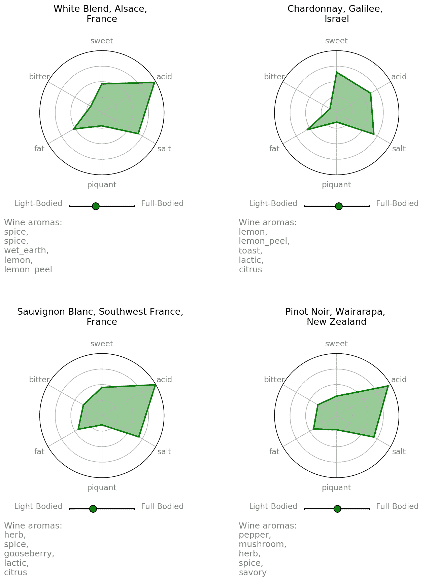

# 食物和葡萄酒搭配

> 原文：<https://towardsdatascience.com/robosomm-chapter-5-food-and-wine-pairing-7a4a4bb08e9e?source=collection_archive---------20----------------------->

## [机器人主持人](https://towardsdatascience.com/tagged/robosomm)

## 使用自然语言处理来解包和匹配食物和酒的特征

葡萄酒和食物的搭配是一种黑暗的艺术。最终成就完美搭配的是葡萄酒和食物中酒体、非香气和香气特征之间的微妙平衡。在本文中，我们将使用数据科学技术和流行的葡萄酒/食物配对理论来构建一个葡萄酒配对引擎。你可以在这里和找到所有相关代码[和](https://github.com/RoaldSchuring/wine_food_pairing/blob/master/Wine%20Food%20Pairing%20Data%20Prep.ipynb)[的 Jupyter 笔记本。](https://github.com/RoaldSchuring/wine_food_pairing/blob/master/Wine%20Food%20Pairings.ipynb)

Chicago-style hot dog

为了陪伴我们踏上这段旅程，我们将带上一位可靠而谦逊的朋友:芝加哥风味的热狗。这是大芝加哥地区每一个运动场所的主要美食，通常都配有一杯塑料杯的淡啤酒。RoboSomm 能不能帮我们选一款葡萄酒，让我们用它来享受呢？

## 提取食物特征

在我们考虑配对之前，我们需要仔细分析热狗的属性。我们如何量化菜肴的非香气和香气特征，以便我们可以根据这些相同的维度来搭配葡萄酒？

我们这里的第一步是训练一个 Word2Vec 模型，为各种不同的食品相关术语生成一个 300 维的单词嵌入。假设我们可以找到一个足够扩展和描述性的文本语料库来训练这个模型，我们将期望这些嵌入能够捕捉到我们食物特征的变化。幸运的是，[亚马逊美食数据集](https://www.kaggle.com/snap/amazon-fine-food-reviews)正是如此:大约 50 万条关于过多食品的评论。

在训练这个模型之后，我们可以计算热狗的嵌入量。我们将把它分解成单独的成分:热狗、番茄、洋葱、泡菜、调味品、芹菜盐、胡椒和芥末。我们将假设满载的热狗是这些成分的单词嵌入的平均值。

Generating normalized non-aroma values for food (illustrated in two dimensions)

为了量化非香味属性，我们将使用经过训练的 Word2Vec 模型来定义非香味(香味、甜味、酸味、咸味、辣味、脂肪和苦味)的嵌入。然后，我们将计算无香味嵌入和一系列示例食品之间的余弦距离，如上面的咸味示例。该距离使用最小最大值定标器在 0 和 1 之间标准化，最小距离是离盐嵌入物最近的食物(培根)，最大距离是离盐嵌入物最远的食物(覆盆子)。上图显示了此过程的简化版本。我们可以看到我们的热狗在咸度表上排名很高，数值为 0.9。

对每一种非香味物质进行这些步骤，我们就能得到热狗的大致风味。最显著的非香味是咸味。还有明显的酸味，可能是由于调味品、泡菜和胡椒的缘故。热狗也很辣，脂肪和浓郁，但苦味和甜味排名较低。

## 为我们的葡萄酒提取香味和非香味

为了创造我们的葡萄酒搭配，我们还需要为不同类型的葡萄酒绘制出有香味的和没有香味的。这一过程与 RoboSomm 系列的前一章中采用的方法非常相似，但有几个关键区别。我们从来自 www.winemag.com[的大约 150，000 篇专业葡萄酒评论中提取信息，并根据语料库中与葡萄酒相关的术语训练一个 Word2Vec 模型。重要的是，我们区分不同类别的术语，标记每个术语是属于香气还是非香气。下面是一个例子。](http://www.winemag.com)

对于每种葡萄酒，我们可以计算每个类别的平均嵌入量(TF-IDF 加权)。在葡萄酒评论不包含所有属性的信息的情况下，我们在我们的数据集中插入所有葡萄酒的非香气平均嵌入量。

接下来，我们根据葡萄品种和次区域对数据集中的所有葡萄酒进行分组(例如，来自美国华盛顿州瓦拉瓦拉谷的霞多丽)。少于 30 个观察值的任何类型的葡萄酒都被丢弃，因为它们不太可能包含足够的信息来准确地模拟所有属性。

为了减少非香气属性的维数，我们应用了具有一个成分的 PCA。由于非香气类别中的描述符是非常一维的(例如，低单宁与高单宁)，我们能够在这一维中捕捉这些属性中的绝大多数变化。产生的标量使用最小最大标量在 0 和 1 之间归一化。

我们留下了一个包含 500 种不同类型葡萄酒的数据集，每种葡萄酒都有一个 300 维的香气向量，一个用于酒体的标量和六个用于其他非香气属性的标量。

## 葡萄酒和食物搭配

现在是有趣的部分。我们的芝加哥风味热狗可以配什么酒？我们需要具体规定如何搭配食物和酒。我们可以使用一个 5 步骤的过程，这个过程受到奇妙的书[葡萄酒愚蠢:万能版:大师指南](https://www.amazon.com/Wine-Folly-Magnum-Master-Guide/dp/0525533893/ref=sr_1_1?crid=3VZ4VYM4ICIMX&keywords=wine+folly+magnum+edition+the+master+guide&qid=1576968335&sprefix=wine+folly%2Caps%2C155&sr=8-1)中列出的葡萄酒配对技巧的启发。

*(一)酒的酒体应该大致与食物的酒体相匹配。*

*(II)排除任何非香气属性与食物中的非香气不协调(不和谐)的葡萄酒。不一致的匹配显示在下面的灰色线条中。*

[Wine Folly flavor pairing chart](https://winefolly.com/tutorial/getting-started-with-food-and-wine-pairing/)

*(III)用一些经验法则排除搭配不好的酒(酒应该比食物更酸，酒应该比食物更甜，苦酒不要和苦食物搭配)。*

*(IV)识别哪些配对是全等的或对比的。一致的搭配具有强烈的非香味，这也可以在食物中找到。对比搭配有强烈的非香味，与食物中的非香味和谐搭配。这些匹配在上图中用蓝线表示。消除任何不一致或对比的配对。*

*(V)根据葡萄酒香气嵌入物与食物嵌入物的接近程度对剩余的葡萄酒进行排序。这确保了食物与具有相似微妙风味的葡萄酒相匹配。*

## 结果

那么，我们的芝加哥风味热狗要喝点什么？RoboSomm 给了我们四点建议:

搭配建议非常多样，从新西兰的黑比诺到加州内陆山谷的霞多丽。所有的搭配都有很好的酸度来匹配调味品、泡菜和胡椒的酸味。夏敦埃酒的油腻反映了食物的油腻。搭配中等至浓郁，与热狗的主体相匹配。推动这种搭配的互补的葡萄酒香气是胡椒、烟和香料；热狗的香肠中体现的味道。

让我们带着机器人再转一圈。一种非常不同的食物怎么样，比如一道美味的开胃菜，有黄瓜、熏鲑鱼、酸奶油和莳萝？

[Smoked Salmon Cucumber Bites](https://www.foodnetwork.com/recipes/ree-drummond/smoked-salmon-cucumber-bites-5502973)

这与我们的热狗有所不同，鲑鱼和酸奶油的脂肪含量更高。由于鱼肉和黄瓜的影响，酒体变得稍淡，但由于酸奶油的存在，酒体仍然适中。

太棒了。我们有几种白葡萄酒可供选择。葡萄酒有大量的酸来补充食物的新鲜度，并且都表现出一些盐份来搭配熏鲑鱼。阿尔萨斯混合白葡萄酒和以色列霞多丽葡萄酒中的柠檬香味与黄瓜和鲑鱼非常相配，而长相思和新西兰比诺葡萄酒中的草药味突出了我们食物中的莳萝。

没有甜点，我们的饭就不完整。让我们看看什么酒可以配一片漂亮的桃子派。

[Lattice-Top Peach Pie](https://www.finecooking.com/recipe/lattice-top-peach-pie)

到目前为止，桃子派与我们测试过的食物相比，具有非常不同的非香味特征，有大量的甜味和脂肪，还有一些来自水果的酸味。

葡萄酒建议是全等的搭配，反映了我们食物的甜味和桃子的酸味。爱达荷雷司令似乎是其浓郁的树果香味和活泼的酸度的绝佳搭配。其他建议也有强烈的甜味，伴随着桃子的香味来反映食物。

## 结论

RoboSomm 能够仅使用基于自然语言的技术产生相当合理的葡萄酒搭配建议。这种产生搭配的新方法很有前途，并为葡萄酒与食物搭配的更多开箱即用方式打开了大门。

现在，让我们为芝加哥风味的热狗举杯(黑皮诺、梅洛或霞多丽)。