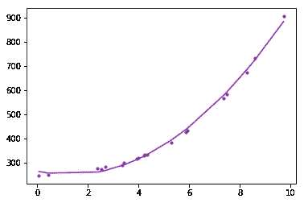
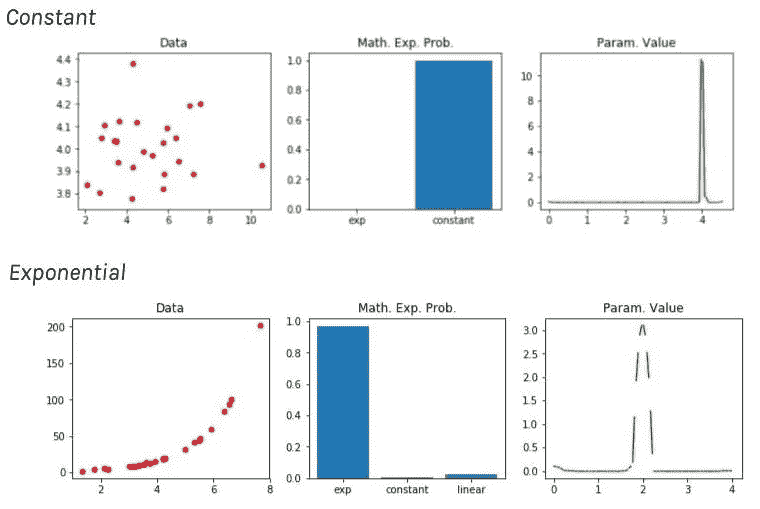
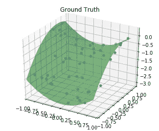
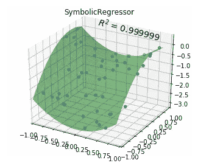

# (机器人)数据科学家即服务

> 原文：<https://towardsdatascience.com/robot-data-scientists-as-a-service-80224f5e928a?source=collection_archive---------7----------------------->

## 用符号回归和概率规划自动化数据科学。

## 如何成为懒惰的(数据)科学家并从此快乐地生活

> 早起的人不会取得进步。它是由懒惰的人试图找到更简单的方法来做某事而制造的。”海因莱茵

答根据[预测机器](https://www.amazon.com/Prediction-Machines-Economics-Artificial-Intelligence/dp/1633695670)的福音，近年来的人工智能革命主要意味着一件事:预测的经济成本正在迅速降低，因为图书馆、云服务和大数据对从业者、初创公司和企业来说变得广泛可用。

> 虽然这个故事作为人工智能采用前景的“大图”当然很有吸引力，但从地面上看，几个行业中应用人工智能/机器学习/数据科学(选择你最喜欢的流行语)的现实是非常不同的。

虽然如今数字数据集确实比以前更容易获得，但现实生活中的用例仍然需要高技能的工作人员利用时间和知识以有意义的方式解释数据模式。以下图表显示了收入数据与云支出的关系:


Revenue data on the y-axis, as a function of cloud expenses on the x-axis (data points are machine generated, but they could easily come from any of our clients or many of our startup peers).

> 如果企业需要提前计划并最终确定预算，准确理解收入和费用之间的关系显然是一个非常重要的话题。怎么才能做到呢？

好吧，一个选择是让你的数据科学家看一看数据并建立一个解释模型；这通常是可行的，但显然这只是企业感兴趣的众多变量中的两个——那些在数据湖中徘徊的我们尚不了解的变量呢？换句话说，数据科学家是伟大的(一个真正无偏的估计！)但它们不一定成规模:在企业内部，即使是制作“探索性分析”也仍然是大量的工作。

第二个选择是去掉所有花哨的东西，只用一个模型来解决所有问题:对于线性回归的人来说，一切看起来都像一个斜坡。这非常方便，并且是市场上几种基于人工智能的解决方案中使用的一种值得尊敬的策略:


“Automated data science” often just means pre-defined models for widgets in your dashboard (excerpt from a real industry white paper).

然而，第二种方法的问题是显而易见的:并不是所有的东西都是直线，这意味着一些“见解”可能是噪音，一些模式将无法被发现；换句话说，一种模式并不*也不*适合所有人。



Revenues vs cloud expenditure again. Not everything is a straight line, as the best fit here is a 2nd degree polynomial — the ROI for our (imaginary) infrastructure scale very well!

> 我们不能做得更好吗？我们认为我们可以:如果我们可以写**一个**程序，然后*写*其他*程序来为我们分析这些变量，会怎么样？*

虽然我们的客户使用的完整解决方案已经超出了这篇文章的范围，但是我们将展示如何结合概率编程和符号回归的思想来构建一个强大的元程序，它将为我们编写有用的代码(你可以在这里运行为这篇文章编写的代码)。

正如[智者](https://en.wikiquote.org/wiki/Arthur_C._Clarke)所说，任何足够先进的技术都无法从[埃隆马斯克的推特](https://twitter.com/elonmusk/status/1051389235406598144?lang=en)中分辨出来。

## 符号回归入门

> " 94.7%的统计数据都是由编造的."—匿名数据科学家

我们将用不超过三分钟的时间用一个简单的例子介绍符号回归之外的直觉(熟悉它的读者——或者只是对讨厌的细节不感兴趣——可以放心地跳到下一节)。

考虑下面的 X-Y 图:


The familiar image of a scatterplot: what is the relation between X and Y?

看着这些数据，我们可以拿出笔和纸，开始对 X 和 Y 之间的关系进行一些合理的猜测(甚至仅仅局限于简单的[多项式选项](https://en.wikipedia.org/wiki/Polynomial_regression)):

```
Y = bX + a (linear)
Y = cX^2 + bX + a (quadratic)
```

我们衡量什么是最好的，并利用我们所学到的*来产生更好的估计:*


Comparing two hypotheses: R-squared is 0.65 and 0.74 respectively.

似乎我们可以尝试更高次的多项式来实现更好的拟合:


R-squared for a third-degree polynomial is 0.99 (it looks like overfitting but we swear it’s not).

这听起来是个合理的策略，不是吗？

> 简而言之，**符号回归**是我们手动做的事情的自动化版本，只有很少的函数和两个“代”。

那就是:

1.  从一系列适合手头数据集的函数开始；
2.  衡量他们做得有多好；
3.  拿那些表现最好的去换，看看你能不能让它们变得更好；
4.  重复 N 代，直到满意。

即使是这个玩具例子，很明显，通过*智能地*探索可能的数学函数空间来拟合数据模式具有有趣的优点:

*   我们不必一开始就指定很多假设，因为过程会进化出越来越好的候选者；
*   结果很容易*解释*(因为我们可以产生诸如“增加 *a* X 将导致增加 *b* Y”的见解)，这意味着新知识可以在所有业务部门之间共享。

作为一个缺点，评估大量的数学表达式可能会很耗时——但这对我们来说不是问题:我们的机器人可以在晚上工作，并在第二天为我们提供预测(这就是机器人的作用，对吗？).

对于我们的目的来说，关键的观察是，在模型表达能力、智能探索和数据拟合之间存在一种基本的权衡:可能解释数据的数学关系空间是无限的——虽然复杂的模型更强大，但它们也容易过度拟合，因此，在简单的模型失败后，应该考虑这些模型。

> 既然关系是用数学的**语言**来表达的，为什么我们不利用形式语法的自然组合性和表达性来导航这种权衡呢(是的，在[也是如此](https://tooso.ai/)我们做[爱语言](/the-meaning-of-life-and-other-nlp-stories-4cbe791ce62a))？

这就是我们将**符号回归**的直觉——自动进化模型以获得更好的解释——与 [**概率编程**](https://probmods.org/exercises/lot-learning.html) 的生成能力相结合的地方。由于模型可以表示为特定领域的语言，我们的回归任务可以被认为是"[贝叶斯程序合成](https://en.wikipedia.org/wiki/Bayesian_Program_Synthesis)"的一个特殊实例:一个通用程序如何编写*特定的*"程序"(即数学表达式)来令人满意地分析看不见的数据集？

在下一节中，我们将构建一种表达函数的最小形式语言，并展示语言结构上的操作如何转化为有效探索数学假设的无限空间的模型(忠实的读者可能还记得，我们以类似的方式解决了在之前的[帖子](/fluid-concepts-and-creative-probabilities-785d3c81610a)中介绍的“序列游戏”)。换句话说，现在是时候建立我们的机器人大军了。

【**加分技术点**:符号回归通常以遗传编程为主要优化技术；一群函数被随机初始化，然后[算法适应度](https://en.wikipedia.org/wiki/Fitness_function)决定群体向非常适合手头问题的表达式进化。我们为*这篇*文章选择了一种概率编程方法，因为它与最近关于概念学习的一些[工作](/fluid-concepts-and-creative-probabilities-785d3c81610a)非常吻合，并且让我们直接在浏览器中分享一些工作代码(彻底的比较超出了*这篇*文章的范围；更多对比和彩色图，见文末附录；在校对文章时，我们还发现了[这种](https://arxiv.org/pdf/1901.07714.pdf)非常新且非常有趣的“神经引导”方法。对遗传编程感兴趣的非懒惰和 Pythonic 读者会发现 [gplearn](https://gplearn.readthedocs.io/en/stable/intro.html) 令人愉快:Jan Krepl 的 [data science-y 教程](https://jankrepl.github.io/symbolic-regression/)是一个很好的起点。]

## 打造一个机器人科学家

> “除了黑艺术，只有自动化和机械化。”洛尔卡

正如我们在上一节中看到的，符号回归的挑战是我们需要考虑的巨大可能性空间，以确保我们在拟合目标数据集方面做得很好。

> 构建我们的机器人科学家的关键直觉是，我们可以在这个无限的假设空间中强加一个熟悉的“语言”结构，并让这一先验知识指导候选模型的自动探索。

我们首先为我们的自动化回归任务创建一种小型语言，从我们可能支持的一些原子操作开始:

```
unary predicates = [log, round, sqrt]
binary predicates = [add, sub, mul, div]
```

假设我们可以选择变量(x *0* ，x *1，* … x *n* )、整数和浮点数作为我们的“名词”， *L* 可以生成如下表达式:

```
add(1, mul(x0, 2.5))
```

完全等同于更熟悉的:

```
Y = X * 2.5 + 1
```


Plotting the familiar mathematical expression “Y = X * 2.5 + 1”

【我们跳过语言生成代码，因为我们在别处讨论了生成语言模型[。从概率编程的角度来看科学问题的概观，从奇妙的](http://www.jacopotagliabue.it/webppl_tutorial.html) [ProbMods 网站](https://probmods.org/)开始。]

由于我们不能直接将一个*先验*置于一组无限的假设之上，我们将利用语言结构来为我们做到这一点。因为生成线性表达式需要较少的(概率)选择:

```
add(1, mul(x0, 2.5))
```

与二次表达式相比:

```
add(add(1, mul(x0, 2.5)), mul(mul(x0, x0), 1.0)))
```

第一种是在观察之前的更可能的假设(即，我们在[奥卡姆剃刀](https://en.wikipedia.org/wiki/Occam%27s_razor)的精神中获得一个优先支持简单性的假设)。

A simple [WebPPL](http://webppl.org/) snippet generating mathematical expressions probabilistically.

我们需要的最后一个细节是如何衡量我们的候选表达式的性能:当然，在数据点之前，线性表达式比二次*更有可能，但是我们通过观察能学到什么呢？由于我们将我们的任务框定为贝叶斯推理，[贝叶斯定理](https://en.wikipedia.org/wiki/Bayes%27_theorem)建议我们需要定义一个*似然函数*，如果潜在假设为真(*后验* ~= *先验+似然*)，它将告诉我们获得数据点的概率。例如，考虑以下三个数据集:*


Three synthetic datasets to test likelihood without informative prior beliefs.

它们是通过向以下函数添加噪声而生成的:

```
f(x) = 4 + 0 * x (constant)
f(x) = x * 2.5 (linear)
f(x) = 2^x (exp)
```

我们可以利用 WebPPL 中的`observe` [模式](https://webppl.readthedocs.io/en/master/inference/conditioning.html?highlight=observe)来[探索](https://gist.github.com/jacopotagliabue/48dfc8203e285bf474f9ff6ae5d1f70b)(没有信息先验)可能性如何影响推理，预先知道生成数据的数学表达式是什么。

A simple [WebPPL](http://webppl.org/) snippet to test the likelihood of some generating functions against synthetic data.

从下面的图表中可以清楚地看出，在只有 25 个数据点的情况下，可能的数学表达式的概率分布非常集中在正确的值上(还要注意，*常数*参数在真实值 *4* 上分布很窄，对于*指数*的例子也是如此)。



Original data (N=25), probability distribution over expressions, parameter estimation for the CONSTANT and EXP example (original data from [WebPPL](http://www.jacopotagliabue.it/symbolic_regression_tutorial.html) exported and re-plotted with Python).

然后，结合(基于语言的)先验和可能性，我们最终的机器人科学家被组装起来(如果你对一个小而粗糙的程序感兴趣，不要忘记运行这里的片段)。

现在让我们看看我们的机器人能做什么。

## 让我们的机器人科学家投入工作

> “人类让我兴奋。”—匿名机器人

现在我们可以创造机器人科学家，是时候看看他们能在一些有趣的数据模式上做些什么了。下面的图表显示了用数学表达式的简单语言构建的数据集(如上所述)，显示了每种情况下的:

*   具有目标数据点的散点图；
*   生成数学表达式(即*真理*)；
*   被机器人科学家选为最有可能解释数据的*的表达式(请注意，在运行代码时，您可能会得到不同但在外延上等价的表达式的几个条目，如`x * 4`和`4 * x`)。*


Four synthetic datasets (left), the underlying generator function (center, in red), and the best candidate according to the robot scientist (right, in blue).

> 结果相当令人鼓舞，因为机器人科学家总是对测试数据集中与 X 和 Y 相关的潜在数学函数做出**非常合理的**猜测。

作为画龙点睛之笔，只需要多几行代码和一些标签，就可以用简单的英语添加一个很好的调查结果摘要，以便下面的数据分析:


From data analysis to an English summary: we report model predictions at different percentiles since the underlying function may be (as in this case) non-linear.

会自动总结为:

```
According to the model '(4 ** x)':

At perc. 0.25, an increase of 1 in cloud expenditure leads to an increase of 735.6 in revenuesAt perc. 0.5, an increase of 1 in cloud expenditure leads to an increase of 9984.8 in revenuesAt perc. 0.75, an increase of 1 in cloud expenditure leads to an increase of 79410.5 in revenues
```

Going from model selection to explanations in plain English is fairly straightforward (original [here](https://drive.google.com/file/d/1maDTU48ylY7Kv8KG7VnaDnxu2iiN6Dpo/view)).

还不错吧。看起来我们的数据科学团队终于可以休息一下，在机器人为他们工作的同时，去享受他们应得的假期了！

当不懒惰的读者更多地摆弄代码片段并发现这些机器人 1.0 版可能出错的各种事情时，我们将回到我们的企业用例，并就如何在现实世界中利用这些工具做一些临别笔记。

## 下一步:跨企业数据扩展预测

> “简单的事实是，当人类和机器作为盟友而不是对手一起工作，以利用彼此的互补优势时，公司可以实现最大的业绩提升。”多赫蒂

让我们回到我们的预测问题:我们有关于云服务如何影响我们公司收入的数据，我们希望从中学习一些有用的东西。


Our X-Y chart: what can we learn from it?

当然，我们可以尝试使用为这个问题设计的机器学习工具*；如果我们相信[深度学习的宣传](/in-praise-of-artificial-stupidity-60c2cdb686cd)，那么在[整合](https://medium.com/thelaunchpad/your-deep-learning-tools-for-enterprises-startup-will-fail-94fb70683834)，对未知数据集的推广和解释方面，这有明显的缺点。我们可以尝试部署内部资源，如数据科学家，但在投资回报时间和机会成本方面会有负面影响。最后，我们可以尝试优先考虑速度，运行一个简单的一刀切模型，牺牲准确性和预测能力。*

> 在这篇文章中，我们概述了一条**非常不同的**路径来应对挑战:通过将统计工具与概率编程相结合，我们获得了一个足够通用的工具来在各种设置中产生*可解释的*和*精确的*模型。我们从自动化人工智能中获得了最佳效果，同时保持了数据科学的良好部分——可解释的结果和建模灵活性。

从科学的角度来看，以上显然只是如何跳出框框思考的初步草图:当从 POC 转向成熟的产品时，一个自然的扩展是在特定于领域的语言中包含[高斯过程](https://en.wikipedia.org/wiki/Gaussian_process)(并且，一般来说，利用我们所知道的关于贝叶斯程序综合的所有好的东西，本着例如优秀的 [萨阿德*等*](https://popl19.sigplan.org/event/popl-2019-research-papers-bayesian-synthesis-of-probabilistic-programs-for-automatic-data-modeling) 的精神)。

就产品而言，我们为价值数十亿美元的公司部署这些解决方案的经验既具有挑战性，也是有益的(正如企业经常做的那样)。他们中的一些人起初持怀疑态度，因为他们被大型云提供商今天作为“自动化人工智能”大力营销的预制解决方案所困扰——事实证明，这些工具除了最简单的问题之外什么也不能解决，仍然需要时间/学习/部署等方面的重要资源..但最终，他们都接受了我们“程序合成”的过程和结果:从自动预测到数据重构，客户喜欢教学机器的“交互式”体验，并通过类似人类的概念与它们合作；结果很容易解释，通过无服务器微服务大规模实现了大规模自动化(关于我们的 WebPPL 无服务器模板，请参见我们的专用[帖子，代码为](/build-smart-er-applications-with-probabilistic-models-and-aws-lambda-functions-da982d69cab1?sk=fba1d20f1fe33c1499f7b2016187e793))。

在 Tooso，我们确实相信近期的人工智能市场属于能够实现人类和机器之间协作的产品，这样各方都可以做自己最擅长的事情:机器可以在数据湖中做定量的跑腿工作，并为进一步分析提供最有希望的路径；人类可以对选定的问题进行高级推理，并向算法提供反馈，以良性循环的方式产生越来越多的见解和数据意识。

总而言之，尽管梦想邪恶的机器人军队很有趣(是的埃隆，[又是你](https://mashable.com/2015/05/12/elon-musk-fears-larry-page/#7VH020n6.mq0))，但未来仍有很多[肯定需要我们](https://www.wired.com/2000/04/joy-2/)。

## 再见，太空牛仔


如果你有问题或反馈，请将你的人工智能故事分享给[jacopo . taglia bue @ tooso . ai](mailto:jacopo.tagliabue@tooso.ai)。

别忘了在领英、[推特](https://twitter.com/tooso_ai)和 [Instagram](https://www.instagram.com/tooso_ai/) 上关注我们。

## 附录:比较回归模型

让我们考虑一个稍微复杂一点的数据集，其中我们的目标变量 Y 在某种程度上依赖于 X 和 Z:



Y depends on both X and Z: what is the exact relation between them (we plotted the “true surface” as a visual aid)?

为了以一种相当直接、非参数化的方式拟合数据，我们从一些经过战斗考验的[决策树回归器](https://scikit-learn.org/stable/modules/generated/sklearn.tree.DecisionTreeRegressor.html)开始:决策树可能不会让你谈 NIPS，但是它们非常健壮，并且在实践中被广泛采用，所以从那里开始是有意义的:


Fitting a decision tree to our dataset: good but not great.

定性的(结果表面的形状，有点“块状”)和定量的(R 平方= 0.84)结果都很好，但并不例外。



Fitting symbolic regression to our dataset: much better!

符号回归产生了更平滑的表面和更好的定量拟合，以及更好的样本外数据预测；此外，系统的输出很容易解释，因为它是一个标准表达式:

```
sub(add(-0.999, X1), mul(sub(X1, X0), add(X0, X1)))
```

那就是:

```
Y = (−0.999 + Z) − ((Z−X) * (X+Z))
```

(关于更长的讨论，请参见来自 [gplearn](https://gplearn.readthedocs.io/en/stable/intro.html) 的[精彩文档](https://gplearn.readthedocs.io/en/stable/examples.html))。