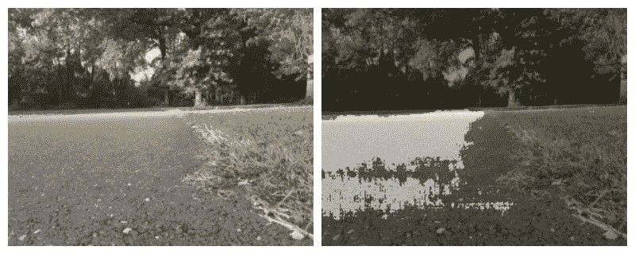
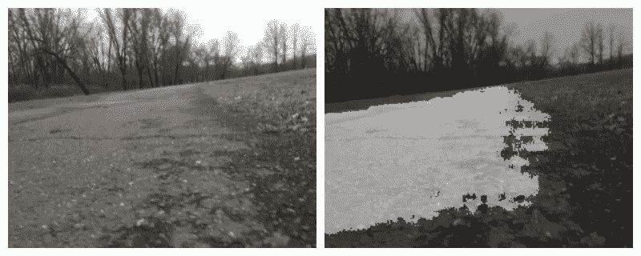
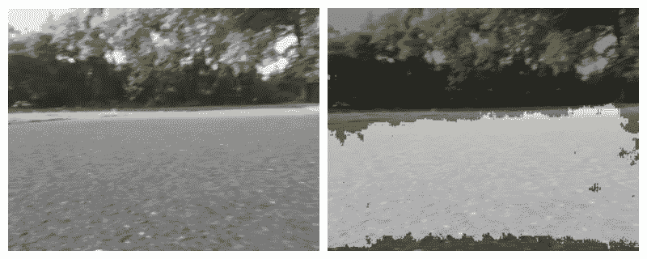
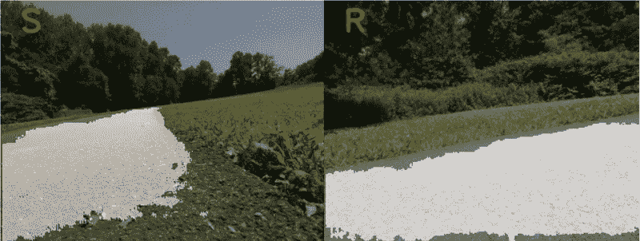

# 基于图像分割的机器人行走路径

> 原文：<https://towardsdatascience.com/robot-following-a-walkway-using-image-segmentation-272bebd93a83?source=collection_archive---------34----------------------->

在我之前的故事中，我正在教一只[覆盆子驱动的机器人坦克](https://medium.com/@const.toporov/raspberry-pi-photo-tank-robot-cf5ca7288adf)自己在人行道上导航。瓶颈是道路识别——我通过 OpenCV 使用了一种简单的颜色过滤方法，结果并不可靠。

一般来说，这是一个图像分割的任务。有一篇[的好文章](/image-segmentation-using-pythons-scikit-image-module-533a61ecc980)描述了最流行的方法。它们很简单，通常不会在现实生活的照片上产生完美的效果。和我基于颜色的实现一样。

为了寻找改进的方法，我决定使用语义分割。神经网络只是在最近才被用于这项任务，但已经展示了令人印象深刻的结果。来自 PyImageSearch 的这篇[很棒的文章给了我灵感，并将我从理论推向了实践。本文介绍了用 E-net 神经网络进行图像分割。](https://www.pyimagesearch.com/2018/09/03/semantic-segmentation-with-opencv-and-deep-learning/)

原来，E 网是比较年轻，不知名的网络。它是基于更著名的 U-net 架构的成功而开发的。

# 优信网

[U-net](https://en.wikipedia.org/wiki/U-Net) 是第一个也是最著名的用于语义分割的神经网络。最初它是为德国的医疗需要而开发的。原始文档在[这里](https://arxiv.org/abs/1505.04597)可用。

人们很快发现这种方法可以用于比 x 光阅读更广泛的用途。有一些关于如何训练和使用 U-net 在城市图像上进行道路分割的文章:

*   [一个](/fastai-image-segmentation-eacad8543f6f)
*   [两个](https://github.com/aschneuw/road-segmentation-unet)
*   [三个](/training-road-scene-segmentation-on-cityscapes-with-supervisely-tensorflow-and-unet-1232314781a8)

有很多有趣的和新的信息，但我正在寻找一个现成的网络来使用我的坦克了。不幸的是，搜索没有很快产生结果。

所以转回到 E-net。

# 电子网络

E-net 是基于 U-net 产生的想法。根据[来源](https://arxiv.org/abs/1606.02147)，它最初是为城市图像分割而设计的。一些开放数据集用于在道路场景上进行训练:

[剑桥街道数据集又名 CamVid](http://mi.eng.cam.ac.uk/research/projects/VideoRec/CamVid/)

[德国和瑞士街道数据集又名城市景观](https://www.cityscapes-dataset.com/)

有一篇关于 E-net 的介绍性文章。

如果有人想深入了解，这里有一份关于如何训练和使用 E-net 网络的详细文件。我认为这是一个强制性的步骤——根据自己的需要和要求定制网络。

但是我太兴奋了，不能马上得到结果，决定使用上面提到的来自 [PyImageSearch](https://www.pyimagesearch.com/2018/09/03/semantic-segmentation-with-opencv-and-deep-learning/) 的现成网络。

# 运行电子网络

到目前为止，我的目标是只识别人行道，而不是网络训练检测的 20 类物体。为此，我用颜色编辑了文件，忽略了除道路以外的所有类。

然后从文件系统中读取模型:

```
def load_segment_model():
    try:
        classes = None
        with open(PiConf.SEGMENT_CLASSES) as f:
            classes = f.read().strip().split("\n")
        colors = None
        with open(PiConf.SEGMENT_COLORS) as f:
            colors= f.read().strip().split("\n")
        colors = [np.array(c.split(",")).astype("int") for c in colors]
        colors = np.array(colors, dtype="uint8")
        print("[INFO] loading model...")
        net = cv2.dnn.readNet(PiConf.SEGMENT_MODEL)
        return net, classes, colors
    except Exception as e:
        logging.exception("Cannot load segment model")
    return None, None, None
```

进行细分:

```
def segment_image(image_path, seg_net, seg_classes, seg_colors): image0 = cv2.imread(image_path)
    image = cv2.resize(image0, (1024, 512), interpolation=cv2.INTER_NEAREST)
    blob = cv2.dnn.blobFromImage(image, 1 / 255.0, (1024, 512), 0, swapRB=True, crop=False) seg_net.setInput(blob)
    start = time.time()
    output = seg_net.forward()
    end = time.time() print("[INFO] inference took {:.4f} seconds".format(end - start)) (numClasses, height, width) = output.shape[1:4] classMap = np.argmax(output[0], axis=0) mask = seg_colors[classMap] mask = cv2.resize(mask, (image0.shape[1], image0.shape[0]), interpolation=cv2.INTER_NEAREST)
    classMap = cv2.resize(classMap, (image0.shape[1], image0.shape[0]), interpolation=cv2.INTER_NEAREST) gmask = cv2.cvtColor(mask, cv2.COLOR_BGR2GRAY)
    gmask = cv2.resize(gmask, (128, 64), interpolation=cv2.INTER_NEAREST)
    gmask = gmask[0:64,32:96] output = ((0.6 * image0) + (0.4 * mask)).astype("uint8")       
    return output, gmask
```

第一个问题出现在代码中，它是输入图像的尺寸。该网络在相当大的 1024x512 图像上进行训练。为了节省处理资源，我的树莓相机设置为 320x240。

# 分段测试

代码移植后，是时候处理坦克已经在人行道上拍摄的照片了。

## 首次测试



只能认出走道的左边部分。

缩小图片并将其中心切割为 64x64(此遮罩由[另一个神经网络](https://github.com/tprlab/pitanq-selfwalk/)决定方向)。


方向网络(它是一个 3 级分类器)命令向左行驶。不是最好的决定，但可以忍受。

## 第二次测试



类似的情况，右下角又不识别了。大概是湿漉漉的表面把网络搞糊涂了。但是道路的最大部分被正确识别。面具看起来很一致:


而方向网决定往前走。

## 第三次测试



这是一个失败的状态——机器人位于人行道中间，需要向右走。

这条路几乎完全被认出来了。


方向分类器命令向右。就是这样。

因此，道路识别的结果要比旧实现中简单的颜色过滤好得多。让我们在真正的坦克上运行它。

# 在覆盆子馅饼上奔跑

不幸的是，注意到的输入图像大小立刻引起了问题。覆盆子太慢了，无法处理这么大的图像。一次分割大约需要 6 秒钟，这对于实时车辆来说是不可接受的。神经网络工作得很好，但当它工作时，坦克偏离了道路。

所以唯一的解决方案是用更小的图片来训练我自己的电子网络。

此外，使用外部电源进行分割也可能是一个好主意，例如英特尔神经计算机棒或类似产品。

最后一幅图表明，即使是道路决策也是有效的，因为它们做得太晚了。



# 链接

*   [之前尝试在人行道上驾驶——基于颜色的分割](/robot-following-a-walkway-with-opencv-and-tensorflow-a631eb72cb8c)
*   [git hub 上带有 E-net 分段的坦克固件](https://github.com/tprlab/pitanq/tree/segmentation)
*   [PyImageSearch 促使我迈出这一步的文章](https://www.pyimagesearch.com/2018/09/03/semantic-segmentation-with-opencv-and-deep-learning/)
*   [如何训练自己的 E-net 实现指南](https://github.com/TimoSaemann/ENet/tree/master/Tutorial)
*   [您可以获取更多信息并购买坦克自制套件的坦克基地](http://pitanq.com)