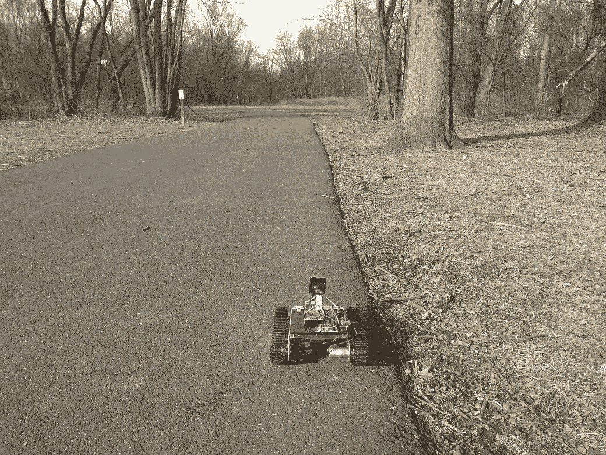
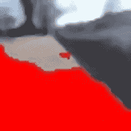
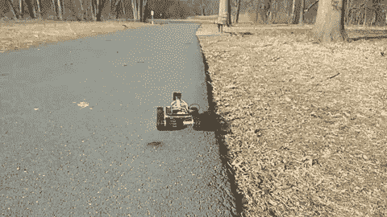

# 基于 OpenCV 和 Tensorflow 的机器人行走

> 原文：<https://towardsdatascience.com/robot-following-a-walkway-with-opencv-and-tensorflow-a631eb72cb8c?source=collection_archive---------13----------------------->

## 如何用树莓 Pi，计算机视觉，卷积神经网络制作自动驾驶机器人？

在[我的机器人](https://medium.com/@const.toporov/raspberry-pi-photo-tank-robot-cf5ca7288adf)学会了[如何跟随一条线](https://medium.com/@const.toporov/line-following-robot-with-opencv-and-contour-based-approach-417b90f2c298)之后，一个新的挑战出现了。我决定走到户外，让机器人沿着人行道移动。如果机器人像狗一样跟着主人穿过公园就好了。

行为克隆给出了实现思路。当人工智能学习提供的行为输入和输出，然后对新的输入做出决定时，这是自动驾驶汽车非常受欢迎的方法。有一篇来自 Nvidia 的文章[介绍了这种方法。](https://devblogs.nvidia.com/deep-learning-self-driving-cars/)

许多好文章都在描述这种想法:

*   [一个](https://medium.com/@ksakmann/behavioral-cloning-make-a-car-drive-like-yourself-dc6021152713)
*   [两个](https://medium.com/deep-learning-turkey/behavioral-cloning-udacity-self-driving-car-project-generator-bottleneck-problem-in-using-gpu-182ee407dbc5)
*   [三个](/implementing-neural-network-used-for-self-driving-cars-from-nvidia-with-interactive-code-manual-aa6780bc70f4)

更令人兴奋的实现是在现实生活中。最好的例子就是 [DonkeyCar](http://www.donkeycar.com/) 和它的[神经网络](https://wroscoe.github.io/keras-lane-following-autopilot.html)。

不幸的是，一种天真的方法——在彩色照片上训练神经网络——没有成功。秋天的公园照片大多是灰色的，所以对调整大小和模糊的照片进行训练的神经网络没有提供可靠的结果。



为了简化人工智能的任务，我决定用计算机视觉技术对图像进行预处理。OpenCV 库有许多功能，当我需要检测地板上的白线时，它工作得很好。

这项任务结果并不容易。照片大部分是灰色的，主要问题是“哪种灰色是走道的颜色”。观察发现，人行道就像“完美的灰色”——其 RGB 值之间的差异极小。

亮度是另一个标准。很难自动确定走道的亮度，所以第一张图片用于调整颜色参数。然后根据参数进行颜色过滤，我们得到了一个带有人行道轮廓的蒙版。

轮廓的形状不精确，并且取决于颜色过滤参数。



下一步是根据走道遮罩做出决定(直走还是左转/右转)。分类的总体思路是查看人行道的右侧边缘:如果边缘更靠左，那么我们需要向左转向。如果没有边缘——向右转向。如果边缘从右下角以一个适中的角度向上——什么也不做，只是开车。

考虑到模糊的斑点形状，仅使用几何图形很难识别边缘特征。然后我依靠神经网络来寻找模式。所以我把走道面具放在三个不同的文件夹里，并在上面训练 NN。

左、右和直遮罩的示例:


从机器学习的角度来说，这是一个具有三类的图像分类任务。灰度图像是理想的输入数据，因此即使是最简单的卷积网络也能显示出出色的结果。我用 Keras over Tensorflow 来教网。

```
model = Sequential()activation = "relu"model.add(Conv2D(20, 5, padding="same", input_shape=input_shape))
    model.add(Activation(activation))
    model.add(MaxPooling2D(pool_size=(2, 2), strides=(2, 2)))model.add(Conv2D(50, 5, padding="same"))
    model.add(Activation(activation))
    model.add(MaxPooling2D(pool_size=(2, 2), strides=(2, 2)))model.add(Flatten())
    model.add(Dense(500))
    model.add(Activation(activation))model.add(Dense(cls_n))opt = SGD(lr=0.01)model.add(Activation("softmax"))model.compile(loss="categorical_crossentropy", optimizer=opt,       metrics=["accuracy"])
```

下一个挑战是在 Raspberry Pi 上运行一切。

我用的是旧 Tensorflow 的 Raspbian 8 Jessie，由 [Sam Abrahams](https://github.com/samjabrahams/tensorflow-on-raspberry-pi) 和 OpenCV 3.4 构建(我必须自己构建)。该版本的 Tensorflow 相当旧，无法与 Keras 模型一起工作。

好在最近 Google 支持了 Tensorflow 的 Raspberry Pi，但是需要 Raspbian 9 Stretch 和 python 3。所以我不得不把所有的机器人固件都移植到新的平台上。OpenCV 也是在那一年开发的，我必须构建 OpenCV 4.0。

把一切放在一起——机器人正在公园里散步。



# 结论

最难的是认路。没有台词使这项任务变得困难。识别参数必须根据光线和当地条件进行调整。但是灰度掩模是完美的材料，即使是简单的 CNN 也能得到可预测的结果。

# 链接

[GitHub repo 与 python 上的完整坦克固件](https://github.com/tprlab/pitanq)

[神经网络的数据和代码](https://github.com/tprlab/pitanq-selfwalk)

[为 Raspbian 预建 OpenCV deb 包](https://github.com/tprlab/pi-opencv)

[油箱装配说明](https://github.com/tprlab/pitanq-prod)

[关于坦克的更多信息](http://pitanq.com)