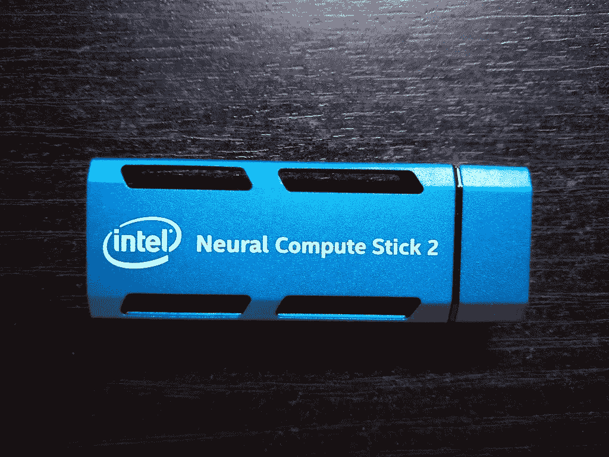
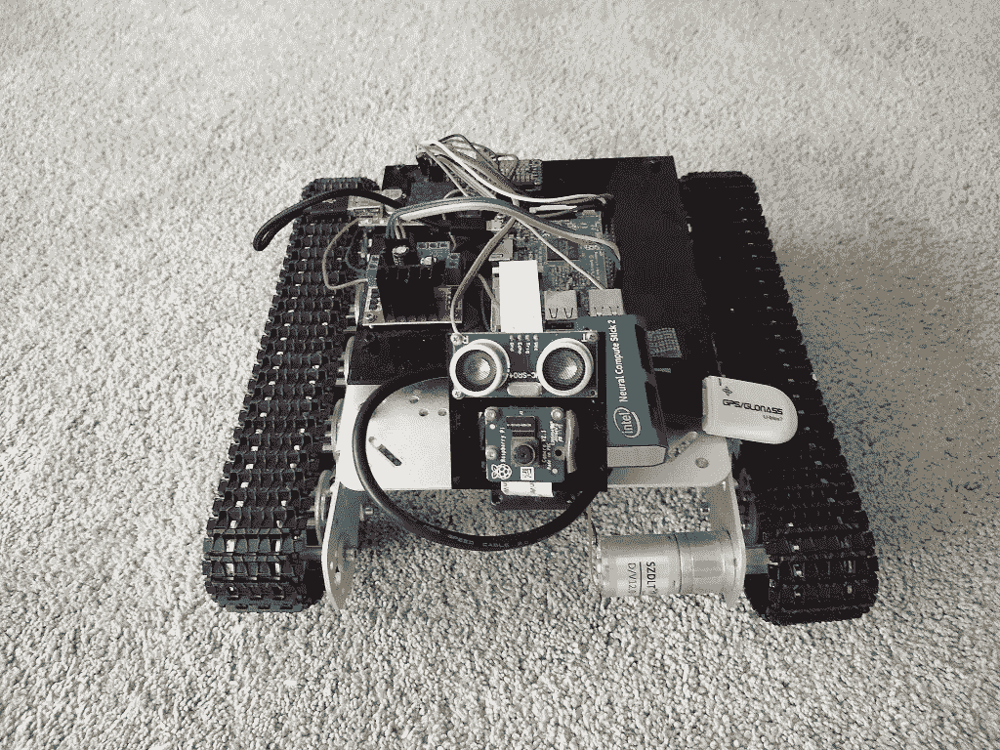
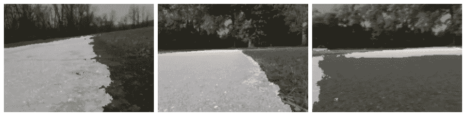
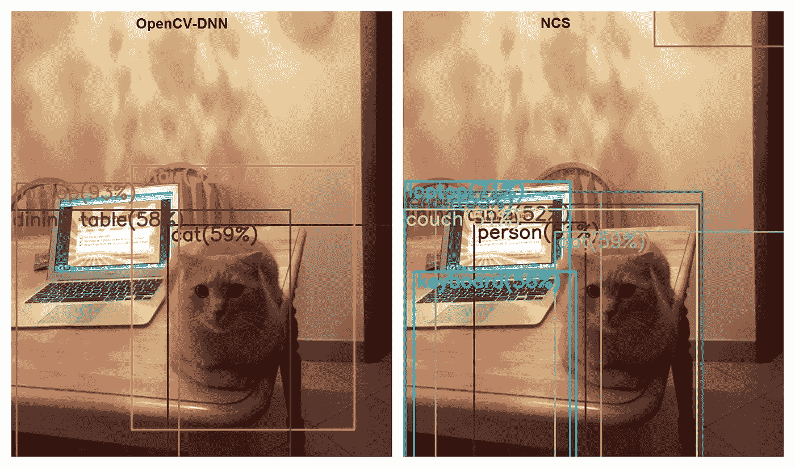

# 机器人坦克与树莓派和英特尔神经计算机棒 2

> 原文：<https://towardsdatascience.com/robot-tank-with-raspberry-pi-and-intel-neural-computer-stick-2-77263ca7a1c7?source=collection_archive---------18----------------------->

在[我之前的文章](/robot-following-a-walkway-using-image-segmentation-272bebd93a83)中，我通过 OpenCV-DNN 和 [Enet](https://github.com/e-lab/ENet-training) 做了一个道路图像分割。

这个实验因为性能而失败:分割过程对 Raspberry 来说太重了。

有两种方法可以解决这个问题:

*   教 Enet 将更小的图片，希望它会更快
*   在一些硬件上运行神经网络的分段

第二个想法似乎更有趣，在我得到英特尔神经计算机棒 2 的几天后。



它相当大，不容易将模块放入机器人布局中。

由于大小，它不适合树莓较低的 USB 插槽。考虑到左边的插槽在相机支架后面，因此不可用，唯一的方法是将 NCS 插入右上角的插槽。GPS 模块已经在那里，所以它用一根电缆延长，并移动到右下方的插槽。



# 英特尔 NCS

英特尔最近发布了他们的神经计算棒的第二个版本，新的 API 被证明与上一个版本不兼容。

新的 API 叫做 Open Vino，包括 OpenCV 和一些神经网络工具。

有一些关于 NCS2 和 Open Vino 框架的介绍性文章:

*   [英特尔](https://software.intel.com/en-us/articles/run-intel-openvino-models-on-intel-neural-compute-stick-2)
*   [走向数据科学 I](/turning-a-raspberry-pi-3b-into-an-object-recognition-server-with-intel-movidius-ncs2-8dcfebebb2d6)
*   [走向数据科学 II](/speed-up-predictions-on-low-power-devices-using-neural-compute-stick-and-openvino-98f3ae9dcf41)
*   [PyImageSearch](https://www.pyimagesearch.com/2019/04/08/openvino-opencv-and-movidius-ncs-on-the-raspberry-pi)

开始与 NCS 合作很容易。英特尔支持 Raspbian [开箱即用](https://docs.openvinotoolkit.org/latest/_docs_install_guides_installing_openvino_raspbian.html)，所以安装没有问题。

结果是 NCS 只支持它自己的神经网络格式。Open Vino 包含一个工具模型优化器来转换一些格式。一些支持的选项有— Caffe、Tensorflow、PyTorch 等。

此外，英特尔还在一个专门的[模型动物园](https://software.intel.com/en-us/openvino-toolkit/documentation/pretrained-models)中为不同的应用提供了一组预训练模型。

语义分割有两种模型:

*   [对于路边物体非常简单](https://docs.openvinotoolkit.org/latest/_intel_models_road_segmentation_adas_0001_description_road_segmentation_adas_0001.html)
*   [多级进阶](https://docs.openvinotoolkit.org/latest/_intel_models_semantic_segmentation_adas_0001_description_semantic_segmentation_adas_0001.html)

不幸的是，高级模型[无法](https://docs.openvinotoolkit.org/latest/_demos_README.html)在 NCS 上运行。

# 网络控制系统中的神经网络

在 NCS 上运行神经网络推理有几个步骤。

## 初始化设备

设备名“MYRIAD”，单词“plugin”和加载库的路径——看起来像是旧时代的产物。

```
from openvino.inference_engine import IENetwork, IEPlugin ncs_plugin = IEPlugin(device="MYRIAD", plugin_dirs = "/opt/intel/openvino/inference_engine/lib/armv7l")
```

## 负载模型

然后我们需要将神经网络模型加载到设备中。

这是一项繁重的工作。我使用的小模型加载时间大约为 15 秒。

好消息是只需要做一次。

```
model = IENetwork(model=xml_path, weights=bin_path)         
net = ncs_plugin.load(network=model)
```

## 运行推理

然后我们可以进行推理，得到一个输出张量。

```
input_blob = next(iter(model.inputs))     
out_blob = next(iter(model.outputs))     
n, c, h, w = model.inputs[input_blob].shape     
images = np.ndarray(shape=(n, c, h, w))     
images[0] = image     
res = net.infer(inputs={input_blob: images})     
res = res[out_blob]
```

## 单一过程问题

突然间，使用来自两个不同过程的 NCS 变得不可能了。

模型加载会产生错误:

```
E: [ncAPI] [    684447] resetAll:348     Failed to connect to stalled device, rc: X_LINK_ERROR 
E: [ncAPI] [    691700] ncDeviceOpen:672        Failed to find suitable device, rc: X_LINK_DEVICE_NOT_FOUND 
Traceback (most recent call last):     
net = ncs_plugin.load(network=model)   
File "ie_api.pyx", line 395, in openvino.inference_engine.ie_api.IEPlugin.load   
File "ie_api.pyx", line 406, in openvino.inference_engine.ie_api.IEPlugin.load 
RuntimeError: Can not init USB device: NC_ERROR
```

在[英特尔支持论坛](https://software.intel.com/en-us/forums/computer-vision/topic/815657)搜索发现了类似的问题。该主题引用了[文档](https://docs.openvinotoolkit.org/2019_R1.1/_docs_IE_DG_supported_plugins_MYRIAD.html#supported_configuration_parameters)，其中明确指出:

> 单个设备不能跨多个进程共享。

# 基于开放 Vino 的图像分割

Open Vino 已经包含了一个现成的语义分割和样本模型。

这个模型的效果不如 Enet 的好，但也不差。



反正 Enet 的这个实现是老 Torch 格式的，Open Vino Model Optimizer 不支持。

对了，开 Vino 模型不开——还有人[问](https://software.intel.com/en-us/forums/computer-vision/topic/796812)，不过建议用一个[类似 PyTorch](https://github.com/warmspringwinds/pytorch-segmentation-detection/tree/master/pytorch_segmentation_detection/models) 的模型和调音。

性能比赛:NCS+open vino segmentation vs Raspberry+Enet NCS 以极大优势获胜:0.8 秒 vs 6。

## 方向决策

坦克(又名 PiTanq)使用图像分类器来决定走哪条路:左，右或直。详情见[专用文章](https://habr.com/ru/post/439928/)。

分类网络已经用 Keras 进行了训练，并且用 Tensorflow 处理 Raspberry 有一个针对 Keras 格式的适配器)。

该模型非常简单，即使在 Raspberry 上也显示出良好的性能:每张图像 0.35 秒。

但是，有了 NCS，我们可以期待一些性能提升。所以，我们需要在 NCS 上运行一个 Keras 模型。Open Vino 支持很多不同的 NN 格式，有 Tensorflow，但是没有 Keras。

将 Keras 转换为 TF 是一项常见的任务，并且有许多可用的资源。我用了[这本指南](https://medium.com/@chengweizhang2012/how-to-convert-trained-keras-model-to-a-single-tensorflow-pb-file-and-make-prediction-4f7337fc96af)。

同一作者[还有另一篇文章](https://medium.com/swlh/how-to-run-keras-model-inference-x3-times-faster-with-cpu-and-intel-openvino-85aa10099d27)讲述了如何在 NCS 上运行 Keras 的所有步骤。

此外，英特尔还为此案例提供了[文档](https://docs.openvinotoolkit.org/latest/_docs_MO_DG_prepare_model_convert_model_Convert_Model_From_TensorFlow.html)。

最后，我得到了基于所有来源的代码:

```
import tensorflow as tf
from tensorflow.python.framework.graph_util import convert_variables_to_constantsfrom keras import backend as K
from keras.models import load_model
from keras.models import model_from_jsondef load_keras_model(json_file, model_file):
    jf = open(json_file, 'r')
    loaded_model_json = jf.read()
    jf.close()
    loaded_model = model_from_json(loaded_model_json)
    loaded_model.load_weights(model_file)
    return loaded_modeldef freeze_session(session, keep_var_names=None, output_names=None,     clear_devices=True):
    graph = session.graph
    with graph.as_default():
        freeze_var_names = list(set(v.op.name for v in tf.global_variables()).difference(keep_var_names or []))
        output_names = output_names or []
        output_names += [v.op.name for v in tf.global_variables()]
        input_graph_def = graph.as_graph_def()
        if clear_devices:
            for node in input_graph_def.node:
                node.device = ""
        frozen_graph = convert_variables_to_constants(session,    input_graph_def, output_names, freeze_var_names)
        return frozen_graphmodel = load_keras_model('./model.json', './model.h5')
frozen_graph = freeze_session(K.get_session(),
                              output_names=[out.op.name for out in model.outputs])tf.train.write_graph(frozen_graph, ".", "ktf_model.pb", as_text=False)
```

同样的代码在 [GitHub](https://github.com/tprlab/pitanq-selfwalk/blob/master/keras2tf.py) 上也有。

现在我们有了一个 TF 模型，然后通过模型优化器将其转换为 Open Vino:

```
python mo_tf.py --input_model "model/ktf_model.pb" --log_level=DEBUG -b1 --data_type FP16
```

基准测试显示了显著的差异:每幅图像 0.007 秒(而不是 0.35 秒)。

所有车型(Keras，TF，Open Vino)都在 [GitHub 上。](https://github.com/tprlab/pitanq-%0Aselfwalk/blob/master/model)

## 物体检测

物体探测任务是机器人的另一个特点。它是用 OpenCV-DNN 和移动 SSD 模型实现的。

[英特尔模型动物园](https://software.intel.com/en-us/openvino-toolkit/documentation/pretrained-models)包含许多基于移动 SSD 的窄特异性检测器，但整个模型缺失。

但在[兼容 Tensorflow 模型列表](https://docs.openvinotoolkit.org/latest/_docs_MO_DG_prepare_model_convert_model_Convert_Model_From_TensorFlow.html)中有提及。

利用之前网络转换的经验我们生成 MobileSSD 2018_01_28 的开放 Vino 模型。

有趣的是，如果你试图用 OpenCV-DNN 打开这个版本的 MobileSSD，它会失败:

```
cv2.error: OpenCV(4.1.0-openvino) /home/jenkins/workspace/OpenCV/OpenVINO/build/opencv/modules/dnn/src/tensorflow/tf_importer.cpp:530:  error: (-2:Unspecified error) Const input blob for weights not found in function 'getConstBlob'
```

但是当我们尝试转换 OpenCV 兼容版本 MobileSSD-11_06_2017 时，转换也失败:

```
[E0919 main.py:317] Unexpected exception happened during extracting attributes for node FeatureExtractor/MobilenetV1/Conv2d_13_pointwise_1_Conv2d_2_1x1_256/Relu6\. Original exception message: operands could not be broadcast together with remapped shapes [original->remapped]: (0,) and  requested shape (1,0,10,256)
```

到目前为止，如果我们想同时使用开放 Vino 和 OpenCV-DNN 方法，我们需要两个不同版本的 MobileSSD。

Open Vino 赢得基准:0.1 秒对 1.7 秒。

MobileSSD 的新版本看起来不如以前的版本稳定:



## 图像分类

PiTanq 的另一个能力是用 Imagenet 上的 Tensorflow 和 Inception 对图像进行分类。

坦克在《盗梦空间》中使用了一个相当老的版本——2015 年 12 月 5 日。从那时起有足够的时间，现在《盗梦空间》有四个版本！

好消息是它们都是由 Open Vino 支持的。

上图中的旧版本指标是:

*   笔记本电脑，笔记本电脑 62%
*   笔记本电脑，笔记本电脑 11%
*   13 秒
*   猫在哪里？

在 NCS 上运行分类器:

*   笔记本电脑，笔记本电脑 85%
*   笔记本电脑，笔记本电脑 8%
*   0.2 秒
*   还是没有猫

## 结论

所有使用 Tensorflow 和 OpenCV-DNN 的神经网络的场景都被 NCS 取代。

这意味着 Tensorflow 可以退出董事会了。说实话，这个框架对树莓来说太重了。

NCS 的性能允许更广泛地使用神经网络。例如，利用实时对象检测来流式传输视频，或者应用实例分割。

单进程的限制是有限的，但是有一种方法可以通过一个专用的服务来包装 NCS。

## 链接

*   [英特尔推出开放式 Vino】](https://software.intel.com/en-us/articles/run-intel-openvino-models-on-intel-neural-compute-stick-2)
*   [打开 Raspbian 的 Vino 安装指南](https://docs.openvinotoolkit.org/latest/_docs_install_guides_installing_openvino_raspbian.html)
*   [开维诺模型动物园](https://software.intel.com/en-us/openvino-toolkit/documentation/pretrained-models)
*   [下载开放葡萄酒模型的资源](https://download.01.org/opencv/2019/open_model_zoo/)
*   [支持 NCS 的 PiTanq 固件](https://github.com/tprlab/pitanq/tree/ncs)
*   [PiTanq 主页](http://pitanq.com)