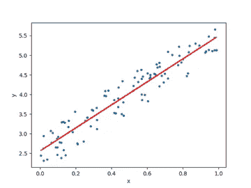
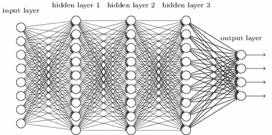
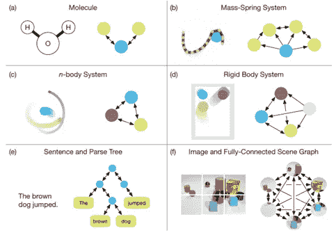
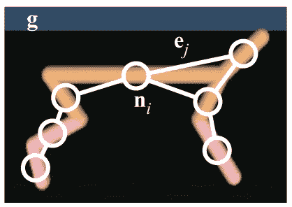
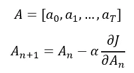

# 基于图网络的机器人控制

> 原文：<https://towardsdatascience.com/robotic-control-with-graph-networks-f1b8d22b8c86?source=collection_archive---------8----------------------->

## [内部 AI](https://medium.com/towards-data-science/inside-ai/home)

## 利用关系归纳偏差提高概括和控制

[source](https://techstory.in/wp-content/uploads/2018/07/the-boston-dynamics-spotmini-the-former-alphabet-unit-s-first-commercial-robot__714707_.jpg)

正如任何对技术感兴趣的人无疑都知道的那样，机器学习正在帮助改变不同行业的许多领域。在过去的几年里，由于深度学习算法，计算机视觉和自然语言处理等事情发生了巨大的变化，这种变化的影响正在渗透到我们的日常生活中。人工智能预计将带来巨大变化的领域之一是机器人领域。几十年前，科幻作家设想由人工智能驱动的机器人与人类社会互动，或者帮助解决人类的问题，或者试图毁灭人类。我们的现实与此相去甚远，我们今天明白，创造智能机器人是一个比当年预想的更艰巨的挑战。机器人必须感知世界并理解它们的环境，它们必须思考它们的目标和如何实现它们，并使用它们的驱动装置执行它们的计划。

当我们人类想到从桌子上拿起一杯水时，我们可能会对我们的手行进的轨迹有一个大致的想法，但为了实际做到这一点，我们的大脑需要通过神经系统发送一个非常长而复杂的电信号序列，以引起肌肉的正确收缩。我们的感觉系统观察这些电信号的影响(我们看到我们的手是如何移动的)，我们的大脑使用这种反馈来补偿误算。这个过程被称为**反馈控制**，是机器人设计师和机器人研究人员面临的挑战之一。我们的机器人不仅需要计划它的手臂应该如何在空间中移动以抓住一个物体，它还必须指定需要施加到它的马达上的电压，以便实现适当的扭矩和力，并完成目标。

反馈控制是一个广阔的领域，具有非常丰富的理论，在我们生活的几乎每个方面都有许多应用。电梯、汽车、飞机、卫星和无数其他日常物体依靠控制算法来调节其内部操作的某些方面。控制理论为控制工程师提供了为许多关键系统设计稳定可靠的控制算法的工具，而这些方法通常依赖于对我们系统的潜在动态的深刻理解。

在设计稳定飞机的控制系统及其自动驾驶软件时，工程师们非常依赖于几十年来在飞机动力学方面的研究和经验。飞机如何对其操纵面角度的变化作出反应是一个相对容易理解的过程，这在试图找出如何控制这样一个系统时提供了很大的好处。

[source](https://static2.therichestimages.com/wordpress/wp-content/uploads/2015/05/b2-spirit-stealth-bomber-wallpaper52413.jpg)

不幸的是，并不是所有的系统都被理解到这种程度的细节，而且获得这种知识的过程通常是非常漫长的，需要多年的研究和实验。随着技术的进步，我们构建的系统的复杂性也在增加，这给控制工程师带来了许多挑战。

在这个机器学习的时代，一个直接的方法当然是从实验期间收集的数据中学习动力学模型。例如，我们可以想到一个带有简单抓钳的机械臂。手臂的状态由每个关节的角度和角速度组成，我们可以采取的行动是关节内每个电机的电压。这些电压会影响机械臂的状态，我们可以将其视为一个函数:

这意味着我们的动力学可以被认为是一个将状态-动作映射到状态的函数，通过学习，我们可以使用类似神经网络的模型来近似它:

其中θ代表我们神经网络的参数。这一过程也经常在基于**模型的强化学习**算法中完成，在该算法中，学习到的动态模型用于加速学习策略的过程。令人失望的是，这经常失败，并且除了使用前瞻时出现的复合误差现象之外，学习的模型倾向于很差地概括到它以前没有见过的状态。学习模型不能很好地推广的原因之一是因为许多神经网络架构非常**一般函数逼近器**，因此推广到看不见的现象的能力有限。

**神经网络和感应偏置**

让我们用一个简单的例子来形象化这一点。假设我们从一个类似于直线的函数中采样点，并尝试用一个学习模型来拟合这个函数。

[source](https://cdn-images-1.medium.com/max/1200/1*LEmBCYAttxS6uI6rEyPLMQ.png)

如果我们尝试使用一个简单的前馈神经网络来近似这个数据，我们可能会在我们的数据被采样的值的范围内获得稳定的性能，如果我们做得好，我们可能会在某种程度上做得很好，甚至超过这个范围。但是，任何使用过神经网络的人都知道，如果我们对输入值范围从 0 到 1 的网络进行训练(如上图所示)，并试图预测类似 1000 的输出，我们将得到完整的、完全无用的输出。然而，如果不使用神经网络，而是使用线性近似作为我们的模型，我们可能仍然会获得相当好的性能，甚至远远超出训练输入范围。这是因为我们的数据是从有噪声的线性线中采样的，并且使用线性近似减少了模型的假设空间，我们必须首先只搜索那些良好的候选模型。神经网络是一个更加通用的模型，可以近似任意结构的函数，但这并不意味着它是这项工作的最佳选择。

当卷积神经网络用于图像处理时，观察到类似的现象。原则上，前馈神经网络可以逼近任何函数，包括图像分类器，但这可能需要庞大的模型和令人难以置信的数据量。卷积网络(或 CNN)通过利用问题中固有的结构来更有效地执行这些任务，例如相邻像素之间的相关性和对神经网络中移动不变性的需要。

[source](https://s3.amazonaws.com/cdn.ayasdi.com/wp-content/uploads/2018/06/21100605/Fig2GCNN1.png)

**图形网络**

回到我们近似机器人系统动力学的问题，对于这个问题，传统神经架构的一个共同特征是，它们将系统视为单个组件。例如，当建模我们的机械臂时，我们可以将神经网络的输入作为一个向量，包含我们手臂的所有角度和角速度。

[source](https://www.andrewszot.com/static/img/ml/crash_course/nn_illustration.png)

这是系统在通用 RL 基准中建模的标准方式，通常在策略优化任务中工作良好。但当试图了解我们的机械臂的动力学时，这是不够的，因为机械臂不仅仅是角度和角速度的向量。一个机器人手臂有**结构**，它由几个关节组成**共享相同的底层物理**，并以一种与它们如何组装有关的方式相互作用。

记住这一点，我们希望我们的神经网络架构以这样一种方式来处理系统，事实证明，我们可以通过一个对图形数据进行操作的特殊神经网络来做到这一点。

来自谷歌 DeepMind 的研究人员在 2018 年发表了一篇题为“**关系归纳偏差、深度学习和图形网络**”的论文。在这篇论文中，他们介绍了一种新的神经网络架构，他们称之为**图网络**，并表明它可以用来非常准确地模拟对象之间相互作用中发生的不同物理现象，如多体引力系统中的行星，刚体粒子之间的相互作用，甚至句子和分子。可以对图形数据进行操作的神经网络的想法早于本文，但是图形网络架构概括了图形神经网络(gnn)的许多先前变体并扩展了它们。

[source](https://arxiv.org/pdf/1806.01261.pdf)

这种方法的一个明显的限制是，我们需要了解系统的结构，以便用图来建模。在某些情况下，我们可能没有这些知识，但在其他许多情况下，我们有，利用这些知识可以使我们的学习问题变得容易得多。

那么这些图形网络是如何工作的呢？简而言之，图的 DeepMind 公式由规则的节点和边组成，此外还有一个全局向量。在网络的每一层中，每条边都使用它开始和结束的节点进行更新。之后，使用结束于每个节点的边的集合来更新每个节点，然后使用所有节点和边来更新全局向量。

[source](https://arxiv.org/pdf/1806.01261.pdf)

这个过程可以在论文的上图中看到；首先，通过将它们的特征与它们的发送者和接收者节点的特征一起进行更新，并使用前馈神经网络来更新边缘特征向量。之后，通过将节点的特征与所有传入边的集合一起进行更新，并对它们应用另一个神经网络。最后，将所有节点和边的集合作为全局向量，用另一个神经网络更新全局向量特征。

**具有学习模型的模型预测控制**

在同时发表的另一篇论文中，名为“**图形网络作为推理和控制的可学习物理引擎**”，DeepMind 的研究人员使用图形网络来建模和控制不同的机器人系统，包括模拟和物理系统。他们将这些不同的机器人系统建模为图表，并使用数据来学习动力学模型。从论文中可以看到这样一个图表的例子:

[source](https://arxiv.org/pdf/1806.01242.pdf)

以这种方式对系统建模，作者实现了对未来状态的非常准确的预测，这种预测可以很好地推广到参数变化的系统，例如更长的躯干或更短的腿。

许多应用中使用的一种强大的控制方法是模型预测控制(MPC)。在 MPC 中，我们的控制器使用动态的线性模型来提前规划固定数量的步骤，并对轨迹采用解析成本函数的导数，以使用梯度下降来优化轨迹。例如，假设我们有一个机器人手臂的线性模型，我们希望它遵循一个期望的轨迹，我们如何找到这样做所需的动作？

假设我们的成本函数是这样的形式:

这意味着，在每一步，我们希望最小化我们希望遵循的参考轨迹和实际轨迹之间的距离，我们还希望最小化能量消耗，这就是第二项所做的(假设 **a** 是我们在电机中使用的电压)。

利用我们有一个线性动力学模型的事实，我们可以把它写成:

由于我们的成本函数和模型都是可微分的，我们可以对这个成本函数的动作集求导，并使用梯度下降迭代优化它。

同样的事情可以用更复杂的动力学图形网络模型来完成。它对于动作也是可微分的，并且我们可以以类似的方式执行模型预测控制。

事实证明，这非常有效，在许多情况下，使用学习模型的控制与使用这些模拟机器人系统背后的真实物理模型的控制一样有效。这是向学习复杂机器人系统的动力学模型和控制策略的能力迈出的非常大的一步，具有对不确定性的鲁棒性和对系统物理参数的灵活性。