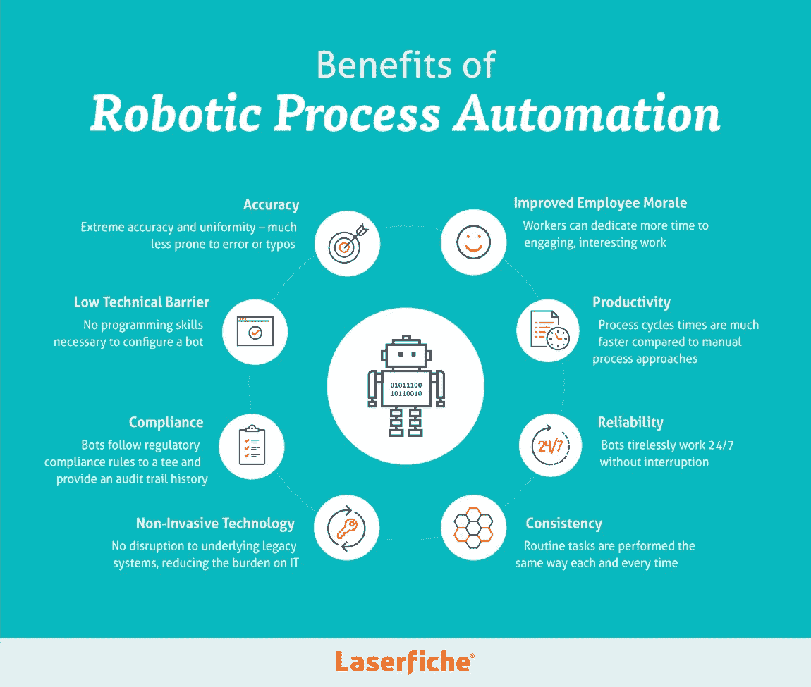
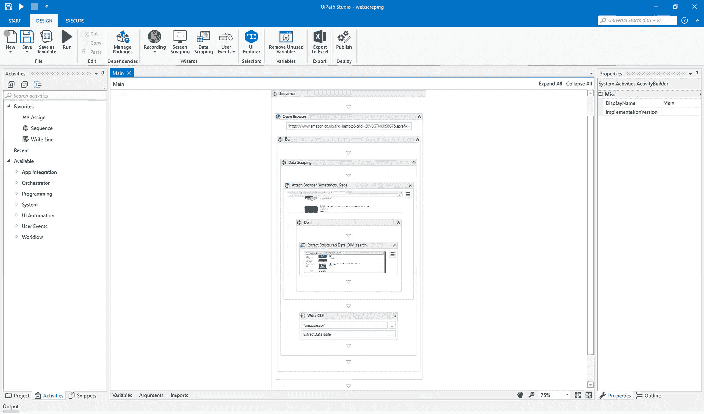

# 使用 UIPath 的机器人流程自动化(RPA)

> 原文：<https://towardsdatascience.com/robotic-process-automation-rpa-using-uipath-7b4645aeea5a?source=collection_archive---------4----------------------->

(Source = [https://www.laserfiche.com/ecmblog/what-is-robotic-process-automation-rpa/](https://www.laserfiche.com/ecmblog/what-is-robotic-process-automation-rpa/))

> “我们对机器人着迷，因为它们是我们自身的反映。”
> 
> —肯·戈德堡

# 介绍

RPA 是一项正在开发的技术，用于自动化手动任务。RPA 与传统编程的区别在于其图形用户界面(GUI)。RPA 自动化是通过分解用户执行的任务并重复它们来执行的。因此，这种技术可以使基于图形的过程的自动化更容易编程。RPA 应用程序的示例包括[1]:

*   从扫描的文档(如 pdf)中提取数据。
*   生成电子邮件/监控电子邮件帐户。
*   读取和创建发票。
*   自动化薪资处理。
*   在静态环境中自动化复杂的基于软件的任务。

RPA 利用软件机器人在 Web/桌面或 Citrix 环境中执行任务。平均而言，机器人执行同等过程的速度比人快三倍，而且它们能够全年 24 小时不间断地工作。RPA 擅长于任何类型的基于规则的重复性应用程序[2]。RPA 公司的一些常见例子有 Automation Anywhere、UIPath 和 blueprism [3]。

# UIPath

UIPath Community Edition 是一款免费软件，可以在 Windows 上下载。使用 UIPath，可以实现复杂的工作流，创建基于序列和流程图的架构。然后，每个序列/流程图可以由许多子活动组成，例如记录机器人要执行的一组动作或筛选和数据采集指令。此外，UIPath 还支持错误处理机制，以防决策情况或不同流程之间出现意外延迟。这可以通过使用控制流命令来完成，例如:

*   If 语句。
*   等待某个 UI 元素出现或消失。
*   增加延迟。
*   使用调试模式分解工作流执行。

Figure 1 : UIPath Interface

UIPath 的另一个特别的功能是它能够处理结构化的表格(例如 XLSX 和 CSV 文件)。这允许开发人员循环通过和过滤来自表的数据，以处理和创建从 web 或任何其他基于桌面的应用程序收集信息的结构化数据。

作为一个应用程序示例，我创建了一个 web 抓取工具来打开 Chrome，以遍历所选类别的所有 Amazon 页面。然后，我可以在一个 CSV 文件中存储该类别中每篇文章的名称、价格和链接。最后，可以对这个文件进行分析(使用 python ML 算法),以查看价格如何随时间变化，并将不同供应商的产品进行比较。

Video 1: Amazon Data Scraping Example

UIPath 目前正在开发其测试版，以将计算机视觉集成为其工作流记录应用程序的一部分。这可能允许在虚拟环境中更好地集成 UIPath，使机器人能够更详细地远程识别不同的 UI 组件。

# RPA 业务应用程序

在我与 [Documation 软件](https://www.documation.co.uk/solutions/robotic-process-automation/)在的实习期间，我有机会使用 UIPath 进行 RPA 工作。作为实习的一部分，我成功地实现了两个工作流的自动化:

1.  在财务系统中注册供应商(从结构化数据集中获取数据)。
2.  使用来自 web 服务的数据在财务系统中创建发票。

这两个工具可以大大加快大中型公司的工作流处理速度。

为了改进上述工作流程，可以添加错误处理机制，在 CSV 文件中存储机器人执行的每个单独流程的状态日志，并标记任何异常。这将允许人类操作员稍后检查机器人如何处理该过程，并查看机器人如何对任何意外事件做出反应。

# 联系人

如果你想了解我最新的文章和项目[，请通过媒体](https://medium.com/@pierpaoloippolito28?source=post_page---------------------------)关注我，并订阅我的[邮件列表](http://eepurl.com/gwO-Dr?source=post_page---------------------------)。以下是我的一些联系人详细信息:

*   [领英](https://uk.linkedin.com/in/pier-paolo-ippolito-202917146?source=post_page---------------------------)
*   [个人博客](https://pierpaolo28.github.io/blog/?source=post_page---------------------------)
*   [个人网站](https://pierpaolo28.github.io/?source=post_page---------------------------)
*   [中等轮廓](https://towardsdatascience.com/@pierpaoloippolito28?source=post_page---------------------------)
*   [GitHub](https://github.com/pierpaolo28?source=post_page---------------------------)
*   [卡格尔](https://www.kaggle.com/pierpaolo28?source=post_page---------------------------)

# 文献学

[1] 57 RPA 用例/应用:深度指南[2019 更新]=[https://blog . ai multiple . com/robotic-process-automation-Use-Cases/](https://blog.aimultiple.com/robotic-process-automation-use-cases/)

[2]德意志银行=[https://www.youtube.com/watch?v=ZDKQAJuEQhY](https://www.youtube.com/watch?v=ZDKQAJuEQhY)

[3] Analytics Insight，[Kamalika Some](https://www.analyticsinsight.net/author/kamalika/)=[https://www . Analytics Insight . net/top-10-robotic-process-automation-companies-of-2018/](https://www.analyticsinsight.net/top-10-robotic-process-automation-companies-of-2018/)