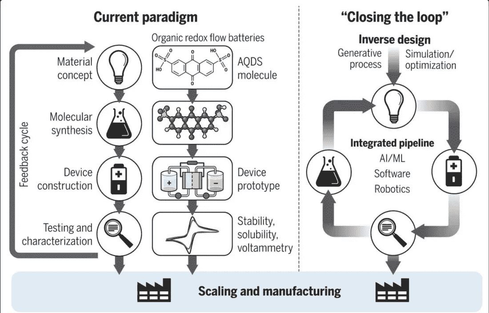

# 机器人在做科学

> 原文：<https://towardsdatascience.com/robots-are-doing-science-de5fd2b5295f?source=collection_archive---------12----------------------->

Data driven AI approaches combined with robotic systems are rapidly transforming science. Image from [Propagator Ventures](https://medium.com/@PropagatorVC/why-we-invested-in-kebotix-5568f2516f1a)

## 边缘的科学

## 这是一件好事

一次一个研究实验室，机器人正在接管科学。

他们正在发现新的药物，生长纳米管的新方法，并扩大我们的新材料库。

他们不会厌倦，也不会浪费时间去思考生命的意义。他们也没有威胁要组织工会或请病假。

他们中的一些人甚至开始形成自己的假设，并进行他们设计的实验——来解决他们选择的问题。

**遇见亚当**

亚当是世界上第一批机器人科学家之一。目前他在英国剑桥进行酵母实验。

酵母或 [*酿酒酵母*](https://en.wikipedia.org/wiki/Saccharomyces_cerevisiae) 是负责葡萄酒、面包和啤酒的真菌。就像狗和它们的品种一样，酵母也有许多种类，每一种在基因上都略有不同。像一个雄心勃勃的研究生一样，亚当希望在尽可能多的酵母菌株上进行实验，以达到他的目标。

亚当的形状像一个移动诊所，有机器人手、离心机、冰柜和恒温箱。他没有脸也没有声音，但如果你仔细观察下面的视频，你会发现他有一个性格——偷偷写在他小心翼翼的动作中，写在他行动之间的停顿中，写在他问自己的问题中。

他从冰箱中挑选特定的酵母菌株，并将其转移到一个*微量滴定器*——一个有许多小试管或*“井”的盘子*。每个试管里都有一种营养丰富的含糖液体和一些精选的添加剂。

每隔 30 分钟，将该板放入阅读器中，仔细测量每个孔反射的光。亚当可以利用这些信息来确定每个孔中酵母的生长速度。这能告诉他添加到井中的特定化学物质对真菌是有益还是有害。

如果他愿意，他可以进入其中的一个井，舀起一些细胞，让它们在另一个井中生长，他也监测这些细胞。

亚当同时运行了一千个酵母实验，每个实验持续长达 5 天。

在这个酵母宇宙中，亚当是一个仁慈的无所不知的上帝。

亚当不仅仅是一台无脑的机器，运行着一个又一个盲目的实验。

从他庞大的数据库中，他可以挑选出一种酶，并猜测可能对此负责的基因。然后，他进行有针对性的实验来证实或反驳这一假设。

没有人参与这个过程。管理亚当的团队不知道他在看哪种酶，也不知道他提出了什么假设。他们只有在亚当检查了他的预感后才能看到结果。

Adam 的初步结果确定了超过 15 种酶的遗传标记。

但更重要的是，它宣布了一个新范式的诞生，即自主科学家*。*

**

*Robot scientist [Eve](https://www.cam.ac.uk/research/news/artificially-intelligent-robot-scientist-eve-could-boost-search-for-new-drugs), located at the University of Manchester. Eve studies new drug candidates for diseases. Eve is a close cousin of Adam.*

*虽然目前是一个小部落，但这些自主科学家的潜力如此之大，以至于许多人认为我们正处于一场重大科学革命的边缘——我们的知识每隔几年就会翻一番。*

*如果是这样，这可能是科学探索中“*爱迪生”*方法终结的开始。*

***爱迪生范例***

*1878 年，托马斯·阿尔瓦·爱迪生即将发现第一个商用电灯泡。*

*物理学是众所周知的:*

1.  **电流通过任何材料(例如:铜线、丝绸、气体)都会使其升温。**
2.  **炽热的物质发光。**

*如果设计巧妙，这些无处不在的双重观察可以放在一起制造电灯。*

*然而，为了产生足够的光，这些材料需要被加热到极高的温度。这意味着大多数物质要么与周围的空气发生反应，要么变成液体，这两种情况都不是我们想要的结果。*

**

*The light of the bulb is generated by the extremely hot filament at the center. The choice of the filament material is the result of massive scientific and engineering effort lasting years. Photo by [Yuichi Kageyama](https://unsplash.com/@kageyama?utm_source=medium&utm_medium=referral) on [Unsplash](https://unsplash.com?utm_source=medium&utm_medium=referral)*

*爱迪生面临的挑战是为他的灯泡找到不会自焚的合适材料。至少，候选材料应该能够让电流通过:也就是说，要有良好的导电性。这排除了粘土、木材和玻璃。*

*此外，它应该满足一些常识性的要求。它应该至少持续几天——如果可能的话甚至更长。它不应该太贵，只有爱迪生才能买得起。*

*然而在那个时候，还没有一本*材料手册*列出世界上所有的材料以及它们的光学、电学、热学、化学和机械性能。*

*因此爱迪生着手对一种又一种材料进行物理测试。*

*据估计，他用了 2000 多种材料做实验，包括他自己的头发，直到他发现了由异国情调的东方竹子制成的碳丝。*

***科学的劳动***

*现代科学的肮脏秘密是，它仍然以爱迪生 150 年前开创的同样方式运行。*

*当然，我们肯定已经走了很长的路，因为这个过程的大部分现在是由我们深厚的科学知识和直觉驱动的。我们知道我们使用或需要的东西背后潜在的物理和化学，这有助于大大缩小搜索空间。今天的科学家不太可能把自己的头发放入熔化的金属中，而是希望得到 vibranium。*

*来自外部的科学遵循高度组织化的逻辑进程，其中每一步都是先验知识和思考的结果。*

*但在内部，仍然存在混乱和任意选择。*

**

*Closed loop workflow of data driven science. The potential chemical space available for exploration is impossibly vast. Theoretical models and computer simulations help us narrow this down to smaller subset of combinations — which is too big for manual exploration but might be accessible to autonomous systems. The robotic agent studies a smaller subset of this region, measures the results and uses this information to improve its own selection and planning criteria. Image taken from ‘[Using artificial intelligence to accelerate materials development](https://www.cambridge.org/core/journals/mrs-bulletin/article/using-artificial-intelligence-to-accelerate-materials-development/90442EB1886A20A4C9437C32336B5611)’*

*例如，为了制造一种轻质钢，基础物理和化学知识可能会告诉冶金学家，他的最佳选择是在铁中添加镍、铬或锰。*

*但是从这里开始，没有真正的前进道路，除非这些组合中的每一种都是物理合成的，并且最终的合金在实验室中对其物理和化学性质进行表征。这些实验可能很简单，也可能很复杂。可能需要重复，直到我们能够确定结果。*

*在地面上，科学是人类的努力，立足于对真实自然现象的公正观察。*

*如果有一千个计算或方程式指出镍是与铁搭档的最佳金属，只要有一个观察反驳它，这并不重要。*

*发现新药、电池元件、汽车零件、玻璃、溶剂、纺织品、陶瓷、电子材料、合金、液体、凝胶等仍然是一项艰巨的任务，需要令人生畏的体力劳动。*

*这就是像亚当和夏娃这样的自主机器人科学家承诺要创造一场革命的地方。*

***高通量实验***

*与人类科学家相比，使用机器人进行实验的明显优势是可以探索更大的搜索空间。*

*亚当研究了数千种酵母菌株，在他的项目周期中进行了超过 600 万次测量。一个在一年内研究 50 种酵母菌株的研究生会被认为是超级明星。*

*在时间和空间上进行大量实验的能力是发现新材料的一个特别重要的要求。*

*我们知道元素周期表中的大约 120 种元素——为什么我们不能把它们每一种都成对地混合起来，看看我们最终会创造出什么？也许这里有一种超级合金或者一种新的磁铁。甚至可能是超导体？*

*仅仅是元素按 50:50 比例的二元组合就需要我们创造和研究 7140 种材料。但是这里的问题是，我们需要研究所有可能的组合比率！*

**

*The workflow of Science. The current paradigm typically takes 10 to 20 years to scale a product from conception to commercialization. The emergent AI driven approaches are promising to reduce this time to as little as 5 years. From [‘Inverse molecular design using Machine learning: Generative design for matter engineering’](https://science.sciencemag.org/content/361/6400/360\)*

*目前正在努力解决这些问题的一小部分。[国家可再生能源实验室](https://data.nrel.gov/submissions/75)的高通量实验数据库包含超过 60，000 个金属样品薄膜。该数据库包含这些材料的结构、电学和光学信息，可供公众查阅。*

*空军研究实验室的[自主研究系统](https://www.afcea.org/content/scientists-pick-ai-lab-partner) (ARES)一直在研究快速生长碳纳米管的最佳条件。通过结合数学见解和遗传算法，该系统已经达到其目标增长率，确定了对碳纳米管生长最有影响的条件。它通过一天运行 100 个实验达到了这个目标。*

*随着深度学习的爆发，科学家们正在将敌对网络和变分编码器等技术与机器人技术相结合，以创建更高级版本的 Adams。这些系统不仅进行了大量的实验，涵盖了组成空间的巨大区域，而且它们还随着每次迭代而自我完善——就像人类科学家会做的那样。*

*自主科学家最近进入了商业领域，如*[*atom wise*](https://www.atomwise.com/)[*benevolent ai*](https://benevolent.ai)和 [*Zymergen*](https://www.zymergen.com/) 等公司致力于开发闭环系统，以发现材料、有机物和药物。**

**然而，人类科学家并没有被机器人取代的危险。我们提供了先进的自动化所不能提供的东西:创造力。**

**如果有的话，这可能意味着未来的研究生院将是一个非常不同的地方，每个学生都能够同时进行成千上万的实验。**

**然而，科学将会永远改变，用太多的知识淹没我们，让我们不知如何是好。**

**新的材料和设备将使世界变得无法辨认，而这些现在都不存在了。**

**机器人正在从事科学研究，这是一件好事。**

****延伸阅读****

1.  **Philip Ball，[利用人工智能加速材料开发，](https://www.cambridge.org/core/journals/mrs-bulletin/article/using-artificial-intelligence-to-accelerate-materials-development/90442EB1886A20A4C9437C32336B5611) MRS 通报，2019 年 5 月**
2.  **罗斯·金等人，[科学的自动化](https://science.sciencemag.org/content/324/5923/85)，科学，2009**
3.  **Alan Guzik 和 Kristin Persson，[材料加速平台](http://mission-innovation.net/wp-content/uploads/2018/01/Mission-Innovation-IC6-Report-Materials-Acceleration-Platform-Jan-2018.pdf)，2018**