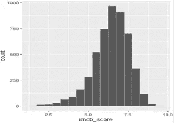
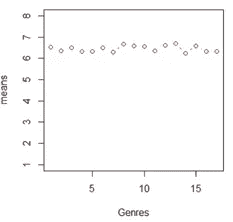
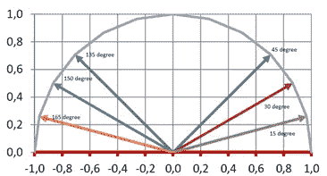
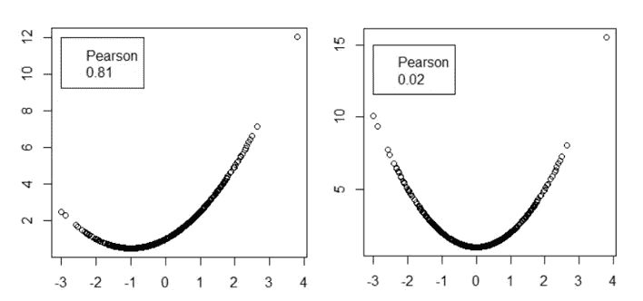
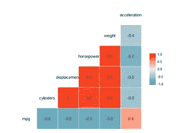
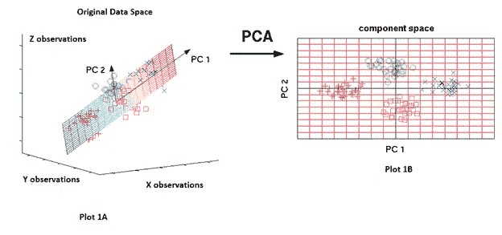

# 您应该知道的健壮和非健壮的数据简化方法

> 原文：<https://towardsdatascience.com/robust-non-robust-methods-for-data-reduction-you-should-know-a1dc7347a802?source=collection_archive---------18----------------------->


网络技术的快速发展、云计算、移动互联网的出现以及物联网设备的出现(如家用电器和自动驾驶汽车)导致了大量数据的创建、交换和存储。但是，这些数据中的大部分可能包含大量冗余和噪声。提高机器学习(ML)模型的预测精度在于*选择最小和最紧凑的有用数据集*；数据清理过程中的一个棘手问题。减少数据大小(维度)的原因包括实现 CPU 和 GPU 计算工作时间的减少。不用说，没有人希望在确定预测模型大致准确之前，花费数百美元运行云计算能力。可以通过几种方式对数据集进行数据缩减。在数据分析和机器学习预测建模中，我们经常会问这样的问题，所有的属性、子集或至少一个预测因素是否有助于解释反应？

**观测值减少**

在减少观测数据的情况下，粗略的方法是将数据切成两半，或者任何其他比例。假设观察结果*是真正随机的，*尽管有好处，也不建议这样做。例如，如果我们要收集大量的曲目和用户级别的音乐元数据，那么我们可以选择数据集中的前几行，并且仍然能够很好地表示整个数据群体。然而，如果数据不是随机的，这可能会带来麻烦。假设我们有一个音乐记录的数据集；第一行可能是特定于“Jazz”这样的流派的数据点—在这种情况下，样本是有偏差的。最安全的选择是分层抽样。比方说，我们的模型需要“流派”作为由类变量组成的解释属性；爵士乐、摇滚乐、古典音乐、流行音乐等。我们可以对原始数据集中出现的每个变量进行相同分布百分比的采样。

减少数据观察是很容易的，但是我们不能说属性也是一样。数据集包含多达数百个属性，这些属性不应该挤在预测模型中。

**简单属性约简技术**

当谈到属性约简时，工具和概念变得相当复杂。我们可以通过使用数据集的专业知识、可视化和执行简单的统计分析来决定移除属性，或者使用一种强大的统计工具来减少数据。让我们看一个例子，展示在 IMDB 5000 电影数据集上的可视化和简单的统计分析。我们想检验“流派”是否对 IMDB 分数有任何影响。也就是说，如果我们想要拟合一个模型来预测 IMDB 分数，我们需要“流派”作为一个解释属性，还是完全删除它？

我们首先从下面的[链接](https://www.kaggle.com/carolzhangdc/imdb-5000-movie-dataset)下载 IMDB 数据集，并运行下面的代码。

```
library(data.table)library(GGally)
IMDB <- read.csv("movie_metadata.csv")sum(duplicated(IMDB))IMDB <- IMDB[!duplicated(IMDB), ]ggplot(imdb_score, aes(imdb_score)) + geom_histogram(binwidth = 0.5, color = "dark gray")
```



IMDB 分数显示了在 6 到 8 之间向右倾斜的分布。除了一些低频类型，这使我们认为，给定足够的类型样本数，我们往往会发现他们的平均 IMDB 分数也在这个范围内。这是考虑该属性对 IMDB 分数的解释价值很小的良好开端，但是我们将通过使用平均值的简单统计来确认这一点。

“流派”是由一个或多个流派组合的字符串组成的分类属性。在这个分析中，我们避免解析字符串中的流派，并计算它们的平均值以避免复杂的平均值相加。相反，我们选择了电影业中最常用的电影类型配方。

```
sort(summary(IMDB$genres),dec=T) #topmost commonly used movie genres excluding ‘others’gnr.df <- as.data.frame(IMDB[,c("genres", "imdb_score")])gnr.df$'Comedy|Drama' <- sapply(1:length(IMDB$genres), function(x) if (IMDB[x,10] %like% "Comedy|Drama") 1 else 0)gnr.df$'Comedy' <- sapply(1:length(IMDB$genres), function(x) if (IMDB[x,10] %like% "Comedy") 1 else 0)gnr.df$'Horror' <- sapply(1:length(IMDB$genres), function(x) if (IMDB[x,10] %like% "Horror") 1 else 0)gnr.df$'Drama' <- sapply(1:length(IMDB$genres), function(x) if (IMDB[x,10] %like% "Drama") 1 else 0)gnr.df$'Documentary' <- sapply(1:length(IMDB$genres), function(x) if (IMDB[x,10] %like% "Documentary") 1 else 0)gnr.df$'Comedy|Drama|Romance' <- sapply(1:length(IMDB$genres), function(x) if (IMDB[x,10] %like% "Comedy|Drama|Romance") 1 else 0)gnr.df$'Comedy|Romance' <- sapply(1:length(IMDB$genres), function(x) if (IMDB[x,10] %like% "Comedy|Romance") 1 else 0)gnr.df$'Drama|Romance' <- sapply(1:length(IMDB$genres), function(x) if (IMDB[x,10] %like% "Drama|Romance") 1 else 0)gnr.df$'Crime|Drama|Thriller' <- sapply(1:length(IMDB$genres), function(x) if (IMDB[x,10] %like% "Crime|Drama|Thriller") 1 else 0)gnr.df$'Action|Crime|Drama|Thriller' <- sapply(1:length(IMDB$genres), function(x) if (IMDB[x,10] %like% "Action|Crime|Drama|Thriller") 1 else 0)gnr.df$'Action|Crime|Thriller' <- sapply(1:length(IMDB$genres), function(x) if (IMDB[x,10] %like% "Action|Crime|Thriller") 1 else 0)gnr.df$'Drama|Thriller' <- sapply(1:length(IMDB$genres), function(x) if (IMDB[x,10] %like% "Drama|Thriller") 1 else 0)gnr.df$'Crime|Drama' <- sapply(1:length(IMDB$genres), function(x) if (IMDB[x,10] %like% "Crime|Drama") 1 else 0)gnr.df$'Horror|Thriller' <- sapply(1:length(IMDB$genres), function(x) if (IMDB[x,10] %like% "Horror|Thriller") 1 else 0)gnr.df$'Crime|Drama|Mystery|Thriller' <- sapply(1:length(IMDB$genres), function(x) if (IMDB[x,10] %like% "Crime|Drama|Mystery|Thriller") 1 else 0)gnr.df$'Action|Adventure|Sci-Fi' <- sapply(1:length(IMDB$genres), function(x) if (IMDB[x,10] %like% "Action|Adventure|Sci-Fi") 1 else 0)gnr.df$'Comedy|Crime' <- sapply(1:length(IMDB$genres), function(x) if (IMDB[x,10] %like% "Comedy|Crime") 1 else 0)gnr.df$'Documentary' <- sapply(1:length(IMDB$genres), function(x) if (IMDB[x,10] %like% "Action|Adventure|Sci-Fi") 1 else 0)gnr.df$'Drama' <- sapply(1:length(IMDB$genres), function(x) if (IMDB[x,10] %like% "Comedy|Crime") 1 else 0)gnr.df$'Comedy' <- sapply(1:length(IMDB$genres), function(x) if (IMDB[x,10] %like% " Action|Adventure|Thriller") 1 else 0)gnr.df$'Horror' <- sapply(1:length(IMDB$genres), function(x) if (IMDB[x,10] %like% " Drama|Mystery|Thriller ") 1 else 0)means <- rep(0,17)for (i in 1:17) {means[i] <- mean(gnr.df$imdb_score[gnr.df[i+2]==1])}plot(means, type = "b", col = "dark red", ylim = c(1,8), xlab = "Genres")
```



上图显示，体裁作为一种预测因素，并不能很好地解释反应 IMDB 得分，因为平均而言，使用频率最高的体裁组合的 IMDB 得分在 6 到 7 之间。实际上，我们可以通过消除流派来合理而自信地减少数据集的维度。

**属性约简:相关性分析**

相关性测试的思想是识别两个属性之间的*线性*强度或者它们之间的相关性强度。这种分析有助于我们确定属性的相互依赖性。一方面，可能有完全的独立性，而另一方面，我们可能有共线性；其中一个变量是另一个变量的线性函数。换句话说，由于这两个属性往往会一起增加或减少，因此很难区分给定预测模型对响应的单独影响。

必须指出的是，在相关性分析中，属性量化了一对属性(即两个属性)之间的关联，而不是大量属性之间的关联。当处理具有数百个属性的大型数据集时，将会有成千上万个相关性的矩阵。即使数据是完全随机的，你也会偶然发现一些属性对之间有很高的相关性。

掌握相关分析背后的技术概念是值得的。如果你不喜欢这些定义，可以随意跳过。我们首先定义两个统计概念；协方差和相关性。

**协方差、相关性和相关系数**

**协方差**:类似于方差，它测量单个随机变量与其均值的平方偏差(*Var(X)= E(X)-E(X))*)。协方差衡量两个属性如何一起波动。换句话说，如果第一个属性很大，第二个属性也很大，两者会一起波动。

**相关性**就是协方差的归一化版本。对此的解释是，协方差数量很少用作推断两个属性之间关系强度的描述性统计，因为协方差数量取决于两个属性的单位度量。换句话说，如果我们有两个属性，用两个独立的单位来度量，那么得到的量就是一个我们不能与任何一个单位相关联的数字。因此，协方差通常通过除以两个属性的标准偏差的乘积来标准化(即，零均值和方差为 1)，从而得到一个称为**相关系数**或*皮尔逊相关系数*的量。

从数学上也可以看出，相关系数是两个标准化列向量(即，属性值)之间角度的余弦。例如，如果两个单独的属性值接近，则两个向量之间的角度将很小，其余弦值接近+1，这表明正相关性很高。如下图所示，相对方向(正和负)的向量(箭头)相对于水平轴(深红色)属性是非正交的或相对平行的，以指示某种数量的关系。



Vectors with various degrees of correlation and directions

**计算相关系数**

为了进行相关分析，我们使用 r 等统计软件来计算相关系数，这是一个相当简单的操作。相关系数是一个介于+1 和-1 之间的数字。正号或负号表示相关的方向。正号表示直接相关；第一属性的单位值的增加使第二属性增加一个单位值，而负号表示负相关；第一属性的单位值的增加使第二属性减少一个单位值。但是，如果属性之间没有明显的线性关系，则相关性为零或接近于零。

前面的陈述带有一些警告:

1 —接近零或零相关系数不一定意味着没有关系，而是意味着 ***没有线性关系*** 。这基本上告诉我们，这两个属性具有零或接近零的相关性，但却相互依赖，通常以非线性方式*。*

*2 —尽管相关系数旨在量化一对变量之间的线性关联强度，*非线性关联有时会产生不反映关系强度的相关性*。*

*3 —计算具有明显非线性关系的一对变量的相关系数通常是不明智的。因此，相关性并不是属性内关系的详尽总结。一个好的做法是绘制属性，并对其统计数据摘要进行可视化检查。*

*4-相关系数的使用很大程度上取决于一对属性是从高斯(正态)分布中抽取的样本这一事实。因为有些属性比其他属性具有更高的分散性，所以值得检查每个属性的分布形式，并考虑是否有任何属性需要转换。例如，对数变换通常用于减少正偏度，并产生更接近正态的分布。*

*5-分析最终有助于在检查随机属性时识别一些潜在的冗余。但是某种程度的相关性不应该总是意味着其中一个是冗余的，尽管如果相关性非常高，那么其中一个可能是“几乎冗余的”。*

*以下面的代码示例为例，绘制一个数据集来说明第 1、2 和 3 点。*

```
*set.seed(1)x = rnorm(600) #vector withdrawn from a normal distributiony = 1 + x + 0.5*x^2 #nonlinear function (1)plot(x,y)legend(-3,12, c("Pearson",round(cor(x,y),2)))y = 1 + x^2 #nonlinear function (2)plot(x,y)legend(-3,15, c("Pearson",round(cor(x,y),2)))*
```

**

*在图的左侧，皮尔逊相关系数很大(> 0.8)，但是属性呈现非线性关系。图的右侧是另一个非线性关系，其中相关系数接近于零。如果不直观地检查属性，我们将无法看到关联的真实性质。*

*让我们运行另一个代码示例，但这次是在汽车数据集上，以显示冗余。我们想从数据集中得到的答案来自以下内容:每加仑英里数(mpg)可以从其他属性中预测出来吗？*

```
*library(GGally)path = "http://archive.ics.uci.edu/ml/machine-learning-databases/auto-mpg/auto-mpg.data"auto_data <- read.csv(path, header = F, sep = "", quote = "\"'", na.strings ='?')colnames(auto_data) <- c('mpg', 'cylinders', 'displacement','horsepower', 'weight', 'acceleration', 'model_year', 'origin', 'name')str(auto_data) #we see there is '?' value in the datasetround(cor(auto_data[,c(-7,-8,-9)]),2)ggcorr(auto_data[,c(-7,-8,-9)], label = T)*
```

**

*Various correlation values between set of attributes*

*气缸和排量高度相关(+1)。它们之间共线性的存在意味着*气缸*提供的关于响应 *mpg* 的信息在*位移*存在时是多余的。即使我们从力学的角度来分析这两个属性，也是如此。*

***高维空间中的多重共线性问题***

*到目前为止，我们已经讨论了线性相关性可以通过相关系数来检测。但是，在高维空间(即大型属性集)中，我们仍然可以看到三个或更多属性之间的共线性，而不会显示每对属性之间的高度相关性。这种现象称为多重共线性。我们不会进一步讨论这个话题，但是，解决方案可能相对简单的是，使用主成分分析(PCA)，虽然这不是它的全部。*

***主成分分析***

*PCA 可能是最广泛使用的数据简化技术。即使该技术实际上并不涉及删除属性本身，而是通过将一组相关属性转换成所谓的主成分来实现约简。每个主成分都是原始属性的线性组合，*所有*主成分都是相互正交的，所以没有冗余信息。此外，每个新的主成分应该指向原始数据中最大可能方差的方向。简单地说，主成分将给出方差的方向和大小，这将帮助我们更好地预测响应。*

*但是为什么 PCA 关注数据集中的方差呢？请记住，信息都是关于可变性的。当一个属性的方差为零时，它不会泄露任何有价值的信息，因为这意味着它的所有观测值都是相同的。此外，PCA 与转换连续属性(即定量)有关。*

*PCA 的另一个好处是它还允许我们可视化大量的属性。假设我们有一组 10 个属性，如果我们要为每个属性组合创建一个散点图，以确定任何可能的相关性，我们最终会有 45 个图！当属性的数量非常大时，这不是一个可行的尝试。*

*PCA 是一种无监督方法，因为它处理一组属性而不考虑响应属性。也就是说，没有关于它们对反应的影响的指导。我们稍后将回到这一点。此外，PCA 不假设原始数据集的潜在概率分布。即，它是否是正态(高斯)l 分布。幸运的是，在现实世界中，数据是高斯分布的，PCA 通常是一种健壮的技术，因此我们可以松一口气了。*

*为了直观显示这一过程，下图显示了以 x、y、z 轴表示的数据集的 1A 图，该数据集包含四个不同颜色和形状的实验数据集。我们可以看到数据集表现出一定的线性。第一和第二主成分 PC1 和 PC2 一起将数据集转换为最具可变性方向上的一组新的基向量。1B 图是数据集到由 PC1 和 PC2 轴表示的二维空间的变换。我们可以看到，数据集的最大方差或动态性主要是沿着 PC1 解释的，而 PC2 方差相对更接近于零，因此其等级更低。如果我们沿着 PC1 线投影 1B 图中的数据，最后一句话会更好理解，其中显示 PC1 仍然靠近原始数据集，并且具有最大的方差，而 PC2 投影将给出较小的方差，并且距离原始数据集最远。*

**

*3-dimensional observations sample are transformed onto a 2-dimensional space that maintains the largest variance in the data.*

*存在许多计算主分量的方法，如幂法、谱分解、特征值分解(ED)、奇异值分解(SVD)和神经网络算法。r 软件包提供了内置函数 prcomp()来计算使用奇异值分解(SVD)技术的 PCA。在计算一组属性的主成分之前，它们应该被标准化为具有一个和零均值的方差。实际上，该计算从相关矩阵而不是协方差矩阵中找到主分量(请参见上面的相关和协方差概念)。*

***求解 PCA:特征向量和协方差***

*如果你不喜欢，这部分可以跳过。我们可以通过特征值分解(ED)技术来解释 PCA，以帮助我们发展技术直觉。它的要点可以归结为以下几点:*

*1-减去数据集 x 中每个属性的平均值。*

*2-求 x 的协方差的特征向量。*

*3-执行基的改变:位于 m 维空间中的数据集(即> = 2)。PCA 询问是否存在另一组基向量，它是原始基向量的线性组合，可以更好地表达数据集？我们所说的更好是指方差和投影最大的方向最接近原始数据集。用线性代数的话来说，基的变化是一个矩阵 P，它将把数据集 X {V1，V2，…，Vn}变换成 Y {V1，V2，…，Vn}，其中 V 是一个向量。这种新的数据表示用这组新的基向量来表示，这些基向量是彼此正交的主分量，并且指向变换数据集的最大方差的方向。基本上，我们要求一个矩阵 P 来完成这个转换。*

*a.计算数据集 Y 的协方差，并将其命名为 CY，它捕获所有可能的属性对之间的协方差。这个平方协方差矩阵将具有非对角线上的协方差值和对角线上的方差值。*

*b.通过矩阵 p 对角化 cy 来优化协方差 CY，以达到最小化数据集中冗余的目的，即 CY 中的所有非对角值(协方差值)都应该为零。*

*c.前一点指的是线性代数方法，该方法认为对角化 CY 的正交矩阵 P 是数据集 X 的协方差的特征向量，因此是其主分量。*

*d.CY 的对角线值是 X 数据集属性的方差。*

*e.根据最大方差对 CY 进行排序，以帮助找到 p 中最重要的对应主成分。*

*虽然 PCA 仍然是一种健壮的技术，但是它肯定有一个缺点，即 PCA 关于每个主成分的重要性的决定不依赖于响应属性。换句话说，在等级中被降级的具有低方差的主成分对于预测响应也可能是重要的，并且在某些情况下甚至更重要。因此，有其他方法可以帮助克服这种偏见。可以使用稳健的方法偏最小二乘法(PLS ),该方法简单地利用响应来识别新属性，该新属性不仅很好地估计了旧属性，而且与响应相关，实际上，它找到了解释响应和预测值的方向。*

***总结***

*我们已经讨论了用于执行预测建模的各种数据简化方法。目的是缩小属性和观察值的选择范围，简洁地解释响应，并帮助快速运行所选的模型。一些归约方法可能需要数据集的专业知识，或者可视化和执行统计分析。一些方法是不稳健的，包括通过分层采样的观察减少，或通过 2 维或更多维空间的相关性分析的属性减少，以及最后，使用 PCA，一种稳健的技术，用于减少数据集的维度空间而不丢失高维空间中的重要信息。我们还解释了每种方法都有其独特的挑战或缺点，但这不应该阻止人们进一步探索这些方法。*