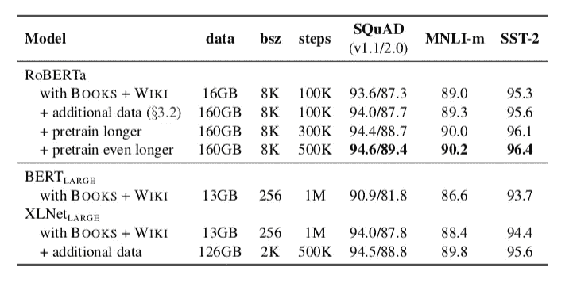
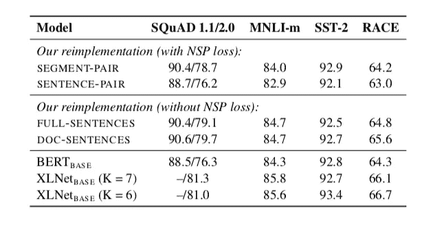
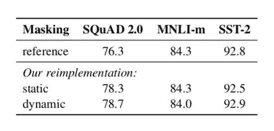
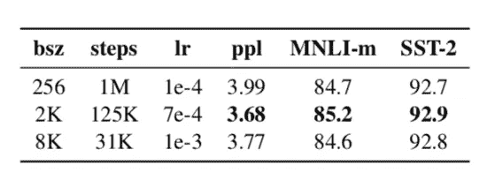

# 鲁棒优化的 BERT 预训练方法

> 原文：<https://towardsdatascience.com/robustly-optimized-bert-pretraining-approaches-537dc66522dd?source=collection_archive---------21----------------------->

Photo by [Joakim Honkasalo](https://unsplash.com/@jhonkasalo?utm_source=unsplash&utm_medium=referral&utm_content=creditCopyText) on [Unsplash](https://unsplash.com/@jhonkasalo?utm_source=unsplash&utm_medium=referral&utm_content=creditCopyText)

## 用于增强 BERT 模型性能的预训练方法的变化摘要

自然语言处理(NLP)近年来一直处于上升趋势。这都归功于语言模型(lm)预训练方法。由于各种原因(训练数据、计算成本和超参数选择)，仔细比较 lm 预训练方法几乎是不可能的。在这篇文章中，我将总结 BERT 的预训练方法中的一些变化，这些变化影响了最终的结果，因此它在 9 个胶合任务中的 4 个中实现了最先进的结果。要获得详细的理解，请阅读下面的文章。

 [## RoBERTa:一种鲁棒优化的 BERT 预训练方法

### 语言模型预训练带来了显著的性能提升，但是仔细比较不同的方法…

arxiv.org](https://arxiv.org/abs/1907.11692) 

# 伯特训练不足

我们几乎认为 *BooksCorpus* 和*英文维基百科*数据集(总共 16 GB)足以让一个语言模型获得对语言的基本理解，但事实并非如此。脸书和华盛顿大学的研究人员(论文作者)在 DGX-1 机器上训练了罗伯塔总共 160 GB 的未压缩英语数据集，每台机器都有 8 x 32GB 的英伟达 V100。

Table 1: Comparing the dataset size and the performance of various models. (image is taken from the [paper](https://arxiv.org/abs/1907.11692))

在上表中，我们可以看到，在类似的设置下，RoBERTa 在小队和 MNLI-m 任务中仅用了 100k 步就超过了 BERT large model(相比之下，BERT 用了 1M)。

# 下一句预测损失

BERT 使用两种不同类型的训练目标，一种是掩蔽语言模型(MLM)，另一种是下一句预测(NSP)。在 MLM，BERT 选择 15%的标记进行替换，其中 80%的标记被替换为*【面具】*，10%保持不变，10%被随机选择的词汇标记替换。

NSP 是一个二元分类任务，它预测两个输入段是否同时出现。该目标旨在改进下游任务，因为它需要模型理解两个给定序列的关系和上下文。正如在[论文](https://arxiv.org/abs/1810.04805)中观察到的，去除 NSP 会损害自然语言理解(NLU)任务的表现。但是在最近的一些模型中，如 [XLNet](https://arxiv.org/abs/1906.08237) 、 [SpanBERT](https://arxiv.org/abs/1907.10529) 等，NSP 损失的必要性受到质疑。

因此，在各种设置(*段对、句子对、完整句子、文档句子*)下进行实验，以比较 NSP 损失对模型性能的影响。在 *SEGMENT_PAIR(有 NSP 损失)*中，设置原始 BERT 的原始输入格式被使用，类似地，在*句子对(有 NSP 损失)*中，设置输入被从来自相同文档或不同文档的连续部分取样。但是在*全句子(没有 NSP 损失)*中，设置输入由来自一个或多个文档的完整句子组成，类似地，在*文档句子*中，设置输入与来自相同文档的完整句子打包在一起。这些实验的输入大小保持在 512。

Table 2: Comparison of performance of models with and without NSP loss (image is taken from the [paper](https://arxiv.org/abs/1907.11692))

该表显示， *DOC-SENTENCES(无 NSP 损失)*设置中的模型优于所有其他模型。如同在其他设置中一样，该模型不能学习长程相关性。尽管如此，RoBERTa 使用*完整句子*设定训练目标。

# 静态屏蔽与动态屏蔽

在 MLM 训练目标中，BERT 在数据预处理过程中仅执行一次屏蔽，这意味着在每一个历元都将相同的输入屏蔽提供给模型。这被称为*静态*屏蔽。为了避免每个时期使用相同的掩码，训练数据被复制 10 次。如果每次将序列输入模型时都执行屏蔽，则模型会看到同一句子的不同版本，屏蔽位于不同的位置。这里，这种类型的屏蔽被称为*动态*屏蔽。

Table 3: Comparison of performance of models trained with static and dynamic masking

用动态掩蔽训练的模型的性能稍好于或至少可与 BERT(即静态掩蔽)模型中使用的原始方法相比，因此用动态掩蔽训练 RoBERTa。如果您有兴趣了解屏蔽是如何工作的，以及它如何提高 BERT 模型的整体性能，您可以查看[这个](https://neptune.ai/blog/unmasking-bert-transformer-model-performance)链接。

# 大批量小批量训练

如果相应地提高学习速度，用大的小批量训练可以提高优化速度和最终任务性能。这显示在以前的工作(显示论文链接)在机器翻译中完成。为批量大小为 256 的 1M 步骤训练模型的计算成本相当于为批量大小为 8K 的 31K 步骤训练。用大的小批量训练模型改善了 MLM 目标的复杂性，同样，通过分布式数据并行训练更容易并行化。即使没有大规模并行化，效率也可以通过梯度累积来提高。

Table 4: Comparison of the effect of increasing batch size (bsz) and learning rate and performance of the model

# 字节对编码

字节对编码(Byte-Pair Encoding，BPE)是字符级和单词级表示的混合，它只依赖于子单词单元。这些子词单元可以通过对训练数据集执行统计分析来提取。一般来说，BPE 词汇表的大小范围从 10K -100K 子词单位。

BERT 使用 30K 的字符级 BPE 词汇大小，它是在用启发式记号化规则预处理之后学习的。罗伯塔使用了由[拉德福德等人(2019)](https://www.techbooky.com/wp-content/uploads/2019/02/Better-Language-Models-and-Their-Implications.pdf) 在论文中讨论的编码方法。这里，BPE 子词词汇表减少到 50K(仍然大于 BERT 的 vocab 大小)个单位，具有编码任何文本的能力，而没有任何未知标记，并且不需要预处理或标记化规则。在某些情况下，使用这种编码会降低最终任务的性能。尽管如此，这种方法还是用于编码，因为它是一种通用的编码方案，不需要任何预处理和标记化规则。

**结论:**

1.  在选择预训练策略(和超参数选择)时，即使是最小的决策也对模型在最终级任务中的性能起着至关重要的作用。
2.  大多数最先进的变压器模型训练不足。即使是训练时间最长的 RoBERTa 模型在 500k 步后也没有过度拟合。