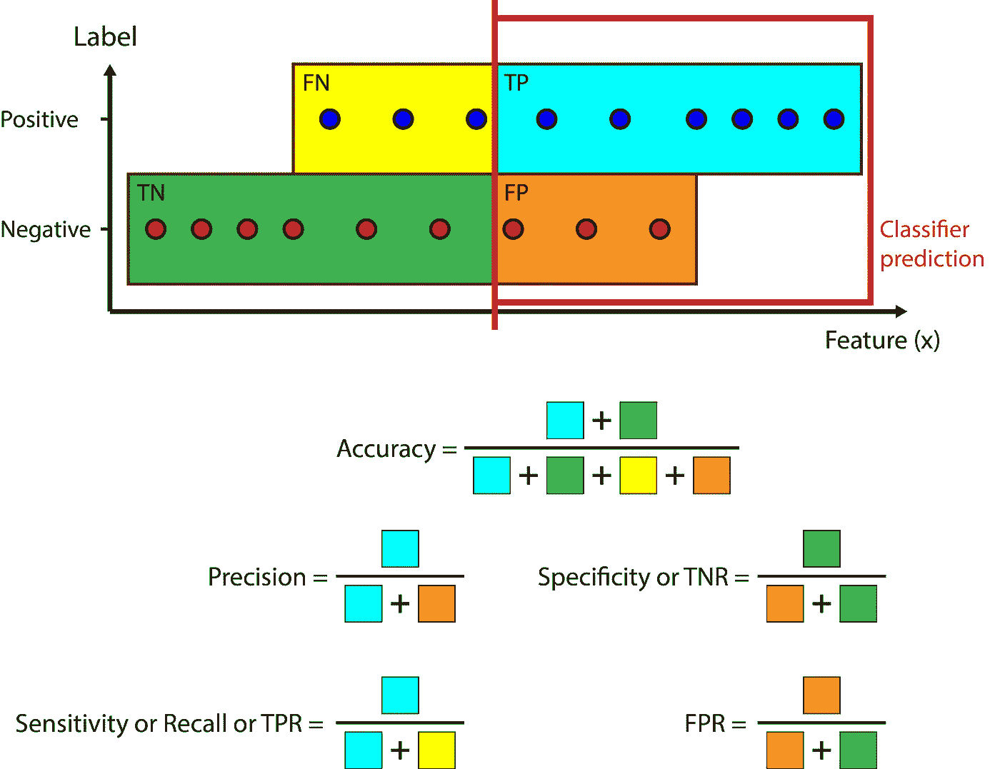
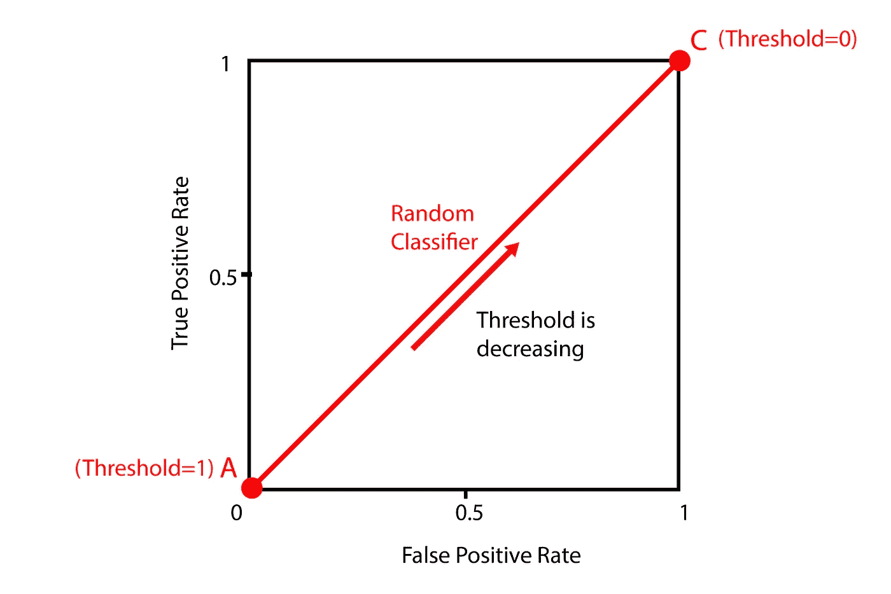
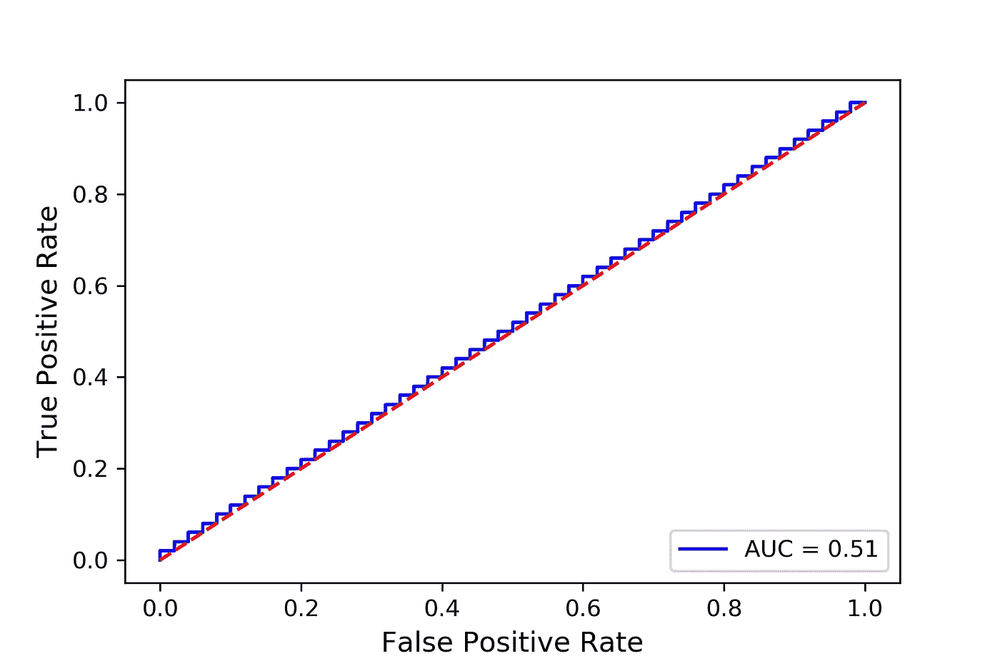
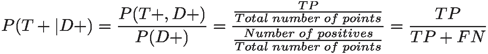
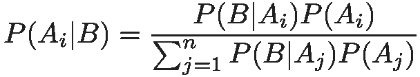
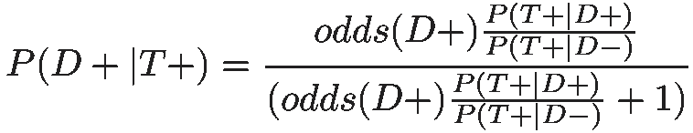
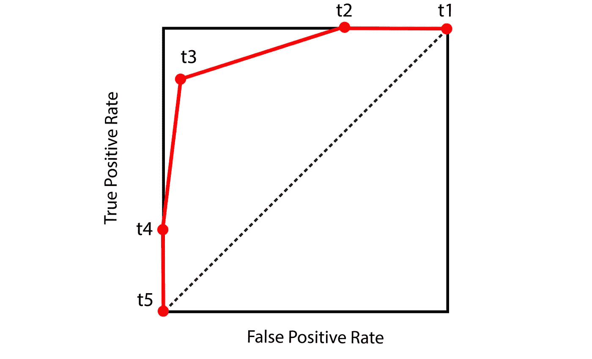
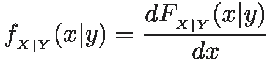
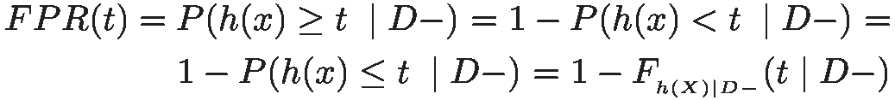
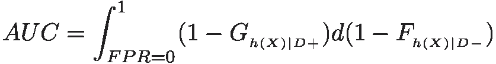

# ROC 曲线，完整介绍

> 原文：<https://towardsdatascience.com/roc-curve-a-complete-introduction-2f2da2e0434c?source=collection_archive---------3----------------------->

作者:雷扎·巴盖里

ROC(接收器操作特性)曲线是一种有用的图形工具，用于评估二元分类器的性能，因为其区分阈值是变化的。为了理解 ROC 曲线，我们应该首先熟悉二元分类器和混淆矩阵。在[二进制分类](https://en.wikipedia.org/wiki/Binary_classification)中，给出了一个对象集合，任务是根据对象的特征将其分为两组。例如，在医学测试中，我们希望分类器根据某些特征(如医学测试结果)来确定患者是否患有某种疾病。

评估分类器意味着测量预测类或标签与评估集中真实标签的匹配程度。在二元分类法中，我们通常把两类中较小的和较有趣的称为正类，把较大的/另一类称为负类。在医学诊断问题中，患有疾病的患者通常是阳性的，而其他人是阴性的。图 1 显示了一个简化的数据集，其中只有一个特征和两个标签。横轴表示特征 x，纵轴表示标签，可以是正的也可以是负的。在这个图中，蓝圈是正数，红圈是负数。

Figure 1

这是我们的训练数据集，每个点称为一个例子。现在，我们希望我们的分类器学习训练数据集，并仅基于特征值预测示例的标签。分类器预测可能不完美，并且在预测实际标签时可能出错。因此，二元分类器的预测有四种可能的结果:

True Positive ( *TP* ):这里分类器预测或标记一个肯定的项目为肯定的，这是一个正确的预测。

真否定( *TN* ):这里，分类器正确地确定否定类别的成员应该得到否定标签，这又是正确的预测。

假阳性( *FP* ):分类器误将一个阴性项目预测为阳性，称为 I 型分类错误。

假阴性( *FN* ):分类器错误地将一个阳性项目标记为阴性，称为 II 型分类错误。

图 2 显示了这些结果的图形表示。

Figure 2

这四个结果定义了一个 2×2 a 的列联表或混淆矩阵，如图 3 所示。为了记住这些术语，您可以分别用正确和不正确替换 True 和 False，也可以分别用选择和拒绝替换肯定和否定。

Figure 3

所以，比如假阳性( *FP* )就是选错了。现在，我们可以根据这些新概念为分类器定义一些评估统计数据或指标:

*准确率*:正确预测数与总预测数之比。所以:

*灵敏度*也称为*召回*或真阳性率( *TPR* ):它测量被分类器正确预测(或召回)为阳性的初始阳性的比例。

*精度*:分类器的肯定预测中真正肯定的部分。

*特异性*或真阴性率( *TNR* ):被分类器正确预测(作为阴性被拒绝)的阴性比例。

假阳性率( *FPR* ):被错误选择为阳性的阴性比例。

图 4 显示了这些指标的图形表示。

Figure 4

**随机分类器**

现在，我们考虑一些特殊情况，并尝试为它们计算这些性能指标。对于第一种情况，我们假设我们有一个预测任何数据点为阳性的差分类器。如图 5 所示，这个分类器从不拒绝任何数据点为负，所以 *TN = 0。*它也从不漏掉一个正数，所以 *FN=0* 。现在我们有:

*回忆或 TPR = TP/(TP+FN) = TP/TP = 1*

*FPR = FP/(FP+TN) = FP/FP =1*

Figure 5

对于第二种情况，我们假设我们有另一个糟糕的分类器，它拒绝所有的数据点，并且从不选择任何数据点作为阳性(图 6)。由于没有选择(无论是正确的还是不正确的) *TP=FP=0，*所以:

*回忆或 TPR = TP/(TP+FN) = 0/(0+FN) = 0*

*FPR = FP/(FP+TN)= 0/(0+TN)= 0*

Figure 6

到目前为止，我们有两个总是选择或拒绝所有数据点的分类器。现在我们假设有第三个分类器位于两者之间。它被称为随机分类器。对于每个数据点，它以相等的概率随机地将它们标记为正或负。因此，这就像挑选一个数据点，然后抛硬币来决定应该给它分配哪个标签。现在想象我们总共有 *N* 个数据点，并且 *N* 是一个非常大的数字。我们还假设实际正的数量是 *Np* ，实际负的数量是 *Nn* 。现在，对于分类器选取的每个点，它实际上是正数的概率是 *Np/N* ，它实际上是负数的概率是 *Nn/N* 。对于阳性点，其被分类器标记为阳性或阴性的概率为 0.5。现在我们可以计算这个分类器得到每个结果的概率。

对于一个 *TP* 为正的概率是 *Np/N* ，被预测为正的概率是 0.5 所以总概率是 *(Np/N)×0.5* 。用类似的方法，我们可以计算出其他结果的概率。

*FN= (Np/N)×0.5*

*FP= (Nn/N)×0.5*

*TN=(Nn/N)×0.5*

所以我们看到得到 *TP* 的概率等于 *FN* 也就是说 *TP=FN* 。同理， *FP=TN* 。这意味着:

*TPR = TP/(TP+FN)= TP/(TP+TP)= 0.5*

*FPR = FP/(FP+TN)= FP/(FP+FP)= 0.5*

如果分类器选择了一个概率较低的正呢？例如，想象一个分类器，它以 0.3 的概率预测一个肯定的结果，并以 0.7 的概率将其拒绝为否定的结果。然后:

*TP= (Np/N)×0.3*

*FN= (Np/N)×0.7*

*FP= (Nn/N)×0.3*

*TN= (Nn/N)×0.7*

*TPR = TP/(TP+FN)= 0.3/(0.3+0.7)= 0.3*

*FPR = FP/(FP+TN)= 0.3/(0.3+0.7)= 0.3*

所以，通过改变选择概率， *TPR* 和 *FPR* 都会改变，但始终保持等于选择概率。事实上，我们之前研究的前两个分类器也可以描述为随机分类器的一个特例。对于预测一切为正的分类器，选择概率为 1，所以 *TPR=FPR=1* ，对于拒绝一切的分类器，选择概率为零，所以 *TPR=FPR=0* 。图 7 显示了 *TPR* 与 *FPR* 的关系图，以及这些分类器各自的分数。

Figure 7

在该图中，点 B 代表一般随机分类器，其以概率 *p* 预测正点。A 点是预测一切为负的分类器，可以认为是随机分类器 *p=0* 。C 点是预测一切为正的分类器，是随机分类器 *p=1* 。 *TPR* 和 *FPR* 的范围都是从 0 到 1，并且所有这些点都位于对角线上。通过改变选择概率，可以改变随机分类器沿对角线的位置。

我们现在可以用一种更数学的方式来表达选择概率。对于数据集中的每个点 *i* ，我们将使用 *x(i)* 来表示输入特征，使用 *y(i)* 来表示我们试图预测的实际标签或目标变量。在二进制分类的情况下， *y(i)* 取二进制值。这里我们假设对于正的点 *y(i)=1* ，对于负的点 *y(i)=0* 。因此，一对 *(x(i)，y(i))* 定义了训练数据集中的每个点或示例。我们的任务是学习一个函数 *h: X → Y* 使得 *h(x)* 是 *y* 对应值的良好预测器，函数 *h* 称为假设。 *h(x)* 应该给出每个点的正标签的概率 *x(i)* ，其数学上可以写成:

*P(y=1|x) = h(x)*

其中 *P* 是给定 *x* 对于每个点 *i* 的条件概率 *y=1* 。因为我们只有两个可能的类别，所以负标签的概率简单地是:

*P(y=0|x) = 1-h(x)*

分类器应该使用 *x* 值为每个点计算 *h(x)* 以预测该点的标签。我们如何定义随机分类器的 *h(x)* ？这里我们假设 *h(x)* 在 0 和 1 之间具有均匀分布。这种分布具有恒定的概率，并且这与我们的随机分类器一致，该随机分类器总是以恒定的概率选择阳性。所以:

*h(x) ~均匀(0，1)*

但是 *h(x)* 仅仅给出了点 *x(i)* 具有正标签的概率。我们怎么能说它是积极的还是消极的呢？我们定义了一个选择阳性的阈值。如果 *h(x)* 大于或等于阈值，我们将 *x* 标记为正，如果小于阈值，我们将它标记为负:

*h(x) ~均匀(0，1)*

*如果 h(x)≥阈值则 y(I)= 1*

*y(i)=0 如果 h(x) <阈值*

现在我可以说明，如果你想让随机分类器的选择概率为 *p* ，阈值应该等于 *1-p* 。

我们知道:

*如果 h(x)≥阈值，y(I)= 1*

设 *X* 是一个随机变量，可以取 *x* 的值。如果我们假设 *h(X)* 在 0 和 1 之间具有均匀分布。那么 *h(X)* 的[概率分布函数](https://en.wikipedia.org/wiki/Probability_density_function) ( *pdf* )简单来说就是 1。

现在我们可以计算它大于阈值的累积概率:

所以*h(X)≥阈值*的概率是 *p* 也就是说 *y(i)=1* 的概率也是 *p* ，分类器以概率 *p* 预测一个正。

当选择概率为零时，阈值将为 1 ( *TPR=FPR=0* )，当选择概率为 1 时，阈值将为零( *TPR=FPR=1* )。因此，在图中，通过将阈值从 1 变为 0，我们沿着图 8 中从点 *A* 到点 *C* 的对角线移动。

Figure 8

现在我们将学习如何用 Python 实现这个随机分类器。首先，我们需要定义一个非常简单的数据集(清单 1)。

如果您运行这个代码，您将得到这个数据集的图，如图 9 所示。

Figure 9

这里我们有 50 个只有一个特征的例子( *x* )。一半点标为负( *y=0* )，另一半点标为正( *y=1* )。正负点之间没有重叠(在 x 值上)。现在我们需要定义假设函数 *h(x)* (清单 2)。函数`predict_proba()`负责为每个 *x* 返回 *h(x)* 。它接受一个数据实例数组( *x* )，并使用`Numpy`的均匀分布返回一个概率数组。因此，现在每个点都被赋予一个概率，该概率来自 0 和 1 之间的均匀分布。

现在我们定义准备 ROC 曲线中的点的函数(清单 3)。该函数获取由`predict_proba()`生成的所有点的概率数组以及实际标签数组( *y* )。然后，它定义介于 0 和 1.1 之间的阈值。你可能会问为什么门槛的上限是 1.1？而不是 1？稍后我会解释。对于每个阈值 *t* ，如果该点的 *h(x)* (具有正标签的概率)大于或等于 *t* ，则该函数预测为 1，否则为零。然后基于这些预测值和 y 中的实际值，建立混淆矩阵，计算出 *TPR* 和 *FPR* 值。最后，它为每个阈值返回具有相应值 *TPR* 和 *FPR* 的阈值数组。 *TPR* 和 *FPR* 阵列将用于绘制 ROC 曲线。

图 10 显示了使用 Python 代码绘制的 ROC 曲线。你可能会注意到 ROC 曲线没有那么接近对角线，这也意味着每个阈值的 *TPR* 和 *FPR* 值不够接近。

Figure 10

这是因为我们没有那么多的数据点。想象你有一枚公平的硬币，你把它抛 10 次。正面和反面的总数不一定相等，但是，如果你增加投掷次数，正面和反面的总数会更接近。因此，如果我们显著增加例子的数量，我们将得到一个更真实的 ROC 曲线。清单 4 通过将示例数量增加到 10000(同样，一半的点标记为 1，另一半标记为 0，没有重叠)做到了这一点。结果如图 11 所示。现在 ROC 曲线非常接近对角线，并且清楚地表示随机分类器。

Figure 11

这些结果表明， *TPR* vs *FPR* 的图可以用于评估二元分类器的性能，然而，我们迄今为止所研究的分类器并不真正有用，因为它们都是盲目工作并随机选择正数据点。我们如何在这个图中包含一个真正的分类器？

**逻辑回归分类器**

[逻辑回归](https://en.wikipedia.org/wiki/Logistic_regression)是一种统计模型，可用于二元分类。这里我们使用逻辑回归来研究二元分类器的行为。我假设您已经对此很熟悉，并且只给出了简要的描述。该模型假设假设具有以下形式:

其中 *xi* 为特征， *g* 称为逻辑函数或 sigmoid 函数。图 12 显示了 sigmoid 函数的曲线图。

Figure 12

*ai* 的最佳值将在学习过程中确定。因为我们的数据集中只有一个特征:

现在和以前一样，我们有:

*P(y=1|x) = h(x)*

*P(y=0|x) = 1-h(x)*

所以，成为正点的概率，现在用一个 sigmoid 函数来描述。我们现在准备将逻辑回归应用于 Scikit-learn 中的一个简单数据集。我们首先定义我们的数据集，它有 20 个例子:

然后我们使用 Scikit-learn 中的逻辑回归模型来拟合数据。该模型将 sigmoid 函数拟合到数据集，以预测每个特征输入的阳性标签的概率。Scikit-learn 的`LogisticRegression`模型有一个叫做`predict_proba()`的方法可以返回这个概率。清单 6 中使用了这种方法来预测一些测试数据点的概率。需要注意的是，`predict_proba()`返回的是负标签和正标签的概率，正标签的概率存储在它的第二列中(第一列存储负标签的概率，所以如果我们将第二列的值称为 *p* ，第一列的值就是 *1-p* )。因此，我们应该首先通过分割返回的数组来分离概率，并将其存储在`skl_prob`变量中。

图 13 显示了原始训练数据集加上`predict_proba()`预测的概率图(红色曲线)。很明显，它是 s 形的。换一种方式来剧情也是有启发的。我们可以先定义一个 sigmoid 函数。然后让`LogisticRegression`返回它学习到的 sigmoid 函数的系数( *a0* 和 *a1* in *h(x)* )。这些系数存储在`clf.coef_` ( *=a1* )和`clf.intercept_` ( *=a0* )中。我定义了一个名为`logistic_predict_proba()`的函数，使用这些系数来计算 *h(x)* 。如果我们用这些系数绘制 *h(x)* ，我们会得到与 Scikit-learn 的`predict_proba()`方法完全相同的结果(图 13 中的黄色曲线)。在该图中，我用 *p* 标记了 *y* 轴，以强调它是一个概率，但是它也可以标记为 *h(x ),因为 h(x)* 是一个概率，并且我在这里绘制了它的值。

Figure 13

但是这些概率如何变成每个数据点的 0 或 1 标签呢？再次使用阈值。对于该模型，预测概率与阈值 0.5 进行比较。如果概率大于 0.5，它将被指定为 1，否则为 0。

在清单 7 中，我定义了一个名为`logistic_predict()`的函数，使用我们之前生成的概率来预测标签。它将概率作为一个参数，并将其与作为阈值的 0.5 进行比较，以预测标签。我们实际上不需要定义这样一个函数。Scikit-learn 的`LogisticRegression`模型有一个叫做`predict()`的方法来做同样的事情。它获取输入要素并使用之前由模型计算的概率(与我们使用`predict_proba()`检索的概率相同)，并以类似的方式预测标注。

清单 7 的输出显示两个函数给出了相同的结果。现在我们有了所有必要的工具来绘制这个分类器的 ROC 曲线。我们使用与随机分类器相同的过程。我们产生一些介于 0 和 1.1 之间的阈值，对于每个阈值，使用来自`LogisitcRegression`模型的概率来预测标签。然后，我们使用这些预测标签和每个数据点的实际标签来计算 *TPR* 和 *FPR* 值。为此，我们可以很容易地使用之前定义的`roc_curve()`函数。最后，我们可以使用生成的 *TPR* 和 *FPR* 值绘制 ROC 曲线(图 14)。

Figure 14

同样，我们真的不需要定义自己的函数。Scikit-learn 有一个名为`metrics.roc_curve()`的函数，它在清单 9 中做了同样的事情。

它非常类似于我的函数，具有相同的参数和返回值，结果图将类似于图 14。检查其返回的数组是有益的。在清单 10 中，我取了一个阈值(实际上是 threshold 数组的第二个值)，并使用该值预测标签。然后，我计算混淆矩阵， *TPR* 和 *FPR* 的值。这些值等于`metrics.roc_curve()`在 *TPR* 和 *FPR* 数组中返回的对应阈值的值( *TPR* 和 *FPR* 数组的第二个值)。

如果您检查阈值的值，您会注意到它从一个大于 1 的数字开始。这里我解释一下原因。如您所知，阈值 1 意味着我们想要一个不预测任何阳性标签的分类器。我们知道:

*如果 h(x)≥阈值，y(I)= 1*

对于随机分类器，我们可以取 *pdf* 的积分来计算 *P(h(x)≥threshold)* 。问题是我们通常不知道 *pdf* 函数取这个积分。相反，我们计算由该阈值产生的阳性和阴性标签的数量，并直接计算概率。这个概率总是小于或等于 1，但是阈值仍然需要从一个大于 1 的数开始。这是因为当概率大于或等于阈值时，`roc_curve()`函数预测一个正标签。现在有可能某些 *h(x)* 值等于 1。如果阈值等于 1，该函数仍然预测它们的正标签。所以分类器仍然预测一些阳性标签，这不是我们想要的分类器。我们知道 *h(x)* 是一个概率，永远不可能大于 1。现在，通过将阈值设置为 1.1，我们确保阈值总是大于所有概率( *h(x)* 值)，并且不会预测到阳性标签。结果是一个不预测任何肯定结果的分类器。

因此，现在应该清楚 Scikit-learn 中的`roc_curve()`函数是如何工作的了。现在让我把重点放在 ROC 情节本身。在图 15 中，突出显示了 ROC 曲线中的一些点。这个数字有点夸张，因为当通过数据点时，s 形曲线的斜率应该慢得多(如图 13 所示)。

Figure 15

点 *A* 对应于大于 1 的阈值，对于该阈值分类器不选择任何东西。以前研究过这种分类器。由于没有选择 *TP=FP =0* ，并且 *TPR=FPR=0* 如前所示。对于 B 点，只有一些正点选择正确，所以 *0 < TPR < 1* ，但是 *FPR* 仍然为零。对于点 D，所有的正点都被正确选择，但是一些负点也被选择为正点，所以 *TPR=1* 和 *0 < FPR < 1* 。对于点 E，我们有一个阈值 0，分类器为其选择所有内容。所以， *TN =FN = 0* 。我们之前也展示过，对于这种情况， *TPR=FPR=1* 。

重要的是要注意，无论您对分类器使用什么模型，ROC 曲线的这两点总是相同的。大于 1 的阈值总是给出 *TPR=FPR=0* ，而 0 的阈值总是给出 *TPR=FPR=1* 。结果，所有的 ROC 曲线都经过这两点。我们还有一个点 C，它对应于阈值 0.5。如图 15 所示，对于这个特定的数据集，这个阈值正确地预测了一切。因此，不存在不正确的选择或拒绝以及 *FP=FT=0* 。因此:

*TPR = TP/(TP+FN) = TP/TP = 1*

*FPR = FP/(FP+TN) = 0*

因此，我们有一个理想的分类器，可以在阈值为 0.5 的情况下正确预测训练数据集的所有标签。理想的分类器总是经过这个点( *TPR=1，FPR=0* )，这个 ROC 曲线就是这种分类器的特征曲线。

如前所述，逻辑回归模型总是使用阈值 0.5 来预测标签。那么用其他阈值来绘制 ROC 曲线有什么意义呢？答案是，我们使用一系列所有可能的阈值以某种方式扫描我们的数据集，并查看数据点在特征空间中的结构。如果我们只有理想的分类器，ROC 曲线就没有多大用处，然而，在许多情况下，分类器不能正确预测所有事情，这就是 ROC 曲线对我们有用的地方。让我在清单 11 中定义一个新的数据集。

图 16 显示了该数据集的曲线图。它有 50 个数据点。一半的点标记为 1，另一半标记为 0。但是，与之前的数据集相比，有很大的不同。这里正负点部分重叠。这意味着对于一些负点来说， *x* 的值高于正点的最小 x 值。

Figure 16

我们使用前面的步骤来拟合逻辑回归模型并绘制 ROC 曲线。这次只使用了 Scikit-learn 功能。首先，我们计算概率( *h(x)* )。

图 17 显示了带有数据集点的结果概率曲线。

Figure 17

最后，我们使用清单 13 中的这些概率绘制 ROC 曲线。

得到的 ROC 曲线绘制在图 18 中。

Figure 18

这个 ROC 曲线现在和之前的相比有点不同。图 19 突出显示了这条曲线上的一些点，以便更好地理解它。

Figure 19

如前所述，阈值 0 和大于 1 的阈值(点 A 和 E)保持在相同的位置。例如，对于阈值为 0.9 的点 B，我们仍然在重叠区域之外。这里 *TP* 和 *FN* 都大于零，但是 *FP* 还是零。所以 *FPR=0* 和 *0 < TPR < 1* 和 B 点位于垂直线上。对于 C 点，我们在重叠区域内，所以 *FP* 不再为零，该点偏离垂直线。此外，如图所示，C 点位于对角线上方，这意味着 *TPR > FPR* 。我们可以简化这个不等式:

从图中可以清楚地看出，这个不等式对于这个数据集是成立的。这是因为当我们开始降低阈值时，我们首先会遇到正的点。换句话说，实际的正点平均起来具有更高的 *h(x)* 或者被预测为正点的概率更高。

对于 D 点，我们又在重叠区域之外，但是这次 *FN=0* 和 *TN* 和 *FP* 都大于零，所以 *TPR=1* 和 *0 < FPR < 1* 和 D 点位于水平线。事实是重叠点的标签不能通过仅使用一个特征来预测。您需要一个以上的特征来分离这些点。

如果我们增加数据集中重叠点的比例会发生什么？清单 14 定义了这样一个数据集，然后绘制了 ROC 曲线。数据集和 ROC 曲线分别显示在图 20 和 21 中。

Figure 20

Figure 21

正如你所看到的，现在我们有了一个更大的重叠区域，所以从垂直线的偏离开始得更快了。有一种方法来表征 ROC 曲线与理想分类器(只有一条垂直线和一条水平线)的偏离。为此，我们计算 ROC 曲线下的面积，如图 22 所示。

Figure 22

我们称这个量为 AUC(曲线下面积)。对于理想的分类器，AUC 是长度为 1 的矩形的面积，因此它正好是 1。对于随机分类器，它大约是下三角形的面积 0.5。对于其他分类器，AUC 介于 0.5 和 1 之间。AUC 越高，分类器越好，因为它更接近理想的分类器。要在 Scikit-learn 中计算 AUC，您可以使用`metrics.auc()`函数，该函数接收由`metrics.roc_rurve()`函数生成的 *TPR* 和 *FPR* 数组，并返回 AUC 值。清单 13 和清单 14 中都使用了这个函数。

但是我们可以将重叠区域的大小增加多少呢？最坏的情况是正负点完全重叠。清单 15 定义了这样一个数据集，并符合逻辑回归模型。结果如图 23 所示。如你所见，假设函数看起来像一条直线，而不是一个 sigmoid 函数。

Figure 23

接下来，我们绘制清单 16 中的 ROC 曲线。

ROC 曲线如图 24 所示。如您所见，它类似于随机分类器的 ROC 曲线，AUC 也接近 0.5。事实上，如果增加数据集中的点数，ROC 曲线会看起来更平滑，AUC 会更接近 0.5。

Figure 24

但是为什么它看起来像一个随机分类器呢？图 25 解释了原因。正如您看到的

事实上，当数据点完全重叠时，分类器无法仅使用一个特征来区分它们，并且它将正标签分配给几乎一半的数据点，而将负标签分配给其他数据点。因此，这个分类器并不比随机分类器好。

Figure 25

因此，表现得像一个随机分类器似乎是最糟糕的情况。但是有可能在对角线下面有一条 ROC 曲线吗？我指的是每一点都有 AUC < 0.5\. To have such a case, we need a classifier which is even worse than a random classifier! Such a classifier should favor a wrong label for each data point which means something is systematically wrong with it. Let’s build a classifier like this.

As you see, this classifier is similar to a logistic regression classifier. In the logistic regression model, the function 【 returns the probability of being a positive ( *p* 的曲线。这里我定义了一个名为`logistic_mispredict_proba()`的新函数，它返回 *1-p* 。事实上，对于明显错误的正点，它返回负点的概率(由逻辑回归分类器计算)。这样，它会支持每个数据点的错误标签。现在，我们使用清单 18 中的这些错误概率来绘制图 16 中相同重叠数据集的 ROC 曲线。

图 26 显示了由`logistic_mispredict_proba()`返回的数据点和概率函数( *h(x)* )。正如你看到的，它类似于图 17，然而，概率函数现在是沿着 x 轴镜像的。

Figure 26

图 27 显示了 ROC 曲线，其现在位于对角线下方，AUC 为 0.02。

Figure 27

最后，图 28 将 ROC 曲线上的点连接到概率函数上的点。

Figure 28

对于 B 这样的点，现在 *TPR* 小于 *FPR* 。当你得到这样的 ROC 曲线时，说明学习算法没有正常工作，是在错误标注数据点。

**数学解释**

这是本文的最后一部分，我将讨论一些更高级的话题。如果你对 ROC 曲线的数学理论不感兴趣，可以跳过这一节。

为了描述 ROC 曲线的数学解释，我们需要定义一种新的符号。正如你所记得的，最初我们有一些积极和消极的数据点。我们用 *D+* 来表示一个数据点的实际标签为正的事件(我们简称它们为正)，用 D-来表示一个数据点的实际标签为负的事件(我们简称它们为负)。我们还使用 *T+* 来表示数据点的预测标签(通过分类器)为正的事件，以及 *T-* 来表示数据点的预测标签为负的事件。

现在我们可以定义一个类似于 *P(T+|D+)* 的条件概率。它是在给定数据点的实际标签为正的情况下，预测该数据点为正的概率。其实就是指得到一个 *TP 的概率。*现在假设具有实际正标签的点的总数是 *Np* 。分类后，它们中的一些将被正确地预测为阳性，而另一些将被错误地预测为阴性。前者是 *TP* ，后者是 *FN* 。所以， *Np* = TP+FN。同样，如果真否定的总数是 *Nn* 那么 *Nn* = TN+FP。根据定义 *P(A|B) = P(A，B)/P(B)* ，所以

如果你还记得，这就是*灵敏度*或者 *TPR* 的定义。所以，*灵敏度*实际上是从正数据点中得到一个 *TP* 的概率。

同理， *P(T-|D-) = TN/(TN + FP)* 等于*特异性*。 *P(T-|D-)* 表示假设一个数据点的实际标签为负，则该数据点被预测为负的概率。所以，*特异性*是从负点中得到一个 TN 的概率。最后， *FPR* 是从负点中得到一个 *FP* 的概率。*FPR = P(T+| D-)= FP/(FP+TN)*。如你所见，我们可以描述所有我们之前定义为条件概率的量。

如前所述，分类器通常不是理想的，并且有可能错误标记测试点。想象一下，一个分类器预测一个测试数据点的阳性标签，这个点真的是阳性的可能性有多大？数学上，我们感兴趣的是计算 *P(D+|T+)* 。这是一个重要的量。例如，一个分类器应该根据一些特征，比如他的医学测试结果，来预测一个病人是否患有某种疾病。如果分类器预测患者患有该疾病，那么这个患者真的患有该疾病的可能性有多大？要回答这个问题，我们需要贝叶斯定理。贝叶斯定理描述了一个事件发生的概率，基于可能与该事件相关的条件的先验知识。让事件 *A1，。。。，Ak* 形成空间 *S* 的分隔，使得

*Pr(Aj) > 0* 对于 *j = 1，.。。，k* ，设 *B* 为事件，使得 *Pr(B) > 0* 。然后，对于 *i = 1，.。。，k*

其中 *P(Ai|B)* 称为事件 *Ai* 的条件概率，假设事件 *B* 已经发生。在这个等式中 *P(Ai)* 通常被称为先验概率，因为 *P(Ai)* 是在我们知道关于事件 *B* 的任何事情之前该事件的概率，而 *P(Ai|B)* 被称为后验概率，因为它是在事件 *B* 发生之后事件 *Ai* 的概率。此外， *P(B|Ai)* 称为给定 *Ai* 的 *B* 的可能性，表示事件 *B* 给定事件 *A* 的可能性有多大。

事实上，贝叶斯定理通过纳入观察事件 *B* 提供的证据，将先验概率 *P(Ai)* 转化为后验概率 *P(Ai|B)* 。

在二元分类的情况下，数据点最初应该是正的或负的，因此:

*P(D+)+P(D-)=1*

因此贝叶斯定理给出:

将 *P(D-)* 替换为 *1-P(D+)* :

为了简化这个方程，我们可以把分子和分母都乘以*(1-P(D+)/P(T+| D-)*。然后我们有:

为了使这个等式更简单，我们需要定义一个新概念。在概率论中，一个事件 *e* 的 [*几率*](https://en.wikipedia.org/wiki/Odds) 定义为该事件发生的概率， *P(e)，*除以该事件不发生的概率， *1 — P(e)* 。

因此，如果我们知道一个事件的概率或几率，我们可以很容易地计算出另一个。举个例子，如果一个特定事件的概率是 0.9，那么这个事件的*几率*就是事件 0.9 除以 0.1，也就是 9:1。根据这个等式，当概率为零时，*赔率*也为零，但当概率为 1 时，*赔率*无穷大。此外，在*赔率*和概率之间存在相关性:

现在我们可以用这个概念来简化为 *P(D+|T+)导出的最后一个方程。*我们可以将 *P(D+)/(1-P(D+))* 替换为 *odds(D+)* 得到:

如果我们重新排列这个等式，我们得到:

但是左手边简直等于*赔率(D+|T+)* 。所以最后我们有了:

术语 *P(T+|D+)/P(T+|D-)* 是 *T+* 的两种可能性之比，我们称之为似然比( *LR* )。一般来说，可能性比率是特定事件 *A* 发生的概率除以事件*A*B*B*未发生的概率。事件 *T+* 实际上是阈值的函数，因为当 *h(x)* (由分类器计算的点的阳性标记的概率)大于或等于阈值时，分类器预测数据点的阳性标记:

*P(T+| D+)= P(h(x)≥阈值| D+)*

*P(T+| D-)= P(h(x)≥阈值| D-)*

因此，对于具有特征 x 的数据点，似然比是假定该数据点的真实标签为正的情况下*h(x)≥阈值*的概率除以假定该数据点的真实标签为负的情况下*h(x)≥阈值*的概率。现在还记得我展示了 *P(T+|D+)* 等于 *TPR* 和 *P(T+|D-)* 等于 *FPR* ，所以我们有:

对于对应于 ROC 曲线上一点的每个阈值， *TPR/FPR* 等于似然比( *LR* )。这也等于连接原点和该点的直线的斜率。例如，在图 29 中，点 *t* 的 *LR* 等于将其连接到原点的蓝线的斜率。

Figure 29

这个等式能告诉我们什么？假设我们有一个数据集。我们通常知道 *D+* 的先验*赔率*。例如，考虑图 16 的数据集，其中 25 个点是正的，25 个点是负的。这里:

这是我们对 *D+* 的先验概率，或者说是我们在观察分类器预测之前的初始知识。请不要混淆 *P(D+)* 和 *h(x)* 。 *h(x)* 是在给定特征 *x* 的情况下预测正点的条件概率，由分类器*，*计算，但 *P(D+)* 是在开始分类*之前，点的实际标记为正而不考虑其特征 *x* 的概率。*现在给我们一个测试点。我们不知道它的 *x* 值，因此我们也不知道 *h(x)* 的确切值，但是我们有一个阈值，我们被告知 *h(x) > = threshold。这意味着分类器预测该测试点的阳性标签。现在，这个点真的是正的概率是多少？如果我们没有这个预测，我们对这个测试点的最佳猜测仍然是先前的*赔率*或*赔率(D+)* 。*

但是有了这个预测，我们就可以计算 ROC 曲线上给定阈值的似然比，然后计算后验 *odds* 也就是 *odds(D+|T)* 。后验*概率*可以转换回概率，这是测试点确实为正的概率。现在，再次查看图 19。对于垂直线上的点，如点 B，我们有:

因此，通过观察事件 *T+* (这意味着分类器预测具有点 B 的阈值的正标签)，我们可以 100%确定我们有一个 *D+* 事件，这意味着该点的实际标签是正的。这是有意义的，因为高于该阈值的所有点实际上是阳性的(图 19)。

对于像点 D 这样的水平线上的点:

所以通过观察一个 *T+* 事件或一个 *TP* 预测与 D 点的阈值，后验*赔率*或概率变得大于前验*赔率*或概率。换句话说，这样的观察减少了我们对测试数据点实际标签的不确定性。但是 *P(D+|T+)* 不像上一种情况是 1。那是因为在这个阈值以上有一些负的点被预测为正的( *FP* )，有可能我们的测试点就是其中之一。

事实上，对于非理想分类器对角线上方的任何点(如图 19 中的点 *C* ),我们有类似的情况。对于这样一个点*TPR>FPR*so1<LR<无穷大，我们得到同样的结果。

对于随机分类器，所有点都在对角线上，因此:

随机分类器不会改变先前的*概率*，并且由于其盲目的性质，它不能改变我们对测试数据点的实际标签的不确定性。对于对角线下方的点，如图 28 中的点 B:

我们知道这个分类器给出了一个错误的答案，所以当它预测一个肯定的答案时，更有可能答案是错误的，并且测试点的实际标签是否定的，所以给出这个预测的实际肯定的*几率*(或概率)变得低于先前的*几率*。同样，这个观察结果(尽管它是一个错误的预测)减少了我们对测试数据点的实际标签的不确定性。

到目前为止，为 *T+* 事件计算了似然比，这意味着*h(x)>=阈值*。但是，我们可以有其他条件。通常，对于事件 *e:*

推导和前面一样。将 *T+* 替换为 *e* 即可。例如，我们可以有两个阈值 *t1* 和 *t2* ，并计算事件 *t1≤h(x) < t2* 的可能性。

现在我们可以稍微简化一下这个分数。我们知道:

*P(t1≤h(x)<T2 | D+)= P(h(x)≥t1 | D+)—P(h(x)≥T2 | D+)*

前面说过，*P(h(x)>= threshold | D+)= P(T+| D+)*等于 *TPR* 。因此

*P(t1≤h(x)<T2 | D+)*=*TPR(t1)**—TPR(T2)*

*TPR(t1)* 表示使用阈值 *t1* 计算的 *TPR* 。此外:

*P(t1≤h(x)<T2 | D-)= P(h(x)≥t1 | D-)—P(h(x)≥T2 | D-)*

*=[1—P(h(x)<t1 | D-)]—[1—P(h(x)<T2 | D-)]*

但是:

*P(h(x)<t1 | D-)= P(T-| D-)=特异性*

根据定义*FPR = 1-特异性，所以*

最后，我们有

现在，请看图 30。如果我们在 ROC 曲线上有两个阈值为 *t1* 和 *t2* 的点，LR 实际上是连接它们的直线的斜率。我们现在可以用这个 *LR* 来计算 *D+* 的*赔率*。

Figure 30

我们又有了一个测试点。我们不知道它的 *x* 值，所以我们不知道 *h(x)* 的确切值；我们只知道这个测试点的 *t1≤h(x) < t2* 。*odds(D+| t1≤h(x)<T2)*给出 *odds* 这个测试数据点在这个条件下确实是正的。

这可以带给我们一个关于 ROC 曲线的结论。LR 实际上是两个条件概率的比值。根据定义，概率是正数，所以比率也是正数。这样一来，任意两点之间的斜率(with 等于 *LR* )永远不可能是负数，ROC 曲线永远是增函数。

现在，请看图 31。我们在 ROC 曲线上有五个点 *t1* 到 *t5* ，每个点对应一个阈值，这个阈值用相同的名字来称呼。如果你还记得，当我们从 *TPR=FPR=0* 到 *TPR=FPR=1* 时，阈值是递减的。所以我们有五个阈值*t1<T2<T3<T4<t5*。

Figure 31

点 *t4* 和 *t5* 用垂直线连接。这条线的斜率是无穷大，这意味着 LR 也是无穷大。

所以如果一个数据点的 *h(x)* 位于这个阈值范围内，那么它的实际标号肯定是正的。以图 19 中的点 B 为例，显示了对于这样的间隔，我们只有实际标签为正的点，这是一致的结果。

点 *t1* 和 *t2* 用一条水平线连接。这条线的斜率为零，这意味着 *LR* 也为零。因此:

所以当 *h(x)* 在这个阈值范围内时，我们就可以确定该点的实际标签为负。以图 19 中的点 *D* 为例，可以看出在这样的区间中，我们只有实际标签为负的点，这解释了为什么*几率*为零。

连接 *t3* 和 *t4* 的直线斜率远大于连接 *t2* 和 *t3* 的直线斜率。这意味着:

因此，当 *t3≤h(x) < t4，*数据点的实际标签为正的机会比 *t2≤h(x) < t3 高得多。*

最后，连接点 *t1* 和 *t5* 的线永远是对角线。这条线的斜率是 1，所以 *LR* 也是 1。结果，LR 不改变后验 odd，并且前验 odd 等于后验 odd。这也是有道理的。记住对于像 *t1* 、 *TPR=FPR=1* 和*阈值> 1 这样的点。这是拒绝一切的分类器。此外，对于像 *t5* 、 *TPR=FPR=0* 和*阈值=0* 这样的点，因为这是预测一切为正的分类器。所以当我们说 *t1≤h(x) < t5* 时，意思是 *h(x)* 可以取 0 到 1 之间任何可能的值。这是一个不添加任何关于 *h(x)* 的更多信息的条件，因为我们已经知道 *h(x)* 是一个概率，并且在 0 和 1 之间有界。结果，通过观察这个条件，我们关于测试点的不确定性没有改变。该区间的 LR 为 1，后验概率保持与先验概率相同。*

因此，ROC 曲线也可以被认为是一种显示似然比的图形工具，而似然比是计算后验概率所必需的。一个好的分类器是给出高后验概率的分类器。这意味着当分类器预测一个正点时，分类器是正确的概率很高，并且该点确实是正的。现在，请看图 32。这里显示了三个分类器 ROC 曲线。一种是理想分类器(分类器 A)。其他的都不理想，但是有一个比较接近理想的分类器(分类器 B)。

Figure 32

我们知道逻辑回归使用 0.5 的阈值。所以对应于每个分类器的这个阈值的点已经被标绘。连接这些点和原点的线也已经显示出来。如前所述，这条线的斜率给出了该阈值的 *LR* 。分类器 *A* 是理想的分类器，斜率是可能的最高值(无穷大)。所以 *LR* 和后验*几率*都是无穷大，后验概率等于 1。这意味着当分类器预测到阳性标签时，我们可以确保它是正确的标签。

现在我们比较一下量词 *B* 和 *C* 。对于分类器 *B* ，连接原点到 *t=0.5* 点的直线的斜率明显较高。这意味着 *LR* 、后验*几率*以及后验概率更高(我们假设对于所有这些分类器，我们具有相同的先验*几率*)。因此，当分类器 B 做出预测时，预测的标签更有可能是正确的。事实上，分类器 *B* 的预测比 *C* 更可靠，这使其成为更好的分类器(它也具有更高的 *AUC)* 。随着 *t=0.5* 点越来越接近( *TPR=1，FPR=0* )，这个斜率越来越大，后验概率*也越来越大。*

但是 *AUC* 的统计解释是什么？ *AUC* 是 *TPR* vs *FPR* 的曲线下面积。所以数学上:

随机变量 X 的[累积分布函数( *cdf* )](https://en.wikipedia.org/wiki/Cumulative_distribution_function) 定义为:

并且 *cdf* 与该随机变量的概率分布函数( *pdf* )之间存在关系:

和

类似的等式适用于[条件 *cdf* 和 *pdf* 和](https://web.stanford.edu/class/archive/cs/cs109/cs109.1178/lectureHandouts/140-conditional-beta.pdf):

现在我们可以根据 *cdf:* 来写 *TPR* 和 *FPR*

你可能注意到了，我把 *h(x) < t* 换成了 *h(x)≤t* 。如果我们假设 *h(x)* 具有连续分布，那么 *P(h(x)=a)=0* 对于任意数 *a、*和多加一个点不改变概率。同样，我们有:

现在我们可以写:

但是我们知道:

现在我们可以在积分中替换它，但是这会把我们的积分变量从 *FPR* 变成 *t* ，所以积分的极限也应该改变。我们已经有了 FPR 的 cdf。使用 *cdf* 的定义，我们有:

现在，如果 *t=-infinity* ，积分将为 1，因为 *pdf* 被归一化，如果 *t=infinity* ，积分为零。所以:

需要注意的是，当我们用一个 *pdf* 到*计算 *FPR* 和 *TPR 时，*的阈值范围是从*-无穷大到无穷大。*这是因为 *pdf* 不是一个概率，不在零和 1 之间。然而，在代码中，我们使用了 0 到 1.1 的阈值范围。这是因为我们没有使用 *pdf* 直接计算介于 0 和 1 之间的概率。*

现在我们有:

现在我们应该用 *pdf* 替换 *G* :

将其代入 *AUC* 方程，我们得到:

现在我们用一个小技巧来简化它。我们可以将 g 乘以一个系数，该系数可以是 0 或 1:

为了进一步简化，我们可以使用[指示器功能](https://en.wikipedia.org/wiki/Indicator_function):

事件的指示器函数在事件发生时取值 1，在事件未发生时取值 0。事件 *E* 的指示函数的期望值等于 *P(E)* :

如果我们回到 *AUC* 等式，我们看到当 *s* 在-无穷大和 *t* 之间或者简单地小于等于 *t* 时，系数为 0，当 *s* 在 t 和无穷大之间或者简单地大于*t 时，系数为 1(事实上它大于或等于 *t* ，但是所以我们可以用事件 *s > t* 的指示函数来代替。但是 *s* 是随机变量 *h(X)|D+* 的值 *t* 是随机变量 *h(X)|D-的值。*所以指标作用是针对事件*h(X)| D+*>*h(X)| D-。**

**

*值得注意的是，该指示函数有两个变量，为了计算其期望值，我们应该对 s 和 t 进行积分。最后，通过用指示函数替换虚拟系数，我们得到:*

**

*但这意味着什么呢？假设我们从带有实际正标签( *D+* )的点中随机抽取一个点 *x1* ，从带有实际负标签( *D-* )的点中随机抽取一个点 *x2* 。 *AUC* 简单来说就是 *h(x1) > h(x2)* 的概率。你应该注意到这不是 *x1* 预测为正而 *x2* 预测为负的概率。预测是将 *h(x)* 与阈值进行比较的结果。这里我们只是针对这些点比较 *h(x)* 。然而，这个概率给了我们一些关于数据集中正负点的可分性的信息。*

*请看图 13。对于一个理想的分类器 *AUC=P(x1 > x2)=1* 。这意味着，如果我们随机选择一个正点和一个负点，正点的 *h(x)* 将总是更高。这是因为所有的正点都比所有的负点具有更高的 *h(x)* 。现在，请看图 23。对于随机分类器 *AUC=P(x1 > x2)=0.5* 。意思是，如果我们随机选择一个正的和一个负的，那么 *h(x1) > h(x2)* 和 *h(x1)≤h(x2)* 两者的概率是相等的。这是数据点重叠的结果。对于对角线上方的非理想分类器 *AUC=P(x1 > x2) > 0.5。**AUC 越高，*数据集中出现的重叠越少，并且在将最佳 sigmoid 函数拟合到该数据集后，预测正确的标签将更容易。*

*如你所见，ROC 曲线的数学理论与我们在前面章节中所学的一致。这里我们假设数据集只有一个特征 *x，*并且 *x* 和 *h(x)* 都是标量。如果我们有一个以上的特征，那么 *x* 将是一个矢量，但是 *h(x)* 仍然是一个标量，这里推导的所有方程仍然有效。*

*在本文中，我们只使用了 Scikit-learn 的逻辑回归模型。Scikit-learn 有更多的机器学习算法，但绘制 ROC 曲线可以用类似的方式完成。首先，您使用该模型的`predict_proba()`方法来计算概率。然后你需要将这些概率和真实标签放入`metrics.roc_curve()`中，以计算 *TPR* 和 *FPR* 。您也可以使用计算出的 *TPR* 和 *FPR* 通过`metrics.auc()`计算 AUC。您最终可以使用类似`matplotlib`的绘图库来绘制结果。*

*我希望你喜欢阅读这篇文章。如果您有任何问题或建议，请告诉我。本文中的所有代码清单都可以作为 Jupyter 笔记本从 GitHub 下载，网址:[https://github.com/reza-bagheri/ROC_curve_article](https://github.com/reza-bagheri/ROC_curve_article)*