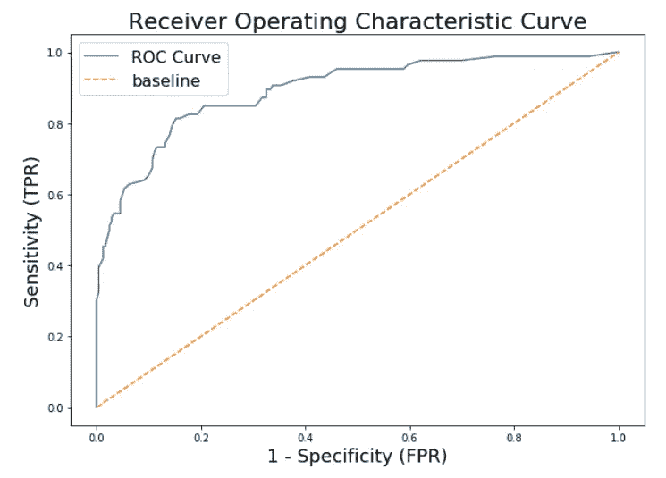

# 机器学习中的 ROC 曲线

> 原文：<https://towardsdatascience.com/roc-curve-in-machine-learning-fea29b14d133?source=collection_archive---------40----------------------->

## 曾经对 ROC 曲线的工作原理感到困惑吗？这可能会把一些碎片拼在一起。

二元分类的逻辑回归模型中的默认设置是将预测概率为 0.5 或更高的所有结果分类为 1。低于 0.5 的概率值被分类为 0。

如果我们可以把这个阈值设为 0.5，并增加或减少它，会怎么样呢？它将如何影响分类模型正确预测正面结果的能力？这些正是 ROC 曲线旨在以高度可解释的方式直观回答的问题。

ROC 曲线绘制在图表上，Y 轴为真阳性率(灵敏度), X 轴为假阳性率(1 -特异性)。对于从 0 到 1 的许多阈值，发现了 TPR 和 FPR 的值。这些值随后被绘制在图表上。我基于逻辑回归问题创建的基本 ROC 图如下所示:



解释:

这里的主要目的是在 ROC 曲线上找到一个点，在该点下的面积最大。这是因为在这一点上，模型可以正确地区分二进制类，它们之间的重叠最小。

休·哈维博士的一幅精美简洁的图像可以用来更好地理解这一点。

Harvey, H. (2019). [image] Available at: [https://twitter.com/DrHughHarvey/status/1104435699095404544](https://twitter.com/DrHughHarvey/status/1104435699095404544) [Accessed 18 Jul. 2019].

因此，随着 AUC 的增加，二元类之间的重叠减少。在那个特定的阈值点，模型可以最好地区分类别。以下列出了 ROC AUC 的一些重要要点:

*   **ROC AUC 为 0.5 表明阳性和阴性数据类别完全重叠，该模型基本上是无意义的，仅相当于简单的猜测**
*   **ROC AUC 为 1 表示正负数据类别完全分离，模型尽可能高效。**
*   **你的 ROC AUC 越接近 1 越好。**

最后总结一下，ROC 曲线是通过将我们的阈值从 0 变到 1 来为每个模型生成的。它最终帮助我们可视化*灵敏度*和*特异性*之间的权衡，并理解我们的数据类是如何分离的。

**附加 cookie:**

使用以下 python 代码可以很容易地找到 AUC 分数:

```
from sklearn.metrics import roc_auc_scoreroc_auc_score(‘Actual Values’, ‘Predicted Probabilities’)
```