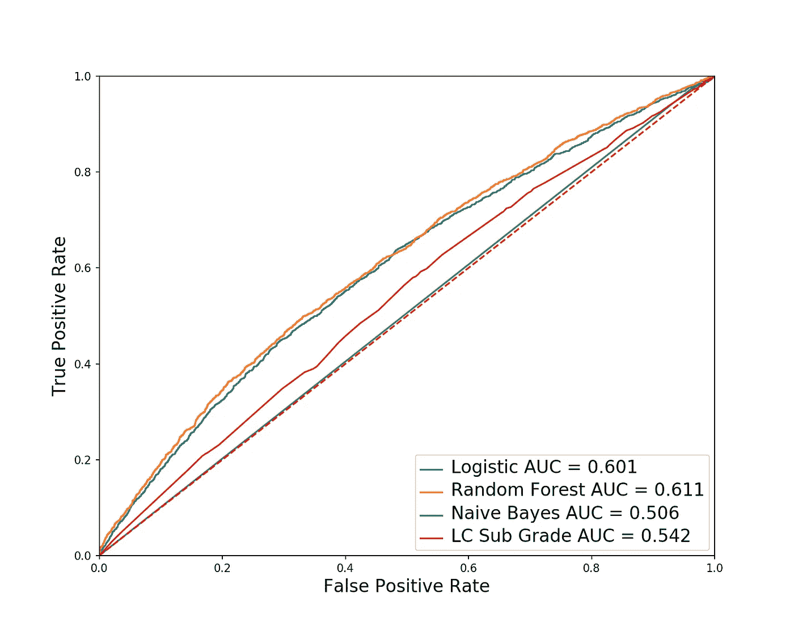
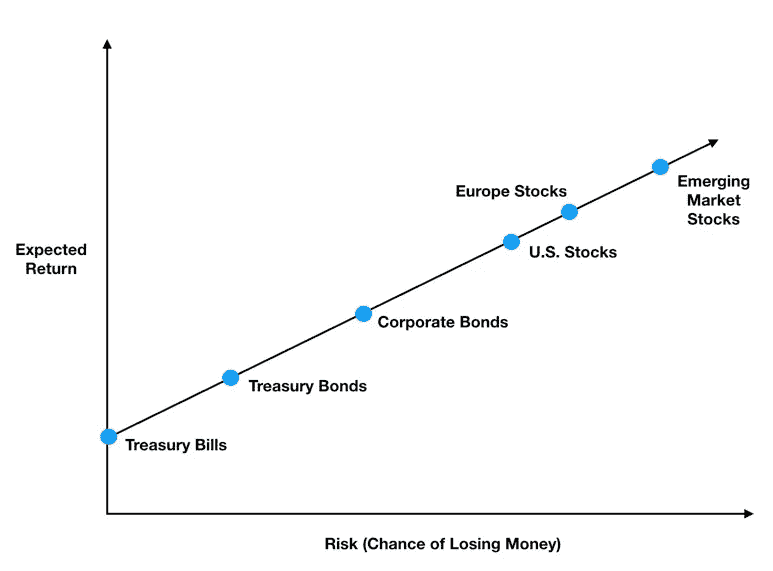
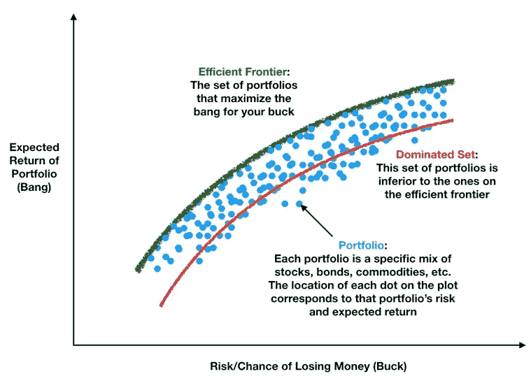
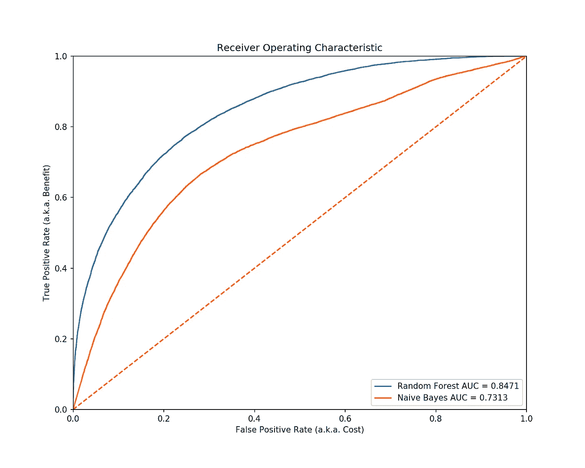
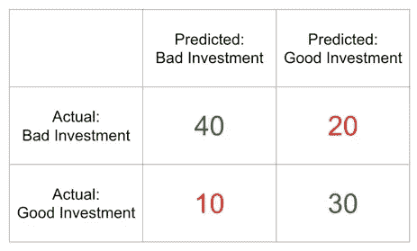

# ROC 曲线和有效前沿

> 原文：<https://towardsdatascience.com/roc-curves-and-the-efficient-frontier-7bfa1daf1d9c?source=collection_archive---------24----------------------->

## 解释如何用一点金融来解释 ROC 曲线

第一次看到一个 [ROC 曲线](https://en.wikipedia.org/wiki/Receiver_operating_characteristic)(受试者工作特性)，很迷茫。为什么数据科学家和统计学家对同一个事物有这么多的称呼(例如，回忆和敏感度是同一个事物，而敏感度和真实肯定率是同一个事物)？这条曲线到底想告诉我什么？

但是在思考和使用它们之后，我意识到 ROC 曲线基本上是你的模型的成本/收益曲线。更具体地说，ROC 曲线是金融市场有效前沿曲线的数据科学表亲。

## 有效边界

让我先戴上我的金融帽子。金融的核心概念之一是风险和回报之间的权衡——你的钱面临的风险越大，你就应该得到越多的补偿(通过更高的预期回报)。尽管风险的定义在很大程度上取决于你的性情和投资哲学，但潜在的直觉很有意义:如果你没有得到回报，为什么还要承担额外的风险？

As your risk increases, you should demand a higher expected return as compensation

虽然你可能不一定同意前一个图中资产的等级顺序，但它表达了这一点。然而，这并不是故事的全部。没有人只持有股票或债券的投资组合。我们持有多样化的投资资产组合。那么当我们开始投资股票、债券、黄金等时，风险和收益曲线会发生怎样的变化呢？在同一个投资组合中。也就是说，如果我们计算我们可能持有的所有投资组合的风险和回报值，然后将它们全部绘制在散点图上，风险和回报图会是什么样子？它看起来会像这样:

The Efficient Frontier

眼熟吗？它看起来就像一条 ROC 曲线！上图中的曲线，我们称之为有效边界，是投资世界的关键[。它可能值得自己的一系列博客文章，但这里要注意的要点是:](https://en.wikipedia.org/wiki/Modern_portfolio_theory)

1.  蓝点代表的投资组合受曲线绿线(有效边界)上的投资组合支配。这意味着，一个理性的投资者永远不会想持有红线上的劣质投资组合，因为对于相同的风险，他可以在有效边界上获得更高的回报。对于一组给定的投资资产，只有一个有效边界。
2.  为什么有效前沿线有曲线形状？因为承担更多风险的回报是递减的。在这一点上，我无法说得很清楚，但回报减少的原因是，随着你在风险曲线上越走越远(在 X 轴上向右移动)，你的投资组合越来越集中在股票和其他风险资产上。这些风险资产高度相关，所以你开始失去投资组合多样化的好处。我们将在后面看到 ROC 曲线以类似的方式表现。

# 回到数据科学

那么，为什么要谈论金融和有效边界呢？这不是数据科学的帖子吗？这是因为当它影响我们的钱包时，成本和收益是最直接和最容易理解的。为什么有效边界有吸引力应该是显而易见的——沿着它的投资组合给你带来最大的投资回报。ROC 曲线的工作方式也是一样的——下方面积最大的曲线代表能给我们带来最大收益的模型。**这个模型基本上就是你的数据科学有效前沿**。

在 ROC 曲线的情况下，什么是收益(砰)，什么是成本(美元)？让我们来看看实际的 ROC 曲线。

ROC is your model’s Cost vs. Benefit Curve

收益是你的模型的真实阳性率，成本是假阳性率(我稍后会用简单的英语解释这个，请耐心听我说)。就像投资组合风险和回报一样，我们希望找到一个模型，对于给定的假阳性率，该模型能给出最高的真阳性率。在上面的 ROC 曲线图中，random forest 的曲线下面积最高(0.847)。正如你所看到的，对于任何假阳性率，它都会产生最高的真阳性率(只需将手指放在 X 轴上的任意一点，然后垂直向上移动；你穿过的最后一条线是给你最大爆炸的模型)。曲线下的区域全面总结了模型在不同成本水平上的性价比。

# 混乱矩阵

现在让我们用一个例子来解释成本和收益的含义。在二进制分类问题中，我们试图将观察结果分为两组，如*好投资*对*坏投资。*下面的 2 乘 2 矩阵(称为混淆矩阵)显示了一个简单的股票预测模型的结果，该模型试图猜测股票在未来 12 个月内是上涨还是下跌(数据是虚构的，仅供说明)。

We are trying to predict whether a stock will go up or not over the next 12 months

红色的数字代表不正确的预测，而绿色的数字代表正确的预测。ROC 曲线很酷的一点是，它在一个图表中捕捉了所有这四个数字，并直观地显示了它们之间的权衡。

## 轰动/好处

让我们先计算一下我们的收益(真实阳性率):

> 真阳性率= 30 / (10 + 30) = 75%

那 75%是什么意思？总共有 30 + 10 = 40 个好的投资，我们正确地预测并利用了其中的 30 个，或 75%。还不错！尽管真正的正回报率是我们模型的优势，但请注意，它的计算包括了我们错误预测为不良投资的 10 只股票(预测=不良，实际=良好)。因此，真正的正利率(我们的 bang)是一个既包括我们的正确预测，也包括我们的**机会成本**(当它实际上是一只好股票时不投资的结果)的数字。

机会成本一点都不好玩，那么我们该如何降低它呢？在之前的 ROC 曲线中，看橙色线(朴素贝叶斯)。如果我们愿意承担最大成本(大约 100%的假阳性率)，预测一切都是好的投资，会发生什么？在这种情况下，你抓住了每一个好的投资，但却招致了巨大的成本。

还要注意，在上面的 ROC 曲线示例中，随机森林能够将机会成本降低到几乎为零，而朴素贝叶斯却无法在不导致最大成本的情况下做到这一点。一般来说，我们总是不得不接受至少一些错过的机会。最后，注意 **ROC 曲线展示了与有效前沿相同的收益递减**。这意味着每一次减少错失机会的尝试都会让你付出更多的代价。

## 美元/成本

在减少错过的机会(也称为假阴性)和增加我们模型的假阳性率(成本)之间有一个权衡。让我们先计算一下上一个例子的成本:

> 假阳性率= 20 / (40 + 20) = 33%

这意味着有 40 + 20 = 60 个不良投资，不幸的是，我们被其中的 20 个，或者 33%困住了。在我们的例子中，这些是真正的负成本，而不仅仅是错过的机会。我们投资了，损失了 20 倍，哎哟！

让我们更深入地研究 ROC 曲线所代表的成本与收益的权衡。假设我的模型有真实的信号(它不只是产生随机噪声)，我可以使用一个概率阈值来调整它打开的频率。例如，如果我将阈值设置为 90%(只有当模型给出 90%或更高的概率时，才预测一个好的投资)，它几乎永远不会开启——但当它开启时，我们会期望更多的时候赚钱。

另一方面，如果我将阈值设置为 10%，我们的模型将一直开启。我们会投资大量的股票，但更多的股票(相对于 90%门槛的情况)是赔钱的。这些赔钱的人是**假阳性**，我们在追求尽可能多的好投资(真阳性)的过程中付出的代价。

# 把这一切联系在一起

如何适当地调整您的模型的阈值是另一天的主题。这在很大程度上取决于你的模型的个体特征，假阳性和假阴性的平均成本，等等..

但我希望大家从所有这些中吸取的一个关键点是，每个分类模型都可以在以下两者之间进行权衡:

*   **机会成本**:你的模型预测的**收益**/真阳性率越高，你错过的机会就越少，你的机会成本就越低。但是，当你降低机会成本时，你最终会撒下更大的网，随着更多真正的积极因素，你也会捕捉到更多…
*   **误报**:较高的误报率意味着你的模型采取更多的行动，但也更容易出错。这些误报就是你产生的**成本**。

ROC 曲线是特定模型如何有效地权衡成本和收益的可视化。这就是为什么曲线下面积最大的模型，如有效边界模型，在以产生的成本提供最大收益方面优于其他模型。