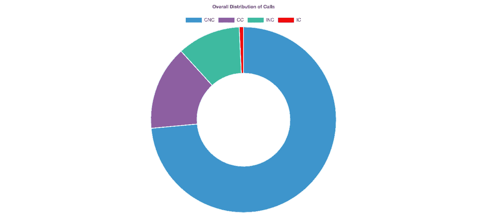
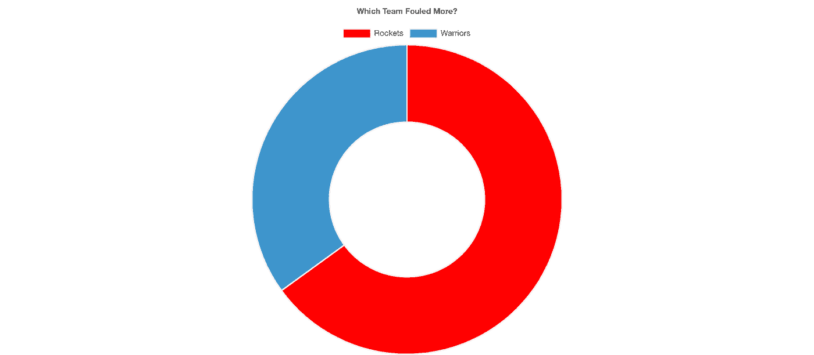
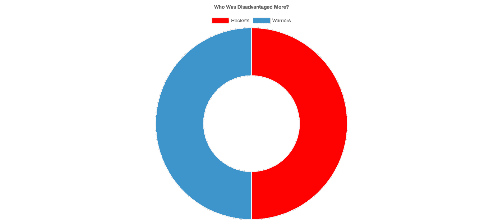

# 火箭 vs 裁判？

> 原文：<https://towardsdatascience.com/rockets-vs-refs-a85e0428e8f1?source=collection_archive---------32----------------------->

NBA 季后赛即将来临，每个人都很高兴看到联盟的巨头们为赢得梦寐以求的冠军而对决。在东部联盟，扬尼斯·阿德托昆博和密尔沃基雄鹿队希望横扫科怀·伦纳德和多伦多猛龙队。在勇士队在第六场比赛中主场击败休斯顿火箭队后，金州勇士队现在发现自己处于横扫波特兰开拓者队的位置。

在整个系列赛中，詹姆斯·哈登表达了他的沮丧，尤其是在第一场比赛后的采访中。

> “我是说，我只是想要一个公平的机会，伙计，”

他认为裁判让他输掉了系列赛的第一场比赛。他并不孤单，因为粉丝们也有同感。他们的抗议有一定的合理性吗？

2015 年，NBA 实施了最后两分钟报告。它详细记录了裁判在比赛最后两分钟做出的每个决定。通常在比赛后一天发布，一份报告详细说明了裁判在比赛最后两分钟内必须做出的每一个决定。在汇总了系列赛中的每一份报告(除了第六场比赛，因为 NBA 没有发布它)后，我们可以看到裁判在比赛的最后阶段有多准确。

这些报告将呼叫分为以下类别:

**错误呼叫(IC):进行了错误呼叫**

**不正确的非通话(INC):应该打电话但没有打**

**正确的呼叫(CC):做出了正确的呼叫**

**纠正不判罚(CNC):裁判没有判罚是正确的**

这个系列是这样分解的:

总的来看，裁判在最后时刻要做出 136 个判罚。在被要求做出决定的次数中，只有 16 次是错误的。这意味着在整个系列赛中，裁判 88%的时间都是正确的。

对于每一种叫牌类型，报告都会分配一个承诺玩家/球队和一个劣势玩家/球队。当我们看数据时，我们看到火箭的犯规几乎是勇士的两倍(13 次对勇士的 7 次)。火箭犯规更多，但他们应该得到判罚，所以说裁判作弊或有偏见是不公平的。

好吧，火箭犯规更多，所以他们应该为他们的失败负责，对吗？让我们先深入一点。

到目前为止，我们只分析了正确的调用。我们的目标是考虑可能显示偏见的呼叫。

正确的判断(顾名思义)是正确的，因此不能用来确定偏见。在这些情况下，正确的呼叫是应该的，因此我们无法确定恶意意图。

相反，查看不正确的电话可能能够说明问题。

不正确的吹罚可能是裁判对情况视而不见，而不正确的吹罚可能表明裁判在积极帮助球队获胜。

确定了衡量偏差的最佳方法后，我们可以查看数据，看看裁判的表现如何。

看起来犯规判罚并没有偏袒一方。在 16 次不正确的吹/不吹中，每个队有 8 次处于劣势。因此，尽管裁判 88%的时候都是正确的，但他们对两队来说都是同样错误的。

在第一场比赛后，金州勇士队的德雷蒙德·格林指出，

> “我想我们可以在每场比赛后都坐在这里抱怨裁判的判罚。这就是我们玩的游戏的本质。裁判是一门不精确的科学。原来如此。”

德雷蒙德·格林可能是对的，但正如证据所表明的，裁判可能不是这次的问题。

如果你有兴趣得出自己的结论，数据和我的代码可以在这里找到****。****