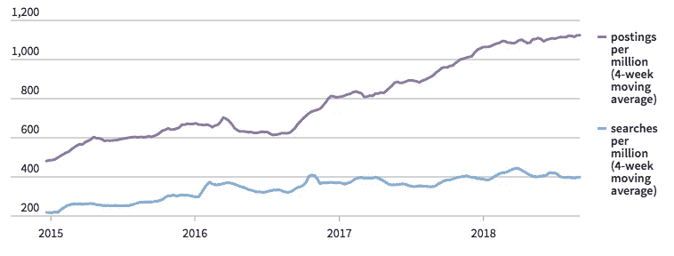
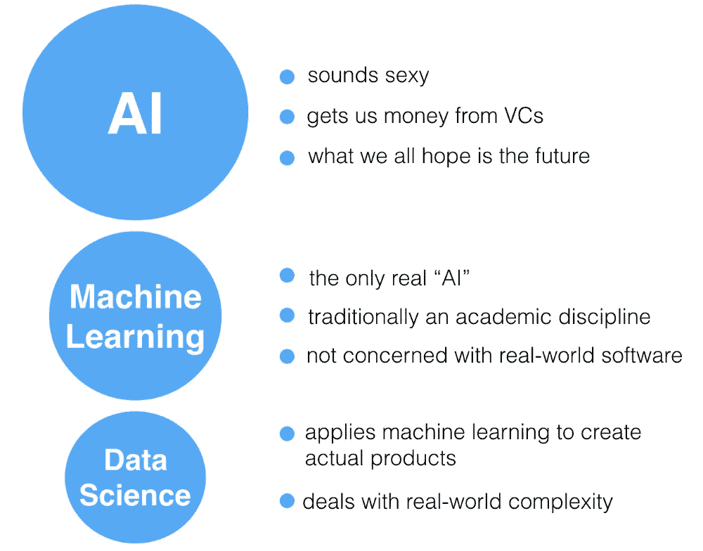
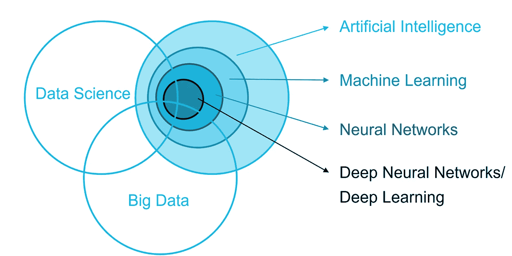

# 数据科学在人工智能中的作用

> 原文：<https://towardsdatascience.com/role-of-data-science-in-artificial-intelligence-950efedd2579?source=collection_archive---------4----------------------->

电子表格的时代已经结束。谷歌搜索，护照扫描，你的网上购物记录，一条微博。所有这些都包含可以收集、分析和货币化的数据。超级计算机和算法使我们能够实时理解越来越多信息。在不到 10 年的时间里，CPU 有望达到人脑的处理能力。

随着大数据和快速计算能力的兴起，许多组织的首席执行官、首席技术官和决策者都在想办法创新他们的公司。当他们想要推出新产品或服务时，他们希望通过数据分析来洞察市场、需求和目标人群等。人工智能和机器学习正在快速被企业采用。这一趋势很可能会上升。

让我们来看一些统计数据:

根据 IDC 的数据，2018 年全球在人工智能和认知技术上的支出将达到 191 亿美元，比一年前增长 54.2%。到 2021 年，人工智能和认知支出将达到 522 亿美元。

人工智能技能是 [LinkedIn](https://economicgraph.linkedin.com/research/linkedin-2018-emerging-jobs-report) 上增长最快的技能之一，从 2015 年到 2017 年增长了 190%。

> 当我们谈论“人工智能技能”时，我们指的是创造人工智能技术所需的技能，包括诸如**神经网络**、**深度学习**和**机器学习、**等领域的专业知识，以及实际的“工具”，如 **Weka** 和 **Scikit-Learn。**

# 招聘:人工智能专家

在人工智能领域，职位空缺比求职者上升得更快。

AI-related jobs include machine learning engineer, predictive modeler, cmt analytics manager, data scientist, computer vision engineer, computational linguist, and information strategy manager.
Source: Indeed.com

没有什么能减缓人工智能的传播。科技公司正在大力投资 it，普华永道的一份报告估计，到 2030 年，人工智能可以为全球经济增加 15.7 万亿美元——并推动北美的 GDP 增长 14%。

也许机器学习最引人注目的方面是它看似无限的适用性。已经有很多领域受到 ML 和现在 AI 的影响，包括教育、金融等等。机器学习技术已经应用于医疗保健领域的关键领域，影响了从减少护理差异到医学扫描分析的方方面面。

# AI 到底是什么？

> 人工智能是“貌似智能的算法”的一般领域，目前机器学习是该领域的前沿。

随着时间的推移，我们对人工智能的定义发生了变化。从 1939 年的智能机器人开始，我们已经走了很长一段路，如下图所示。

Source: 1939 I AM A SMART FELLOW ROBOT TALKS Stock Footage

人工智能只是一台能够模仿或模拟人类思维或行为的计算机。其中，有一个子集叫做机器学习，它现在是人工智能最令人兴奋的部分的基础。通过允许计算机学习如何自己解决问题，机器学习取得了一系列突破，这些突破一度似乎几乎不可能。这就是电脑可以在照片中认出朋友的脸或者驾驶汽车的原因。这就是人们积极谈论类人人工智能到来的原因。

A simplified explanation of AI, Machine Learning, and Data Science. Source: Suraj Jena, June 10, 2018

# 那么，机器学习和数据科学是如何交叉的呢？

> 机器学习是人工智能的一个分支，其中一类数据驱动的算法使软件应用程序能够高度准确地预测结果，而不需要任何显式编程。

这里的基本前提是开发能够接收输入数据并利用统计模型预测输出的算法，同时随着新数据的出现更新输出。

所涉及的过程与预测建模和数据挖掘有许多共同之处。这是因为这两种方法都需要搜索数据来识别模式并相应地调整程序。

我们大多数人都以这样或那样的形式体验过机器学习。如果你在亚马逊上购物，或者在网飞上看了一些东西，这些个性化的(产品或电影)推荐就是机器学习在起作用。

另一方面，数据科学采用数学和统计学等计算机科学学科，并融合了数据挖掘、聚类分析、可视化以及机器学习等技术。

> 因此，两者之间的主要区别在于，作为一个更广泛的术语，数据科学不仅关注算法和统计，还关注整个数据处理方法。

机器学习是人工智能的一个子集。虽然数据科学是从数据中提取知识或见解的跨学科领域

VENN diagram of AI, Big Data and Data Science Fraunhofer FOKUS

# 人工智能技术中如何使用数据科学领域的例子

[**IBM Watson**](https://www.ibm.com/watson/health/index-1.html) 是一项人工智能技术，可以帮助医生快速识别患者病历中的关键信息，以提供相关证据并探索治疗方案。它接受患者的医疗记录，然后根据来自 300 多种期刊、200 多本教科书和 15 多页文本的信息提供基于证据的个性化建议，这使医生可以即时访问大量针对患者治疗计划的个性化信息。

**蓝莓。这个机器人在被喂以成千上万部电影的字幕后，可以表演即兴喜剧。[科里·马修森](https://korymathewson.com/)，埃德蒙顿阿尔伯塔大学的人工智能研究员，创造了一种算法[，旨在与他在舞台上即兴表演](https://www.newscientist.com/article/2179506-ai-tries-bad-improv-comedy-to-trick-people-into-thinking-it-is-human/)。他训练它创造用于即兴表演的对话线，当对话有意义时奖励它，当它吐出胡言乱语时惩罚它。**

虽然蓝莓不会很快在第二城市试镜，但这个可爱的机器人偶尔会用有趣的台词击中要害。我将展示一个蓝莓的短片作为结束。

Kory Mathewson, inventor of Blueberry. Video Credit: Bloomberg, Hello World, Is AI Ready for Improv Comedy

**参考文献:**

“*随着公司拥抱人工智能，这是一个求职者的市场*”，Ann Saphir，2018 年 10 月 15 日

“*人工智能能否取代数据科学家*？”佩德罗·乌里亚-雷西奥，2018 年 9 月 14 日

"*AI 准备好即兴喜剧了吗*"，彭博商业周刊，《你好世界》第一季第 16 集，2018 年 6 月 11 日

"*专家谈:数据科学 vs .数据分析 vs .机器学习"*，Sarihari Sasikumar，2018 年 10 月 18 日

“ *I .将‘G’放在‘AI’中:人工智能(狭义/应用)中使用的术语概述——以及它们彼此的意义*”，Suraj Jena，2018 年 6 月 10 日

“*媒体领域的人工智能和机器学习*”，弗劳恩霍克·福库斯

“*人工智能通过生产力和个性化改进推动 GDP 增长 15.7 万亿美元*”，普华永道出版社，2017 年 6 月 27 日

"*根据 IDC 2018 年 3 月 22 日发布的新支出指南*，到 2018 年，全球在认知和人工智能系统上的支出将增长至 191 亿美元

“*领英 2018 新兴工作报告*”，领英，2018 年 12 月 13 日