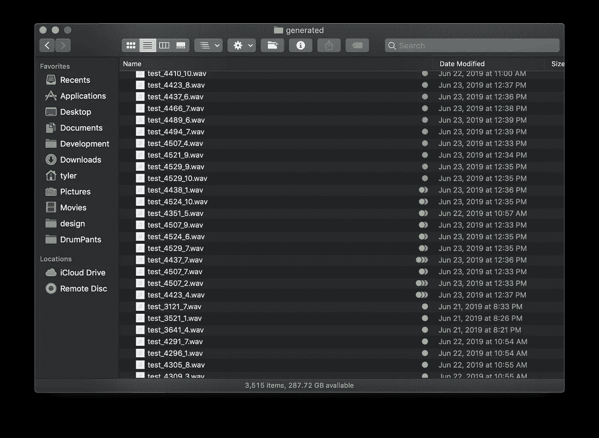
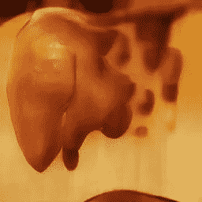

# 在深度学习中滚动

> 原文：<https://towardsdatascience.com/rolling-in-the-deep-learning-39d1fea6184?source=collection_archive---------27----------------------->

## 在现有艺术家身上训练人工智能来创作新颖的音乐

我用几种机器学习技术制作了这个音乐视频。音乐是由一个人工智能在阿黛尔的专辑“21”上训练了两周产生的。视觉效果是由一个人工智能生成的，该人工智能从她的歌曲“在深渊中翻滚”的每一行歌词中创建了图像。他们一起创造了一个有趣的，也许是令人不安的机器辅助创作的观点。

这一切都始于我和我的朋友们玩的一个叫做 Cover Me Badd 的活动/游戏。这有点像带回家的卡拉 ok，或者 DIYMTV。每个季度，你组建一个乐队，然后选择一首翻唱歌曲。但你不能翻唱这首歌。我们把所有的歌曲放进一顶帽子里(嗯，一顶虚拟的帽子)，把它们混在一起，然后随机分发给每个乐队，所以你必须翻唱别人提交的一首歌。然后你录下这首歌，制作一个音乐视频，我们在最后聚在一起开一个大派对，看所有的视频。

这个季度，我被安排去采访阿黛尔的《在深渊中翻滚》。我知道我不可能唱好这首歌，因为我的声音太难听了。所以我训练了一个机器人为我唱歌。

# 训练“Adeldroid”

我最近发现了 SampleRNN，这是一种机器学习算法，可以从音频样本中学习，然后吐出类似的声音作为输出。达达机器人小组已经使用 SampleRNN 制作了一个无尽的死亡金属电台。他们还训练了一名披头士乐队的模特，创作了[《深入披头士》专辑。](https://www.youtube.com/watch?v=exXUPJRZKZ0)

这个概念有点简单:你把一个音乐源(作为 PCM。wav 文件)，将其分割成小段，然后从这些小段中随机选取，并将它们输入到递归神经网络中。每次你给它输入一些片段，这个模型就能更好地模仿那个声音。前 500-1000 次迭代将是噪音和静态的，但过一会儿它的输出将开始成形，听起来类似于你喂它的东西。它可以模仿声音、吉他、钢琴、鼓——如果你的训练数据是这样的话，甚至可以同时模仿。

Here’s what successive trainings of SampleRNN on Ariana Grande sounds like

现在，如果你在你的家用电脑上训练这个模型，可能需要几个月才能得到有用的东西。你需要的是一个特别为机器学习而构建的非常强大的 GPU。在我写这篇文章的时候，最好的是 NVidia Tesla P100，如果你想要自己的，价格在 10，000 美元左右。幸运的是，我们可以简单地从云中租用一个(这仍然是一个很大的成本，但比投资自己的硬件要少得多)。

有几家公司会让你在云中使用他们花哨的 GPU。由于我在谷歌工作，我决定使用谷歌云平台的计算引擎。他们有一个预构建的虚拟机映像，其中已经安装了所有 NVidia CUDA 驱动程序和 Tensorflow 等机器学习软件，并准备好在他们的 [Google Cloud 深度学习虚拟机映像](https://cloud.google.com/deep-learning-vm/)中使用。你只需点击按钮，它就会为你提供一个带有 Tesla GPU 的虚拟机，然后你登录并复制你的音乐文件和用于 Tensorflow 代码的 [SampleRNN，并立即开始训练。](https://github.com/Unisound/SampleRNN)

> 提示:确保在运行训练命令之前运行[屏幕 Linux 实用程序](https://linuxize.com/post/how-to-use-linux-screen/)，这样它就不会在你退出时被杀死。

那你等着。我对我的模型进行了大约 4500 次迭代，持续了大约两周。(按照特斯拉虚拟机每小时 50 美分的价格，大约是 170 美元。所以，是的，创造你自己的唱歌机器人并不便宜。)

我会每天登录，检查最新的样品，以确保它们是好的。有几次，代码因为超出界限的无限值而崩溃。没关系，你可以删除最后几个快照，然后从那里重新开始训练，这样通常就可以了。

一旦我对进度感到满意(大约在第 3500 次迭代时)，我停止了训练，并将样本输出持续时间从每 10 次迭代生成 3 秒剪辑(这对测试很有好处，因为它们会减慢训练过程)提高到每一次迭代生成 8 秒剪辑。我又让它运行了几天，以产生一个我可以从中提取的好的素材集。

# 拼凑机器人的散文诗

然后，我把我从云端生成的所有样本下载到我的电脑上，开始了漫长而艰苦的分类过程。人工智能创造的背后隐藏着大量的人类劳动，从收集人类创造的内容的数据，到使用发展中国家的数字劳动力(例如机械土耳其人)来标记训练数据，到聚合和排序模型的输出并微调参数。

我亲身经历了后者。我的分类系统是基于 macOS 的 Finder 颜色标签:

*   **红色/橙色/黄色**:人声(红色最好，黄色……不太好)
*   **绿色**:环境/旋律乐器
*   **紫色/蓝色**:鼓/低音/背景节奏
*   **灰色**:怪异/另类/最爱

由于我对将近 1500 个剪辑进行了分类(只有迭代 3000 到 4500 是可列表的)，并且每个迭代有 10 个剪辑，我将从每个迭代中抽取几个剪辑。如果某件事真的很有希望，我会在同一个迭代中听更多，否则我会尽可能快地完成它们。

一旦我完成了对最好的样本的标记，我必须将它们排列成某种“歌曲”，有开头、中间和气候结尾，希望能创造出一种旅程，而不是仅仅将随机的片段连接在一起。我真的受到了乐队 [Yacht 与机器学习](https://www.youtube.com/watch?v=pM9u9xcM_cs)合作的技术的启发，并试图适应他们在与 AI 合作时强加给他们创作过程的“规则”:

> 你们中的一些人可能知道，使用机器学习来制作一首有结构的歌曲，有开头，中间和结尾，有独唱，合唱，独唱，仍然有点，超出了我们的能力范围。但这是一件好事，因为旋律是模特的工作，但编曲和表演完全是我们的工作。
> 
> 所以对我们来说，我们决定用这个过程创作的每一首歌都必须从我们备份目录中的现有旋律中插入…我们还决定不能添加任何音符。我们无法添加任何和声。我们不能即兴演奏或解释，或者从根本上说，不能以任何方式创新。没有加法改变，只有减法或换位改变……我们可以随心所欲地构造、剪切和拼贴。

现在，他们想出的规则是处理由人工智能生成的纯 MIDI 音符，而不是实际的音频样本，所以他们有更多的自由，但我喜欢他们的坚韧，并决定在同样的限制下工作。最终我想出了[你一开始听到的音乐](https://youtu.be/LVtWunaTyZs)。

如果我再做一次，我想我会稍微放松一下约束，并尝试将人工智能生成的样本分层到一些更连贯的节拍上，至少保持稳定的节奏，因为人工智能样本非常有节奏和混乱。或者我会从生成的样本中拼接出某些声音，并在采样器中使用它们来创作我自己的旋律。

我还有一个假设，可能会提高模特的节奏感。不是以固定的 3 秒钟间隔随机切割训练输入并将其投入到模型中，而是将所有歌曲的时间扭曲为相同的速度。然后根据速度将它们分割成一个小节的持续时间或其他固定数量的节拍，并将其输入神经网络。如果你能给它输入训练数据，所有数据都有相同的规律节奏，它可能会选择更有节奏的队列，并学会发出更稳定的鼓声。下次要尝试的东西。

# 生成视觉效果

因为 Cover Me Badd 需要一个音乐视频，我需要一些视觉效果。我刚刚听说了这个叫做 [Runway](https://runwayml.com) 的新应用，它非常棒，尤其是对于那些想要开始 ML 的艺术家来说。它开放了几十种不同的机器学习模型，经过预先训练，点击按钮即可使用。你只需输入或拖放你的输入(文本、图像、视频等)，它将在你的本地机器或云中运行它，并给你结果。它也有一个很棒的 API，可以通过 MIDI、OSC 或 HTTP/JSON 接受输入并产生输出，所以你可以将其连接到许多不同的乐器/应用程序或你自己的代码中。

The image for the lyric “You had my heart inside your hand”

我决定在 Runway 中使用 [AttnGAN 模型](https://docs.runwayml.com/#/tutorials/tutorial_t2i)，它接受文本作为输入，生成图像作为输出。我把它连接到我写的 Javascript 上，一行一行地输入阿黛尔的“在深渊中翻滚”的歌词，每行一张图片。我真的很喜欢它所产生的抽象但令人不寒而栗的可识别的图像。

我首先想滚动所有的图像以及产生它们的歌词，然而，结果是一次看太多了。所以我删除了歌词，并使用 [P5.js](https://p5js.org) 编写了一个小算法，在图像滚动时将它们“融合”到一起。把它们扔在一起，还有维奥拉！我成功地避免了为我的封面和提交播放任何音乐！

我的朋友在聆听聚会上说的一句令人难忘的话是，“这个机器人需要学习让音乐变得更好！”嗯，是的，但是 200 美元是它能学会的最好的了。