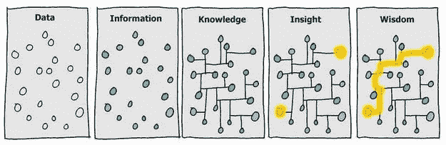

# 数据去神秘化— DIKW 模型

> 原文：<https://towardsdatascience.com/rootstrap-dikw-model-32cef9ae6dfb?source=collection_archive---------11----------------------->


## 首先了解全局将为这一旅程的成功奠定基础

总体而言，数据是科技和商业领域最大的新趋势之一。数据“专家”正迅速成为行业中薪酬最高的个人，每家公司都希望在数据能力的浪潮中冲浪。

它正在成为理解我们周围世界的一种基本方式。我们可以将数据科学视为认识论或一种认知方式。我们可以想一想，处理问题和解决问题的方法。

但正如任何新趋势一样，我们必须问自己:所有这些流行语实际上意味着什么？

什么是数据科学家？简而言之，**比任何软件工程师更擅长统计，比任何统计学家更擅长软件工程的人。**

本文的目标是揭开数据分析的神秘面纱。我们将解释这些流行语的含义，大数据能做什么和不能做什么，以及如果您要加入数据列车，应该探索哪些技术

本文是关于数据分析的四篇系列文章的第一篇。我们将从一些基础知识开始，然后在此基础上一步一步地解释计算和思维过程中更复杂和更强大的系统，并帮助您理解为什么每个人都对数据如此着迷。

# 迪克夫金字塔

在开始讨论数据分析之前，让我们从一个简单但极其重要的概念开始:DIKW 金字塔。虽然许多人熟悉金字塔，但很少有人了解如何解读它，如何使用它，以及他们自己的立场。


DIKW Pyramid

要详细说明这个概念，请听 Jennifer Rowley (2007):“通常信息是根据数据定义的，知识是根据信息定义的，智慧是根据知识定义的。”

现在让我们来解释金字塔的每一层。

**数据**只是一组信号或符号。仅此而已——只有噪音。它可能是服务器日志、用户行为事件或任何其他数据集。它是无组织的，未经加工的。它是惰性的。如果我们不知道这意味着什么，这是没有用的。

当你开始让数据变得有用时，你就获得了**信息**。当我们应用系统来组织和分类数据时，我们可以将这种非结构化的噪音转化为信息。这个阶段应该回答“什么”、“什么时候”和“谁”的问题。简而言之，信息是有意义的数据。这个“意义”可能是有用的，但并不总是有用的。

知识是旅程的下一步，也可能是最重要的一步。它隐含地需要学习。这意味着我们可以获取数据，对其进行分类和处理，生成信息，然后以一种有用的方式组织所有这些信息。信息可以帮助我们理解关系，而知识让我们发现模式。这是让我们建立预测模型并产生真实见解的基础。我喜欢的一个定义是，知识是一种心理结构，由积累的学习和对信息的系统分析构成。

**智慧**是最后的边疆。它允许我们正确地预测未来，不仅通过检测和理解模式，而且深入理解这些模式背后的“为什么”。智慧是关于未来的:它依赖于知识和模式模型，但它可以帮助塑造你的“直觉”和直觉，给你一个指数级的竞争优势。知识会因为现实的快速变化而快速老化，但智慧会更加僵化。目前，这是一项纯粹的人类技能，但人工智能正在快速追赶。当人工智能变得比人类智慧更好时，*结果将是不可预测的*。

下图完美地展示了这种思维模式:



A different view of the DIK(I)W Pyramid

这个例子还引入了'**洞察力**的概念，有时也称为'**智能**。这是智慧的零星体现。洞察力是连接知识和智慧的纽带。

# 虚假的例子

**数据**:下雨了

**信息**:一小时内气温下降了 5 度，湿度上升了 5%，下午 3 点开始下雨。

**知识**:湿度的快速增加，伴随着低压区引起的温度下降，将可能使大气无法保持水分和雨水。

智慧:根据观察和数学模型，我们可以预测未来下雨的原因和时间，而且我们可以如此快速系统地预测，不需要太多的分析。我们已经了解了蒸发、气流、温度梯度、变化和降雨之间发生的所有相互作用。

# 奖励积分

***代表性启发式*** 被我们的大脑用来推断模式。我们的大脑使用其大部分能力来创造模式，并沉迷于试图理解和预测现实世界中的模式。这意味着在处理数据时，我们需要非常小心，避免过早下结论。知道我们有这种到处追逐和看到模式的倾向，可以帮助我们在推断模式时慢下来。这是一个值得单独写一篇文章的主题，但是最好从一开始就记住。

***可用性偏差*** 与前面的概念有些关系。这是一种思维捷径，依赖于即时、紧急的信息，并试图仅使用最明显的信息来概括研究结果。在这种偏见下，人们倾向于对更近的信息做出更重的判断，使新的观点偏向最新或最接近的新闻。你可以在下面的文章中了解更多。

[](https://medium.com/@anthony.figueroa/availability-heuristic-8b70e38afec8) [## 可用性启发式

### 它是什么？它如何影响我们的决策过程

medium.com](https://medium.com/@anthony.figueroa/availability-heuristic-8b70e38afec8) 

# DIKW 等级的起源

不是数据科学。即使是工程领域也不行。这种心理框架的起源是诗歌。诗人 T.S .艾略特是第一个提到“DIKW 等级制度”的人，尽管他没有用那个名字来称呼它。1934 年艾略特在《岩石》中写道:

```
Where is the Life we have lost in living? 
Where is the wisdom we have lost in Knowledge? 
Where is the Knowledge we have lost in Information?
```

虽然这是第一次提到艺术中的等级制度，但不是唯一的一次。在管理和信息科学流行起来之前，弗兰克·扎帕在 1979 年提到了等级制度:

```
Information is not Knowledge, 
Knowledge is not wisdom, 
Wisdom is not truth, 
Truth is not beauty, 
Beauty is not love, 
Love is not music, 
and Music is THE BEST
```

# 参考

1.  拉塞尔·l·阿科夫，“从数据到智慧”，《应用系统分析杂志》16(1989):3–9。
2.  米兰·泽莱尼，“管理支持系统:走向综合知识管理”，《人类系统管理》7，第 1 期(1987):59–70。
3.  米（meter 的缩写））库利，建筑还是蜜蜂？(伦敦:霍加斯出版社，1987 年)。
4.  哈兰德·克利夫兰，“作为资源的信息”，《未来学家》，1982 年 12 月，第 34-39 页。
5.  艾略特，岩石(费伯和费伯 1934)。
6.  弗兰克·扎帕，“帕卡德鹅”在专辑乔的车库:第二和第三幕(塔记录，1979)。
7.  Nikhil Sharma，“数据信息知识智慧(DIKW)层次结构的起源”，(谷歌公司，2008 年 2 月)。