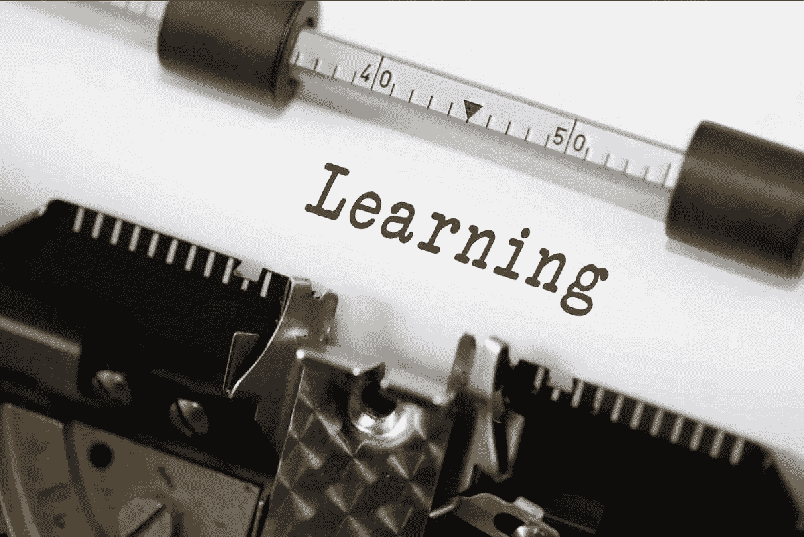

# 罗森布拉特的感知机，第一个现代神经网络

> 原文：<https://towardsdatascience.com/rosenblatts-perceptron-the-very-first-neural-network-37a3ec09038a?source=collection_archive---------6----------------------->

## 初学者深度学习快速入门。

在过去的十年里，机器学习已经在许多领域产生了变革性的影响，如认知神经科学、图像分类、推荐系统或工程。最近，*神经网络*和*深度学习*吸引了更多的关注，它们的成功被科学和主流媒体定期报道，例如 Deep Mind 的 AlphaGo 和 AlphaGo Zero 或最近的 [AlphaStar](https://deepmind.com/blog/alphastar-mastering-real-time-strategy-game-starcraft-ii/) 。这种新的兴趣部分是由于对开源库的访问，例如 [TensorFlow](https://www.tensorflow.org/) 、 [PyTorch](https://pytorch.org/) 、 [Keras](https://keras.io/) 或 [Flux.jl](https://github.com/FluxML/Flux.jl) 等等。

虽然这种对高效和多功能库的更多访问通过减少实现深度学习算法所需的计算机科学知识，打开了创新应用的大门，但仍然需要对基础数学理论的良好理解，以提出用于所考虑任务的高效神经网络架构。不幸的是，社会对数学的形象可能会吓跑学生(参见纪录片 [*我是如何开始讨厌数学的*](https://www.youtube.com/watch?time_continue=23&v=jSt6Opt5nm4) 以获得例证)。缺乏数学素养也可能是政治和非技术行业经常对深度学习的表现和能力持怀疑态度或过于乐观的原因之一。此外，[苏珊娜·沙特克](https://medium.com/u/a2db0221ff40?source=post_page-----37a3ec09038a--------------------------------)最近发表了一篇文章，讨论为什么[人们不信任人工智能](/people-dont-trust-ai-we-need-to-change-that-d1de5a4a0021)以及为什么业界可能不愿意采用它。她列举的一个关键原因(尽管不是唯一的原因)如下:

> 在 IBM2018 年的一项研究中，63%的受访者认为缺乏技术技能是人工智能实施的障碍。

 [## 人们不信任人工智能。我们需要改变这种情况。

### 94%的高管认为人工智能是业务的关键，但只有 18%的高管大规模采用了人工智能。问题是对人工智能的不信任——我们…

towardsdatascience.com](/people-dont-trust-ai-we-need-to-change-that-d1de5a4a0021) 

## 本系列的历史观点和目标

尽管深度学习只是在最近才成为主流媒体，但它的历史可以追溯到 20 世纪 40 年代初，由麦卡洛克和皮茨建立的第一个人工神经元数学模型。从那以后，科学文献中提出了许多架构，从 Frank Rosenblatt (1958 年)的单层感知器到最近的[神经常微分方程](https://arxiv.org/abs/1806.07366) (2018 年)，以解决各种任务(例如，下围棋、时间序列预测、图像分类、模式提取等)。下面的时间线(由[法维奥·巴斯克斯](https://medium.com/u/e8ec6fa4d7d4?source=post_page-----37a3ec09038a--------------------------------)提供)提供了深度学习历史的一幅相当准确的图片。

Thanks to [Favio Vázquez](https://medium.com/u/e8ec6fa4d7d4?source=post_page-----37a3ec09038a--------------------------------) for this amazing figure. Check out his posts, they are really good!

正如你所看到的，这段历史很复杂。因此，在数量有限的博文中涵盖所有这些不同的架构是不现实的。此外，这些神经网络结构中的一些可以从高级数学领域或者甚至从统计物理学中提取。这些系列不是详细讨论这些架构中的每一个，而是旨在逐步向初学者介绍深度学习背后的数学理论，它使用的基本算法，以及提供一些关于其发展的历史观点。为此，我们将从简单的线性分类器开始，如 Rosenblatt 的单层感知或逻辑回归，然后转到完全连接的神经网络和其他广泛的架构，如卷积神经网络或 LSTM 网络。其他各种主题，如凸和非凸优化，通用近似定理，或技术和道德的良好做法也将在路上解决。因为我们的目标是帮助初学者理解深度学习算法的内部工作原理，所以所有将要介绍的实现基本上都依赖于 SciPy 和 NumPy，而不是像 TensorFlow 这样高度优化的库，至少在可能的情况下。此外，为了教学和科学推广，本系列中使用的所有代码都可以在 GitHub [ [此处](https://github.com/loiseaujc/TowardsDataScience/tree/master) ]上免费获得。事不宜迟，让我们开始吧！

# 麦卡洛克和皮茨的人工神经元模型(1943 年)

人工神经元的第一个数学模型是由沃伦·麦卡洛克(1898-1969，美国神经生理学家)和小沃尔特·h·皮茨(1923-1969，美国逻辑学家)在 1943 年提出的阈值逻辑单元。然而，在深入研究他们的模型之前，让我们先快速回顾一下生物神经元实际上是如何工作的。

Left: Warren S. McCulloch. Right: Walter H. Pitts Jr.

## 生物神经元的高级描述

神经元是大脑的组成部分。简而言之，神经元是电可兴奋的细胞，通过专门的连接与其他细胞进行交流。存在不同的生物模型来描述它们的属性和行为，例如

*   早在 1907 年，路易斯·拉皮克(1866-1952，法国神经科学家)就提出了整合-发射模型。
*   [霍奇金-赫胥黎模型](https://en.wikipedia.org/wiki/Hodgkin%E2%80%93Huxley_model)，以获得 1963 年诺贝尔生理学和医学奖的[艾伦·a·霍奇金](https://en.wikipedia.org/wiki/Alan_Lloyd_Hodgkin)(1914–1998，英国生理学家和生物物理学家)和[安德鲁·f·赫胥黎](https://en.wikipedia.org/wiki/Andrew_Huxley)(1917–2012，英国生理学家和生物物理学家)命名。
*   以理查德·菲茨休(1922–2007，美国生物物理学家)和 j·南云(日本工程师)命名的[菲茨休-南云模型](https://en.wikipedia.org/wiki/FitzHugh%E2%80%93Nagumo_model)，基本上是霍奇金-赫胥黎模型的简化。
*   或者是尤金·m·伊兹基科维奇(生于 1967 年，俄罗斯数学家)最近的脉冲神经元模型[。](https://www.izhikevich.org/publications/spikes.htm)

尽管这些模型中的一些开始被采用作为复杂神经网络的构建模块(例如，参见脉冲神经网络)，我们此后将限制我们自己对神经元的非常高级的描述。下图显示了示意图。出于我们的目的，我们只对以下元素感兴趣:

Schematic representation of **biological neuron**. From [Wikipedia](https://en.wikipedia.org/wiki/Neuron).

*   **树突**，也称为*树突*，是一个神经细胞的分支原生质延伸，它将从其他神经细胞接收到的电化学刺激传播到细胞体(或**细胞体**)。
*   **胞体**是从树突接收到的信号汇合并传递的地方。它包含许多细胞器以及细胞核。
*   **轴突丘**是连接**轴突**的细胞体的特殊部分。正是它控制着神经元的放电。如果它接收到的信号的总强度超过了阈值，神经元就会向轴突发出一个信号(称为动作电位)。
*   **轴突**是从胞体向下延伸到末端的细长纤维。它的作用是通过它的**突触**将神经信号传递给其他神经元。
*   **突触**是位于连接神经元和其他神经细胞的轴突末梢最末端的小间隙。在那里，神经递质被用来将信号通过突触传递给其他神经元。

生物神经元的工作原理可以总结如下。首先，它从其树突(即，从其他神经元)获取输入。第二步，在 soma 中对这些输入进行加权求和。结果然后传递给轴突小丘。如果这个加权和大于阈值限制，神经元将会触发。否则，它将保持静止。我们神经元的状态(开或关)然后通过其轴突传播，并通过其突触传递给其他连接的神经元。虽然非常简单，但这种对生物神经元工作原理的高级描述足以理解麦卡洛克和皮茨在 1943 年提出的人工神经元的数学模型。

## 人工神经元的数学模型

基于对神经元工作原理的基本理解，麦卡洛克和皮茨在他们的开创性论文*中提出了第一个人工神经元的数学模型，这是早在 1943 年神经活动中固有思想的逻辑演算。尽管非常简单，他们的模型已经被证明是非常通用和容易修改的。今天，他们最初模型的变体现在已经成为大多数神经网络的基本构建模块，从简单的单层感知器一直到微软用来赢得 2016 年 ImageNet 竞赛的 152 层深度神经网络。*

麦卡洛克&皮茨的神经元模型，以下简称为 MCP 神经元，可由以下规则定义:

*   它有一个二进制输出 *y* ∈ {0，1}，其中 *y* =1 表示神经元启动， *y* =0 表示它处于静止状态。
*   它有 n 个兴奋性二进制输入 *xₖ* ∈ {0，1}。
*   它有一个单一的抑制输入 *i* 。如果它是开着的，神经元就不能激发。
*   它有一个阈值θ。如果它的输入总和大于这个临界值，神经元就会触发。否则，它将保持静止。

给定输入***x***=【*x₁、x₂、x₃、* … *、xₙ* ]ᵀ，抑制输入 *i* 和阈值θ，输出 *y* 计算如下

对于任何具有神经网络基础知识的人来说，这样的模型看起来可疑地像现代人工神经元，这正是因为它是！

许多不同的论文和博客帖子已经展示了如何使用 MCP 神经元来实现不同的布尔函数，如 OR、and 或 NOT。下面用马文·明斯基的符号来说明这些。

Three boolean functions are modeled using MCP neurons. For more details, see the post mentioned below by [Akshay Chandra Lagandula](https://medium.com/u/202534492f47?source=post_page-----37a3ec09038a--------------------------------)

必须强调的是，通过堆叠多个 MCP 神经元，还可以表示更复杂的功能(例如，触发器、除以 2 等)。尽管有这种灵活性，MCP 神经元仍有很大的局限性，即

*   单个 MCP 神经元不能代表 XOR 布尔函数或任何其他非线性函数。
*   所有的突触权重都被设置为 1，这意味着所有的输入对输出的贡献是相等的。
*   所考虑的功能需要由用户硬编码。无法从数据中得知。
*   绝对抑制规则(即如果抑制输入 *i* 开启，神经元不能触发)限制性太强。

尽管如此，MCP 神经元在当时的研究界引起了极大的兴奋，半个多世纪后，引发了现代深度学习。在这个过程中，最重要的改进之一，解决了 MCP 神经元的一些限制，来自于弗兰克·罗森布拉特和他的感知机。

**注:** [阿克谢·钱德拉·拉甘杜拉](https://medium.com/u/202534492f47?source=post_page-----37a3ec09038a--------------------------------)去年夏天出版了一本关于麦卡洛克·皮茨的《神经元》的精彩介绍。最值得注意的是，他举例说明了布尔函数(例如 AND、OR 等)是如何使用这个模型实现的。对于更深入的细节(和漂亮的数字)，强烈鼓励感兴趣的读者去看看。

 [## 麦卡洛克-皮茨神经元——人类第一个生物神经元的数学模型

### 众所周知，深度神经网络的最基本单元被称为人工神经元/感知器…

towardsdatascience.com](/mcculloch-pitts-model-5fdf65ac5dd1)  [## 感知器:人工神经元(麦卡洛克-皮茨神经元的本质升级)

### 深度神经网络的最基本单元被称为人工神经元，它接受输入，处理它…

towardsdatascience.com](/perceptron-the-artificial-neuron-4d8c70d5cc8d) 

# 罗森布拉特的单层感知器(1957 年)

在麦卡洛克和皮茨之后大约 15 年，美国心理学家弗兰克·罗森布拉特(1928-1971)受到突触可塑性(即学习过程中大脑神经元的适应)的[赫比理论](https://en.wikipedia.org/wiki/Hebbian_theory)的启发，提出了*感知器*，这是对 MCP 神经元模型的一个重大改进。这项发明让他获得了国际认可，迄今为止，电气和电子工程师协会(IEEE)，“*世界上最大的专业协会，致力于推动技术创新和卓越，造福人类*”，以他的名字命名其年度奖项。

Left: **Frank Rosenblatt**, from [Wikipedia](https://en.wikipedia.org/wiki/Frank_Rosenblatt). Right: **Mark I Perceptron machine**, the first implementation of the perceptron algorithm. From [Wikipedia](https://en.wikipedia.org/wiki/Perceptron) as well.

罗森布拉特的主要成就是表明，通过放松 MCP 的一些规则(即绝对抑制、所有输入的平等贡献以及它们的整数性质)，人工神经元实际上可以从数据中学习。更重要的是，他为这种改进的 MCP 神经元模型提出了一种*监督*学习算法，使人工神经元能够自己直接从训练数据中计算出正确的权重。在深入机器学习有趣的东西之前，让我们快速讨论一下感知器可以解决的问题类型。

## 二元分类

二进制(或二项式)分类是基于规定的规则将给定集合的元素分类成两组(例如，分类图像是描绘猫还是狗)的任务。下图描述了此类问题的两个实例。在左边，任务是识别两个*线性可分的*类之间的分界线(即分界线是简单的直线)，而在右边，两个类是*非线性可分的*(即分界线是**而不是**简单的直线)。

Examples of linear and nonlinear binary classification problems. In the rest of this post, we will consider only example (a).

正如我们将看到的，罗森布拉特的感知器只能处理线性可分类的分类任务。然而，必须注意的是，右图中的例子也可能被感知器处理，尽管它需要一个称为*特征工程*的输入预处理，以将其转换成一个线性可分问题*。*这将在以后的帖子中解决(希望如此)。

为了更好地理解感知器处理二元分类问题的能力，让我们考虑它所依赖的人工神经元模型。

Artificial neuron used by the perceptron. From [Wikipedia](https://commons.wikimedia.org/wiki/File:Perceptron_moj.png#/media/File:Perceptron_moj.png).

正如你所看到的，这个神经元与麦卡洛克&皮茨在 1943 年提出的非常相似。然而，它有一些主要的区别，即

*   神经元接受与突触权重 *b* 相关的额外恒定输入(在上图中表示为θ)，也称为偏差。关于 MCP 神经元，偏差 *b* 仅仅是激活阈值的负值。
*   突触权重 *wₖ* 不限于一，因此允许一些输入比其他输入对神经元的输出有更大的影响。
*   它们也不局限于严格为正。因此，一些输入可能具有抑制性影响。
*   绝对抑制法则不再适用。

在数学术语中，感知器所依赖的人工神经元的非线性是

该函数对应于 Heaviside 函数(即 *H* ( *z* ) = 0，如果 *z* < 0，否则 *H* ( *z* ) = 1)。请注意，感知器的等效公式(其中二进制输出定义为 *y* ∈ {-1，1})考虑的是符号函数，而不是亥维赛函数，即

无论公式是什么，感知器(和许多其他线性分类器)的决策边界是这样的

或者，使用我们简洁的数学符号

该决策函数线性依赖于输入 *xₖ* ，因此得名*线性分类器*。此外，这个方程是一个*超平面*(1D 的一个简单点，2D 的一条直线，3D 中的一个规则平面，等等)的方程。突触权重的向量 ***w*** 垂直于该平面，而偏差 *b* 是从原点的偏移。既然我们对罗森布拉特的感知器为什么可以用于线性分类有了更好的理解，那么有待回答的问题是

> 给定一组 m 个例子( **x** ₘ，yₘ)，感知器如何学习正确的突触权重 **w** 和 bias b 以正确区分两类？

## 感知机学习算法

如前所述，Rosenblatt 的主要成就不仅表明他对 MCP 神经元的修改实际上可以用于执行二进制分类，而且还提出了一种相当简单但相对有效的算法，使感知器能够从示例中学习正确的突触权重 ***w*** 。该算法如下所示

在继续讨论 Python 实现之前，让我们考虑四个简单的思想实验来说明它是如何工作的。

*   假设 mᵗʰ示例 ***x*** *ₘ* 属于类别 *yₘ* =0，并且感知器正确预测 *ŷₘ* =0 *。*在这种情况下，重量修正由δ***w***=(0-0)***x****ₘ*给出，即我们不改变重量。这同样适用于偏见。
*   同样，如果 mᵗʰ例子 ***x*** *ₘ* 属于类 *yₘ* =1，感知器正确预测 *ŷₘ* =1，那么权重修正为δ***w***= 0。这同样适用于偏差。
*   现在假设 mᵗʰ例子 ***x*** *ₘ* 属于类别 *yₘ* =0，并且感知机错误地预测 *ŷₘ* =1 *。*在这种情况下，权重修正由δ***w***=(0–1)***x****ₘ=*–***x****ₘ*给出，而偏差更新为*b*=*b*–1。
*   最后，如果 mᵗʰ例子 ***x*** *ₘ* 属于类 *yₘ* =1 而感知器错误预测 *ŷₘ* =0，权重修正为δ***w***=***x****ₘ*。偏差也根据 *b* = *b+* 1 更新。

如你所见，这个算法非常简单。然而，乍一看，为什么这样一个简单的算法实际上可以收敛到一组有用的突触权重，这可能还不清楚。虽然相对简单，收敛的证明将不会在这里提出，实际上将是一个即将到来的职位的主题。对于这篇文章的其余部分，只要做出一个信念的飞跃，相信我，它确实会收敛。与此同时，如果你是一个怀疑论者或者仅仅是不相信，你可以看看阿克谢·钱德拉·拉甘杜拉的帖子，从几何学的角度直观地了解它为什么有效。

 [## 感知器学习算法:其工作原理的图形解释

### 本帖将讨论 Minsky 和 Papert 在 1969 年提出的著名的感知器学习算法。这是一个…

towardsdatascience.com](/perceptron-learning-algorithm-d5db0deab975) 

现在让我们继续有趣的事情，用 Python 实现这个简单的学习算法。假设您已经熟悉 Python，下面的代码应该是不言自明的。

请注意，为了清晰和易用，我们将在整个课程中尽量坚持使用 scikit-learn API。在我的 towards data science Github repo([此处](https://github.com/loiseaujc/TowardsDataScience/tree/master))上可以免费获得该代码的扩展版本(带有各种健全性检查和其他内容)。我们的模型学习到的最终决策边界如下所示

Linear decision boundary learned by the perceptron.

对于这个特定的例子，我们的感知器在整个数据集上经过三次，才正确地学习到这个决策边界。虽然它正确地对我们训练数据集中的所有例子进行了分类，但我们将在后面的帖子中看到，感知器的泛化能力相当有限，特别是由于它的边缘很小，并且对有噪声的数据非常敏感，这甚至可能阻止学习算法收敛。尽管如此，请不要犹豫，从 Github 下载相应的脚本，并使用这个简单的实现来建立您对它为什么工作、如何工作以及它的局限性的直觉。毕竟，

> 锻造造就铁匠，航海造就水手，熟能生巧。

## 感知器的消亡

这种学习算法对于线性可分问题的简单性和效率是它在 20 世纪 50 年代末和 60 年代初如此流行的一些关键原因。然而，这种受欢迎程度导致罗森布拉特夸大了他的感知学习能力，在科学界引起了不切实际的期望，媒体也报道了这一点。正如我们将在后面的文章中看到的，这种感知机确实有很大的局限性，极大地限制了它在现实生活中的应用。*的奇招*来自[马文·明斯基](https://en.wikipedia.org/wiki/Marvin_Minsky)(1927–2016，美国认知科学家)和[西蒙·派珀特](https://en.wikipedia.org/wiki/Seymour_Papert)(1928–2016，南非裔美国数学家)，他们在 1969 年出版了臭名昭著的名著*感知机:计算几何导论*。在本书中，作者展示了 Rosenblatt 的感知器(以及任何其他单层感知器)实际上是多么有限，而且值得注意的是，它无法学习简单的逻辑异或函数。有人认为，这本书的出版和对感知机极限的展示引发了 20 世纪 80 年代所谓的人工智能冬天…

# 结论

本文是我在法国巴黎国立高等艺术学院教授的深度学习入门系列文章的第一篇。由于我们必须先学会走，然后才能跑，因此我们的注意力一直集中在深度学习的非常初步的方面，从历史和数学的角度来看，即麦卡洛克&皮茨的人工神经元模型和罗森布拉特的单层感知器。因为这些是现代神经网络的非常基本的构建模块，所以在进入现代深度学习之前，不要犹豫，尽可能多地阅读它们，并玩 Jupyter 笔记本，以确保您完全掌握它们的属性和限制。我知道在单层感知器上给一个帖子贴上深度学习的标签可能有些牵强。然而，即使可以在网上找到大量的教程(有些真的很好，有些有点可疑)来运行深度学习库，如 TensorFlow，而不需要对底层数学的深刻理解(没有双关语)，拥有这样的见解将被证明是非常有价值的，并防止你后来屈服于深度学习的常见陷阱。所以我们一步一步来，好吗？

在接下来的几篇文章中，我们将讨论以下主题:

*   感知器收敛定理。
*   罗森布拉特感知器的极限，走向灭亡的途径。

 [## 罗森布拉特感知机的改进

### 自适应线性神经元和 Delta 规则

towardsdatascience.com](/improving-upon-rosenblatts-perceptron-d0517d3c5939) 

最后，你会在下面找到一个关于麦卡洛克&皮茨神经元和罗森布拉特感知器的历史和数学的附加在线资源列表。不要犹豫，看看这些，因为它们可能会处理一些我们只见过的方面！

PS:如果你知道任何其他相关链接，不要犹豫给我发消息，我会编辑帖子来添加它:)

## 其他在线资源

*   Sebastian Raschka 关于 [*单层神经网络和梯度下降*](https://sebastianraschka.com/Articles/2015_singlelayer_neurons.html#adaptive-linear-neurons-and-the-delta-rule) 的博文。
*   Jonty Sinai 的博客文章简单地命名为 [*感知器*](https://jontysinai.github.io/jekyll/update/2017/11/11/the-perceptron.html) 。
*   Amanda Gefter [Nautilus](https://medium.com/u/c731395f912d?source=post_page-----37a3ec09038a--------------------------------) 关于 Walter Pitts 不可思议的历史。

> *想阅读更多此类内容吗？*查看我其他关于[低秩结构和数据驱动建模](https://loiseau-jc.medium.com/list/lowrank-structure-and-datadriven-modeling-8f39635a90ea) *的文章或者干脆我的* [*机器学习基础知识*](https://loiseau-jc.medium.com/list/machine-learning-basics-0baf10d8f8b5) ！

 [## 二元交叉熵和逻辑回归

### 有没有想过我们为什么使用它，它来自哪里，如何有效地优化它？这里有一个解释(代码…

towardsdatascience.com](/binary-cross-entropy-and-logistic-regression-bf7098e75559)