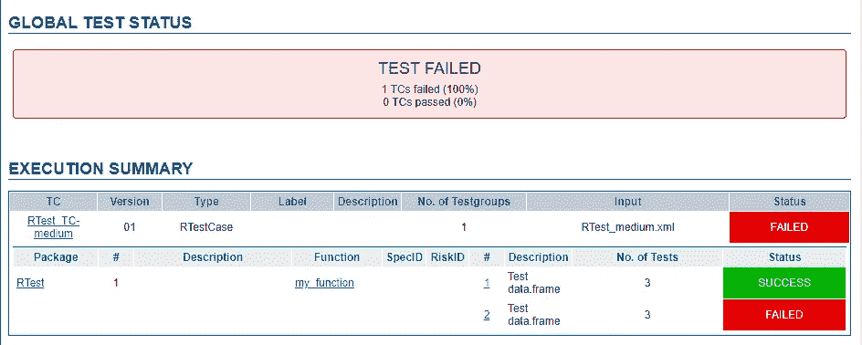
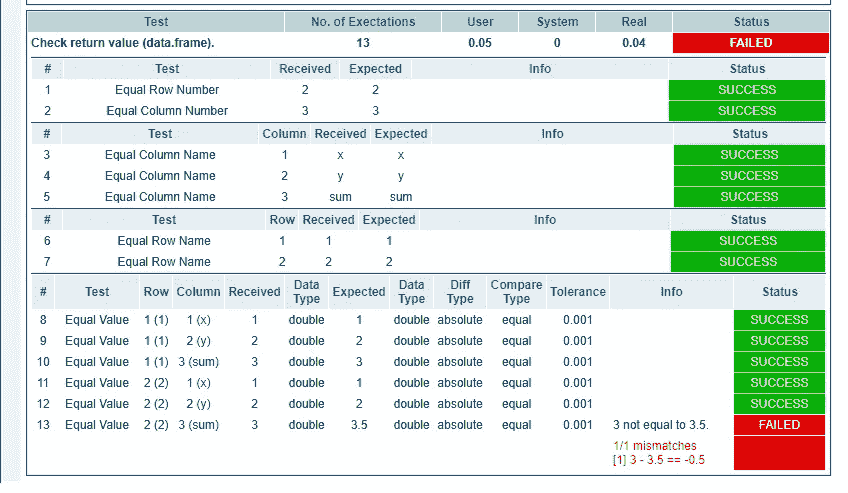
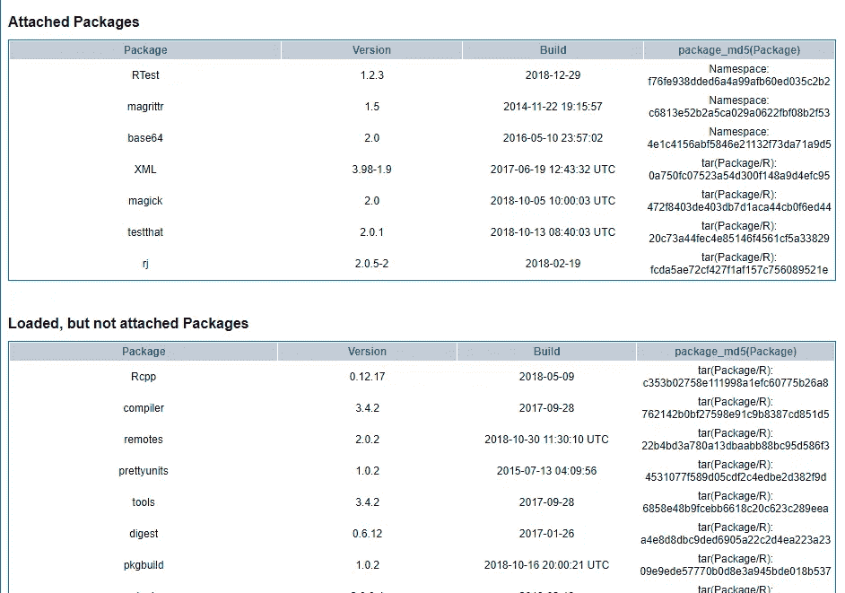

# RTest:R 包的漂亮测试

> 原文：<https://towardsdatascience.com/rtest-pretty-testing-of-r-packages-50f50b135650?source=collection_archive---------24----------------------->

## specflow 和 cucumber.io 支持非编码人员解释 R 包的测试报告，此外还允许非编码人员创建测试用例。简单 r 包验证的一步。


by startupstockphotos [http://startupstockphotos.com/post/143841899156](http://startupstockphotos.com/post/143841899156)

## 目录

*   [为什么要 RTest？](#5cfa)
*   【RTest 有什么特别之处？
*   [RTest](#618a)的测试实现示例。
*   [延伸阅读](#85b2)

# 为什么是 RTest？


在 R 中测试似乎很简单。从使用`usethis::test_name("name")`开始，然后在[*test that*](http://testthat.r-lib.org/)*中用类似`expect_equal`的功能编写测试代码。网上可以找到很多教程，甚至有一整本书都是关于“[测试 R 代码](https://www.amazon.de/gp/product/1498763650/ref=as_li_tl?ie=UTF8&camp=1638&creative=6742&creativeASIN=1498763650&linkCode=as2&tag=zappingseb-21&linkId=ca15df0c474acdcf98c8750db741c4e3">Testing R Code (Chapman &amp; Hall/Crc the R)</a><reference><testspec>*
```

*`params`账户输入参数*

*`reference`为输出数据帧*

*`testspec`测试是否静默运行，容差是多少*

*对于成功的测试，我们的测试应该是这样的:*

*您可以立即看到 RTest 的一个特殊功能。它允许为多个测试使用数据集，我们将这些数据集存储在`input-data`标签中。这可以节省文件中的空间。这里将使用数据集`test01`。此外，可以为每个测试给出测试描述。对于存储在 XML 中的每个 data.frame，列的类型可以在`col-defs`中给出。这些都是数字。*

*这里给出了`input-data`:*

*这是一个数据帧，其中 *x* 列只携带 1，而 *y* 列只携带 2。该测试应创建一个数据帧，每行的 sum 列为 3。*

*我们可以通过改变`reference`标签让测试失败，而不是在`sum`列中只有 3，我们可以添加一个 3.5 让测试失败。整个测试用例可以在有 90 行的 [github gist 中找到](https://gist.github.com/zappingseb/0f5dabe94c7d284bc543469c50a4213c)。*

*3.测试用例的**执行**只是一行代码。您应该在 XML 文件目录中有您的工作目录，并且应该在全局环境中定义`my_function`。*

```
*RTest.execute(getwd(),"RTest_medium.xml")*
```

*4.**测试报告**现在包含一个成功测试和一个失败测试。两者都将被可视化:*

**

*General test outcome in RTest test report*

*所有测试都有附加信息。对于失败的测试，我们将总和设置为 3.5 而不是 3。它在表的末尾报告:*

**

*example of a failed data frame comparison in RTest*

*此外，报告还包含测试运行环境的信息:*

**

*System information for an RTest test report*

*就是这样。现在你可以用 RTest 测试任何包。*

# *进一步阅读*

*   *[RTest github 知识库](https://github.com/zappingseb/RTest)*
*   *[RTest 文档网站](https://zappingseb.github.io/RTest/articles/RTest.html)*
*   *为什么我们需要对编程语言进行人类可读的测试？*
*   *作者的 LinkedIn p 年龄*