# RTX 2060 Vs GTX 1080Ti 深度学习基准:最便宜的 RTX 卡 Vs 最贵的 GTX 卡

> 原文：<https://towardsdatascience.com/rtx-2060-vs-gtx-1080ti-in-deep-learning-gpu-benchmarks-cheapest-rtx-vs-most-expensive-gtx-card-cd47cd9931d2?source=collection_archive---------2----------------------->

## 使用带有 fast.ai 和 PyTorch 库的 CIFAR-10 和 CIFAR-100 数据集对 2060 和 1080Ti 进行训练时间比较。

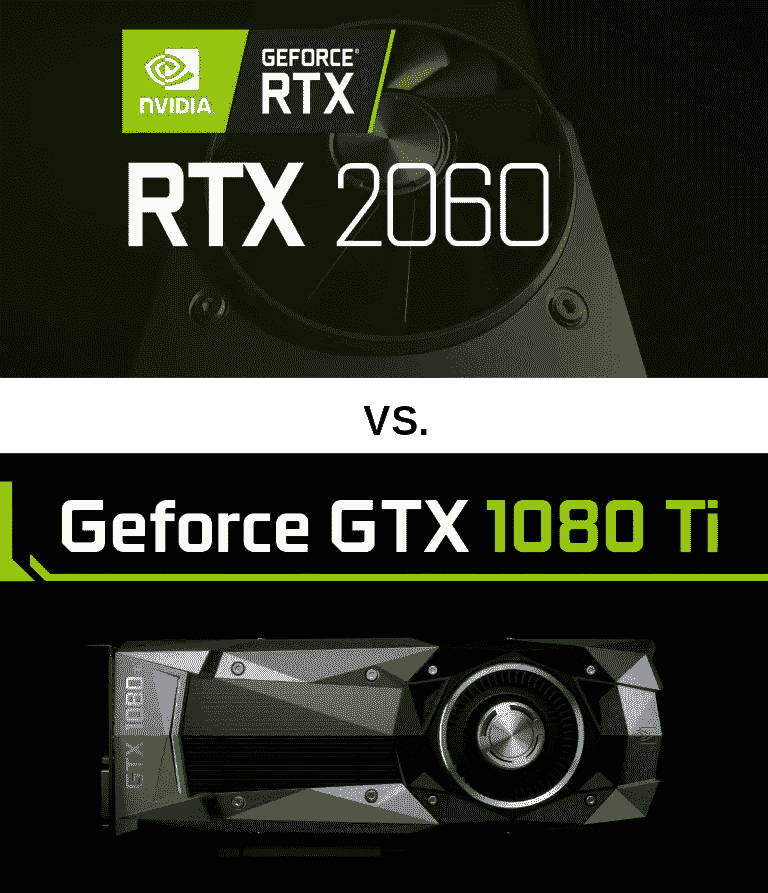

**TLDR #1** : **尽管只有一半的 VRAM，一半的零售价格，RTX 2060 在计算机视觉中可以突破 1080Ti，一旦它的张量核心在**[**py torch**](https://pytorch.org/)**+**[**Fastai**](https://docs.fast.ai/)**中被激活。**

不到一年前，凭借其 GP102 芯片+ 3584 个 CUDA 内核+ 11GB 的 VRAM， **GTX 1080Ti** 是上一代英伟达**帕斯卡**系列(泰坦版除外)的顶级 GPU。需求如此之大，以至于零售价格经常超过 900 美元，远远高于 699 美元的官方建议零售价。

2018 年秋季，英伟达推出了最新的**图灵**阵容，命名为“RTX”，拥有光线追踪核心和张量核心。整体价格大幅上涨:例如，RTX 2080Ti 的零售价为 1150 美元甚至更高。

图灵/ RTX 范围内的机器学习的一个关键特征是 [**张量核心**](https://www.nvidia.com/en-us/data-center/tensorcore/) :根据英伟达的说法，这使得计算可以在“浮点 16”而不是常规的“浮点 32”中运行，并将训练深度学习模型的时间缩短了 50%。

大约一个月前(2019 年 1 月 7 日)，英伟达发布了图灵系列中最便宜的 GPU:RTX 2060。

使用 Jupyter 笔记本，我在每个 Cifar 数据集上用 FP32 和 FP16 训练了 ResNet 模型 18 到 152，以比较 30 个时期所需的时间。

有了 Fastai，从 FP32 切换到 FP16 训练就像添加 ***`* 一样简单。to_fp16() *`*** 在你的常规代码的末尾。

*   常规 FP32 版本，带有预训练的 Resnet 18 模型:

`learn = create_cnn(data, models.resnet18, metrics = accuracy)`

*   FP16 版本:

`learn = create_cnn(data, models.resnet18, metrics = accuracy)***.to_fp16()***`

就这样，你现在可以访问 RTX 张量核心了！

*注:关于“FP16”训练的更多信息，也称为“混合精确训练(MPT)”，查看那些优秀的帖子。*

*   **[*西尔万·古格*](https://sgugger.github.io/) *(Fastai)***
*   **[*混合精度训练*](https://hackernoon.com/rtx-2080ti-vs-gtx-1080ti-fastai-mixed-precision-training-comparisons-on-cifar-100-761d8f615d7f) *基准用 RTX 2080Ti & 1080Ti 通过* [*桑雅姆布塔尼*](https://medium.com/u/a08b1e531f9c?source=post_page-----cd47cd9931d2--------------------------------) *(又名@init_27)***

# **TLDR 排名第二。**

**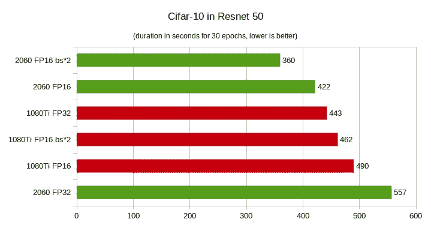****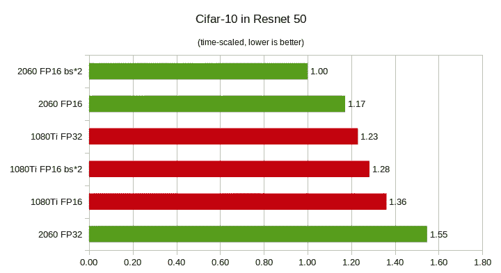**

***注:“bs * 2”表示 batch_size 大两倍，如 256 比 128。***

# **设置**

****硬件**:我使用的是一台“现实生活”的高端游戏电脑，具有以下[规格](https://pcpartpicker.com/user/EricPB/saved/NPjLJx)**

*   **AMD 锐龙 7 1700X 3.4GHz 8 核处理器**
*   **MSI X370 Krait 游戏主板**
*   **32 GB DDR 4–2400 内存**
*   **1 TB Nvme 三星 960 EVO**
*   **华硕 GTX 1080 ti-11GB Turbo(800 美元)**
*   **巴利特 RTX 2060–6GB(350 美元)**

***这些零件是我个人使用的，没有任何公司、出版商或供应商支付或赞助。***

****软件**:我双开机用的是 Ubuntu 和 Windows 10。**

*   **Ubuntu 18.04 + Anaconda/Python 3.7**
*   **CUDA 10**
*   **PyTorch 1.0 + fastai 1.0**
*   **Nvidia 驱动程序 415.xx**

***注意:在每次培训之前，这些卡被切换到一个辅助 PCie 插槽(x8 ),不处理 PC 双显示器，从而确保他们的计算能力 100%集中在培训上。
我提到这一点是因为我在一台 2007* [*Ergotron LX 双支架*](https://www.ergotron.com/en-us/products/product-details/33-299#/) *(我有史以来购买的最好的长期电脑！):一个 24 英寸的 1080p(垂直)和一个 27 英寸的 1440p(横向)都连接到同一个 GPU，因此人们可以认为它会从培训中窃取“一些”计算能力。***

**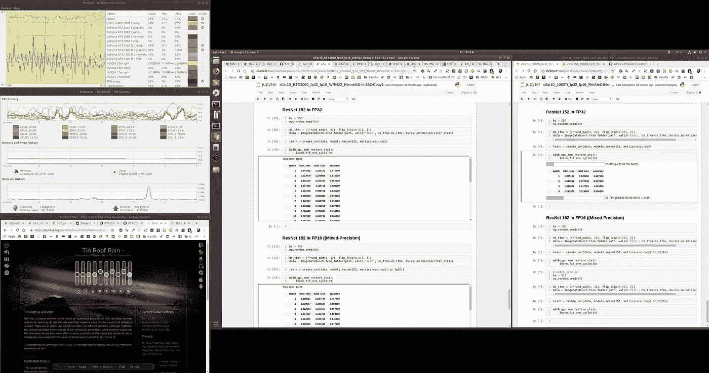**

**A screenshot of my dual monitors: the 24" vertical on left, the 27" landscape on right.**

***顺便说一句，如果你想检查双显示器对训练表现的影响，请使用 1080Ti 向下滚动文章底部进行比较。***

****两种 GPU 规格的快速总结。****

**GTX 10 人阵容中的 1080 Ti(最后一位):**

**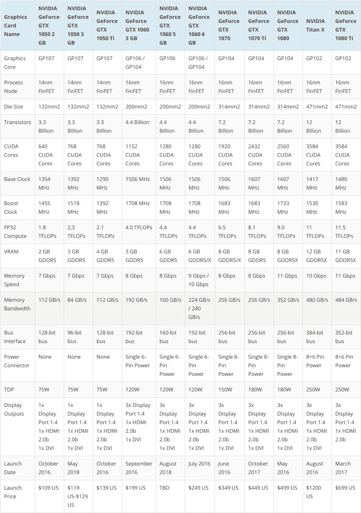**

**RTX 20 强阵容中的 2060(第一个):**

**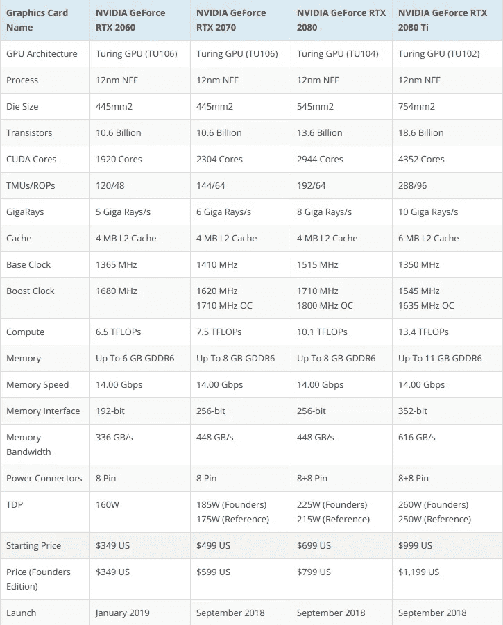**

****要点:****

*   **RTX 2060 的 CUDA 内核数量大约是 1080Ti 的一半(1920 对 3584)**
*   **它的内存带宽大约是 1080Ti 的 70%(336 对 484 GB/s)**
*   **它有 240 个张量核([来源](https://www.nvidia.com/en-us/geforce/news/nvidia-geforce-rtx-2060/))用于深度学习，1080Ti 没有。**
*   **它的额定功耗为 160W，带有一个 8 针连接器，而 1080Ti 的额定功耗为 250W，需要一个双 8+6 针连接器。**
*   **它的价格不到 1080Ti(在瑞典斯德哥尔摩)零售价的一半。**

****附加信息:****

*   **方法:为了保持可比性，我在三个版本中运行了每个基准测试。
    -版本“ **FP32** ”和版本“ **FP16** ”对 1080Ti 和 2060 使用了相同的 batch_size(有人可能认为 1080Ti 的 VRAM 大约是 2060 的两倍，但我选择了这种方法。您可以自行运行测试)。
    -版本“ **FP16 bs*2** ”使用了两倍大的 batch_size，以受益于 FP16 训练背后的理论(详见上面两个链接的帖子)。**
*   **我使用的 Jupyter 笔记本，包括 30 个纪元的所有持续时间，都可以在我的 [GitHub repo](https://github.com/EricPerbos/GTX-vs-RTX-Deep-Learning-benchmarks/tree/master/cifar_medium) 中找到。你需要法斯泰·V1 来运行它们。**
*   **我用来计算持续时间、时间尺度和图表的电子表格也在回购协议中。**

# **CIFAR-10 基准测试**

# **Resnet 18**

*   **“完成 30 个周期的时间”的持续时间(秒):**

**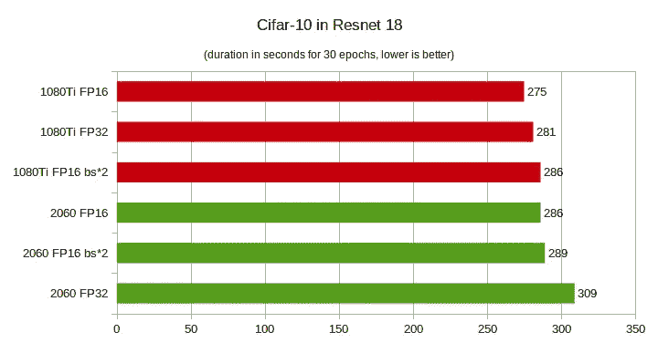**

*   **时标:**

**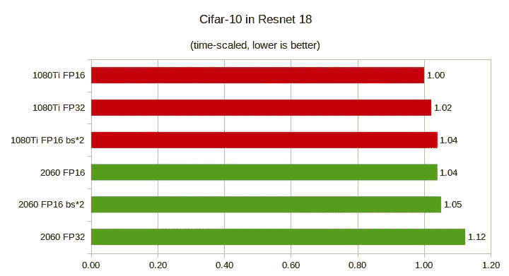**

# **Resnet-34**

*   **持续时间(秒):**

**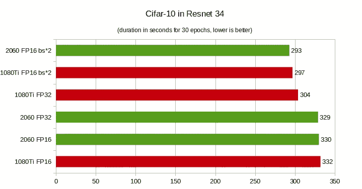**

*   **时标:**

**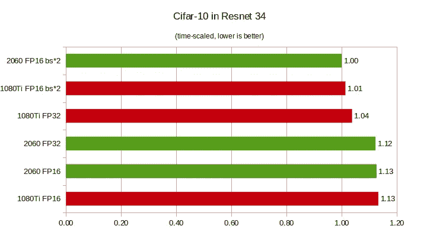**

# **Resnet 50**

*   **持续时间(秒):**

****

*   **时标:**

****

# **Resnet 101**

*   **持续时间(秒):**

**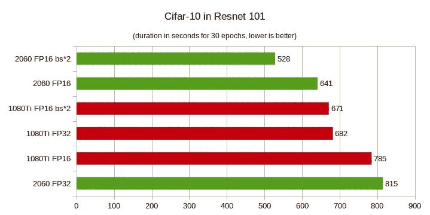**

*   **时标:**

**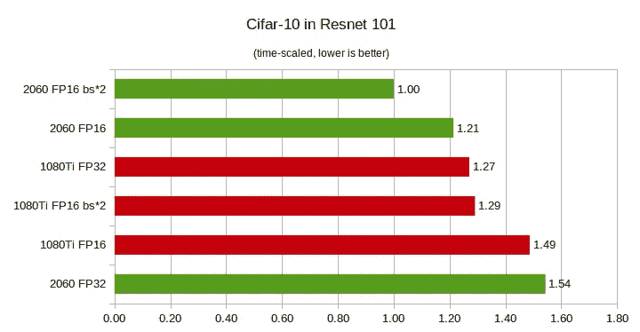**

# **Resnet 152**

*   **持续时间(秒):**

****

*   **时标:**

**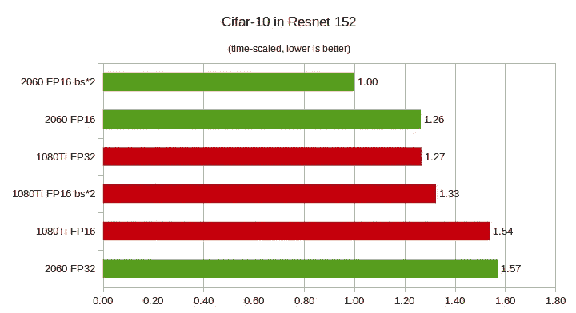**

# **CIFAR-100 基准测试**

# **Resnet 18**

*   **持续时间(秒):**

**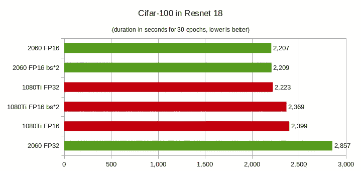**

*   **时标:**

**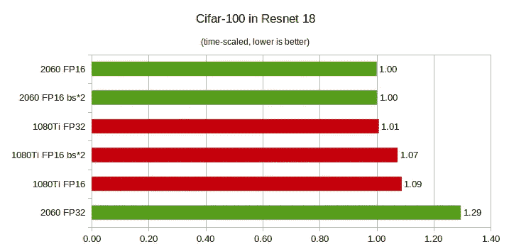**

# **Resnet 34**

*   **持续时间(秒):**

**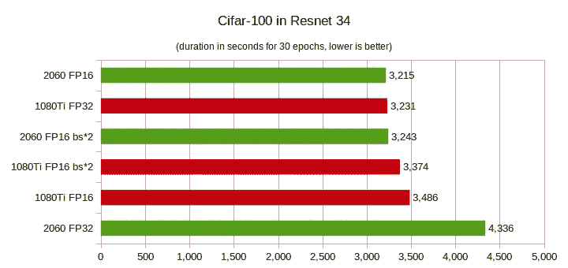**

*   **时标:**

**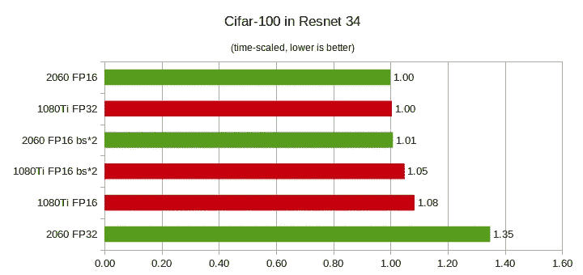**

# **Resnet 50**

*   **持续时间(秒):**

**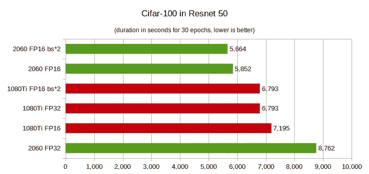**

*   **时标:**

**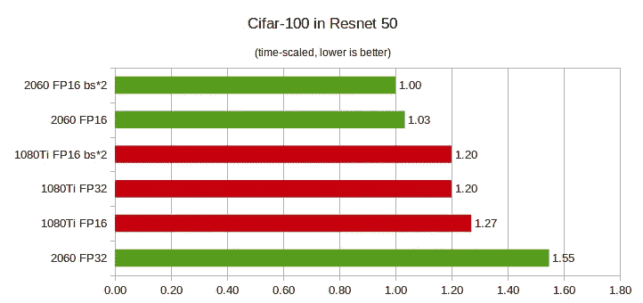**

# **Resnet 101**

*   **持续时间(秒):**

****

*   **时标:**

**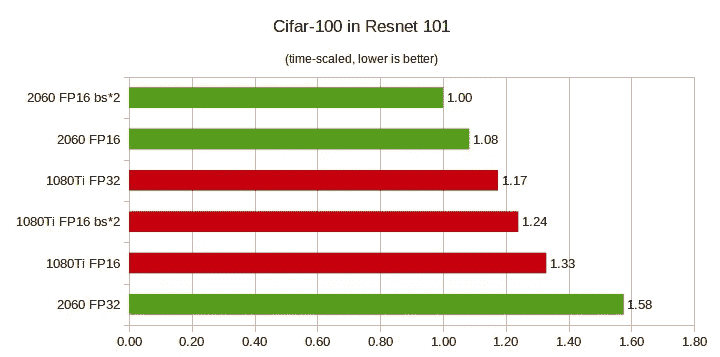**

# **Resnet 152**

*   **持续时间(秒):**

**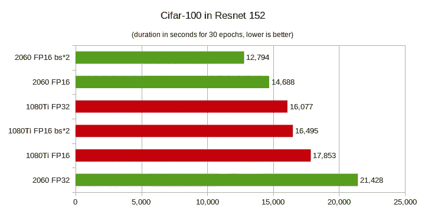**

*   **时标:**

**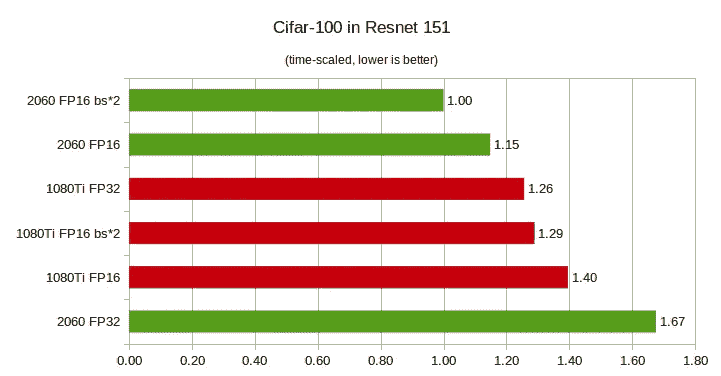**

# **奖金:**

## **我比较了 1080Ti 作为红色独立 GPU(无显示器)和蓝色主 GPU(处理双显示器，参见前面的讨论)的性能。**

*****注:我用的是 Cifar-10。*****

*   **持续时间(秒):**

**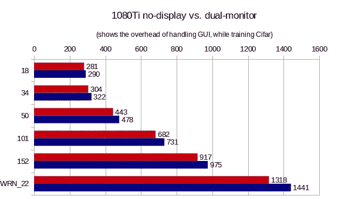**

*   **时标:**

**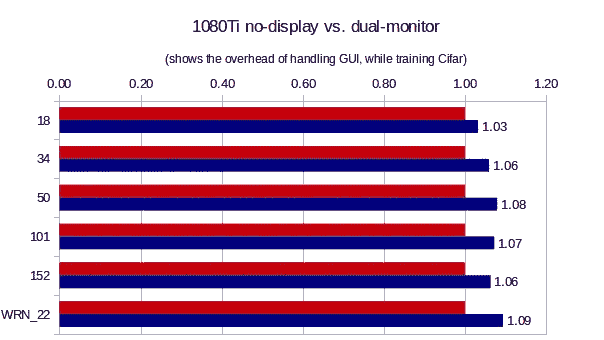**