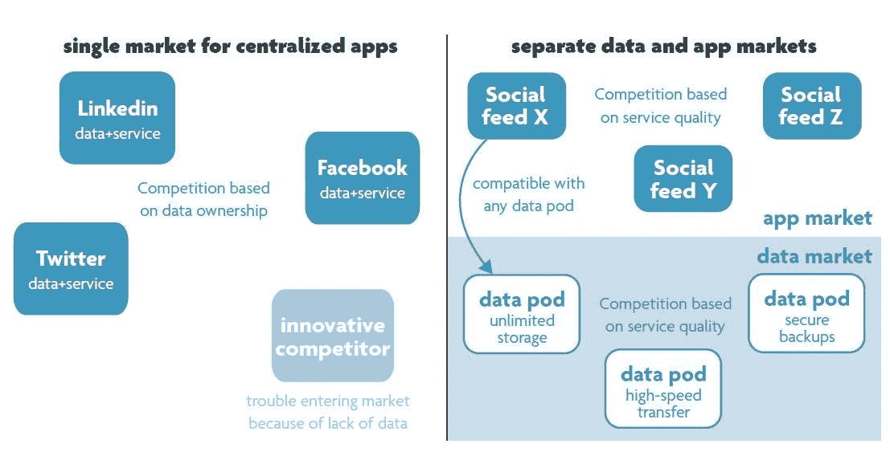

# 我们如何重新控制个人数据

> 原文：<https://towardsdatascience.com/ruben-verborgh-on-data-privacy-accf91d280c9?source=collection_archive---------17----------------------->

## *回归去中心化网络*

*数据是驱动我们经济的“新石油”，但最近的数据泄露事件表明，我们或许应该对分享我们的数据保持警惕。重新控制我们个人数据的方法是回到一个去中心化的网络，这对消费者和公司来说都是一个双赢的局面。*

# 服务的交易数据

2018 年 3 月，很明显，剑桥分析公司出于政治目的使用了数百万脸书用户的个人数据。这一丑闻痛苦地表明，我们以前多么不担心自己的个人数据。事实上，我们对自己数据缺乏控制是万维网发明者蒂姆·伯纳斯·李在 2017 年表达的担忧之一，他声称今天的互联网不像过去那样开放。

> 尽管最初的意图是“向所有人开放的免费空间”，但网络已经演变成一个由谷歌和脸书等少数互联网巨头管理的中央集权系统。

他们的共同点是共享的商业模式，乍一看似乎很有吸引力:他们不为他们的服务向我们收费。然而，如果我们阅读他们的数据政策中的小字，我们很快就会意识到我们正在付费——不是用钱，而是用我们的个人数据。

这十年的口号是“数据是新的石油”，因此显然，公司拥有的数据越多，就越强大。以脸书为例，一个普通用户的数据据说相当于大约 20 美元的年收入。这似乎是一个相当大的数字——特别是考虑到该网站有 22.7 亿活跃用户——但从我们作为消费者的角度来看，实际上并没有那么多。让我们反过来:假设你丢失了所有的私人信息和照片，你愿意花多少钱把它们找回来？当然，20 美元对于重新控制你的数据来说是一个很小的代价。

我们不断地创造关于我们个人生活、职业生活、购物习惯等的数据。很长一段时间以来，似乎没有人特别担心我们“提供”给脸书、谷歌等公司的信息量。但在不久的将来，人们会希望重新控制自己的个人数据。

今天的集中式网络商业模式不仅影响了我们的隐私，也扼杀了创新。只能有一个赢家，即拥有最多数据的赢家。在许多领域，这些赢家已经确立。这使得他们几乎没有创新的动力。毕竟，你为什么要改变一场胜利的游戏？

社交媒体公司不是大数据游戏的唯一参与者。几乎每家公司都会收集客户的信息，在某种程度上，它们都是大数据公司。甚至超市也会跟踪和分析你买的东西，并根据你的个人资料给你发送个性化广告。对许多这样的公司来说，数据只是达到目的的一种手段:他们需要数据来优化他们的服务或销售，但他们实际上对拥有或管理数据没有直接的兴趣。此外，拥有数据越来越成为公司的一项责任，特别是自从 GDPR(通用数据保护条例)生效以来:如果他们存储数据，他们也必须能够保护它。

# 想象一个分散的网络

到 2035 年，我们将重新控制我们的个人数据。这意味着我们可以选择将数据存储在任何我们想存储的地方，与我们使用的应用程序无关。我们的个人数据将存储在我们自己控制的所谓的“数据舱”中。在理想情况下，我们将为每个用户提供多个数据容器，例如，一个用于个人数据，一个用于工作相关信息，一个用于官方文档等。我们发布的所有内容都将保存在我们自己的数据舱中，这些数据舱存储在我们选择的服务器上。

为了实现类似社交网络的东西，我们当然需要分享我们的一些数据。只是，在 2035 年的去中心化网络中，我们将可以选择——分别为每个应用程序——我们想要提供哪个数据容器。

> 我们仍将是数据的所有者——不会制作任何副本——相反，我们只是将应用程序链接到我们愿意开放的数据窗格部分。要实现这一点，必须满足一个重要条件:应用程序必须能够重用其他应用程序创建的数据。

用一个现在的例子来解释这一点:假设你所有的朋友都在脸书，但你更喜欢像 Ello 这样不太受欢迎的替代品。2019 年，选择 Ello 将意味着你不能与你的任何朋友互动(除非你是一个潮流引领者，并能说服他们加入你的 Ello——但我们只是用另一个点取代了一个中心化点)。2035 年，你的朋友使用哪个社交网站将不再重要。由于应用程序将不再拥有任何数据，它们将仅仅成为不同的界面来查看来自你朋友的数据荚的信息。因此，在 Ello 上，你可以看到朋友在脸书上的帖子，并与之互动。因此，应用程序之间的切换将变得容易，它们之间的竞争将基于服务质量，而不是数据所有权。

> 目前，互联网的一半隐藏在属于少数公司的数据仓库中。这就好像是你的浏览器决定了你可以访问哪些网站。想象一下，Safari 用户看不到谷歌 Chrome 用户创建的任何网站。这就像社交网站决定你可以联系哪些朋友或联系人一样毫无意义。

在去中心化的愿景中，数据存储和应用将成为两个独立的市场。社交网站将试图通过其服务的用户友好性而不是其拥有的用户数量来超越彼此。提供数据存储的服务器也将有一个新的市场。

# 大数据时代的终结:然后呢？

网络去中心化颠覆了大数据商业模式。它改变了应用程序的竞争方式:它们将不得不通过创新来说服客户，例如用户友好的界面、最好的客户服务、完美的数据安全性等，而不是通过已经拥有大量关于现有成员的数据来吸引新成员。更重要的是，他们还必须通过另一种方式赚钱，比如收取年费。或者有些会给你付费或者(有意识地)出售你的数据的选择。关键是这种思维方式创造了选择和多样性，从而创造了机会。

夺回对我们数据的控制权的影响当然将远远超出社交媒体的范围。例如，今天的大多数消费者并不真正知道他们的超市有哪些关于他们的信息，更不用说他们对这些信息施加任何控制了。在一个分散的系统中，客户将拥有他们所有的数据。乍一看，这似乎是超市的一大劣势，但事实上，这也是一个获得比他们自己可能收集的更多数据的机会。这变成了一场交易游戏:顾客可能会同意分享他们所有的个人购物数据——来自每家超市——以换取个性化的交易。如果超市 Y 注意到你总是在他们竞争对手的店里买酸奶，他们可以给你提供个性化的乳制品降价。它使他们能够分析客户的完整购物行为，为他们提供宝贵的见解，以优化他们的产品。

今天的大多数消费者并不真正知道他们的超市有什么关于他们的信息。在一个去中心化的系统中，客户将拥有他们所有的数据，并且可以选择(有意识地)“出售”它们。例如，对于超市来说，这可能是一个很大的优势，因为他们可以要求访问客户的完整购物数据，也可以了解他们从竞争对手那里购买了什么。这将使他们能够分析客户的完整购物行为，为优化他们的产品提供有价值的见解。

# 为什么现在是收回我们隐私的好时机？

向一个去中心化的网络转移——或者实际上是回归——首先是要让人们相信这样做的重要性。对数据隐私的日益关注无疑是朝着正确方向迈出的一步。2018 年，欧盟也发出了一个重要信号，推出了《一般数据保护条例》(GDPR)，旨在让个人对自己的个人数据拥有更多控制权。

像 GDPR 这样的法规也使得公司拥有数据更加昂贵，这可能会刺激他们转向不同的商业模式；尤其是对于那些只将大数据作为达到目的的手段，而不是作为其商业模式的核心组成部分的公司。

> 公司需要开始以不同的方式思考数据。像石油一样，数据不应该被保存和储存，而应该成为推动引擎运转的物质。

有趣的是，让人们重新控制自己的数据并不意味着会更少。事实上，从分散的角度来看，将会有更多的数据，因为公司也将能够请求访问竞争对手收集的数据。