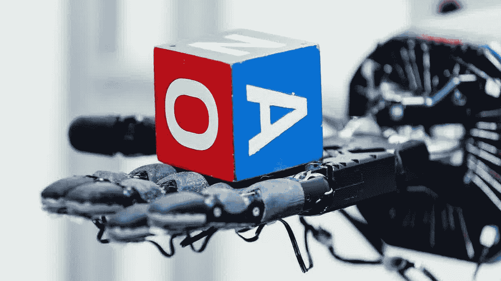

# 魔方？不，机器人和人工智能还没有出现

> 原文：<https://towardsdatascience.com/rubiks-cube-no-robotics-and-ai-are-not-there-yet-6c9845fcf924?source=collection_archive---------23----------------------->

## 再来说说目前备受关注的 OpenAI 灵巧机械手。

**这是一个炒作疫苗的帖子**。换句话说，我会试着让人们不再对机器人技术的最新发展大肆宣传。具体来说，OpenAI 声称在学习用机器人手解决魔方方面取得了一些相当惊人的[成果](https://youtu.be/x4O8pojMF0w)。不考虑他们强大的广告机器，效果究竟有多惊人？

## 有什么大惊小怪的？

惊人的结果显然不是解开魔方。它是用相对非平凡的机器人系统处理魔方的能力。我们说的是[暗影灵巧 E 系列手办](https://www.shadowrobot.com/products/dexterous-hand/):

[1]

实际上，这手牌就是去年玩这个方块的那手牌:

[1]

所以，最后我们还是在说旋转立方体。

控制手的难点在于它有 20 个自由度。此外，用一只手拿着魔方并解决它是非常困难的，即使对一个人来说也是如此(虽然我可以想象同时控制两只机器手是相当困难的，原因将在后面介绍)。

解决这个问题有许多障碍，如估计手的姿态、跟踪立方体、学习旋转立方体等等。令人印象深刻的是，在模拟训练控制策略后，他们能够在基于摄像机输入的真实系统上做到这一点。此外，手能够适应突然的扰动，即玩具长颈鹿在旋转立方体时触摸它。

简而言之，人们可以将他们的方法分为三个重要部分:**计算机视觉**(感知)**强化学习**和**领域随机化**。

## **自适应域随机化**

当你可以进行受控实验时，强化学习效果很好。这意味着你有一个模拟，你可以重置，快速执行。如果你想在一个真实的系统上尝试这一点…好吧，祝你好运，也许你可以问问你的曾曾孙辈学习得如何，对机器人和/或它周围的各种物体/人的一些轻微伤害，因为它的随机探索行为。

为了将策略转移到真实的系统中(假设我们有一个可用的系统模拟)，我们可以使用域随机化。这可以归结为将扰动应用到我们现有的模拟中来创造更多的模拟。这样，我们也许就能捕捉到现实世界的复杂性。

这不是一个非常新的想法，它可以追溯到很久以前，实际上，OpenAI 在他们以前的机器人手论文中使用了简单的扰动进行域随机化，但是基于他们之前的许多人的工作。唉，这里显然有些新奇的东西，“自适应域随机化”。它有什么适应性？他们声称，通过从学习到的生成性分布中取样，他们可以为政策生成越来越困难的模拟。好吧，这似乎是合乎逻辑的，生成式发行版是 21 世纪的东西，它们以某种方式让它发挥了作用。不错，但是…

## **假设有一个模型(模拟)相当方便……**

> 我们设定这个目标是因为我们相信，成功训练这样一只机器手来完成复杂的操纵任务，为通用机器人奠定了基础。[1]

是的，通用机器人……我想知道假设我们有通用机器人可能遇到的所有情况的模拟是否合理。我会让你得出自己的结论，这是一个相当哲学的问题。

## **政策升华，有何新意？**

因此，因为训练会花费太多时间，他们用某种好的开始策略初始化不同的实验(模拟的实例)。他们并行积累了很多数据，这些数据来自不同的政策。学习理论中一个众所周知的事实是，如果你的训练数据没有反映实际的数据分布，你的模型将训练得很差。为此，他们采用 DAGGER 算法进行行为克隆，以有效地适应初始策略。这里没什么新东西。

## **处理太多数字的问题**

> 对于块重定向任务，我们使用 4 × 8 = 32 个 NVIDIA V100 GPUs 和 4 × 100 = 400 个工作机，每个工作机有 32 个 CPU 核心。对于魔方任务，我们使用 8 × 8 = 64 个 NVIDIA V100 GPUs 和 8 × 115 = 920 个工作机，每个工作机有 32 个 CPU 内核。[1]

这项任务需要大量的计算能力，让我重复一遍，大量的计算能力。光看这些数字就让我头晕。920x32 CPUs？？？都是为了控制这一手一个任务。然后它让你想知道…花了多少时间？嗯…

> 我们已经连续几个月以这种规模训练魔方策略，同时改进模拟保真度、ADR 算法、调整超参数，甚至改变网络架构。魔方训练所使用的经验的累积量大约是 13000 年，与 OpenAI Five [1]所使用的 40000 年处于同一数量级

嗯，这真是太神奇了。我们需要 13 000 年才能学会解魔方(其实不是从零开始解，而是雇佣一个解算师来解)，nice:)。当然，支持这种计算的主要论点是人类有很长的进化时间，数百万年的进化。既然我们正在建造这些系统，我们应该能够通过分享我们的一些进化经验来加快它们的学习，即添加足够的先验知识，这样我们就不必等待 13000 年才能让我们的机器人学会如何拖地板。

事实上，即使在所有的训练之后:

> 用机器手解魔方还是不容易。我们的方法目前解决魔方的 20%的时间时，应用最困难的争夺的[需要 26 面旋转。对于需要 15 次旋转才能撤销的更简单的加扰，成功率是 60%。[1]](http://cube20.org/qtm/)

## 结论

总而言之，我认为 OpenAI 的贡献在某种意义上是相关的，它显示了通过一些聪明的工程技术，计算能力可以带给我们多远。实际上，在无限计算能力的假设下，你可以解决任何问题。有趣的是，随着处理能力的提高，我们正在实现什么。

另一方面，我不得不提到，这种研究是不可持续的，也许处理这么多数字来解魔方是不合理的，而且是多余的。 **13000 年，64 个 GPU，训练几个月，这些数字都得往下走。**

[1]

**参考文献**

[1]OpenAI[https://openai.com/blog/solving-rubiks-cub](https://openai.com/blog/solving-rubiks-cube/#challenges)e