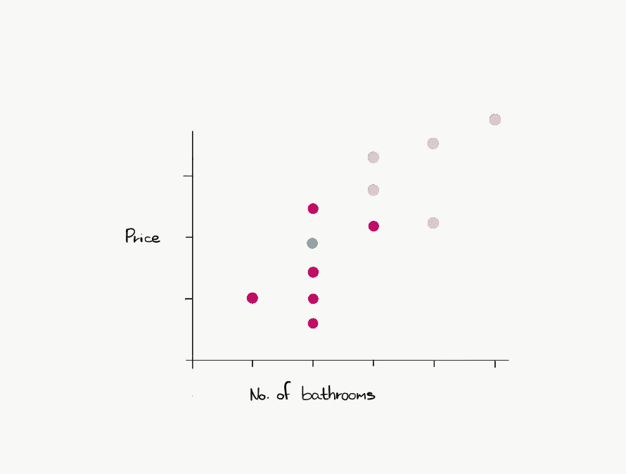

# 基本 k 近邻

> 原文：<https://towardsdatascience.com/rudimentary-k-nearest-neighbors-6d0d1e5e4c60?source=collection_archive---------27----------------------->

## [初级 ML](https://towardsdatascience.com/tagged/rudimentary-ml)

## 最直观的 ML 模型


有时在数据科学中，你会发现自己拿起一个导弹发射器就是为了杀死一只蚂蚁。

不过，在这种情况下，我们将讨论可能是最直观的机器学习算法。然而，不要被愚弄了，尽管它很简单，kNN 算法在某些情况下仍然非常有效。

## 一些快速注释:

首先，kNN 是一种非参数算法，这意味着它不假设您的数据遵循任何特定的分布。另一个很酷的事情是，它可以执行分类和回归任务，这两个我们将在这篇文章中触及。

# 直觉

首先，我们将使用一个数据集的简单表示来说明我们将如何使用 kNN 来执行一个**分类**任务。


设**洋红色**为 A 型，**黑色**为 b 型。这些点将组成给定的数据。假设**蓝色**是我们希望根据给定数据进行分类的数据点。

为此，我们将选择一个值 **k** ，它将是与我们的新数据点“最相似”的点数。

在这个二维例子中，我们将选择我们的**相似性度量**作为欧几里德距离。

因此，例如，如果我们让 **k=2** ，那么我们将寻找与我们的新数据点最相似的 2 个点。如果我们用距离来表示，我们会寻找最近的两个点。


The red line touches precisely 2 points.

之后，我们计算每种类型的数据点在 k 个最近点的集合中所占的比例。然后，我们选择具有最高比例的类型，并将我们的新数据点分配给该类型。

在我们的例子中，最近的两个点都是黑色的。

```
Prop of black = 2/2
Prop magenta = 0/2
```

因此，我们将把我们的新数据点归类为 b 类。

另一方面，如果我们选择 k 为 8，我们将:

```
Prop of black = 3/8
Prop magenta = 5/8 
```

在这种情况下，我们会将新的数据点分配给类型 a。

# 回归设置

在这种情况下，我们在很大程度上遵循同样的想法。

例如，如果我们要使用 kNN 来预测房子的价格，我们可能有如下设置:


我们希望找到 k 个最相似的点，并使用这些点的响应值的平均值作为所讨论的新数据点的预测值。

如果我们让 k 为 6，并且我们想要使用这个数据集来预测一个有两个卫生间的房子的价格，那么最相似的数据点将首先是其他有两个卫生间的房子，然后是有一个和三个卫生间的房子。



实际上，相应的预测价格值是洋红色点的平均价格。得到的预测是蓝点。

# k 的选择

正如我们所见，K 的选择确实很重要。

请注意 K 值如何在数据没有任何变化的情况下改变模型的性能。任何这样的变量被称为**超参数**。

的确**超参数优化**本身就值得一整篇帖子。

然而，出于本文的目的，我们将只提及**网格搜索**算法。

内容如下:

*   选择一组超参数值
*   使用这些值中的每一个值来训练模型
*   评估每个模型的性能，并选择导致误差最小的值。

这是一个关于 k 值增加时，这个过程的大概情况。


Generic Graph Showing How Test Error(Magenta) and Training Errors(Blue) Change over 1/K

# 最后的想法

首先，kNN 受到维数灾难的困扰，因此随着输入变量数量的增加，kNN 可能会越来越困难。值得考虑使用降维技术来解决这个问题。

此外，kNN 需要适当缩放的数据。换句话说，您可能必须对数据进行归一化，因为测量值之间的单位差异会严重损害模型的有效性。

另一件需要考虑的事情是，只要数据中的真实关系符合参数模型的假设，线性回归等参数方法往往会优于 kNN 等非参数方法。有趣的是，在一些不遵循所有假设的数据上，参数方法甚至可能比非参数方法表现得更好——所以不要排除它们！

总之，kNN 理解和实现起来相对简单，因此它是一个很好的方法，可以作为其他技术的基准。

我希望你喜欢这本书，并发现它在某种程度上是有用的，无论是学习新的东西还是刷新已经存在的东西。

*我本人是数学金融专业的应届毕业生，所以我既是一名教师，也是一名学习者。*

*也就是说，我非常乐意接受任何建议、更正或你在阅读这篇文章时想到的任何一般性反馈。*

*请随时在 LinkedIn 上与我联系—*

 [## 约万·梅德福德-加拿大滑铁卢大学| LinkedIn

### 查看约万·梅德福德在全球最大的职业社区 LinkedIn 上的个人资料。Jovan 的教育列在…

www.linkedin.com](https://www.linkedin.com/in/jovanmedforddataanalyst) 

*如果你愿意，你也可以在 Twitter 上关注我—*

[](https://twitter.com/JovanMedford) [## 约万·梅德福德(@约万麦德福德)|推特

### 约万·梅德福德的最新推文(@JovanMedford)。一点特别的东西🤯|数学、金融和科技作家…

twitter.com](https://twitter.com/JovanMedford)