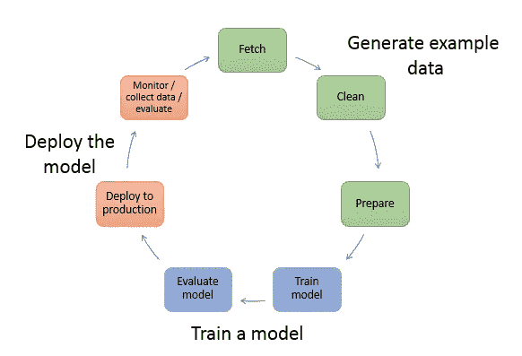

# 使用 Docker 容器在本地运行 Amazon SageMaker 笔记本

> 原文：<https://towardsdatascience.com/run-amazon-sagemaker-notebook-locally-with-docker-container-8dcc36d8524a?source=collection_archive---------12----------------------->

Photo by [Aleks Dorohovich](https://unsplash.com/@aleksdorohovich?utm_source=unsplash&utm_medium=referral&utm_content=creditCopyText) on [Unsplash](https://unsplash.com/search/photos/local-notebook?utm_source=unsplash&utm_medium=referral&utm_content=creditCopyText)

A mazon SageMaker，AWS 的云机器学习平台，由 4 个主要产品组成，支持数据科学工作流程中的不同流程:

Source: [https://docs.aws.amazon.com/sagemaker/latest/dg/how-it-works-mlconcepts.html](https://docs.aws.amazon.com/sagemaker/latest/dg/how-it-works-mlconcepts.html)

1.  **真相**:大规模按需数据标注服务的托管服务。
    (生成示例数据，用于监督算法)
2.  **培训**:培训和调整任何规模模型的托管服务。
    (训练一个模型)
3.  **推理**:托管预建模型并对新数据运行推理的托管服务。
    (部署模型)
4.  总而言之，**Notebook**:AWS 托管的服务器，供数据科学家访问和管理上述 3 项功能以及许多其他数据科学任务。

虽然托管的**笔记本**服务提供了一种非常方便的方式来获得与 Amazon SageMaker 一起工作的完整服务器，但在许多情况下，出于成本、访问便利性或“可定制性”的考虑，需要进行本地设置。

**在这篇文章中，我将详细介绍本地托管的笔记本 Docker 容器背后的动机，并描述已经复制的 Amazon SageMaker 笔记本实例的各种功能。**

*这篇帖子的目标读者是正在使用或计划使用亚马逊 SageMaker 的数据科学家和机器学习工程师。对 Amazon SageMaker 及其笔记本实例的基本了解加上 Docker 的知识将是有用的。*

# TL；速度三角形定位法(dead reckoning)

对于忙碌的人，这里有一个快速总结:

*   托管的 SageMaker Notebook 实例预构建了许多重要功能，包括一套全面的工具和库、具有最新机器学习框架的多个内核、GPU 支持、Git 集成和许多真实世界的示例。
*   尽管如此，它需要钱，要求所有数据都在线上传，需要互联网接入，特别是 AWS 控制台登录，并且很难定制。
*   为了克服这些缺点，我创建了一个 Docker 容器，它提供了一个类似的设置，可以在任何笔记本电脑/台式机上本地使用。
*   复制的功能包括完整的 Jupyter 笔记本和实验室服务器、多个内核、AWS & SageMaker SDKs、AWS 和 Docker CLIs、Git 集成、Conda 和 SageMaker 示例选项卡。
*   AWS 托管的实例和本地容器并不相互排斥，应该一起使用来增强数据科学体验。

Docker 图片的完整源代码存放在 Github 上:[https://github.com/qtangs/sagemaker-notebook-container](https://github.com/qtangs/sagemaker-notebook-container)

Docker 图片已经发布到 Docker Hub:[https://hub.docker.com/r/qtangs/sagemaker-notebook](https://hub.docker.com/r/qtangs/sagemaker-notebook)

# 在这篇文章中，

我将探索:

*   为什么我们首先需要一个笔记本实例？
*   为什么我们需要本地笔记本容器？
*   复制了哪些功能？
*   缺少哪些功能？
*   如何开始使用容器？

# 为什么我们首先需要一个笔记本实例？

在探索本地实例之前，让我们深入了解一下 Amazon SageMaker 笔记本实例提供的好处:

*   **完整的按需系统**:对于一个不怎么处理基础设施的数据科学家来说，这是开始使用 Amazon SageMaker 最简单的方法。使用 AWS 控制台，只需点击几下鼠标，您就可以访问配备了最常用库和工具的综合系统。
*   **多个机器学习内核**:Notebook 实例提供了各种内置内核，包括标准的 Python 2 和 3，流行的框架如 TensorFlow、MXNet、PyTorch 和 Chainer，以及其他运行时如 R、PySpark。
*   **适用于不同工作负载的多种机器规模**:您可以选择最基本的多用途实例类型，如 t2、t3 或 m4、m5、计算优化型(r4、r5)以及强大的基于 GPU 的类型(p2、p3)。
*   **使用 GPU 机器的弹性推理**:虽然使用 p2，p3 产生 GPU 驱动的性能提升，但是它们很贵。相反，您可以附加一个额外的弹性推理实例(eia1 类型)来使用 GPU 训练和测试您的模型，其成本只是 p2、p3 的一小部分。
*   **安全性**:默认情况下，笔记本实例是安全的，您需要登录 AWS 控制台才能访问它。
*   **Git 集成**:您可以将 Notebook 实例与 Git 存储库(由 AWS CodeCommit 或 Github 或任何其他 Git repo 托管)相链接，以便对您的所有工作进行代码版本控制。如果你在团队中工作，这一点尤其重要。
*   **大量示例**:为了让你快速入门，AWS 在每个实例中都嵌入了大量示例，大多数来自 Github 上托管的 [AWS 示例](https://github.com/awslabs/amazon-sagemaker-examples)。只需很少的努力，您就可以将一个示例的完整源代码导入到您自己的实例中。

# 为什么我们需要本地笔记本容器？

尽管 AWS 托管的笔记本实例有很多好处，但是本地笔记本容器也有一些缺点。以下是本地笔记本容器的一些好处:

*   **降低成本**:运行一个 AWS 托管的实例要花钱；此外，还没有办法使用 spot 实例，它通常用于降低 EC2 实例的成本。运行本地容器不需要任何成本。
*   **易于使用本地数据**:由于 SageMaker 笔记本实例运行在云中，它只能访问在线数据。任何本地数据都必须首先上传到 S3 或其他在线存储器。本地容器不需要这样，它可以使用简单的 Docker 卷挂载。
*   **跳过 AWS 控制台**:访问 AWS 托管的实例需要登录 AWS 控制台，有 12 个小时的超时，这意味着每天至少要登录一次。使用本地容器，您只需配置一次 AWS 凭证，之后就不再需要登录了(除非需要访问 S3 或其他 AWS 服务)。
*   离线访问:本地容器的另一个优点是，你可以在没有互联网连接的情况下随时访问它，尤其是当你想专注于数据清理、特征工程、数据分析等等的时候。不需要培训服务器的功能。
*   **定制**:虽然 AWS 提供的 Notebook 实例已经包含了许多通用的库和工具，但是可能仍然需要针对特定的用例进行进一步的定制。SageMaker 通过生命周期配置和直接终端访问实现了这一点。然而，这有时会感觉受到限制，尤其是需要 shell 脚本知识。对于本地容器来说，能够使用数据科学家团队需要的所有工具轻松配置 Docker 映像是一个优势。
*   **灵活性**:有了 Docker 映像，一组数据科学家可以决定将其集中托管在一个高容量服务器中，或者设置笔记本实例集群。选择是无限的。

> **注意**:AWS 托管的实例和本地容器**并不**互斥。您可以同时使用两者，如果您正确设置了 Git 集成，它们可以同步，这样您就可以在日常工作的两种选择之间无缝切换。

# 复制了哪些功能？

本地 Docker 容器的主要目的是尽可能多地维护 AWS 托管的实例的最重要的特性，同时增强本地运行能力的体验。以下是已复制的功能:

## Jupyter 笔记本和 Jupyter 实验室

这只是从 Jupyter 的[官方 Docker 图片](https://github.com/jupyter/docker-stacks)中截取的，做了一些修改以匹配 SageMaker 的笔记本设置，包括:

*   将默认用户命名为`*ec2-user*`，并允许无密码`*sudo*`访问。
*   允许定制 Miniconda 和 conda 版本。
*   跳过 Jupyter 集线器
*   将笔记本目录设置为`*/home/ec2-user/SageMaker*`

## 多核

使用 Conda environments ( `*conda env create*`)创建多个与 SageMaker 内核名称相匹配的内核。例如:

*   `*conda_python2*`
*   `*conda_python3*`
*   `*conda_tensorflow_p36*`

内核列表是动态的，即 docker 映像可以包含一个或多个内核。它是在构建 Docker 映像时由参数`*CONDA_ENVS*`设置的。最初支持的 Conda 环境包括`*python2*`、`*python3*`、`*tensorflow_p36*`、`*mxnet_p36*`。通过在`*base/utils/envs*`文件夹中添加 Conda 环境文件，可以简单地创建额外的内核。

## AWS 和 SageMaker SDKs

每个内核都包括 AWS Boto3 SDK 和 SageMaker SDK。这对于所有与 AWS 服务交互的 Python 代码都是必不可少的，包括 SageMaker 的培训和部署服务。

## AWS CLI

AWS CLI 是为与 AWS 交互的 shell 脚本安装的。

> **注意**:AWS SDK 和 CLI 都需要在主机中配置一次 AWS 凭证。

## Docker CLI

许多 SageMaker 示例使用`*docker*`来构建用于训练的定制图像。我们没有在 Docker 上安装一个完整的 Docker，这是一个复杂的操作，而是利用了主机的 Docker 引擎。为了实现这一点，我们在 Docker 映像上安装了 Docker CLI，并依靠主机的 Docker 套接字来连接主机的 Docker 引擎。这是通过在运行容器时包含`*-v /var/run/docker.sock:/var/run/docker.sock:ro*`来实现的。

> **注意**:在 Windows 上，将挂载更新为:`*-v //var/run/docker.sock:/var/run/docker.sock:ro*` *。*

## Jupyter 实验室中的 Git 集成

安装 Git 是为了允许直接从容器访问 git。此外，jupyterlab 上安装了 [jupyterlab-git](https://github.com/jupyterlab/jupyterlab-git) 扩展，用于与 git 进行快速 GUI 交互。

## 康达标签

就像 AWS 托管的实例一样，基于 Docker 的实例包含一个 Conda 选项卡来管理 Conda 环境。

> **注意**:虽然这是为了模拟实际情况，但是不建议您在这里对 Conda 环境进行修改。相反，更新`*base/utils/envs*`下相应的 YAML 文件并重建 Docker 映像，这样您的更改就会被记录下来并可以与其他人共享。

## SageMaker 示例选项卡

AWS 提供的所有 SageMaker 示例都与简单的 2-click 复制功能一起反映在 Docker 映像中，因此您可以轻松地使用现有示例并进行尝试。其他例子(来自 [fast.ai](https://github.com/fastai/course-v3) 和 [PyTorch](https://github.com/pytorch/tutorials) )还没有包括在内，但将来会包括在内。

# 缺少哪些功能？

## GPU 支持

目前，该容器仅为 CPU 工作负载而构建。对于任何使用 GPU 的本地培训和测试，您必须使用 AWS 托管的实例。注意，如果您使用 SageMaker 的培训作业运行 GPU 驱动的培训，那么您不需要本地容器上的 GPU。

## 其他内核

使用 Conda 可以很容易地添加其他基于 Python 的内核。然而，对于 R 和 Spark 运行时，未来还需要做更多的工作。

## 局部训练和推理

使用 AWS 托管的实例，您可以使用 [SageMaker 的本地模式](https://sagemaker.readthedocs.io/en/stable/overview.html#local-mode)在该实例上运行训练和推理。目前，Docker 容器没有为此而设置。将来，将添加网络配置来支持这一点。

## 使用最新的 SageMaker 设置自动更新

目前，每当 SageMaker Notebook 实例更新时(新的 SageMaker 版本)，内核配置都需要手动更新。将来，这些可以使用 CloudWatch 事件和 AWS Lambda 函数自动更新。

## Python 库

为了保持 Docker 映像尽可能精简，许多库没有包含在给定的内核中。如果您需要容器中的某些库，您可以在`*base/utils/envs*`文件夹中使用自定义环境 YAML 文件构建自己的容器。在未来，我的目标是使它更容易定制。

## 其他工具

一些工具，如 [nbdime](https://github.com/jupyter/nbdime) 、Jupyter Notebook Diff 和 Merge 工具以及 [plotlywidget](https://github.com/plotly/plotly.py) (一个开源的、用于 Python 的交互式图形库)应该会在未来被集成。

# 如何开始使用容器？

可以在 Github 库找到说明:[https://github.com/qtangs/sagemaker-notebook-container](https://github.com/qtangs/sagemaker-notebook-container)

# 摘要

亚马逊 SageMaker 的笔记本实例是 AWS 云机器学习平台的重要组成部分。

在 Docker 容器映像中复制它有望进一步简化对 SageMaker 世界的访问。

请注意，AWS 还为[培训](https://github.com/aws/sagemaker-containers)和[部署](https://github.com/aws?utf8=✓&q=serving&type=&language=)提供了 Docker 容器。

在未来的帖子中，我将继续关注使用 Amazon SageMaker 的机器学习基础设施，以及我们如何应用最佳实践来简化和巩固这些基础设施组件。

*感谢您的阅读。请在下面评论分享你的想法。*

*这项工作的完整项目托管在*[*Github*](https://github.com/qtangs/sagemaker-notebook-container)*上。*