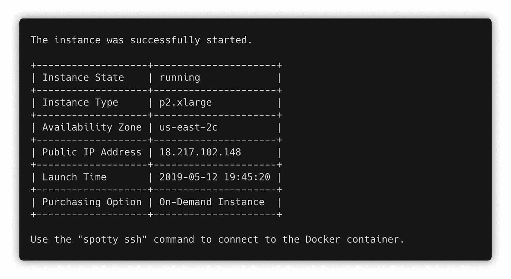

# 用一个命令在 AWS 上运行深度学习容器

> 原文：<https://towardsdatascience.com/run-deep-learning-containers-on-aws-with-one-command-114898e1eb5?source=collection_archive---------24----------------------->


有许多公开可用的 Docker 图像，如 [TensorFlow](https://hub.docker.com/r/tensorflow/tensorflow) 、 [PyTorch](https://hub.docker.com/r/pytorch/pytorch/tags) 、 [Jupyter Docker Stacks](https://jupyter-docker-stacks.readthedocs.io/en/latest/using/selecting.html) 或 [AWS 深度学习容器](https://docs.aws.amazon.com/dlami/latest/devguide/deep-learning-containers-images.html)，可用于训练深度学习模型。

有了 [Spotty](https://github.com/apls777/spotty) 你只需要一个命令就可以在 AWS 上运行 Docker 容器。Spotty 为您管理所有必要的 AWS 资源，包括卷、快照和 SSH 密钥，将本地项目与实例同步，并使用 [tmux](https://github.com/tmux/tmux) 将远程进程从其终端分离。

**你所需要的只是在你的项目的根目录下有一个名为** `**spotty.yaml**` **的配置文件。**

# 装置

要求:

*   Python ≥3.5
*   [安装](https://docs.aws.amazon.com/cli/latest/userguide/cli-chap-install.html)和[配置](https://docs.aws.amazon.com/cli/latest/userguide/cli-chap-configure.html#cli-quick-configuration) AWS CLI

使用 [pip](http://www.pip-installer.org/en/latest/) 安装或升级 Spotty:

```
pip install -U spotty
```

# 配置文件

一个配置文件描述了 EC2 实例的参数和 Docker 容器的参数，这些参数将被用作项目的环境。这里有一个例子:

有了上面的配置，Spotty 将在 **us-east-2** (俄亥俄州)地区运行一个**按需** **p2.xlarge** 实例。随意更改这个配置:例如，您可以将参数`image`更改为`pytorch/pytorch:latest`来运行 PyTorch 容器。

如果您想启动一个 Spot 实例，而不是一个按需实例，请删除`onDemandInstance`参数。要找到所选实例类型的最低价格区域，使用`spotty aws spot-prices -i <INSTANCE_TYPE>`命令。

在[文档](https://apls777.github.io/spotty/docs/configuration/)中阅读更多关于配置的信息。

# 启动容器

一旦项目目录中有了一个`spotty.yaml`文件，就可以使用下面的命令启动容器:

```
spotty start
```

该命令将启动一个 EC2 实例，将本地项目与该实例同步，并运行容器。



使用`spotty ssh`命令连接到容器。

**不要忘记稍后使用** `**spotty stop**` **命令停止实例！**

# AWS 深度学习容器

[AWS 深度学习容器](https://aws.amazon.com/machine-learning/containers/)是预装深度学习框架的 Docker 映像，针对最高性能进行了优化:

> *AWS DL 容器包括对流行框架(如 TensorFlow 和 Apache MXNet)的最新版本的 AWS 优化和改进，以及为云中的训练和推理提供最高性能的库。例如，AWS TensorFlow 优化通过显著改进的 GPU 扩展使模型的训练速度提高了一倍。*

Docker 图片在亚马逊 ECR 有售。[在这里](https://docs.aws.amazon.com/dlami/latest/devguide/deep-learning-containers-images.html)你可以找到一个图像 URL 列表，可以在一个不稳定的配置文件中使用。

要运行 AWS DL 容器，实例应该能够访问 Amazon ECR:

1.  使用`managedPolicyArns`参数将`arn:aws:iam::aws:policy/AmazonEC2ContainerRegistryFullAccess`策略附加到实例角色。
2.  在容器运行之前使用`commands`参数登录 Amazon ECR:`$(aws ecr get-login --no-include-email --region us-east-2 --registry-ids 763104351884)`。

**确保图像名称中的区域和登录命令中的区域与** `**region**` **参数匹配。**

# 结论

Spotty 是一种使用 Docker 容器在 AWS 上训练深度学习模型的快速简便的方法。它将节省您管理 AWS 资源的时间，并通过将项目与实例同步、运行自定义远程脚本和使用 tmux 分离远程进程来帮助工作流。

如果你喜欢这篇文章，请在 GitHub **上启动** [**项目，并与你的朋友分享这篇文章。**](https://github.com/apls777/spotty)