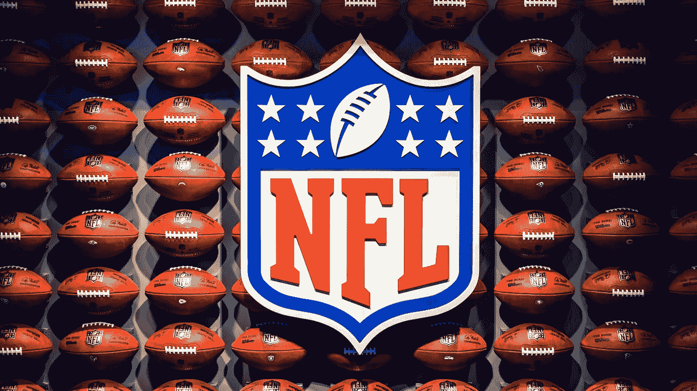
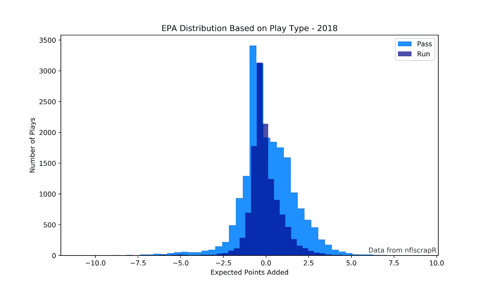
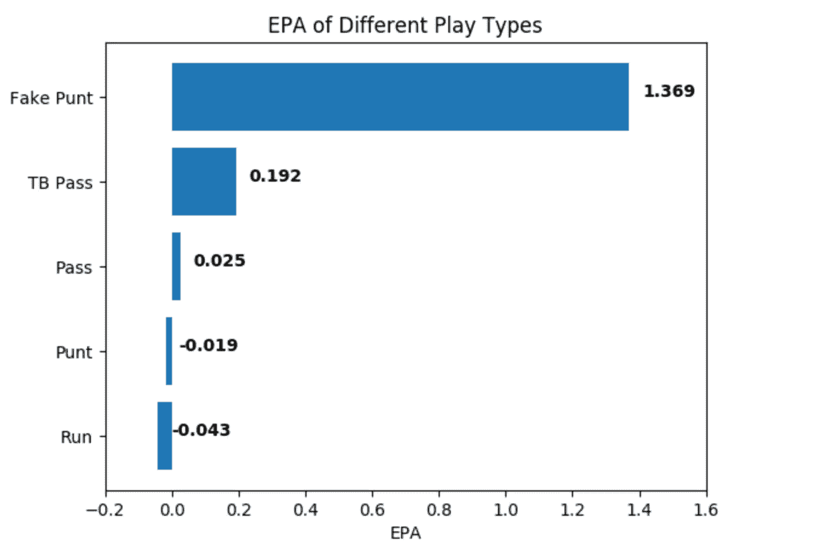
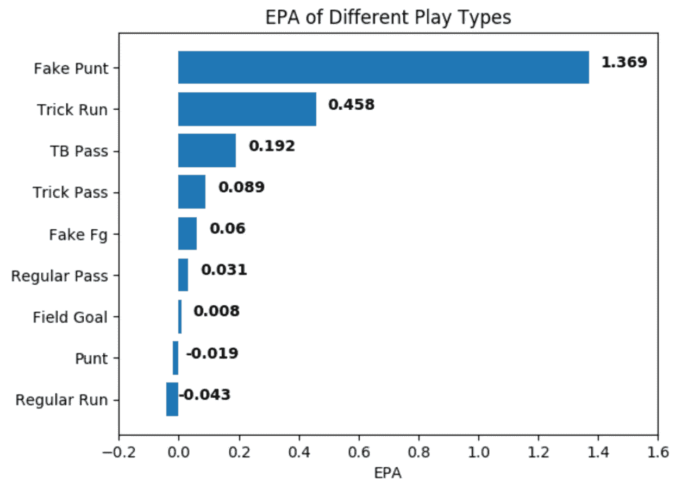

# 运行更多的特技播放

> 原文：<https://towardsdatascience.com/run-more-trick-plays-d7c4ff0cd813?source=collection_archive---------21----------------------->



[Via hence-the-boom on Unsplash](http://Photo by HENCE THE BOOM on Unsplash)

## 受穆罕默德·萨努的启发，对 2009-2019 年美国国家橄榄球联盟特技表演进行了分析

# 介绍

足球中的恶作剧是这项运动中最有趣的部分之一。双逆转，假摔，跳蚤闪烁通常会成为亮点。它们在本质上是高度变化的:要么你抓住防守放松警惕并轻松触地得分，要么你让你的跑卫把鸭子扔进双包并把球放在银盘子里给对方。对于任何一个经常看足球比赛的人来说，特技表演的高变化性是直观的。可能不直观的是它们的实际价值。直到最近，公众还不容易获得客观评估特技表演所需的数据。感谢[罗恩·尤尔科](https://github.com/ryurko/nflscrapR-data)的出色工作，以及[本·鲍德温](https://gist.github.com/guga31bb/5634562c5a2a7b1e9961ac9b6c568701)和 Github 用户[@德里克 97](https://gist.github.com/Deryck97/fa4abc0e66b77922634be9f51f9a1052) 的精彩教程，任何像我这样的笨蛋都可以花几个小时分析高飞在 10 年期间发挥的价值。

# 预期增加的点数(EPA)

你如何捕捉一部戏的价值？显然，在几乎所有情况下，50 码的完成比 2 码的跑更有价值。然而，第一次 4 码跑比第三次 1 码跑更有价值吗？那是一个很难准确回答的问题。然而很明显，并不是所有的码都是平等的。随着时间的流逝，结束半场对抗防守的传球可能会增加 30 码。所做的只是填充统计数据。任何 NFL 教练都宁愿在关键情况下进行第三次向下转换，不管多短。Ron Yurko 撰写了一篇论文，详细介绍了预期加分指标。在论文中([见此处](https://arxiv.org/pdf/1802.00998.pdf))，他能够确定一个球队在比赛中任何一点的得分。如果在一次游戏之后，预期点数度量较高，则该玩家增加预期点数。当然，诸如麻袋或拦截之类的游戏会导致负面的 EPA。

显然，90 码以上的进攻型打法有最高的 EPA，红区失误有最差的 EPA。以下是数据集中排名前五的 EPA 行动:

```
Description (3:15) (Shotgun) B.Roethlisberger pass deep middle to J.Smith-Schuster for 97 yards, TOUCHDOWN. 
 EPA 9.5
Description (10:06) (Shotgun) C.Johnson up the middle for 91 yards, TOUCHDOWN. 
 EPA 9.3
Description (7:44) (Shotgun) C.Palmer pass short middle to M.Floyd for 91 yards, TOUCHDOWN. 
 EPA 9.2
Description (8:51) (Shotgun) P.Mahomes pass deep middle to D.Robinson for 89 yards, TOUCHDOWN. PENALTY on KC-D.Robinson, Taunting, 15 yards, enforced between downs. 
 EPA 9.1
Description (11:51) (Shotgun) D.Carr pass deep middle to A.Cooper for 87 yards, TOUCHDOWN. 
 EPA 8.9
```

你明白了。下面是倒数 5 名:

```
Description (12:14) (No Huddle, Shotgun) M.Vick to WAS 10 for -6 yards (R.Kerrigan). FUMBLES (R.Kerrigan), touched at WAS 10, RECOVERED by WAS-D.Hall at WAS 25\. D.Hall for 75 yards, TOUCHDOWN. Lateral batted by 91 - Kerrigan The Replay Assistant challenged the backward pass ruling, and the play was Upheld. 
 EPA -12.8
Description (11:14) (Shotgun) J.Tuel pass short right intended for T.Graham INTERCEPTED by S.Smith at KC 0\. S.Smith for 100 yards, TOUCHDOWN. 
 EPA -12.7
Description (6:05) (Shotgun) M.Cassel sacked at DEN 25 for -17 yards (M.Haggan). FUMBLES (M.Haggan), RECOVERED by DEN-J.Hunter at DEN 25\. J.Hunter for 75 yards, TOUCHDOWN. 
 EPA -12.1
Description (2:51) M.Vick pass short left intended for B.Celek INTERCEPTED by P.Robinson at NO 1\. P.Robinson for 99 yards, TOUCHDOWN. PENALTY on PHI-M.Vick, Low Block, 15 yards, enforced between downs. The penalty for a low block during the interception return will be assessed on the ensuing kickoff. 
 EPA -12.1
Description (7:50) (Shotgun) E.Manning pass short left intended for H.Nicks INTERCEPTED by B.McCann at DAL -1\. B.McCann for 101 yards, TOUCHDOWN. 
 EPA -12.1
```

环保局是一个有趣的事情，因为在进攻中，它可以大于触地得分。这是有道理的，因为如果你在自己的端区防守，你预计 1)不会在一次击球中得分，2)由于场地短，另一个队更有可能在下一次击球中得分。它也可以是-12，因为在红区 1)你预计平均得分约为 5 分，2)防守队的下一次控球应该是在开球后，可能是在他们自己的半场。

# 特技表演

现在我们有了一个衡量一部戏价值的标准，我们可以开始将不同类型的戏分组并进行比较。比如摘自@Deryck97 上面链接的教程，2018 年 rush vs. pass 打法对比:



Both the mean and the standard deviation of pass plays are higher.

那么，使用 nflscrapR 数据，我们如何知道一个游戏是否是一个技巧游戏？不幸的是，没有简单的指示变量来表示“特技播放”。相反，我们必须想出创造性的方法来识别它们。

## 假踢

最容易开始的比赛是假踢。大部分剧本描述都包含了剧本的形成。如果一场比赛被标为“踢阵型”或“射门阵型”，但比赛类型是跑动或传球，那么它很可能是假球。我不得不手动过滤一些其他类型的游戏，比如当玩家错过了一个快照并中止游戏时，但这很容易。以下是 python 代码:

```
punts = df.loc[df.desc.str.contains('punt|Punt')]
fake_punts = punts.loc[(punts['play_type']=='run')|(punts['play_type']=='pass')]# drop enforced penalties
fake_punts = fake_punts.loc[fake_punts.penalty!=1]# drop non enforced penalties
fake_punts =fake_punts.loc[~fake_punts.desc.str.contains('Penalty')]# drop punter mishandles fake_punts=fake_punts.loc[~fake_punts.desc.str.contains('Aborted|Shotgun')] # drop plays where punter intentionally runs out of end zone (not likely to fake a punt in own redzone)
fake_punts = fake_punts.loc[~fake_punts.desc.str.contains('SAFETY
')] # drop plays without description
fake_punts.dropna(subset=['desc'], inplace=True)
```

然后，我将同样的过滤器应用到以平手结束的游戏中。最终，在大约 22，000 次试踢(常规赛和季后赛)中，我发现了 177 次假球。不到 1%的假率！

让我们也想出一些基线。我将展示汤姆·布拉迪的平底船的平均 EPA、传球的平均 EPA、跑动的平均 EPA 和传球的平均 EPA🐐。



哇！假船票的价值大约是汤姆·布拉迪船票的 7 倍。当然，EPA 的标准偏差也要高得多。非假平手的 EPA 的标准偏差是 1.16，而假平手的标准偏差是 3.17。很明显，如果你造假失败，那么你就有一个很大的负面 EPA。

假球也一样有价值吗？根据我简单的分析，没有。扔出失球，糟糕的抢断，点球等等——假球的 EPA 是 0.06。这比你的平均通过率高，但不是超级令人兴奋，因为我是在伪造的投注号码后跑的。我相信这是因为你放弃了一个投篮机会。如果你在一个假动作中失败了，你就会失去一些你原本可以从尝试中得到的分数。如果你所做的只是得到第一次得分，你甚至不会得到那么多预期的分数。他们有一个类似假平底船的大标准差。因此，如果你落后几个点，你可能还是会更好地掷骰子，用一个假的。

## 特技跑/传球

不幸的是，技巧跑位和传球并不容易区分。作为免责声明，本文的重点是从 NFL 的比赛数据开始。我不是在写关于假戏的论文。因此，虽然我竭尽全力成功地隔离了特技播放，但我并不声称 100%准确或最好的可能过程。

让我们从传球开始。我开始时抛出了明显的战术(点球，两分转换尝试)以及我已经分析过的战术(踢法)。我也放弃了具有极端获胜概率的策略(<5% & > 95%的获胜概率)。这里的想法是避免孤注一掷的后期横向游戏，如钩和后者。

然后，我在游戏描述中搜索了数据集中尝试次数少于 30 次的玩家的跳蚤闪烁和传球。跳蚤闪烁覆盖了 QB 的侧边，理论上，任何其他的技巧传球都会涉及到一个通常不会传球的跑卫或宽接球员的侧边。最后，我把那些只出现了很短时间并被我的过滤器过滤掉的 QB 列入黑名单。他们很容易找到，因为整个系列的戏剧都在描述中突出了出来。

快到了。对于跑位戏，我分离出了有横向或反向描述的戏。幸运的是，没有太多防守球员在摸索恢复后落后的情况。我最终得到了 180 个剧本的样本(手动删除了一两个奇怪的剧本)。我选择排除两点转换的尝试，所以不幸的是这一优点没有包括在内:

Two-point attempt starts at 0:43s

咻。结果如下:



我很惊讶地发现反转和横向跑动是如此的有价值！理论上，他们就像拥有一个传球能力是汤姆·布拉迪两倍的球员。因为跑位通常没有传球有价值，所以我期望技巧传球有更高的 EPA。特技通行证仍然是有价值的，但是许多 EPA 仅仅是由跳蚤市场驱动的。事实上，只计算跑锋和 WR 传球(n=194)，EPA 是 0.024——比正常传球还糟糕！跳蚤-闪烁，当单独分组时(n=66)，EPA 为 0.3——非常有价值。我估计你非 QB 扔拦截的风险太高了。

# 理论与实践

当然，如果一个团队总是假摔，那么防御将会调整，EPA 将会下降。这里恰当的批评是，正是这出戏的新颖之处让它们变得有价值。尽管如此，我的分析表明，球队肯定应该运行更多的逆转和假摔。

换一种说法，我认为风险承受能力并不是避免假踢或转身的好理由。这里打个比方。在 21 点中，打到 16 点感觉不舒服。你经常崩溃，觉得自己很愚蠢。然而，这几乎总是数学上最好的玩法，因为庄家通常会赢 16。当你住在 16 楼的时候，通常你只是给了房子额外的优势。

就像打 16 分一样，在自己的场地假装踢了一脚，然后失败了，这可能感觉很愚蠢。然而，这在数学上是有利的。有足够的空间尝试超过 1%的时间。

同样，我认为很重要的一点是，所有这些特技都有很高的标准差。这表明，即使这些打法的 EPA 与正常打法相同，有时当一支球队被击败时，尝试它们仍然是有利的。如果你有 80%的胜算，游戏理论说不要尝试一系列疯狂的游戏，这些游戏可能会立即逆转胜算。出于同样的原因，当团队遥遥领先时，他们会聪明地跑得更快。另一方面，如果你的胜率是 30-40 %,那么你的球队可能需要一个假摔或射门来达到 55%的胜率。让我们看看团队实际上是怎么做的:

```
Average Win Prob at time of punt attempt: 0.462
Average Win Prob at time of fake punt attempt: 0.398

Average Win Prob at time of field goal attempt: 0.578
Average Win Prob at time of fake field goal attempt: 0.561

Average Win Prob at time of run attempt: 0.559
Average Win Prob at time of trick run attempt: 0.534

Average Win Prob at time of pass attempt: 0.490
Average Win Prob at time of trick pass attempt: 0.557
```

似乎只有在困难的情况下，球队才会正确地使用假摔。投篮、技巧传球和技巧跑动都是在球队(平均)已经领先的情况下进行的。这是次优的，可能是因为教练太保守了。

当然，尽管如此，还是有一些技巧永远不是最佳的:

自从我看到一条令人印象深刻的 Mohamed Sanu 统计线，这篇文章就一直在我的脑海中萦绕。我一定会大声喊出来。在 Sanu 传球的 8 次尝试中，他平均每场比赛得 2 分！这太疯狂了。这是 8 个通行证:

```
(14:53) (Shotgun) Direct snap to M.Sanu.  M.Sanu pass deep middle to A.Green for 73 yards, TOUCHDOWN.
(12:48) M.Sanu pass deep right to G.Bernard pushed ob at CLE 9 for 25 yards (B.Mingo). {Ball lateraled from Dalton to Sanu} Cleveland challenged the pass completion ruling, and the play was Upheld. (Timeout #2.)
(1:03) M.Sanu pass deep right to B.Tate pushed ob at ATL 24 for 50 yards (D.Lowery).
(:06) (Shotgun) M.Sanu pass short left to A.Dalton for 18 yards, TOUCHDOWN. {Dalton pitched out to Sanu, who then passed to Dalton.}
(3:28) (Shotgun) M.Sanu pass short right to A.Green to TB 27 for 11 yards (B.McDougald). #14 lateral to #12
(12:44) Direct snap to M.Sanu.  M.Sanu pass deep left to Ju.Jones for 51 yards, TOUCHDOWN.
(8:56) T.Sambrailo reported in as eligible. Direct snap to M.Sanu.  M.Sanu pass incomplete deep left to J.Jones.
(8:55) (Shotgun) M.Sanu pass short right to M.Ryan for 5 yards, TOUCHDOWN.
```

所以，还有其他变量在起作用。如果你的一个外接球手有一个金色的深球，那么数学就简单多了。这段视频让它更加令人印象深刻:

综上所述，NFL 球队应该更经常地进行特技表演。别的不说，就是好玩。代码可以在[这里](https://github.com/btatkinson/trick_plays)找到。

*取决于许多因素