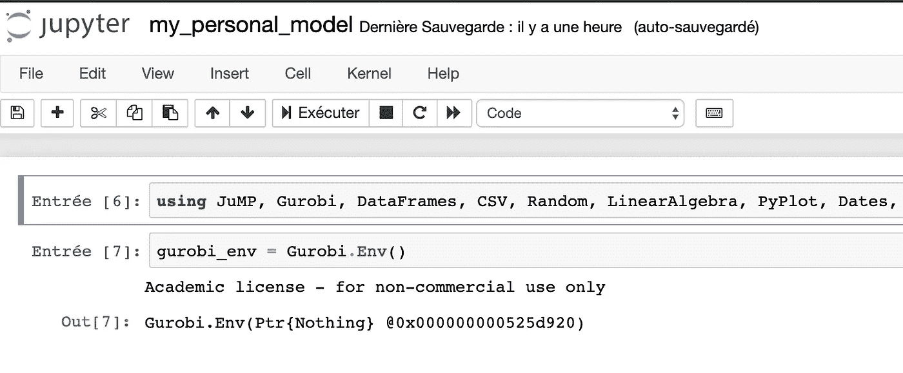

# 在 AWS 上运行 Julia + Gurobi + Jupyter

> 原文：<https://towardsdatascience.com/running-julia-gurobi-jupyter-on-aws-33f7016ab229?source=collection_archive---------20----------------------->

如果你在麻省理工学院参加任何数据科学课程，你可能已经处于这种状态:

如果像我一样，你没有一个超级 16gb 内存的计算机，你可能会发现自己不得不等待几个小时才能运行完你的模型。

考虑到你可能不会把一周的每个小时都花在运行 Julia 模型上，你可以让它们在云上运行，只需运行时间的一小部分。今天我们来看看如何让 Julia 和 Gurobi 一起运行在云上。

# 1.设置 AWS 实例

您应该做的第一件事是在 AWS 上设置一个服务器。我假设你已经有一个帐户(如果没有，请在这里检查)。

为此，我决定使用一个 *r5a.large* 实例，运行 16gb 内存的 ubuntu 16。对于那些需要 GPU 的人，亚马逊也有一大堆。

一旦你继续通过审查(8gb 磁盘对我来说很好，所以没有必要改变什么)你将需要生成一个密钥对。这是访问服务器所需的密钥文件。我把我的*命名为朱丽娅*，把它下载到你电脑上的一个安全位置。

然后继续运行实例。因为我们将在默认端口上运行 jupyter 笔记本，所以我们需要在实例上打开端口 8888。单击列表中的实例，向下滚动到*安全组*并单击该组(如果您没有选择自定义组，名称应该以 *launch-wizard-XX* 开头)。

进入安全组页面后，单击您的安全组并向下滚动到*入站*选项卡。点击*编辑*并打开 TCP 端口 8888，允许所有连接。

您已经为新服务器做好了一切准备！我们现在将 ssh 到它，并开始安装我们需要的文件。

# 2.安装必要的软件包

以下假设你在 Macbook 或 Linux 机器上。如果你用的是 windows，那么我建议用 *Putty* 来访问服务器。在这里阅读如何做。

打开一个终端，首先对您之前下载的密钥文件授予适当的权限:

> chmod 400 ~/Desktop/julia.pem

Sssh 进入您的服务器(在 AWS 的实例页面上找到公共 DNS 名称):

> ssh-I ~/Desktop/Julia . PEM ubuntu@ec2–XX.compute-1.amazonaws.com

更新和升级必要的 ubuntu 软件包:

> sudo apt 更新；sudo apt 升级-y

## 安装 Julia 1.2.0

在撰写本文时，最新的稳定版本是 1.2.0，下载页面[在这里](https://julialang.org/downloads/)。

在服务器上运行:

> wget[https://Julia lang-S3 . Julia lang . org/bin/Linux/x64/1.2/Julia-1 . 2 . 0-Linux-x86 _ 64 . tar . gz](https://julialang-s3.julialang.org/bin/linux/x64/1.2/julia-1.2.0-linux-x86_64.tar.gz)
> 
> tar xvfz Julia-1 . 2 . 0-Linux-x86 _ 64 . tar . gz

## 安装 Gurobi

为了让它工作，你需要安装 Gurobi v7.x.x(稍后会详细介绍)。

在服务器上运行:

> https://packages.gurobi.com/7.5/gurobi7.5.2_linux64.tar.gz[wget](https://packages.gurobi.com/7.5/gurobi7.5.2_linux64.tar.gz)
> 
> tar xvfz guro bi 7 . 5 . 2 _ Linux 64 . tar . gz

然后将 Julia 和 Gurobi 添加到文件系统路径中。打开 *~/。bashrc* 使用您最喜欢的文本编辑器，并将其附加到末尾:

> export guro bi _ HOME = "//HOME/Ubuntu/guro bi 752/Linux 64 "
> 
> 导出 LD _ LIBRARY _ PATH = "/home/Ubuntu/guro bi 752/Linux 64/lib "
> 
> 导出 GRB 许可证文件= "/home/Ubuntu/guro bi 752/Linux 64/guro bi . lic "
> 
> 导出路径= "/home/Ubuntu/guro bi 752/Linux 64/bin:/home/Ubuntu/Julia-1 . 2 . 0/bin:$ PATH "

要测试新添加的变量，请运行:

> 来源~/。bashrc
> 
> 朱莉娅

如果您看到提示，就可以开始了！

## 设置 Gurobi 许可证(棘手的部分)

我们现在需要激活古罗比。现在的困难是，我们将使用学术许可证在云上运行 Gurobi。但是为了提取激活所需的许可文件，主机必须在麻省理工学院的网络上。我们将使用另一种方法来获取许可证的详细信息。它假设你的个人电脑连接到麻省理工学院的网络，并只与 Gurobi 的 v7 版本。

首先，通过在服务器上运行以下命令来获取主机信息的详细信息:

> grbprobe

头部到[https://www.gurobi.com/downloads/free-academic-license/](https://www.gurobi.com/downloads/free-academic-license/)，在底部拿到你的执照密钥。

您现在必须构建这个 URL(用实际数据替换):

http://apps.gurobi.com/keyserver?id =<key>& hostname =<hostname>& hostid =<hostid>& username = Ubuntu & OS = Linux & sockets = 5 & local date = YYYY-MM-DD</hostid></hostname></key>

在我的例子中，url 是:

[http://apps.gurobi.com/keyserver?id=<XX>hostname = IP-172-31-27-159&hostid = 7 EB 9 e 98 e&username = Ubuntu&OS = Linux&sockets = 5&local date = 2019-09-25](http://apps.gurobi.com/keyserver?id=ad346146-dfba-11e9-9185-0a7c4f30bdbe&hostname=ip-172-31-27-159&hostid=7eb9e98e&username=ubuntu&os=linux&sockets=5&localdate=2019-09-25)

在你连接到麻省理工网络的个人电脑上运行这个。在文本编辑器中格式化输出，如下所示:

现在在 AWS 服务器上将它粘贴到一个新文件中，该文件位于*/home/Ubuntu/gurobi 752/Linux 64/gurobi . lic*

(如果您更改这些位置中的任何一个，请更新之前设置的环境变量)。

要检查激活是否成功，请在服务器上运行以下命令:

> gurobi.sh

如果命令返回与上面相同的输出，就可以开始了！

## 安装 Jupyter 笔记本

安装 jupyter 笔记本很容易，只需运行这 3 个命令:

> 卷发[https://bootstrap.pypa.io/get-pip.py](https://bootstrap.pypa.io/get-pip.py)|须藤蟒 3
> 
> sudo apt-get -y 安装 ipython
> 
> pip3 安装 jupyter

最后安装下面的 julia 包

> 朱莉娅
> 
> >使用 Pkg
> 
> > Pkg.add("JuMP ")
> 
> > Pkg.add("Gurobi ")
> 
> > Pkg.add("IJulia ")

## 运行笔记本

我更喜欢使用存储所有笔记本的特定目录。当然这是可选的

> mkdir ~/笔记本
> 
> CD ~/笔记本

在后台启动 jupyter 笔记本

> nohup jupyter 笔记本>日志&

将日志文件打开到带有令牌的 url

> 尾部原木

# 3.打开个人电脑上的笔记本

您首先需要打开一个从您的计算机到远程服务器的隧道。运行以下命令(或通过 putty 执行):

> ssh -i ~/Desktop/julia.pem -L 8888:本地主机:8888 ubuntu@ec2–XX.compute-1.amazonaws.com

现在，您可以在浏览器中粘贴带有上图中令牌的 url，并开始使用笔记本！

希望这样你可以更快地在后台运行你的模型！

***下一个*** *:我会试着建立一个亚马逊 AMI 镜像，这样你就可以开始一个预装了所有东西的新服务器了！*