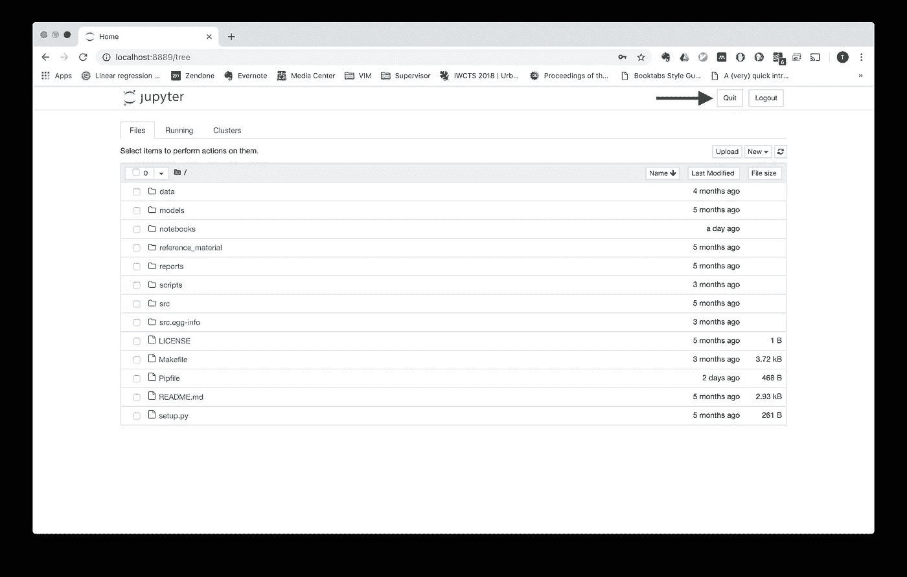

# 在远程服务器上运行 Jupyter 笔记本电脑

> 原文：<https://towardsdatascience.com/running-jupyter-notebooks-on-remote-servers-603fbcc256b3?source=collection_archive---------4----------------------->


[Jupyter 笔记本](https://jupyter.org/)是许多数据科学家工具箱中的必备工具。作为一个工具，Jupyter Notebook 可以通过以交互方式更容易地执行数据分析、模型原型制作和实验来提高生产力，从而缩短从编码到看到结果的反馈循环。

在许多情况下，在笔记本电脑或工作站上运行 Jupyter 笔记本就足够了。然而，如果您正在处理大型数据集，进行计算成本高昂的数据处理，或者学习复杂的模型，您可能需要比笔记本电脑更强大的功能。也许你正在大型图上运行[图卷积网络](/how-to-do-deep-learning-on-graphs-with-graph-convolutional-networks-7d2250723780)，或者在大型文本语料库上使用递归神经网络进行[机器翻译，并且需要更多的 CPU 内核、RAM 或几个 GPU。幸运的是，您可能在远程服务器上拥有这些资源！](https://medium.com/@umerfarooq_26378/neural-machine-translation-with-code-68c425044bbd)

如果您的远程服务器有图形用户界面(GUI ),那么您很幸运。您可以使用[远程桌面软件](https://en.wikipedia.org/wiki/Remote_desktop_software)访问远程服务器，或者像在笔记本电脑上一样使用 Jupyter Notebook。

然而，许多服务器没有 GUI。如果您处于这种情况，您可以通过在您的笔记本电脑上编写 Python 脚本来设置您的实验，在您的一小部分数据上运行它以验证它可以运行，将它复制到远程服务器，并从命令行执行它。您甚至可以在笔记本中设置实验，并使用`jupyter nbconvert --to script your_notebook.ipynb`将笔记本导出到脚本中。尽管这种工作流确实允许您在远程服务器上运行代码，但是您不能再使用 Jupyter Notebook 来进行交互操作，例如，试验您的模型和可视化您的结果。太可惜了！

在这篇文章中，我将向你展示如何在远程服务器上运行 Jupyter 笔记本，以及如何在你的笔记本上访问它。我还将展示如何设置两个`bash`命令来简化整个过程。

# 启动远程笔记本服务器

我们将使用[安全 Shell 协议](https://en.wikipedia.org/wiki/Secure_Shell) (SSH)在远程服务器上启动 Jupyter 笔记本服务器。SSH 允许我们向远程服务器发送命令。基本语法如下:

```
ssh username:password@remote_server_ip command
```

您应该发送的确切命令在一定程度上取决于您的上下文。在我的例子中，我与其他人共享一个远程服务器，因此没有在共享环境中安装 Jupyter。因此，我的第一步是转到我的项目文件夹，激活虚拟环境，并启动笔记本服务器。特别是，我想在远程服务器上执行以下三个`bash`命令:

```
cd project_folder
. virtual_environment/bin/activate
jupyter notebook --no-browser --port=8889
```

我执行带有`--no-browser`标志的`jupyter notebook`命令来启动 Jupyter 笔记本，启动一个浏览器，因为远程服务器如果没有 GUI 就不能显示浏览器。我还使用`--port=8889`标志将端口从默认端口 8888 更改为端口 8889。这是个人喜好；将本地和远程笔记本放在不同的端口上，以便更容易看到我的代码在哪里运行。

为了在远程服务器上执行命令，我们运行组合命令

```
nohup ssh -f username:password@remote_server_ip "cd project_folder; . virtual_environment/bin/activate; jupyter notebook --no-browser --port=8889"
```

请注意，我将这三个命令排成一行，并用`;`代替换行符将它们分开。执行此命令将在端口 8889 上启动 Jupyter 笔记本服务器，并让它在后台运行。最后，我在`ssh`命令中添加了`-f`标志，将进程推到后台，并在前面添加了`nohup`命令，使进程的所有输出静音，这样您就可以继续使用终端窗口。你可以在这里阅读更多关于`nohup`命令[的内容。](https://www.computerhope.com/unix/unohup.htm)

# 访问您的笔记本

您现在可以通过输入 url 来访问笔记本

```
remote_server_ip:8889
```

该命令要求您记忆 IP 地址或标记网页。然而，我们可以通过使用[端口转发](https://en.wikipedia.org/wiki/Port_forwarding)让访问远程笔记本就像访问本地笔记本一样简单:

```
nohup ssh -N -f -L localhost:8889:localhost:8889 username:password@remote_server_ip
```

`-N`标志告诉`ssh`不会执行任何远程命令。此时，我们不需要执行任何远程命令。如前所述，`-f`标志将`ssh`进程推到后台。最后，`-L`标志使用语法`local_server:local_port:remote_server:remote_port`指定端口转发配置。该配置指定所有发送到本地机器上端口`8889`的请求，例如，您的笔记本电脑，发送到远程机器上`username:password@remote_server_ip`的端口`8889`。如前所述，`nohup`命令被添加到前面，以使输出静音。

上述命令的效果是，您现在可以在浏览器中访问远程 Jupyter 笔记本服务器

```
localhost:8889
```

就像您在本地运行笔记本一样。

# 停止远程笔记本服务器

原则上，您可以让笔记本服务器在远程服务器上无限期运行(除非重启或崩溃)，但是您可能需要停止服务器，例如升级您的`jupyter`版本。如果你需要停止它有两种方法:通过浏览器或命令行。

## 通过浏览器窗口

在 Jupyter 笔记本的最新版本中，您可以在浏览器窗口的右上角找到一个退出按钮，如下图中的箭头所示。如果您按下它，您将不得不使用我们之前看到的启动命令重新启动服务器。



The Quit Button

## 通过命令行

如果您无法升级到具有 Quit 按钮的较新版本的 Jupyter，或者只是喜欢通过终端工作，您也可以从命令行停止服务器。Jupyter 有一个停止笔记本的 shell 命令:

```
jupyter notebook stop 8889
```

其中`8889`是端口号。您可以使用命令在远程服务器上执行它

```
ssh username:password@remote_server_ip "jupyter notebook stop 8889"
```

不幸的是，[这个命令目前正在被调试](https://github.com/jupyter/notebook/issues/2844#issuecomment-371220536)，但是我已经把它包含在这里，希望它在将来能够工作。但是，作为一种变通方法，您可以使用以下命令终止`jupyter`进程:

```
ssh username:password@remote_server_ip "pkill -u username jupyter"
```

其中`-u username`表示只有由`username`启动的`jupyter`进程应该被终止。这样做的缺点是，如果您同时运行多个笔记本服务器，您将关闭所有的笔记本服务器。最后，您当然可以通过登录到远程服务器、启动笔记本服务器并保持终端窗口打开来手动管理服务器。这允许您使用常用的`CTRL+C`键盘命令关闭笔记本服务器。

# 简化您的工作流程

记住所有这些命令可能相当麻烦。幸运的是，我们可以通过为每个命令创建 bash 别名来简化工作。将下面几行添加到您的`~/.bashrc`文件中:

通过在终端中键入`source .bashrc`来加载命令。现在，您可以在终端中使用命令`remote_notebook_start`和`remote_notebook_stop`分别启动远程笔记本服务器(并设置端口转发)和关闭它。

# 总结

在这篇文章中，我向您展示了如何使用 bash 命令在远程服务器上启动、访问和停止 Jupyter 笔记本，并展示了如何创建 bash 别名来简化这些操作。

我希望这些命令可以提高您的数据科学生产力，几乎无缝地允许您获得 Jupyter 笔记本和远程服务器上可用的任何计算资源的好处。

*喜欢你读的书吗？考虑在*[*Twitter*](https://twitter.com/TobiasSJepsen)*上关注我，在那里，除了我自己的帖子之外，我还分享与数据科学和机器学习的实践、理论和伦理相关的论文、视频和文章。*

*如需专业咨询，请在*[*LinkedIn*](https://www.linkedin.com/in/tobias-skovgaard-jepsen/)*上联系我，或在*[*Twitter*](https://twitter.com/TobiasSJepsen)*上直接留言。*