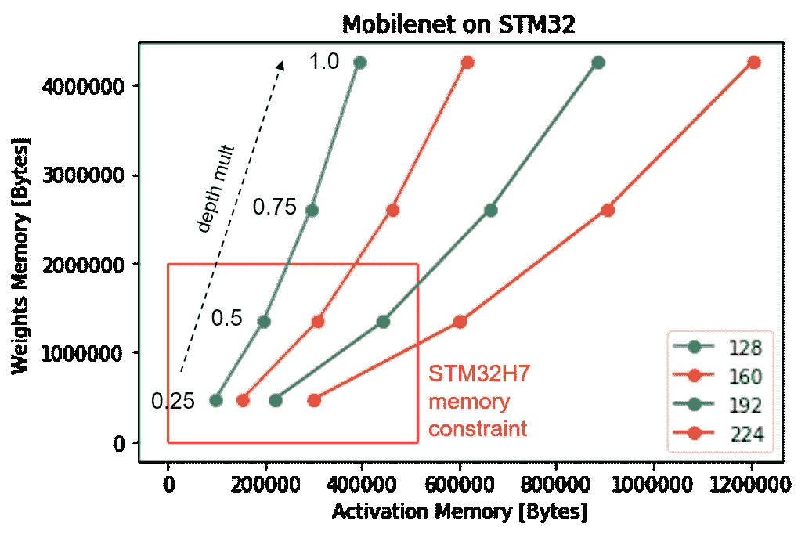

# 在 STM32 MCUs 上运行 Mobilenet

> 原文：<https://towardsdatascience.com/running-mobilenet-on-stm32-mcus-at-the-edge-e217db934f83?source=collection_archive---------11----------------------->

作者:[Alessandro Capotondi](https://medium.com/u/25ef1551c648?source=post_page-----e217db934f83--------------------------------)&Manuele Rusci，博洛尼亚大学

# **人工智能驱动的高能效边缘设备**

物联网现已成为现实。今天，主要的供应商正在通过他们的在线平台向[提供数十种云服务](https://blog.usejournal.com/cloud-technology-in-the-era-of-iot-blockchain-machine-learning-and-ai-4f1a19476b32)来加工和存储个人数据。另一方面，边缘设备的技术仍然存在一些限制。例如，你们中的任何人想要在他家门口放置无线摄像机，都很可能会遇到缺少电源插头或电池组的情况，如果连续播放图像，就需要经常更换。因此，**始终在线**功能的最终目标与能源限制密切相关。

> 为了打破这一障碍，驱动关键词是**智能**:边缘的物体应该表现得像小大脑一样，高效地执行数据到信息的转换，对数据流量的减少产生明显的影响，从而在能源方面节省大量资金。

当遇到深度学习(DL)方法时，节能智能提出了两个主要挑战，如以下问题所示:

1.  哪种深度学习模型最适合我们能源受限设备的可用资源，以及我们如何在其上高效运行该模型？我们能否在不降低准确性指标的情况下，对模型进行微调，以适应目标架构上的实现？
2.  我们能否改进边缘设备架构，以有效支持给定的 DL 模型工作平台？

我们认为回答这些问题没有正确的顺序。相反，两边同时工作会产生最好的结果。在这篇文章中，我们将描述最近的深度学习模型，已经针对能效进行了训练和优化，如何通过我们优化的 [CMSIS-NN 库扩展](https://github.com/EEESlab/CMSIS_NN-INTQ)映射到 STM32H7 MCU 等边缘设备上。我们的代码是[在线](https://github.com/EEESlab/mobilenet_v1_stm32_cmsis_nn)。

# **高能效嵌入式深度学习**

谷歌通过发布新的工具和方法来拦截这种必要性，以支持将最先进的深度学习模型从能源昂贵的 GPU 转移到资源受限的边缘设备。可以观察到两个主要趋势:

*   网络拓扑很重要。为什么不缩小模型来减少参数和 MAC 运算量呢？尽管这一过程听起来像是魔法，但 [Mobilenet](https://hackernoon.com/creating-insanely-fast-image-classifiers-with-mobilenet-in-tensorflow-f030ce0a2991) 的经验表明，这是一种可行的方法，可以在模型大小和识别准确性指标之间实现最佳平衡。
*   [Tensorflow Lite](https://medium.com/tensorflow/introducing-the-model-optimization-toolkit-for-tensorflow-254aca1ba0a3) 现在是一个众所周知的工具，用于将现有模型压缩到一个“更简单”的数值域(例如 8 位定点数据)，目标是[减少内存占用并加快计算](https://heartbeat.fritz.ai/8-bit-quantization-and-tensorflow-lite-speeding-up-mobile-inference-with-low-precision-a882dfcafbbd)。压缩的成本包括一个“特殊的”重新训练过程，需要达到与原始未压缩模型相同的精度水平。

在应用压缩后，8 位版本的 Mobilenet 在浮点基线方面没有表现出精度下降，目前用于[分类任务或作为对象识别框架的主干](https://medium.com/tensorflow/using-tensorflow-lite-on-android-9bbc9cb7d69d) (TF Lite on [Raspberry](https://medium.com/@Quantum_inc/object-detection-with-raspberry-pi-and-python-bc6b3a1d4972) )。

# **基于 ARM Cortex-M7 的 MCU 上的 MobileNet**

现在，要在能源受限的设备上运行压缩的 DL 模型，还缺少什么？ARM 试图通过发布 Cortex-M target 的 [CMSIS NN 库](https://medium.com/@chengweizhang2012/how-to-run-deep-learning-model-on-microcontroller-with-cmsis-nn-part-1-493e3cefbce)来回答这个问题。不幸的是，该库没有跟踪 DL 模型压缩和量化的最新特性。事实上，有效的量化过程包括不对称范围内的线性量化。假设卷积层的权重参数在范围[a，b]内被量化，其中 a > 0 和 b < 0，则

asymmmetric quantization of real values r

因此，量化卷积核的内环可以计算为:

asymmetric convolution between q1 and q2 inputs

很容易注意到，现在 8 位卷积核必须执行偏置卷积运算，然后是缩放(和箝位)运算。我们在发布的 [CMSIS-NN 扩展](https://github.com/EEESlab/CMSIS_NN-INTQ)中提供了这些新的卷积内核。

> 最后但同样重要的是，内存！存储器很可能是 MCU 系统中最珍贵的构建模块。能量游戏的最大部分是在从存储器来回移动数据时进行的。

创新的架构解决方案在这里可以发挥关键作用(你还记得帖子开头的第二个问题吗？).然而，当试图在 ST32H7 设备上实现 MobileNet 时，内存限制是存在的(2MB 闪存+ 512kB L2 SRAM ),我们需要面对它。最简单的解决方案是使用 R/W L2 存储器存储临时层激活(输入和输出),同时将网络参数存储在只读闪存中。下一个问题是:哪种类型的 MobileNet 符合这些限制？

memory footprint requirement to map mobilenet networks on a STM32H7 MCU

上图中的每个点代表一个 Mobilenet 模型，具有特定的输入大小(128、160、192、224)和宽度乘数(0.25、0.5、0.75、1.0)。激活记忆要求在 x 轴上，权重参数在 y 轴上。红框界定了符合 STM32H7 MCU 存储器限制的模型的解空间。您会发现，并不是所有的网络都适合有限的内存空间(实际上，top1 得分最高的网络不适合)。
因此，我们从 [TensorFlow](https://github.com/tensorflow/models/blob/master/research/slim/nets/mobilenet_v1.md) 下载了一个 8 位量化 Mobilnet 160_0.25，并通过使用我们的库扩展移植到 STM32H7 中。结果:一个 1000 类的分类任务可以在 165 毫秒内运行(在 400MHz 下 65 个周期)。如果你想了解更多，你可以查看[我们的 github 回购](https://github.com/EEESlab/mobilenet_v1_stm32_cmsis_nn)。关于这个话题的更多见解将很快出现。敬请期待！