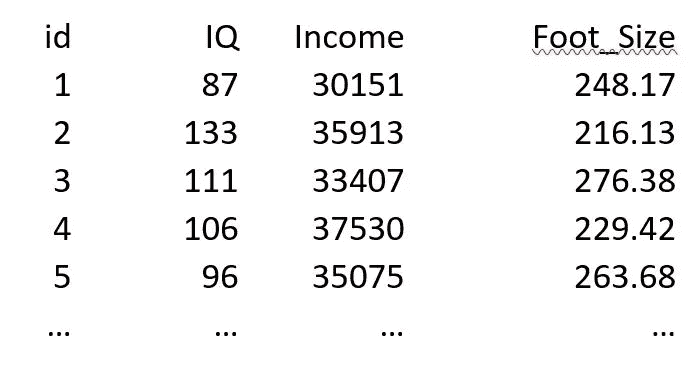
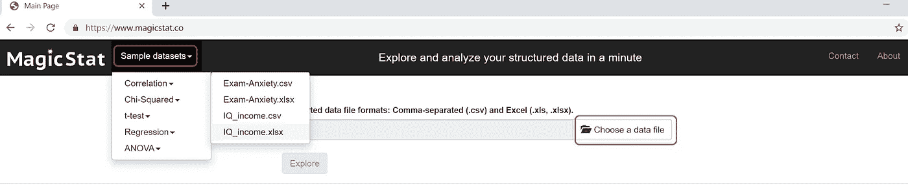
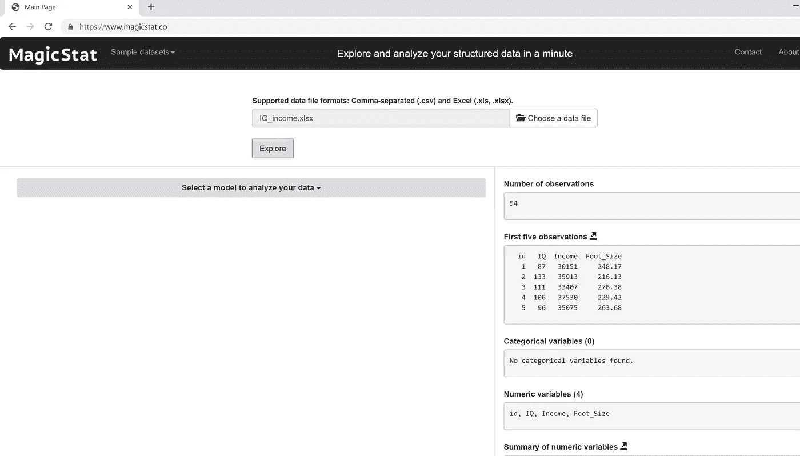
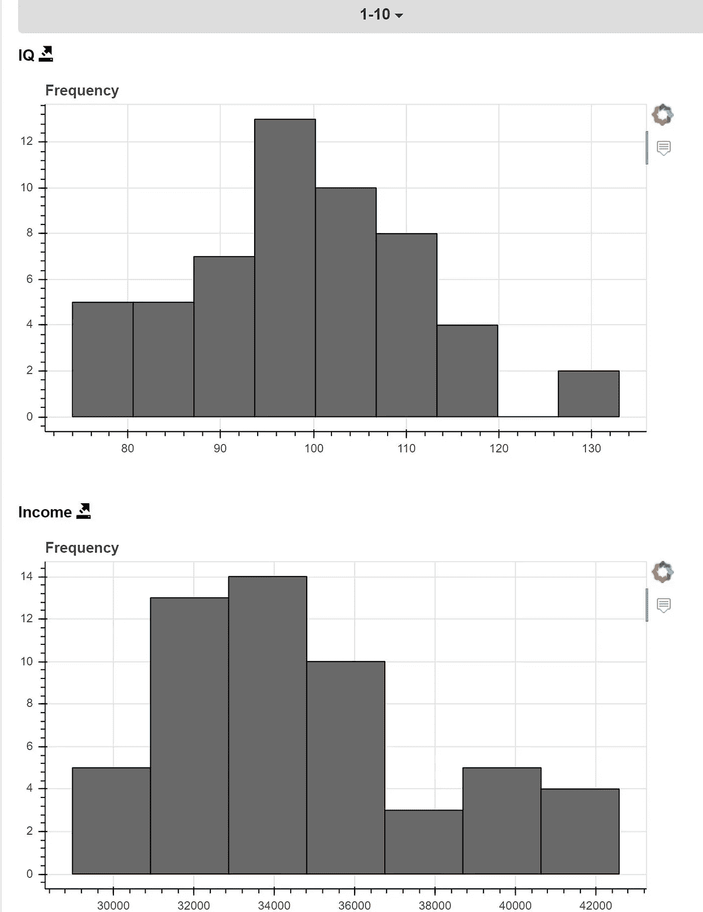
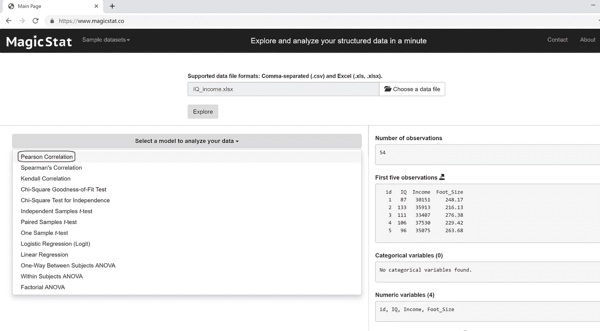
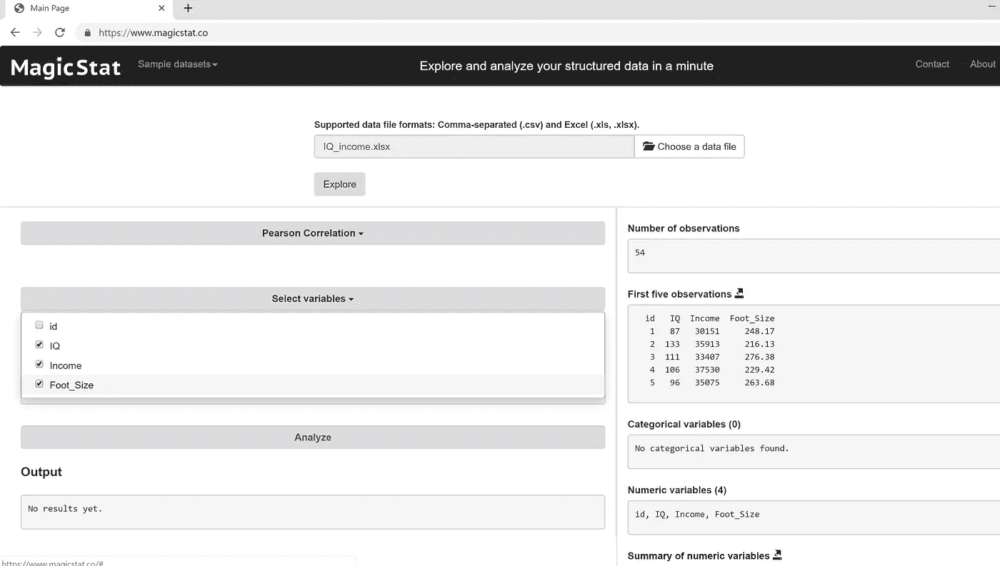
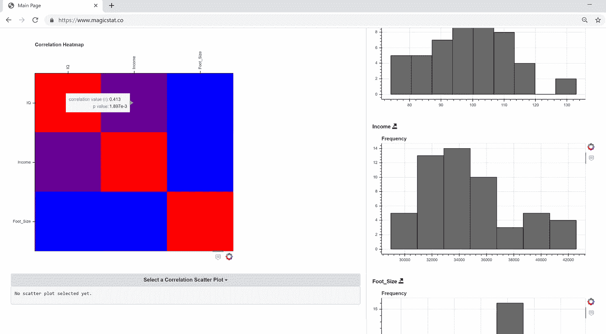
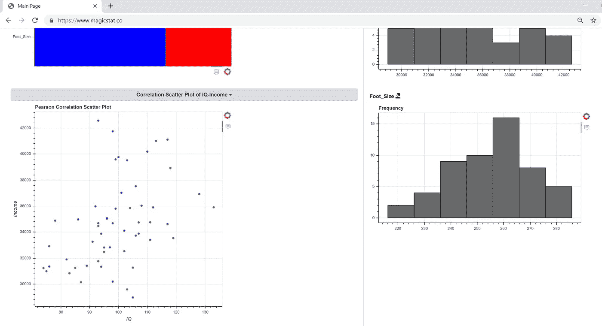

# 使用 MagicStat 运行 Pearson 关联

> 原文：<https://towardsdatascience.com/running-pearson-correlation-using-magicstat-6aa8dd4c39?source=collection_archive---------25----------------------->

## 相关性衡量两个变量之间的关系，例如，一个人的智商与他们的收入有关吗？

对于皮尔逊相关，我们需要两个变量。通常，两个变量都需要是连续的、正态分布的、无界的，比如身高或年龄。如果一个变量是绝对的，就像职业，或者如果有很多有界限的分数，就像一次考试中有很多 0 或 100 分，那么它就不起作用。

皮尔逊相关性的测试分数是 *r* ，其范围从-1 到+1。 *r* 分数告诉你两个变量之间关系的两件事:关系的强度和方向。 *r* 得分的绝对值越大，关系越强。如果数字是正数，那么这两个变量是直接相关的:一个变量上升，另一个也上升。如果值是负的，那么它们成反比:一个上升，另一个下降，反之亦然。

皮尔逊相关性的测试分数是 *r* ，其范围从-1 到+1。 *r* 得分告诉你两个变量之间关系的两件事:关系的强度和方向。 *r* 得分的绝对值越大，关系越强。如果数字是正数，那么这两个变量是直接相关的:一个变量上升，另一个也上升。如果值是负的，那么它们成反比:一个上升，另一个下降，反之亦然。

重要的是要记住，虽然皮尔逊相关可以确定两个变量之间的关系，但它不能(本身)确定是否存在因果关系，更不用说哪个变量导致了另一个变量。有些关系显然是第三个变量的产物。例如，冰淇淋销量与溺水呈正相关。现在，买冰淇淋会导致人淹死吗？当然不是。事实上，第三个变量(温度)负责冰淇淋和溺水之间的关系:随着天气变热，人们更有可能吃冰淇淋，也更有可能去游泳。

*r* 分数还与一个 *p* 值相关联，用于测试统计显著性。如果零假设为真，p 值评估我们偶然获得该数据集的可能性。因此， *p* 值越低，零假设为真的可能性就越小。通常，我们的阿尔法水平，统计显著性的阈值，被设置为 0.05。也就是说，如果我们的 p 值低于 0 . 05，那么我们拒绝零假设。

皮尔逊相关性的 *p* 值由两个因素决定:关系的强度和自由度。关系越强(无论是负的还是正的)，p 的*值越低。皮尔逊相关的自由度是 N 减 2，所以你的样本越大，自由度就越多，你的 *p* 值就越低。*

现在我们知道了什么是相关性，让我们来看一个例子。假设我们想知道一个人的智商和收入是否相关。我们有下面的[数据集](https://www.magicstat.co/static/sample_datasets/IQ_income.xlsx)。

我们的假设是，更聪明的人更有技能，需求更高，因此赚更多的钱。然而，智商和收入之间的关系并不完美，不是吗？影响一个人收入的不仅仅是他们的智商:他们在哪个领域工作，他们有多少经验，甚至他们住在哪里。所以，智商和收入之间不会是完美的关系，甚至可能不会是特别强的关系。因此，我们将假设智商和收入之间存在适度的正相关关系。一般来说，我们希望有理论支持的假设。这样我们就可以避免“钓鱼探险”,这种探险会将变量随机放在一起。在没有基于理论的假设的情况下进行测试，会增加你可能发现的任何关系只是由于偶然的可能性。在最后一栏，我们也有每个人的脚的大小。显然，我们不会假设脚的大小与智商或收入之间有任何差异。

现在我们有了假设，让我们看看如何在 [MagicStat](https://www.magicstat.co) (版本 1.0.8)上执行关联。

**1-)选择一个数据文件**

通过单击“选择数据文件”按钮选择您自己的数据集。如果您想使用样本数据文件，请单击工具栏上的“样本数据集”，将其保存到您的硬盘上，然后单击“选择数据文件”并导航到您保存它的位置。

**2-)浏览数据集**

选择数据集后，单击“浏览”按钮。

选择数据集后，单击“浏览”按钮。窗口右侧是数据集的一览信息，包括变量信息、条形图和直方图。

**4-选择“皮尔逊相关”模型**

单击“选择一个模型来分析您的数据”，并在下拉列表中选择“Pearson Correlation”。

**5-选择变量**

单击“选择变量”按钮，并选择您想要在模型中包含的变量。在这里，我们选择“智商”、“收入”和“脚的大小”。

**6-分析数据集**

最后，单击“分析”按钮。

**口译结果**

现在是解释我们在前面步骤中获得的结果的时候了。

在皮尔逊相关中，自由度纯粹是样本大小的函数，N 减 2。所以，是 52。

接下来是我们的相关表。正如我们假设的那样，在 0.41 的时候，智商和收入之间有一个适度的相关性，而脚的大小和智商或收入之间没有相关性。

下面是每种关系的 *p* 值，我们看到智商和收入之间的中度相关性的 p 值为 0.02，这意味着如果智商和收入之间没有关系，我们预计得到的数据集大约是千分之二——不太可能！。脚的尺寸-智商和脚的尺寸-收入的 *p* 值接近 1，这意味着它们之间不太可能有关系。

在相关表之后， [MagicStat](https://www.magicstat.co) 给了我们一些图表。首先是关联热图，显示最强的关系在哪里。我们可以看到紫色表示智商和收入之间的适度关系，蓝色表示与脚的大小没有关系。

然后，我们可以选择一个散点图来可视化关系并检查异常值。如果我们看看智商-收入散点图，似乎没有任何明显的异常值。有了这个散点图和智商与收入之间的理论联系，我们可以对我们在数据集中发现的关系充满信心。

**注:**本文有两位作者，[法提赫](https://www.linkedin.com/in/fatih-sen-6b1aa313)恩(PhD) 和[布伦特摩根(PhD)](https://www.linkedin.com/in/brent-morgan-84062b9/) 。