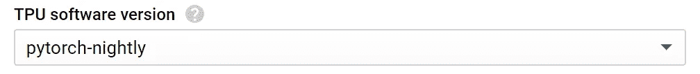

# 在 TPU 运行 PyTorch:一包把戏

> 原文：<https://towardsdatascience.com/running-pytorch-on-tpu-a-bag-of-tricks-b6d0130bddd4?source=collection_archive---------7----------------------->

在写这几行的时候，在 TPUs 上运行 PyTorch 代码还不是一个常用的方法。当然，TPU 已经针对 TensorFlow 进行了优化，并且主要用于 tensor flow。但 Kaggle 和谷歌在其一些比赛中分配了免费的 TPU 时间，人们不会简单地改变他最喜欢的框架，因此这是我与 TPU 在 GCP 训练 PyTorch 模型的经验(大部分是成功的)的备忘录。


Image by author

[PyTorch/XLA](https://github.com/pytorch/xla) 是允许这么做的项目。它仍在积极发展，问题得到解决。希望在不久的将来，运行它的体验会变得更加顺畅，一些错误会得到修复，最佳实践会得到更好的传播。

# 设置事物

我的设置包括:

1.  带有预建 PyTorch/XLA 映像的 GCP 计算引擎**虚拟机**。按照 [PyTorch/XLA github 第](https://github.com/pytorch/xla)页的“使用预构建的计算虚拟机映像”部分进行设置。
2.  **TPU 节点**，[使用本指令](https://cloud.google.com/tpu/docs/creating-deleting-tpus)与“GCP 控制台”选项为自己创建一个。如果您的 GCP 项目有一个免费的 TPU 配额，您会收到一封电子邮件，描述您可以使用的版本和区域。除此之外，我没有找到一个直接的方法来验证创建 TPU 节点确实是免费的，除了看法案。
3.  **Jupyter 笔记本**，跟着[这篇搞笑文章](/running-jupyter-notebook-in-google-cloud-platform-in-15-min-61e16da34d52)来套吧。没有朱庇特我再也无法工作了。你可能会注意到，当它对你起作用时，你会深呼吸。
4.  我还发现，在某些情况下，使用**谷歌云存储**传输文件非常方便。例如，您可以在虚拟机上使用以下代码行来复制 Kaggle API 令牌，并使用它下载竞争数据。还可以使用`gsutil cp`将文件复制回 GS bucket。

```
gcloud auth login
gsutil cp gs://bucket-name/kaggle-keys/kaggle.json ~/.kaggle
chmod 600 ~/.kaggle/kaggle.json
kaggle competitions download -c recursion-cellular-image-classification
```

除了 google storage，我还使用 github repository 将数据和代码从我的本地机器转移到 GCP 虚拟机，然后再转移回来。

请注意，TPU 节点上也运行着一些软件版本。它必须与您在虚拟机上使用的 conda 环境相匹配。由于 PyTorch/XLA 目前正在积极开发中，所以我使用夜间 TPU 版本:



# 与 TPU 一起训练

让我们来看看代码。PyTorch/XLA 有自己运行多核的方式，由于 TPU 是多核的，所以你想利用它。但是在此之前，您可能希望将模型中的`device = ‘cuda’`替换为

```
import torch_xla_py.xla_model as xm...
device = xm.xla_device()...
xm.optimizer_step(optimizer)
xm.mark_step()
...
```

只在 TPU 的一个核心上测试你的模型。上面代码片段中的最后两行替换了常规的`optimizer.step()`调用。

对于多核培训，PyTorch/XLA 使用自己的 DataParallel 类。在测试目录的中可以找到一个带有数据并行[的训练循环的例子，我想强调与之相关的以下三点。](https://github.com/pytorch/xla/blob/master/test/test_train_mnist.py)

1) DataParallel 保存模型对象的副本(每个 TPU 设备一个)，这些副本以相同的权重保持同步。用户可以通过访问其中一个模型来保存重量:

```
torch.save(model_parallel._models[0].state_dict(), filepath)
```

2)每个数据并行内核必须运行相同数量的批处理，并且只允许运行完整的批处理。因此，每个历元使用少于 100%的样本运行，残差被忽略。对于数据集洗牌，这对于训练循环来说不是大问题，但是对于推断来说却是个问题。我使用单核运行进行推理，如上所述。

3)直接从 jupyter 笔记本上运行数据并行代码对我来说非常不稳定。它可以运行一段时间，但之后会抛出系统错误、内核死亡甚至 jupyter 崩溃。将它作为脚本运行似乎是稳定的，所以我创建了第二个笔记本来运行，代码如下:

```
!jupyter nbconvert --to script MyModel.ipynb
!python MyModel.py
```

# 绕过限制

PyTorch/XLA 设计导致 PyTorch 功能上的一系列限制[。事实上，这些限制对 TPU 设备](https://github.com/pytorch/xla/blob/master/API_GUIDE.md#performance-caveats)是通用的，显然也适用于张量流模型，至少部分适用。明确地

1.  建议张量形状在迭代之间是相同的，这也限制了遮罩的使用。
2.  要避免步骤之间迭代次数不同的循环。

不遵循这些准则会导致(严重的)性能下降。不幸的是，在我的损失函数中，我需要同时使用遮罩和循环。就我而言，我把所有东西都移到了 CPU 上，现在速度快多了。在你所有的张量上做`my_tensor.cpu().detach().numpy()`就行了。当然，它在需要跟踪梯度的张量上不起作用，而且由于转移到 CPU 上，它本身也会导致速度变慢。

# 性能比较

我的 Kaggle 比赛队友 [Yuval Reina](https://www.kaggle.com/yuval6967) 已经善意地同意在本节分享他的机器配置和训练速度以供比较。我还为我的笔记本(一台物理机器，这次不是 jupyter)添加了一个专栏，但是它与这些重量级的不匹配，并且在其上运行的代码没有针对性能进行很好的优化。

网络的输入是具有 6 个通道的 512×512 图像。我们测量了训练循环中每秒处理的图像，在这个指标上，所描述的 TPU 配置以 110 比 57 的比例优于 Yuval 的 Tesla V100。

TPU vs GPU performance comparison

如上所述(不含`DataParallel`)单核 TPU 的性能为每秒 26 幅图像，比全部 8 个内核加在一起大约慢 4 倍。

我们没有透露 Yuval 使用的架构，因为竞争仍在进行中，但它在大小上与 resnet50 没有明显不同。但是请注意，由于我们没有运行相同的架构，这种比较是不公平的。

试图切换到 GCP SSD 磁盘的火车图像并没有提高性能。

# 结论

总之，我在 PyTorch/XLA 的经历是复杂的。我遇到了几个 bugs 工件(这里没有全部提到)，现有的文档和例子是有限的，TPU 固有的限制对于更有创造性的架构来说可能太过禁止。另一方面，它大部分是有效的，并且当它有效时，性能是好的。

最后，也可以说是最重要的，完成后不要忘记停止 GCP 虚拟机！